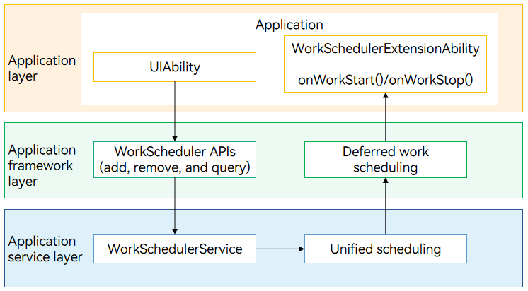

# Deferred Task (ArkTS)

## Overview

### Introduction

If an application needs to execute a non-real-time task after switching to the background, for example, if the application wants to obtain emails irregularly when the network is available, the application can request deferred tasks. When the specified conditions (including the network type, charging type, storage status, battery status, and timing status) are met, the system adds the task to the execution queue. Then the system starts the application to execute the task based on the memory, power consumption, device temperature, and user habits.

### Working Principle

**Figure 1** Working principle of deferred task scheduling 


An application calls the **WorkScheduler** APIs to add, delete, and query deferred tasks. Based on the task-specific conditions (specified by **WorkInfo**, including the network type, charging type, and storage status) and system status (including the memory, power consumption, device temperature, and user habits), the WorkSchedulerService determines the time to schedule the tasks.

When the scheduling conditions are met or the task scheduling ends, the system calls back **onWorkStart()** or **onWorkStop()** in [WorkSchedulerExtensionAbility](../reference/apis-backgroundtasks-kit/js-apis-WorkSchedulerExtensionAbility.md). The system also creates an independent process for the **WorkSchedulerExtensionAbility** and provides a duration for the **WorkSchedulerExtensionAbility** to run. You can implement your own service logic in the callback functions.


### Constraints

- **Quantity limit**: An application can request a maximum of 10 deferred tasks during a time segment.

- **Execution frequency limit**: The system controls the execution frequency of deferred tasks<!--RP1--> based on the application activity group in the [device usage statistics](../reference/apis-backgroundtasks-kit/js-apis-resourceschedule-deviceUsageStatistics-sys.md)<!--RP1End-->. <!--Del-->Applications that request the WORK_SCHEDULER resource are placed in the efficiency resource exemption group.<!--DelEnd-->

  **Table 1** Application activity groups  
  | Group| Deferred Task Execution Frequency|
  | -------- | -------- |
  | Group of active applications| At a minimum interval of 2 hours|
  | Group of frequently used applications| At a minimum interval of 4 hours|
  | Group of applications that are used neither frequently nor rarely| At a minimum interval of 24 hours|
  | Group of rarely used applications| At a minimum interval of 48 hours|
  | Group of restricted applications| Forbidden|
  | Group of applications never used| Forbidden|<!--Del-->
  | Efficiency resource exemption group| No restriction|<!--DelEnd-->
  
- **Timeout**: The WorkSchedulerExtensionAbility can run for a maximum of 2 minutes for a single callback. If the application does not cancel the deferred task upon a timeout, the system forcibly terminates the process for the WorkSchedulerExtensionAbility. <!--Del-->Privileged system applications can request the WORK_SCHEDULER resource to extend the duration to 20 minutes in the charging state and 10 minutes in the non-charging state.<!--DelEnd-->

- **Scheduling delay**: The system schedules deferred tasks in a unified manner based on the memory, power consumption, device temperature, and user habits. For example, when the system memory resources are insufficient or the temperature reaches a certain level, the system delays task scheduling.

- **Restrictions for WorkSchedulerExtensionAbility**: The following APIs cannot be called in the WorkSchedulerExtensionAbility:

  [@ohos.resourceschedule.backgroundTaskManager (Background Task Management)](../reference/apis-backgroundtasks-kit/js-apis-resourceschedule-backgroundTaskManager.md)

  [@ohos.backgroundTaskManager (Background Task Management)](../reference/apis-backgroundtasks-kit/js-apis-backgroundTaskManager.md)

  [@ohos.multimedia.camera (Camera Management)](../reference/apis-camera-kit/arkts-apis-camera.md)

  [@ohos.multimedia.audio (Audio Management)](../reference/apis-audio-kit/arkts-apis-audio.md)

  [@ohos.multimedia.media (Media)](../reference/apis-media-kit/arkts-apis-media.md)


## Available APIs

**Table 2** Main APIs for deferred tasks

The table below lists the APIs used for developing deferred tasks. For details about more APIs and their usage, see [@ohos.resourceschedule.workScheduler (Deferred Task Scheduling)](../reference/apis-backgroundtasks-kit/js-apis-resourceschedule-workScheduler.md).
| API| Description|
| -------- | -------- |
| startWork(work: WorkInfo): void; | Starts a deferred task.|
| stopWork(work: WorkInfo, needCancel?: boolean): void; | Stops a deferred task.|
| getWorkStatus(workId: number, callback: AsyncCallback&lt;WorkInfo&gt;): void; | Obtains the information about a deferred task. This API uses an asynchronous callback to return the result.|
| getWorkStatus(workId: number): Promise&lt;WorkInfo&gt;; | Obtains the information about a deferred task. This API uses a promise to return the result.|
| obtainAllWorks(callback: AsyncCallback\<Array\<WorkInfo>>): void; | Obtains all the deferred tasks. This API uses an asynchronous callback to return the result.|
| obtainAllWorks(): Promise&lt;Array&lt;WorkInfo&gt;&gt;; | Obtains all the deferred tasks. This API uses a promise to return the result.|
| stopAndClearWorks(): void; | Stops and clears all the deferred tasks.|
| isLastWorkTimeOut(workId: number, callback: AsyncCallback\<boolean>): void; | Checks whether the last execution of a deferred task has timed out. This API uses an asynchronous callback to return the result. It is applicable to repeated tasks.|
| isLastWorkTimeOut(workId: number): Promise&lt;boolean&gt;; | Checks whether the last execution of a deferred task has timed out. This API uses a promise to return the result. It is applicable to repeated tasks.|

**Table 3** Options of WorkInfo
| Name            | Type                               | Mandatory  | Description              |
| --------------- | --------------------------------- | ---- | ---------------- |
| workId          | number                            | Yes   | ID of a deferred task.         |
| bundleName      | string                            | Yes   | Bundle name of the application where the deferred task is located.          |
| abilityName     | string                            | Yes   | Ability name in the bundle.|
| networkType     | [NetworkType](../reference/apis-backgroundtasks-kit/js-apis-resourceschedule-workScheduler.md#networktype)       | No   | Network type.            |
| isCharging      | boolean                           | No   | Whether the device needs to enter the charging state to trigger deferred task scheduling.<br>- **true**: The device needs to enter the charging state to trigger deferred task scheduling.<br>- **false**: The device does not need to enter the charging state to trigger deferred task scheduling.|
| chargerType     | [ChargingType](../reference/apis-backgroundtasks-kit/js-apis-resourceschedule-workScheduler.md#chargingtype)     | No   | Charging type.            |
| batteryLevel    | number                            | No   | Battery level.             |
| batteryStatus   | [BatteryStatus](../reference/apis-backgroundtasks-kit/js-apis-resourceschedule-workScheduler.md#batterystatus)   | No   | Battery status.            |
| storageRequest  | [StorageRequest](../reference/apis-backgroundtasks-kit/js-apis-resourceschedule-workScheduler.md#storagerequest) | No   | Storage status.            |
| isRepeat        | boolean                           | No   | Whether the deferred task is repeated.<br>- **true**: The deferred task is repeated.<br>- **false**: The deferred task is not repeated.|
| repeatCycleTime | number                            | No   | Repeat interval, in milliseconds.            |
| repeatCount     | number                            | No   | Number of repeat times.            |
| isPersisted     | boolean                           | No   | Whether the registered deferred task can be saved in the system.<br>- **true**: The task can be saved. That is, the task can be restored after the system restarts.<br>- **false**: The task cannot be saved.|
| isDeepIdle      | boolean                           | No   | Whether the device needs to enter the idle state to trigger deferred task scheduling.<br>- **true**: The device needs to enter the idle state to trigger deferred task scheduling.<br>- **false**: The device does not need to enter the idle state to trigger deferred task scheduling.  |
| idleWaitTime    | number                            | No   | Time to wait in the idle state before triggering deferred task scheduling, in milliseconds.          |
| parameters      | [key: string]: number \| string \| boolean  | No   | Carried parameters.|

The **WorkInfo** parameter is used to set conditions for triggering task scheduling. Its setting must comply with the following rules:

- **workId**, **bundleName**, and **abilityName** are mandatory. **bundleName** must be set to the bundle name of the current application.

- The carried parameters can be of the number, string, or boolean type.

- At least one condition must be set, including the network type, charging type, storage status, battery status, and timing status.

- For repeated tasks, **repeatCycleTime** must be at least 2 hours. When **isRepeat** is set, you must set **repeatCycleTime** or **repeatCount**.

**Table 4** Deferred task scheduling callbacks

The table below lists the APIs used for developing deferred task scheduling callbacks. For details about more APIs and their usage, see [@ohos.WorkSchedulerExtensionAbility (Deferred Task Scheduling Callbacks)](../reference/apis-backgroundtasks-kit/js-apis-WorkSchedulerExtensionAbility.md).
| API| Description|
| -------- | -------- |
| onWorkStart(work: workScheduler.WorkInfo): void | Called when the system starts scheduling the deferred task.|
| onWorkStop(work: workScheduler.WorkInfo): void | Called when the system stops scheduling the deferred task.|


## How to Develop

The development of deferred task scheduling consists of two steps: implementing the deferred task scheduling capability and implementing deferred task scheduling.

1. **Implementing the deferred task scheduling capability**: Implement the callbacks for starting and stopping the WorkSchedulerExtensionAbility.

2. **Implementing deferred task scheduling**: Call the **WorkScheduler** APIs to start and stop delayed tasks.

### Implementing Deferred Task Scheduling Callbacks

1. Create a project directory.

   In the **./entry/src/main/ets** directory of the project, create a directory and an ArkTS file. For example, create a directory and name it **WorkSchedulerExtension**. In the **WorkSchedulerExtension** directory, create an ArkTS file named **WorkSchedulerExtension.ets** and implement the callbacks for deferred task scheduling.

2. Import the module.
   
   ```ts
   import { WorkSchedulerExtensionAbility, workScheduler } from '@kit.BackgroundTasksKit';
   ```

3. Implement the lifecycle callbacks for the WorkSchedulerExtensionAbility.
   
   ```ts
   export default class MyWorkSchedulerExtensionAbility extends WorkSchedulerExtensionAbility {
     // Callback invoked when the system starts scheduling the deferred task.
     onWorkStart(workInfo: workScheduler.WorkInfo) {
       console.info(`onWorkStart, workInfo = ${JSON.stringify(workInfo)}`);
       // Print the parameter, for example, key1, in parameters.
       // console.info(`work info parameters: ${JSON.parse(workInfo.parameters?.toString()).key1}`)
     }
   
     // Callback invoked when the system stops scheduling the deferred task.
     onWorkStop(workInfo: workScheduler.WorkInfo) {
       console.info(`onWorkStop, workInfo is ${JSON.stringify(workInfo)}`);
     }
   }
   ```

4. Register the WorkSchedulerExtensionAbility in the [module.json5 file](../quick-start/module-configuration-file.md) and set the tags as follows:

   - Set **type** to **workScheduler**.

   - Set **srcEntry** to the code path of the WorkSchedulerExtensionAbility component.

   ```json
   {
     "module": {
         "extensionAbilities": [
           {
             "name": "MyWorkSchedulerExtensionAbility",
             "srcEntry": "./ets/WorkSchedulerExtension/WorkSchedulerExtension.ets",
             "type": "workScheduler"
           }
         ]
     }
   }
   ```


### Implementing Deferred Task Scheduling

1. Import the module.
   
   ```ts
   import { workScheduler } from '@kit.BackgroundTasksKit';
   import { BusinessError } from '@kit.BasicServicesKit';
   ```

2. Start a deferred task.
   
   ```ts
   // Create workinfo.
   const workInfo: workScheduler.WorkInfo = {
     workId: 1,
     networkType: workScheduler.NetworkType.NETWORK_TYPE_WIFI,
     bundleName: 'com.example.application',
     abilityName: 'MyWorkSchedulerExtensionAbility'
   }
   
   try {
     workScheduler.startWork(workInfo);
     console.info(`startWork success`);
   } catch (error) {
     console.error(`startWork failed. code is ${(error as BusinessError).code} message is ${(error as BusinessError).message}`);
   }
   ```

3. Cancel the deferred task.
   
   ```ts
   // Create workinfo.
   const workInfo: workScheduler.WorkInfo = {
     workId: 1,
     networkType: workScheduler.NetworkType.NETWORK_TYPE_WIFI,
     bundleName: 'com.example.application', 
     abilityName: 'MyWorkSchedulerExtensionAbility' 
   }
   
   try {
     workScheduler.stopWork(workInfo);
     console.info(`stopWork success`);
   } catch (error) {
     console.error(`stopWork failed. code is ${(error as BusinessError).code} message is ${(error as BusinessError).message}`);
   }
   ```

### Verifying Deferred Task Scheduling
Check whether the **onWorkStart** and **onWorkStop** methods of WorkSchedulerExtensionAbility are correctly implemented and can be successfully called.

   After the deferred task is requested, its callback can be triggered only when the required conditions are met. To quickly perform the verification, trigger the callback manually with the following [hidumper](../dfx/hidumper.md) command.

   ```ts
   $ hidumper -s 1904 -a '-t com.example.application MyWorkSchedulerExtensionAbility'

   -------------------------------[ability]-------------------------------


   ----------------------------------WorkSchedule----------------------------------
   ```
<!--no_check-->