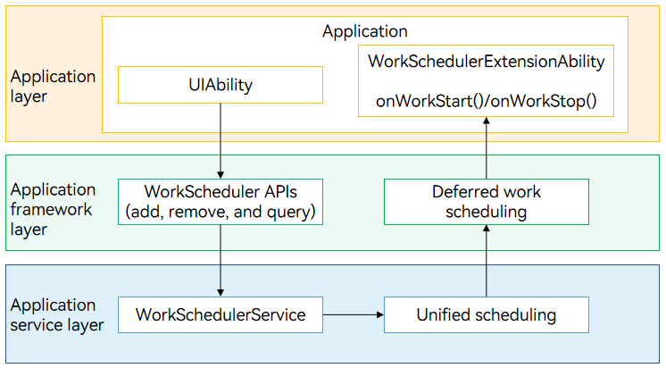

# Deferred Task (ArkTS)

<!--Kit: Background Tasks Kit-->
<!--Subsystem: ResourceSchedule-->
<!--Owner: @xufu7-->
<!--Designer: @zhouben25-->
<!--Tester: @leetestnady-->
<!--Adviser: @HelloCrease-->

## Overview

### Introduction

If an application needs to execute a non-real-time task after switching to the background, for example, if the application wants to obtain emails irregularly when the network is available, the application can request deferred tasks. When the specified trigger conditions (including the network type, charging type, storage status, battery status, and timing status) are met, the system adds the task to the execution queue. Then the system starts the application to execute the deferred task based on the memory, power consumption, device temperature, and user habits.

### Working Principle

**Figure 1** Working principle of deferred task scheduling 


An application calls the deferred task API to add, delete, and query deferred tasks. The deferred task management module determines the scheduling time based on the task conditions (set by the [WorkInfo](../reference/apis-backgroundtasks-kit/js-apis-resourceschedule-workScheduler.md#workinfo) parameter, including the network type, charging type, and storage status) and system status (including the memory, power consumption, device temperature, and user habits).

When the scheduling conditions are met or the task scheduling ends, the system calls back **onWorkStart()** or **onWorkStop()** in [WorkSchedulerExtensionAbility](../reference/apis-backgroundtasks-kit/js-apis-WorkSchedulerExtensionAbility.md). The system also creates an independent process for the **WorkSchedulerExtensionAbility** and sets a period for the **WorkSchedulerExtensionAbility** to run. You can implement your own service logic in the callback functions.


### Constraints

- **Quantity limit**: An application can request a maximum of 10 deferred tasks during a time segment.

- **Execution frequency limit**: The system controls the execution frequency of deferred tasks <!--RP1-->based on the application activity group in the [device usage statistics](../reference/apis-backgroundtasks-kit/js-apis-resourceschedule-deviceUsageStatistics-sys.md)<!--RP1End-->. <!--Del-->Applications that request the WORK_SCHEDULER resource are placed in the efficiency resource exemption group.<!--DelEnd-->

  **Table 1** Application activity groups  
  | Group| Deferred Task Execution Frequency|
  | -------- | -------- |
  | Group of active applications| At a minimum interval of 2 hours|
  | Group of frequently used applications| At a minimum interval of 4 hours|
  | Group of commonly used applications| At a minimum interval of 24 hours|
  | Group of rarely used applications| At a minimum interval of 48 hours|
  | Group of restricted applications| Forbidden|
  | Group of applications never used| Forbidden|
  | <!--DelRow-->Exemption group for efficiency resources| No restriction|
  
- **Timeout**: The WorkSchedulerExtensionAbility can run for a maximum of 2 minutes for a single callback. If the application does not cancel the deferred task upon a timeout, the system forcibly terminates the process for the WorkSchedulerExtensionAbility. <!--Del-->Privileged system applications can request the WORK_SCHEDULER resource to extend the duration to 20 minutes in the charging state and 10 minutes in the non-charging state.<!--DelEnd-->

- **Scheduling delay**: The system schedules deferred tasks in a unified manner based on the memory, power consumption, device temperature, and user habits. For example, when the system memory resources are insufficient or the temperature reaches a certain level, the system delays task scheduling.

- For details about the restrictions on calling [WorkSchedulerExtensionAbility](../reference/apis-backgroundtasks-kit/js-apis-WorkSchedulerExtensionAbility.md) APIs, see [Constraints](../reference/apis-backgroundtasks-kit/js-apis-WorkSchedulerExtensionAbility.md#constraints).


## Available APIs

**Table 2** Main APIs for deferred tasks

The table below lists the APIs used for developing deferred tasks. For details about more APIs and their usage, see [@ohos.resourceschedule.workScheduler (Deferred Task Scheduling)](../reference/apis-backgroundtasks-kit/js-apis-resourceschedule-workScheduler.md).
| API| Description|
| -------- | -------- |
| [startWork(work: WorkInfo): void](../reference/apis-backgroundtasks-kit/js-apis-resourceschedule-workScheduler.md#workschedulerstartwork) | Start a deferred task.|
| [stopWork(work: WorkInfo, needCancel?: boolean): void](../reference/apis-backgroundtasks-kit/js-apis-resourceschedule-workScheduler.md#workschedulerstopwork) | Cancel the deferred task.|
| [getWorkStatus(workId: number, callback: AsyncCallback&lt;WorkInfo&gt;): void](../reference/apis-backgroundtasks-kit/js-apis-resourceschedule-workScheduler.md#workschedulergetworkstatus) | Obtains the information about a deferred task. This API uses an asynchronous callback to return the result.|
| [getWorkStatus(workId: number): Promise&lt;WorkInfo&gt;](../reference/apis-backgroundtasks-kit/js-apis-resourceschedule-workScheduler.md#workschedulergetworkstatus-1) | Obtains the information about a deferred task. This API uses a promise to return the result.|
| [obtainAllWorks(callback: AsyncCallback&lt;Array&lt;WorkInfo&gt;&gt;): void](../reference/apis-backgroundtasks-kit/js-apis-resourceschedule-workScheduler.md#workschedulerobtainallworks10) | Obtains all the deferred tasks. This API uses an asynchronous callback to return the result.|
| [obtainAllWorks(): Promise&lt;Array&lt;WorkInfo&gt;&gt;](../reference/apis-backgroundtasks-kit/js-apis-resourceschedule-workScheduler.md#workschedulerobtainallworks)  | Obtains all the deferred tasks. This API uses a promise to return the result.|
| [stopAndClearWorks(): void](../reference/apis-backgroundtasks-kit/js-apis-resourceschedule-workScheduler.md#workschedulerstopandclearworks) | Stops and clears all the deferred tasks.|
| [isLastWorkTimeOut(workId: number, callback: AsyncCallback\<boolean>): void](../reference/apis-backgroundtasks-kit/js-apis-resourceschedule-workScheduler.md#workschedulerislastworktimeout10) | Checks whether the last execution of a deferred task has timed out. This API uses an asynchronous callback to return the result. It is applicable to repeated tasks.|
| [isLastWorkTimeOut(workId: number): Promise&lt;boolean&gt;](../reference/apis-backgroundtasks-kit/js-apis-resourceschedule-workScheduler.md#workschedulerislastworktimeout) | Checks whether the last execution of a deferred task has timed out. This API uses a promise to return the result. It is applicable to repeated tasks.|

**Table 3** Deferred task scheduling callbacks

The table below lists the APIs used for developing deferred task scheduling callbacks. For details about more APIs and their usage, see [@ohos.WorkSchedulerExtensionAbility (Deferred Task Scheduling Callbacks)](../reference/apis-backgroundtasks-kit/js-apis-WorkSchedulerExtensionAbility.md).
| API| Description|
| -------- | -------- |
| [onWorkStart(work: workScheduler.WorkInfo): void](../reference/apis-backgroundtasks-kit/js-apis-WorkSchedulerExtensionAbility.md#onworkstart) | Called when the system starts scheduling the deferred task.|
| [onWorkStop(work: workScheduler.WorkInfo): void](../reference/apis-backgroundtasks-kit/js-apis-WorkSchedulerExtensionAbility.md#onworkstop) | Called when the system stops scheduling the deferred task.|


## How to Develop

The development of deferred task scheduling consists of two steps: implementing the deferred task scheduling capability and implementing deferred task scheduling.

1. **Implementing the deferred task scheduling capability**: Implement the callbacks for starting and stopping the WorkSchedulerExtensionAbility.

2. **Implementing deferred task scheduling**: Call the **WorkScheduler** APIs to start and stop delayed tasks.

### Implementing Callbacks for Work Scheduler

1. Create a project directory.

   In the **./entry/src/main/ets** directory of the project, create a directory and an ArkTS file. For example, create a directory and name it **WorkSchedulerAbility**. In the **WorkSchedulerAbility** directory, create an ArkTS file named **WorkSchedulerAbility.ets** and implement the callbacks for deferred task scheduling.

2. Import the module. No permission is required.

   <!-- @[extension_include](https://gitcode.com/openharmony/applications_app_samples/blob/master/code/DocsSample/BackGroundTasksKit/WorkScheduler/entry/src/main/ets/WorkSchedulerAbility/WorkSchedulerAbility.ets) -->
   
   ``` TypeScript
   import {workScheduler, WorkSchedulerExtensionAbility} from '@kit.BackgroundTasksKit';
   ```

3. Implement the lifecycle callbacks for the WorkSchedulerExtensionAbility.
   <!-- @[workSchedulerExtension](https://gitcode.com/openharmony/applications_app_samples/blob/master/code/DocsSample/BackGroundTasksKit/WorkScheduler/entry/src/main/ets/WorkSchedulerAbility/WorkSchedulerAbility.ets) --> 
   
   ``` TypeScript
   export default class WorkSchedulerAbility extends WorkSchedulerExtensionAbility {
     // Callback invoked when the system starts scheduling the deferred task.
     onWorkStart(workInfo: workScheduler.WorkInfo) {
       // ...
       console.info(`onWorkStart, workInfo = ${JSON.stringify(workInfo)}`);
       // Print the parameter, for example, key1, in parameters.
       console.info(`work info parameters: ${JSON.parse(workInfo.parameters?.toString()).key1}`);
     }
   
     // Callback invoked when the deferred task ends. This callback is triggered when the deferred task times out for 2 minutes or the stopWork API is called to cancel the task.
     onWorkStop(workInfo: workScheduler.WorkInfo) {
       console.info(`onWorkStop, workInfo is ${JSON.stringify(workInfo)}`);
     }
   }
   ```

4. Register the WorkSchedulerExtensionAbility in the [module.json5 file](../quick-start/module-configuration-file.md) and set the tags as follows:

   - Set **type** to **workScheduler**.

   - Set **srcEntry** to the code path of the WorkSchedulerExtensionAbility component.

   <!-- @[workScheduler_configure](https://gitcode.com/openharmony/applications_app_samples/blob/master/code/DocsSample/BackGroundTasksKit/WorkScheduler/entry/src/main/module.json5) -->
   
   ``` JSON5
   {
     "module": {
       // ...
       "extensionAbilities": [
         {
           "name": "WorkSchedulerAbility",
           "srcEntry": "./ets/WorkSchedulerAbility/WorkSchedulerAbility.ets",
           "type": "workScheduler",
           // ...
         }
       ]
     }
   }
   ```


### Implementing Deferred Task Scheduling

1. Import the module.

   <!-- @[workScheduler_include](https://gitcode.com/openharmony/applications_app_samples/blob/master/code/DocsSample/BackGroundTasksKit/WorkScheduler/entry/src/main/ets/feature/WorkSchedulerSystem.ets) -->
   
   ``` TypeScript
   import { BusinessError } from '@kit.BasicServicesKit';
   import { workScheduler } from '@kit.BackgroundTasksKit';
   ```

2. Start a deferred task.
   <!-- @[startWork](https://gitcode.com/openharmony/applications_app_samples/blob/master/code/DocsSample/BackGroundTasksKit/WorkScheduler/entry/src/main/ets/feature/WorkSchedulerSystem.ets) -->
   
   ``` TypeScript
   let workInfo: workScheduler.WorkInfo = {
     workId: 1,
     networkType: workScheduler.NetworkType.NETWORK_TYPE_ANY,
     bundleName: 'ohos.samples.workschedulerextensionability',
     abilityName: 'WorkSchedulerAbility',
     // ...
   }
   
   try {
     workScheduler.startWork(workInfo);
     console.info(`startWork success`);
   }
   catch (error) {
     console.error(`startWork failed. code is ${(error as BusinessError).code} message is ${(error as BusinessError).message}`);
   }
   ```

3. Cancel the deferred task.
   <!-- @[stopWork](https://gitcode.com/openharmony/applications_app_samples/blob/master/code/DocsSample/BackGroundTasksKit/WorkScheduler/entry/src/main/ets/feature/WorkSchedulerSystem.ets) --> 
   
   ``` TypeScript
   // Create workInfo.
   let workInfo: workScheduler.WorkInfo = {
     workId: 1,
     networkType: workScheduler.NetworkType.NETWORK_TYPE_ANY,
     bundleName: 'ohos.samples.workschedulerextensionability',
     abilityName: 'WorkSchedulerAbility',
     // ...
   }
   try {
     workScheduler.stopWork(workInfo);
     console.info(`stopWork success`);
   } catch (error) {
     console.error(`stopWork failed. code is ${(error as BusinessError).code} message is ${(error as BusinessError).message}`);
   }
   ```

### Verifying Deferred Task Scheduling
Check whether the **onWorkStart** and **onWorkStop** methods of WorkSchedulerExtensionAbility are correctly implemented and can be successfully called.

   After the deferred task is requested, its callback can be triggered only when the required conditions are met. To quickly perform the verification, trigger the callback manually using the following [hidumper](../dfx/hidumper.md) command.
   
   > **NOTE**
   > 
   > - `-s 1904`: sends a command to the WorkScheduler system service (1904 is the service ID).
   > - `-a`: carries additional parameters, which must be enclosed in quotation marks.
   > - `-t`: specifies the target application package name and **ExtensionAbility** name. The example values `com.example.application` and `MyWorkSchedulerExtensionAbility` need to be replaced with actual ones.
   
   ```ts
   $ hidumper -s 1904 -a '-t com.example.application MyWorkSchedulerExtensionAbility'

   -------------------------------[ability]-------------------------------


   ----------------------------------WorkSchedule----------------------------------
   ```

## Samples

The following sample is provided to help you better understand how to develop deferred task scheduling:

- [Delayed Task Scheduling (ArkTS, API Version 9)](https://gitcode.com/openharmony/applications_app_samples/tree/master/code/DocsSample/BackGroundTasksKit/WorkScheduler)

<!--no_check-->