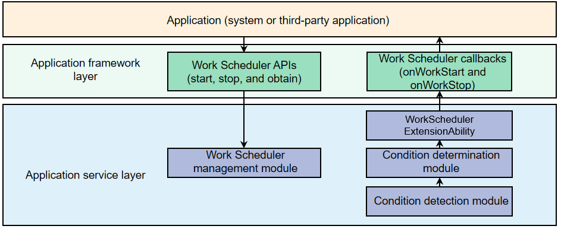

# WorkSchedulerExtensionAbility Development

If your application needs to execute a non-real-time task or a persistent task, you can harness the Work Scheduler mechanism, which will schedule the task when the preset conditions (including the network type, charging type, storage status, battery status, and timing status) are met.

**WorkSchedulerExtensionAbility** provides callbacks for Work Scheduler tasks. When a Work Scheduler task starts or stops, these callbacks are invoked to process your service logic.

## Working Principles

Figure 1 shows the working principle of Work Scheduler.

**Figure 1** Work Scheduler working principle



An application starts, stops, and obtains Work Scheduler tasks through the [workScheduler APIs](../reference/apis/js-apis-resourceschedule-workScheduler.md).

The application service layer detects and determines the conditions. If the preset conditions are met, the application service layer calls back the **WorkSchedulerExtensionAbility** object to start the application and triggers the **onWorkStart** and **onWorkStop** callbacks.

## Available APIs

The **WorkSchedulerExtensionAbility** class has the following APIs. For details, see [WorkSchedulerExtensionAbility](../reference/apis/js-apis-WorkSchedulerExtensionAbility.md).

| Name| Description|
| -------- | -------- |
| onWorkStart(work: workScheduler.WorkInfo): void | Called when the Work Scheduler task starts.|
| onWorkStop(work: workScheduler.WorkInfo): void | Called when the Work Scheduler task stops.|

## How to Develop

To create a WorkScheduler project in DevEco Studio, perform the following steps:

- [Implement callbacks for Work Scheduler](#implementing-callbacks-for-work-scheduler): Develop the callbacks provided by **WorkSchedulerExtensionAbility**.

- [Implement Work Scheduler](#implementing-work-scheduler): Develop the [workScheduler APIs] to implement functions such as starting or stopping Work Scheduler tasks.

- [Set the configuration file](#setting-the-configuration-file): Set the configuration file **module.json5**.

### Implementing Callbacks for Work Scheduler

1. Create a module named **library** in the root directory of the project, with the **Ohos Library** template selected.

2. In the **./library/src/main/ets** directory under **library**, create an ArkTS file named **workAbility.ets** and implement the callbacks for Work Scheduler.

    Import the module.

    ```ts
    import WorkSchedulerExtensionAbility from '@ohos.WorkSchedulerExtensionAbility';
    ```

    Implement the lifecycle callbacks for the WorkSchedulerExtensionAbility.

    ```ts
    export default class workAbility extends WorkSchedulerExtensionAbility {
      // Callback invoked when the Work Scheduler task starts.
      onWorkStart(workInfo) {
        console.log(`onWorkStart CommonEvent publish start ${JSON.stringify(workInfo)}`);
        // Publish an upgrade notification.
        let notificationRequest = notification.getNotificationContentBasic('upgrade', upgradeMessage, '');
        notification.publish(notificationRequest, (err) => {
          if (err) {
            console.log(`onWorkStart notification publish err ${JSON.stringify(err)}`);
          }
          console.log(`onWorkStart notification publish success`);
        });
      }

      // Callback invoked when the Work Scheduler task stops.
      onWorkStop(workInfo) {
        // Publish an upgrade completion notification.
        let notificationRequest = notification.getNotificationContentBasic('upgrade', 'upgrade success', '');
        notification.publish(notificationRequest, (err) => {
          if (err) {
            console.log(`onWorkStop notification publish err ${JSON.stringify(err)}`);
          }
          console.log(`onWorkStop notification publish success`);
        });
      }
    }
    ```

3. In the **./entry/src/main/ets** directory under the **entry** module of the project, create a directory named **workAbility**. In the **workAbility** directory, create an ArkTS file named **WorkTest.ets** and implement the callbacks for Work Scheduler.
   
Import the module.
   
 ```ts
    import { workAbility } from '@ohos/library'
    ```
   
Inherit from **workAbility** and implement the lifecycle callbacks for the WorkSchedulerExtensionAbility.
   
 ```ts
    export default class WorkTest extends workAbility {
      onWorkStart(workInfo) {
        console.log(`onWorkStartTest start ${JSON.stringify(workInfo)}`);
        super.onWorkStart(workInfo);
      }
   
      onWorkStopTest(workInfo) {
        super.onWorkStop(workInfo);
        console.log(`onWorkStop value`);
      }
    }
    ```

### Implementing Work Scheduler

1. In the **./library/src/main/ets** directory under **library**, create a TypeScript file named **DelayWork.ts**, and implement the Work Scheduler APIs.

    Import the module.

    ```ts
    import workScheduler from '@ohos.resourceschedule.workScheduler';
    ```

    Encapsulate the APIs for starting and stopping Work Scheduler tasks.

    ```ts
    export default class DelayWork {
      private workInfo = {
        workId: 1,
        networkType: workScheduler.NetworkType.NETWORK_TYPE_WIFI,
        bundleName: '',
        abilityName: ''
      }
      // Start the Work Scheduler task.
      startWork(bundleName: string, abilityName: string) {
        this.workInfo.bundleName = bundleName;
        this.workInfo.abilityName = abilityName;
        try {
          workScheduler.startWork(this.workInfo);
          console.log(`startWork success`);
        } catch (error) {
          Logger.error(TAG, `startWork startwork failed. code is ${error.code} message is ${error.message}`);
          prompt.showToast({
            message: `${error.message}`
          });
        }
      }

      // Stop the Work Scheduler task.
      stopWork(bundleName: string, abilityName: string) {
        this.workInfo.bundleName = bundleName;
        this.workInfo.abilityName = abilityName;
        workScheduler.stopWork(this.workInfo, false);
        console.log(`stopWork`);
      }
    }
    ```

2. In the **./entry/src/main/ets/pages/index.ets** directory under the **entry** module of the project, add the **Upgrade** button, which, when being clicked, will call the API encapsulated in **library** to start the Work Scheduler task.

    Import the module.

    ```ts
    import { workAbility } from '@ohos/library';
    ```

    Add the **Upgrade** button, which, when being clicked, will call the API encapsulated in **library** to start the Work Scheduler task. In the API, **bundleName** and **abilityName** are passed in, where the value of **abilityName** is **WorkTest**.

    ```ts
    Button($r('app.string.upgrade'))
      .width('60%')
      .height(40)
      .fontSize(30)
      .onClick(() => {
        this.work.startWork('ohos.samples.workscheduler', 'WorkTest');
      });
    ```

    When the component is destructed, it calls the API to stop the Work Scheduler task.

    ```ts
    aboutToDisappear() {
      this.work.stopWork('ohos.samples.workscheduler', 'WorkTest');
    }
    ```

### Setting the Configuration File

1. Register the WorkSchedulerExtensionAbility in the [module.json5 file](../quick-start/module-configuration-file.md) under the **entry** module. Set **type** to **workScheduler** and **srcEnty** to the code path of the WorkSchedulerExtensionAbility component.
   
     ```json
     {
       "module": {
           "extensionAbilities": [
             {
               "name": "WorkTest",
               "srcEntry": "./ets/workAbility/WorkTest.ets",
               "label": "$string:WorkSchedulerExtensionAbility_label",
               "description": "$string:WorkSchedulerExtensionAbility_desc",
               "type": "workScheduler"
             }
           ]
       }
     }
     ```

## Restrictions

To minimize the abuse of **WorkSchedulerExtensionAbility** by third-party applications, the following APIs cannot be invoked in **WorkSchedulerExtensionAbility**:

- @ohos.backgroundTaskManager.d.ts
- @ohos.resourceschedule.backgroundTaskManager.d.ts
- @ohos.multimedia.camera.d.ts
- @ohos.multimedia.audio.d.ts
- @ohos.multimedia.media.d.ts
