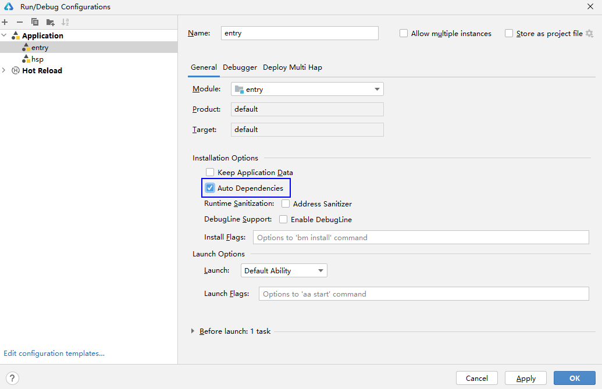
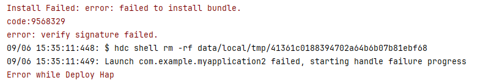
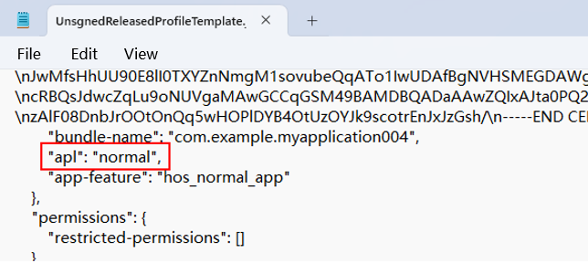

# Bundle Manager

Bundle Manager (bm) is a tool for installing, uninstalling, updating, and querying bundles. It provides basic capabilities for debugging application installation packages.

## Environment Setup

Before using this tool, you must obtain <!--Del-->[<!--DelEnd-->hdc<!--Del-->](../../device-dev/subsystems/subsys-toolchain-hdc-guide.md)<!--DelEnd--> and run the hdc shell command.


## bm Commands

| Name| Description|
| -------- | -------- |
| help | Displays the commands supported by the bm tool.|
| install | Installs a bundle.|
| uninstall | Uninstalls a bundle.|
| dump | Displays bundle information.|
| clean | Clears the cache and data of a bundle. This command is available in the root version. It is also available in the user version with developer mode enabled. It is unavailable in other cases.|
| <!--DelRow-->enable | Enables a bundle. A bundle can be used after being enabled. This command is available in the root version but not in the user version.|
| <!--DelRow-->disable | Disables a bundle. A bundle cannot be used after being disabled. This command is available in the root version but not in the user version.|
| get | Obtains the UDID of a device.|
| quickfix | Performs patch-related operations, such as installing or querying a patch.|
| compile | Executes the AOT compilation on a bundle.|
| copy-ap | Copies the .ap file of a bundle to the **/data/local/pgo** directory for the shell user to read the file.|
| dump-dependencies | Displays the information about the modules on which the bundle depends.|
| dump-shared | Displays the HSP information of a bundle.|
| dump-overlay | Displays **overlayModuleInfo** of an overlay bundle.|
| dump-target-overlay | Displays **overlayModuleInfo** of all overlay bundles associated with a target bundle.|


## help

```bash
# Display the help information.
bm help
```


## install

```bash
bm install [-h] [-p filePath] [-r] [-w waitingTime] [-s hspDirPath]
```

  **Parameters**


| Parameter| Description|
| -------- | -------- |
| -h | Displays help information.|
| -p | Installs an HAP in a specified path or multiple HAPs in a specified directory. This parameter is mandatory.|
| -r | Installs an HAP in overwrite mode. This parameter is optional. By default, the HAP is installed in overwrite mode.|
| -s |  Installs an HSP. Each directory can have only one HSP with the same bundle name. This parameter is mandatory only for the HSP installation.|
| -w | Waits for a specified time before installing a HAP. The minimum waiting time is 5s, and the maximum waiting time is 600s. The default waiting time is 5s. This parameter is optional.|


Example
```bash
# Install an HAP.
bm install -p /data/app/ohos.app.hap
# Install an HAP in overwrite mode.
bm install -p /data/app/ohos.app.hap -r
# Install an HSP.
bm install -s xxx.hsp
# Install a HAP and its dependent HSP.
bm install -p aaa.hap -s xxx.hsp yyy.hsp
# Install an HAP. The waiting time is 10s.
bm install -p /data/app/ohos.app.hap -w 10
```

## uninstall

```bash
bm uninstall [-h] [-n bundleName] [-m moduleName] [-k] [-s] [-v versionCode]
```

  **Parameters**

| Parameter| Description|
| -------- | -------- |
| -h | Displays help information.|
| -n | Uninstalls a bundle. This parameter is mandatory.|
| -m | Uninstalls a module. This parameter is optional. By default, all modules are uninstalled.|
| -k | Uninstalls a bundle with or without retaining the bundle data. This parameter is optional. By default, the bundle data is deleted along the uninstall.|
| -s |  Uninstalls an HSP. This parameter is mandatory only for the HSP installation.|
| -v | Uninstalls an HSP of a given version number. This parameter is optional. By default, all shared bundles with the specified bundle name are uninstalled.|


Example

```bash
# Uninstall a bundle.
bm uninstall -n com.ohos.app
# Uninstall a module of a bundle.
bm uninstall -n com.ohos.app -m com.ohos.app.EntryAbility
# Uninstall a shared bundle.
bm uninstall -n com.ohos.example -s
# Uninstall a shared bundle of the specified version.
bm uninstall -n com.ohos.example -s -v 100001
# Uninstall a bundle and retain user data.
bm uninstall -n com.ohos.app -k
```


## dump

```bash
bm dump [-h] [-a] [-g] [-n bundleName] [-s shortcutInfo] [-d deviceId]
```

  **Parameters**

| Parameter| Description|
| -------- | -------- |
| -h | Displays help information.|
| -a | Displays all bundles installed in the system. This parameter is optional.|
| -g | Displays the names of bundles whose signatures are of the debug type. This parameter is optional.|
| -n | Displays the details of a bundle. This parameter is optional.|
| -s | Displays the shortcut information of a bundle. This parameter is optional.|
| -d | Displays the bundle information on a given device, which is the current device by default. This parameter is optional.  |


Example

```bash
# Display the names of all bundles installed in the system.
bm dump -a
# Display the names of bundles whose signatures are of the debug type in the system.
bm dump -g
# Display the details of a bundle.
bm dump -n com.ohos.app
# Display the shortcut information of a bundle.
bm dump -s -n com.ohos.app
# Display cross-device bundle information.
bm dump -n com.ohos.app -d xxxxx
```

## clean

```bash
bm clean [-h] [-c] [-n bundleName] [-d] [-i appIndex]
```
**Parameters**

| Parameter| Description|
| -------- | --------- |
| -h | Displays help information.|
| -c -n | **-n** is mandatory, and **-c** is optional. Clears the cache data of a specified bundle.|
| -d -n | **-n** is mandatory, and **-d** is optional. Clears the data directory of a specified bundle.|
| -i | Clears the data directory of an application clone. This parameter is optional. The default value is 0.|


Example

```bash
# Clear the cache data of a bundle.
bm clean -c -n com.ohos.app
# Clear the user data of a bundle.
bm clean -d -n com.ohos.app
# Execution result
clean bundle data files successfully.
```

<!--Del-->
## enable

```bash
bm enable [-h] [-n bundleName] [-a abilityName]
```


  **Parameters**

| Parameter| Description|
| -------- | -------- |
| -h | Displays help information.|
| -n | Enables a specified bundle. This parameter is mandatory.|
| -a | Enables an ability with a specified bundle name. This parameter is optional.|


Example

```bash
# Enable a bundle.
bm enable -n com.ohos.app -a com.ohos.app.EntryAbility
# Execution result
enable bundle successfully.
```


## disable

```bash
bm disable [-h] [-n bundleName] [-a abilityName]
```


  **Parameters**

| Parameter| Description|
| -------- | -------- |
| -h | Displays help information.|
| -n | Disables a specified bundle. This parameter is mandatory.|
| -a | Disables an ability with a specified bundle name. This parameter is optional.|


Example

```bash
# Disable a bundle.
bm disable -n com.ohos.app -a com.ohos.app.EntryAbility
# Execution result
disable bundle successfully.
```
<!--DelEnd-->


## get

```bash
bm get [-h] [-u]
```

  **Parameters**

| Parameter| Description|
| -------- | -------- |
| -h |Displays help information.|
| -u | Obtains the UDID of a device. This parameter is mandatory.|


Example

```bash
# Obtain the UDID of a device.
bm get -u
# Execution result
udid of current device is:
23CADE0C
```


## quickfix

```bash
bm quickfix [-h] [-a -f filePath [-t targetPath] [-d] [-o]] [-q -b bundleName] [-r -b bundleName]
```

Note: For details about how to create an .hqf file, see [HQF Packing Command](packing-tool.md#hqf-packing-command).

  **Parameters**
|   Parameter | Description|
| -------- | -------- |
| -h | Displays help information.|
| -a -f | **-a** is optional, and **-f** is mandatory when **-a** is specified. Executes the quick fix patch installation command. **file-path** corresponds to an .hqf file. You can pass in one or more .hqf files or the directory where the .hqf file is located.|
| -q -b | **-q** is optional, and **-b** is mandatory when **-q** is specified. Displays the patch information based on the bundle name.|
| -r&nbsp;-b | **-r** is optional, and **-b** is mandatory when **-r** is specified. Uninstalls a disabled patch based on the bundle name.|
| -t | Fixes a bundle to a specified path. This parameter is optional.|
| -d | Selects the debug mode for quick fix. This parameter is optional.|
| -o | Selects the overwrite mode for quick fix. In this mode, the .so file is decompressed and overwritten in the .so directory of the bundle. This parameter is optional.|


Example

```bash
# Display patch package information by the bundle name.
bm quickfix -q -b com.ohos.app
# Execution result
# Information as follows:
# ApplicationQuickFixInfo:
#  bundle name: com.ohos.app
#  bundle version code: xxx
#  bundle version name: xxx
#  patch version code: x
#  patch version name:
#  cpu abi:
#  native library path:
#  type:

# Install a quick fix patch.
bm quickfix -a -f /data/app/
# Execution result
apply quickfix succeed.
# Uninstall a quick fix patch.
bm quickfix -r -b com.ohos.app
# Execution result
delete quick fix successfully
```

## dump-shared

```bash
bm dump-shared [-h] [-a] [-n bundleName] [-m moduleName]
```

  **Parameters**

| Parameter| Description|
| -------- | -------- |
| -h | Displays help information.|
| -a | Displays all HSPs in the system. This parameter is optional.|
| -n | Displays detailed information about the shared library with a specified bundle name. This parameter is optional.|
| -m | Displays detailed information about the shared library with a specified bundle name and module name. This parameter is optional.|


Example

```bash
# Display the bundle names of all shared libraries installed in the system.
bm dump-shared -a
# Display the details about the specified shared library.
bm dump-shared -n com.ohos.lib
# Display information about the shared library on which a specified module of a bundle depends.
bm dump-dependencies -n com.ohos.app -m entry
```

## dump-dependencies

```bash
bm dump-dependencies [-h] [-n bundleName] [-m moduleName]
```

**Parameters**
| Parameter| Description|
| -------- | -------- |
| -h | Displays help information.|
| -n | Displays information about the shared library on which a specified bundle depends. This parameter is mandatory.|
| -m | Displays information about the shared library on which a specified module of a bundle depends. This parameter is optional.|

Example
```Bash
# Display information about the shared library on which a specified module of a bundle depends.
bm dump-dependencies -n com.ohos.app -m entry
```


## compile

```bash
bm compile [-h] [-m mode] [-r bundleName]
```
**Parameters**

| Parameter| Description|
| -------- | -------- |
| -h | Displays help information.|
| -a | Compiles all bundles. This parameter is optional.|
| -m |  Compiles a bundle based on the bundle name. The value can be **partial** or **full**. This parameter is optional.|
| -r | Checks whether a bundle is removed. This parameter is optional.|

Example

```bash
# Compile a bundle based on the bundle name.
bm compile -m partial com.example.myapplication
```

## copy-ap

Copies an .ap file to the **/data/local/pgo** directory of a specified bundle.

```bash
bm copy-ap [-h] [-a] [-n bundleName]
```

**Parameters**

| Parameter| Description|
| -------- | -------- |
| -h | Displays help information.|
| -a |  Copies the .ap files related to all bundles. By default, .ap files related to all bundles are copied. This parameter is optional.|
| -n |  Copies the .ap file related to a specified bundle, which is the current bundle by default. This parameter is optional.|

Example

```bash
# Copy the .ap file related to a specified bundle.
bm copy-ap -n com.example.myapplication
```

## dump-overlay

```bash
bm dump-overlay [-h] [-b bundleName] [-m moduleName]
```

**Parameters**
| Parameter| Description|
| -------- | -------- |
| -h | Displays help information.|
| -b | Displays all **OverlayModuleInfo** about a specified overlay bundle. This parameter is mandatory.|
| -m | By default, the name of the main module of the current overlay bundle is used. This parameter is optional. Displays **OverlayModuleInfo** about a specified overlay bundle based on the bundle name and module name.|

Example

```bash
# Display OverlayModuleInfo of an overlay bundle named com.ohos.app.
bm dump-overlay -b com.ohos.app

# Display OverlayModuleInfo of the overlay module named entry in an overlay bundle named com.ohos.app.
bm dump-overlay -b com.ohos.app -m entry

# Display OverlayModuleInfo of the overlay module named feature in an overlay bundle named com.ohos.app.
bm dump-overlay -b com.ohos.app -m feature
```

## dump-target-overlay

Displays **overlayModuleInfo** of all overlay bundles associated with a target bundle.

```bash
bm dump-target-overlay [-h] [-b bundleName] [-m moduleName]
```

**Parameters**
| Parameter| Description|
| -------- | -------- |
| -h | Displays help information.|
| -b | Displays all **OverlayBundleInfo** about a specified bundle. This parameter is mandatory.|
| -m |  Displays **OverlayModuleInfo** based on a specified bundle name and module name. By default, **OverlayModuleInfo** of the main module of the current bundle is displayed. This parameter is optional.|

Example

```bash
# Display OverlayBundleInfo of an overlay bundle named com.ohos.app.
bm dump-target-overlay-b com.ohos.app

# Display OverlayModuleInfo of the overlay module named entry in an overlay bundle named com.ohos.app.
bm dump-target-overlay -b com.ohos.app -m entry
```

## Error Codes

### 9568320 The Signature File Does Not Exist
**Error Message**

Failed to install bundle, no signature file.


**Symptom**

A user attempts to install an unsigned HAP file.

**Possible Causes**

The HAP file is not signed.

**Solution**

1. Use [automatic signing](https://developer.huawei.com/consumer/en/doc/harmonyos-guides-V13/ide-signing-V13#section18815157237) to sign the HAP file. after the device is connected.
2. Manually sign the HAP file. For details, see [Signing Your App/Atomic Service Manually](https://developer.huawei.com/consumer/en/doc/harmonyos-guides-V13/ide-signing-V13#section297715173233).
<br></br>

### 9568347 The Local .so File Fails to Be Parsed
**Error Message**

error: install parse native so failed.

**Symptom**

When you start debugging or running a C++ app/service, the error message "error: install parse native so failed" is displayed during HAP installation.

**Possible Causes**

The Application Binary Interface (ABI) supported by the device does not match that configured in the C++ project.

> **NOTE**
>
> - If the project has a dependent HSP or HAR module, make sure that one of the ABI types configured for all modules that contain C++ code is supported by the device.
> - If the project depends on a third-party library that includes .so files, make sure the appropriate ABI directory for your device, such as **arm64-v8a** or **x86_64**, is present in the **oh_modules/*third-party-library*/libs** directory.
<!--RP1--><!--RP1End-->

**Solution**

1. Connect the device to DevEco Studio.
2. Open the CLI and go to the **toolchains** directory in the SDK installation directory.
    ```
    To check the OpenHarmony SDK installation directory, choose **File** > **Settings** > **SDK**.
    ```
3. Run the following command to obtain the list of ABI types supported by the device, which include one or more of the following: default, armeabi-v7a, armeabi, arm64-v8a, x86, and x86_64.
    ```
    hdc shell
    param get const.product.cpu.abilist
    ```
4. Based on the obtained list, modify the **abiFilters** settings in the [module-level build-profile.json5](https://developer.huawei.com/consumer/en/doc/harmonyos-guides-V13/ide-hvigor-compilation-options-customizing-sample-V13#section4322212200) file. The rules are as follows:
    * If the list includes only **default**, run the following command to check whether the **lib64** folder exists:
      ```
      cd /system/
      ls
      ```
      
      * If the **lib64** folder exists, add the arm64-v8a type to **abiFilters**.
      * If the **lib64** folder does not exist, add armeabi, armeabi-v7a, or both types to **abiFilters**.
    * If the list includes one or more of the following, add at least one of them to **abiFilters**: armeabi-v7a, armeabi, arm64-v8a, x86, and x86_64.
<br></br>


### 9568344 The Configuration File Fails to Be Parsed
**Error Message**

error: install parse profile prop check error.


**Symptom**

When you start debugging or run an application, the error message "error: install parse profile prop check error" is displayed during the installation of the HAP.

**Possible Causes**

1. The **bundleName** in the [app.json5 configuration file](../quick-start/app-configuration-file.md#tags-in-the-configuration-file) and **name** in the [module.json5 configuration file](../quick-start/module-configuration-file.md#tags-in-the-configuration-file) are invalid.

<!--Del-->
2. The **type** field in [extensionAbilities](../quick-start/module-configuration-file.md#extensionabilities) is set to **service** or **dataShare**.
<!--DelEnd-->


**Solution**
1. Modify the **bundleName** field in the app.json5 configuration file and the **name** field in the module.json5 file based on the naming rule.
<!--Del-->
2. If the **type** field in **extensionAbilities** is set to **service** or **dataShare**, set [allowAppUsePrivilegeExtension](../../device-dev/subsystems/subsys-app-privilege-config-guide.md) for the application as follows:

    1. Obtain the new signature fingerprint.

        a. In the project-level **build-profile.json5** file (in the root directory of the project), obtain the value of **profile** in the **signingConfigs** field, which is the storage path of the signature file.

        b. Open the signature file (with the file name extension .p7b), search for **development-certificate** in the file, copy **-----BEGIN CERTIFICATE-----**, **-----END CERTIFICATE-----**, and the information between them to a new text file, delete the newline characters, and save the file as a new .cer file.

        The format of the new .cer file is shown below. (The file content is an example.)

        

        c. Use the keytool (available in the **jbr/bin** folder of the DevEco Studio installation directory) to obtain the SHA-256 value of the certificate fingerprint from the .cer file:
          ```
          keytool -printcert -file xxx.cer
          ```
        d. Remove colons (:\) from the SHA-256 content in the certificate fingerprint. What you get is the signature fingerprint.

        The following figure shows an example.
        

        After colons are removed, the obtained signature fingerprint is **5753DDBC1A8EF88A62058A9FC4B6AFAFC1C5D8D1A1B86FB3532739B625F8F3DB**.

    2. Obtain the **install_list_capability.json** file of the device.

        a. Connect to the device and enter the shell.
        ```
        hdc shell
        ```
        b. Run the following command to view the **install_list_capability.json** file of the device:
        ```
        // Locate the file on the device.
        find /system -name install_list_capability.json
        ```
        c. Run the following command to obtain the **install_list_capability.json** file:
        ```
        hdc target mount
        hdc file recv /system/etc/app/install_list_capability.json
        ```

    3. Add the signature fingerprint obtained to **app_signature** in the **install_list_capability.json** file. Note that the signature fingerprint must be configured under the corresponding bundle name.
    
    4. Push the modified **install_list_capability.json** file to the device and restart the device.

        ```
        hdc target mount
        hdc file send install_list_capability.json /system/etc/app/install_list_capability.json
        hdc shell chmod 644 /system/etc/app/install_list_capability.json
        hdc shell reboot
        ```
    5. Reinstall the application.<!--DelEnd-->


### 9568305 The Dependent Module Does Not Exist
**Error Message**

error: dependent module does not exist.


**Symptom**

When you start debugging or run an application, the error message "error: dependent module does not exist" is displayed during the installation of the HAP.

**Possible Causes**

The SharedLibrary module on which the application depends is not installed.

**Solution**

1. Install the dependent SharedLibrary module. On the **Run/Debug Configurations** page of DevEco Studio, select **Keep Application Data** on the **General** tab page, and click **OK** to save the configuration. Then run or debug the application again.

2. On the **Run/Debug Configurations** page of DevEco Studio, click the **Deploy Multi Hap** tab, select **Deploy Multi Hap Packages**, select the dependent module SharedLibrary, and click **OK** to save the configuration. Then run or debug the application again.

3. Choose **Run** > **Edit Configurations**. On the **General** tab page, select **Auto Dependencies**. Click **OK** to save the configuration, and then run or debug the project.


### 9568259 Some Fields Are Missing in the Configuration File
**Error Message**

error: install parse profile missing prop.


**Symptom**

When you start debugging or run an application, the error message "error: install parse profile missing prop" is displayed during the installation of the HAP.

**Possible Causes**

Mandatory fields are missing in the **app.json5** and **module.json5** files.

**Solution**

* 1. Check and add mandatory fields by referring to the [app.json5 file](../quick-start/app-configuration-file.md) and [module.json5 file](../quick-start/module-configuration-file.md).
* 2. Determine the missing fields based on the HiLog.

    Run the following command to enable disk flushing:
    ```
    hilog -w start
    ```

    Disk location: **/data/log/hilog**

    Open the log file and find **profile prop %{public}s is mission**. For example, **profile prop icon is mission** indicates that the **icon** field is missing.


### 9568258 The Release Types of the New Application and Existing Application Are Different
**Error Message**

error: install releaseType target not same.


**Symptom**

When you start debugging or run an application, the error message "error: install releaseType target not same" is displayed during the installation of the HAP.

**Possible Causes**

* Scenario 1: The value of **releaseType** in the SDK used by the existing HAP is different from that used by the new HAP.
* Scenario 2: When the application has multiple HAPs, the **releaseType** values in the SDK used by each HAP are different.

**Solution**

* Scenario 1: Uninstall the existing HAP on the device and then install a new HAP.
* Scenario 2: Use the same SDK to repackage the HAPs to ensure that the **releaseType** values of multiple HAPs are the same.


### 9568322 The Signature Verification Fails Because the Application Source Is Untrusted
**Error Message**

error: signature verification failed due to not trusted app source.


**Symptom**

When you start debugging or run an application, the error message "error: signature verification failed due to not trusted app source" is displayed during the installation of the HAP.

**Possible Causes**

* Scenario 1: The signature does not contain the UDID of the debugging device.

* Scenario 2: The [release certificate and release profile](https://developer.huawei.com/consumer/en/doc/app/agc-help-releaseharmony-0000001933963166) is used during signature. However, an application signed by a release certificate cannot be debugged or run.

**Solution**

* Scenario 1:
	1. Use [automatic signing](https://developer.huawei.com/consumer/en/doc/harmonyos-guides-V13/ide-signing-V13#section18815157237) to sign the HAP file. after the device is connected.
	2. If manual signature is used, add the UDID of the device to the **UnsgnedDebugProfileTemplate.json** file. For details, see <!--RP2-->[hapsigner Guide](https://gitee.com/openharmony/docs/blob/master/en/application-dev/security/hapsigntool-guidelines.md)<!--RP2End-->.

        1. Obtain the UDID of the device.

        ```
          // Command for obtaining the UDID
          hdc shell bm get -u
        ```

        2. Go to the DevEco Studio installation path and open the **UnsgnedDebugProfileTemplate.json** configuration file in the SDK directory.

        ```
          DevEco Studio installation path\sdk\version number or default\openharmony\toolchains\lib\

          Example: xxxx\Huawei\DevEco Studio\sdk\HarmonyOS-NEXT-DB1\openharmony\toolchains\lib\
          Example: xxxx\Huawei\DevEco Studio\sdk\default\openharmony\toolchains\lib\
        ```

        3. Add the UDID of the device to the **device-ids** field in the **UnsgnedDebugProfileTemplate.json** file.

  3. Check whether the signature contains the UDID of the debugging device. You can use a text editor to open the signed HAP and search for **device-ids**.
* Scenario 2: Use the [debug certificate and debug profile](https://developer.huawei.com/consumer/en/doc/app/agc-help-debug-app-0000001914423098) to re-sign the application.

### 9568286 The Type of the Signing Certificate Profile of the New Application Is Different from That of the Existing Application
**Error Message**

error: install provision type not same.

**Symptom**

When an application or service is debugged or running, the HAP fails to be installed because the type of the [signing certificate profile](https://developer.huawei.com/consumer/en/doc/app/agc-help-add-releaseprofile-0000001914714796) of the new application is different from that of the existing application.

**Possible Causes**

The type in the signing certificate profile of the new application is different from that of the existing application.

**Solution**

1. Ensure that the type of the signing certificate profile of the new application is the same as that of the existing application, and install the new HAP.
2. Uninstall the existing application and install the new HAP.

### 9568289 The Installation Fails Because the Permission Request Fails
**Error Message**

error: install failed due to grant request permissions failed.


**Symptom**

When you start debugging or run an application, the error message "error: install failed due to grant request permissions failed" is displayed during the installation of the HAP.

**Possible Causes**

The application uses the default Ability Privilege Level (APL), which is normal, and requires the system_basic or system_core permission.

**Solution**

1. Go to the DevEco Studio installation path and open the **UnsgnedDebugProfileTemplate.json** configuration file in the SDK directory.
```
DevEco Studio installation path\sdk\version number or default\openharmony\toolchains\lib\

Example: xxxx\Huawei\DevEco Studio\sdk\HarmonyOS-NEXT-DB1\openharmony\toolchains\lib\
Example: xxxx\Huawei\DevEco Studio\sdk\default\openharmony\toolchains\lib\
```
2. In the **UnsgnedDebugProfileTemplate.json** file, change the APL level to **system_core** and re-sign the package.


### 9568297 The Installation Fails Because the SDK Version of the Device Is Too Early
**Error Message**

error: install failed due to older sdk version in the device.


**Symptom**

When you start debugging or run an application, the error message "error: install failed due to older sdk version in the device" is displayed during the installation of the HAP.

**Possible Causes**

The SDK version used for build and packing does not match the device image version.

**Solution**

* Scenario 1: The device image version is earlier than the SDK version for build and packing. Update the device image version. Run the following command to query the device image version:
  ```
  hdc shell param get const.ohos.apiversion
  ```
  If the API version provided by the image is 10 and the SDK version used for application build is also 10, the possible cause is that the image version is too early to be compatible with the SDK verification rules of the new version. In this case, update the image version to the latest version.

* Scenario 2: For applications that need to run on OpenHarmony devices, ensure that runtimeOS has been changed to OpenHarmony.

### 9568332 The Installation Fails Due to Inconsistent Signatures
**Error Message**

error: install sign info inconsistent.


**Symptom**

When you start debugging or run an application, the error message "error: install sign info inconsistent" is displayed during the installation of the HAP.

**Possible Causes**

1. The signatures of the existing application and new application are different, or the signatures of HAPs and HSPs are different. **Keep Application Data** is selected in **Edit Configurations** (the application installation is overwritten) and the application is re-signed.
2. If an application is uninstalled but its data is kept, and a new application with the same bundle name is later installed, it is necessary to check whether the identity details match. If the signature information is inconsistent, this error is reported.


**Solution**

1. Uninstall the application, or deselect **Keep Application Data**. Then install the new application.
2. If the signature inconsistency is caused by HSPs provided by different teams, use [integrated HSP](../quick-start/integrated-hsp.md). If there are multiple HAPs, ensure that their signatures are the same.
3. If an application is uninstalled but its data is kept, a new application with the same bundle name but different signature information fails to be installed. To install the new application, you must first reinstall the uninstalled application and uninstall it without retaining the data.

### 9568329 The Signature Information Fails to Be Verified
**Error Message**

error: verify signature failed.



**Symptom**

The **bundleName** in the signature information is different from that of the application.

**Possible Causes**

* Scenario 1: An HSP module provided by a third party is imported, and the HSP is neither an [integrated HSP](../quick-start/integrated-hsp.md) nor an HSP with the same bundle name, causing the bundle name inconsistency.

* Scenario 2: An incorrect signature file (with the file name extension .p7b) is used for signature, causing the bundle name inconsistency.


**Solution**

* Scenario 1: Use an HSP only for the application with the same bundle name; use an integrated HSP for applications with different bundle names. Ask the third party to provide an integrated HSP or an HSP with the same bundle name.

* Scenario 2: Check the signing process and signing certificate. For details, see [Signing Your App/Atomic Service](https://developer.huawei.com/consumer/en/doc/harmonyos-guides-V13/ide-signing-V13).


### 9568266 The Installation Permission Is Denied
**Error Message**

error: install permission denied.


**Symptom**

When you run the **hdc install** command to install the HAP file, the error message "code:9568266 error: install permission denied" is displayed.

**Possible Causes**

The **hdc install** command cannot be used to install the enterprise application with a release signature.

**Solution**

1. Run the **hdc install** command to install and debug the enterprise application with a debug signature.


### 9568337 The Installation Parsing Fails
**Error Message**

error: install parse unexpected.

**Symptom**

When an application is pushed to a device, an error message is displayed, indicating that the HAP file fails to be opened.

**Possible Causes**

* Scenario 1: The storage space of the system partition is full. As a result, when you run the **hdc file send** command, files on the device are damaged due to insufficient storage space.

* Scenario 2: The HAP file is damaged when it is pushed to the device.

**Solution**

* 1. Check the storage space allocated to the system partition. If the storage space is full, clear the storage space to install the HAP file.
  ```bash
  hdc shell df -h /system
  ```

* 2. Check the MD5 values of the local HAP file and the HAP file pushed to the device. If they are different, the HAP is damaged during the push. In this case, push the file again.


### 9568316 The Permission of APL in ProxyData Is Low
**Error Message**

error: apl of required permission in proxy data is too low.

**Symptom**

**requiredReadPermission** and **requiredWritePermission** of the **proxyData** tag in the **module.json** file fail to be verified.

**Possible Causes**

**requiredReadPermission** and **requiredWritePermission** can be configured only when the application has the permission level of **system_basic** or **system_core**.

**Solution**

1. Check whether the **proxyData** content defined by the application meets the requirements. For details, see [proxyData](../quick-start/module-configuration-file.md#proxydata).


### 9568315 The URI in Proxy Data Is Incorrect
**Error Message**

error: uri in proxy data is wrong.

**Symptom**

**uri** of the **proxyData** tag in the **module.json** file fails to be verified.

**Possible Causes**

The format of **uri** does not meet the requirement.

**Solution**

1. Check whether the **proxyData** content defined by the application meets the requirements. For details, see [proxyData](../quick-start/module-configuration-file.md#proxydata).


### 9568336 The Debugging Type of the Application Is Different From That of the Installed Application
**Error Message**

error: install debug type not same.

**Symptom**

The debugging type (the **debug** field in the **app.json** file) of the application is different from that of the installed application.

**Possible Causes**

You have installed the application using the **Debug** button of DevEco Studio, and then you install the HAP file of the application by running the **hdc install** command.

**Solution**

1. Uninstall the existing application and install the new application.


### 9568296 The Bundle Type Is Incorrect
**Error Message**

error: install failed due to error bundle type.

**Symptom**

The installation fails because the **bundleType** tag is incorrect.

**Possible Causes**

The **bundleType** of the application to be installed is different from that of an existing application with the same **bundleName**.

**Solution**

* Method 1. Uninstall the existing application and install the application again.

* Method 2: Set the **bundleType** of the application to the same as that of the existing application.


### 9568292 The User With UserID 0 Can Install Only the Singleton Application
**Error Message**

error: install failed due to zero user can only install singleton app.

**Symptom**

The user with **UserID 0** is only allowed to install the application with the **singleton** permission, and the application with the **singleton** permission is only allowed to be installed by the user with **UserID 0**.

**Possible Causes**

**UserID** is not set to **0** for the application with the **singleton** permission.

**Solution**

1. If the application has the **singleton** permission, set **UserID** to **0** during installation.
	```bash
	# Set the user ID to 0.
	hdc install -p <HAP file name>.hap -u 0
	```


### 9568263 The Installation Version Cannot Be Downgraded
**Error Message**

error: install version downgrade.

**Symptom**

The installation fails because **versionCode** of the application to be installed is earlier than that of the existing application.

**Possible Causes**

The **versionCode** of the application to be installed is earlier than that of the existing application.

**Solution**

1. Uninstall the existing application and install the new application.


### 9568304 The Application Does Not Support the Current Device Type
**Error Message**

error: device type is not supported.

**Symptom**

The installation fails because the application does not support the current device type.

**Possible Causes**

The application does not support the current device type.

**Solution**

1. To adapt to the current device, add the current device type to the value of **deviceTypes** of the application. The value of **deviceTypes** can be any of the following: phone, tablet, 2in1, tv, wearable, and car.


### 9568317 The Multi-Process Configuration of the Application Does Not Match the System Configuration
**Error Message**

error: isolationMode does not match the system.

**Symptom**

The installation fails because **isolationMode** of the application is not supported by the system.

**Possible Causes**

* 1. The device supports the isolation mode (the value of **persist.bms.supportIsolationMode** is **true**), whereas the value of **isolationMode** in the HAP is **nonisolationOnly**.

* 2. The device does not support the isolation mode (the value of **persist.bms.supportIsolationMode** is **false**), whereas the value of **isolationMode** in the HAP is **isolationOnly**.

**Solution**

1. Set the value of **isolationMode** in the HAP configuration file based on the isolation mode of the device.
	```bash
	# Query the value of persist.bms.supportIsolationMode. If errNum is:106 is returned, persist.bms.supportIsolationMode is not configured.
	hdc shell
	param get persist.bms.supportIsolationMode
	# Set persist.bms.supportIsolationMode.
	hdc shell
	param set persist.bms.supportIsolationMode [true|false]
	```


### 9568315 The URI Attribute of the Proxy Data Is Incorrect
**Error Message**

error: uri in proxy data is wrong.

**Symptom**

**uri** of the **proxyData** tag in the **module.json** file fails to be verified.

**Possible Causes**

The format of **uri** does not meet the requirement.

**Solution**

1. Ensure that the URI meets the format requirements.
	```bash
	# URI format specifications.
	The URI of a data proxy must be unique and must be in the format of datashareproxy://bundleName/xxx.
	```


### 9568310 The Compatibility Policies Are Different
**Error Message**

error: compatible policy not same.

**Symptom**

The compatibility policy of the new bundle is different from that of the existing bundle.

**Possible Causes**

1. The shared library to be installed has the same bundle name as the existing bundle.
2. The bundle to be installed has the same bundle name as the existing shared library.

**Solution**

1. Uninstall the installed bundle or shared library, and install the new bundle.


### 9568391 The Bundle Manager Service Is Stopped
**Error Message**

error: bundle manager service is died.

**Symptom**

The bundle manager service is stopped.

**Possible Causes**

An unknown system exception occurs.

**Solution**

1. Restart the phone and try again.

2. If the installation still fails after the preceding steps are performed for three to five times, check whether a crash file containing **foundation** exists in the **/data/log/faultlog/faultlogger/** directory of the device.
```
hdc shell
cd /data/log/faultlog/faultlogger/
ls -ls
```
3. Export the crash file and log file and submit them to [online tickets](https://developer.huawei.com/consumer/en/support/feedback/#/) for help.
```
hdc file recv /data/log/faultlog/faultlogger/
hdc file recv /data/log/hilog/
```

### 9568393 The Code Signature Fails to Be Verified
**Error Message**

error: verify code signature failed.

**Symptom**

The code signature fails to be verified.

**Possible Causes**

The bundle does not contain code signature information.

**Solution**

1. Install the latest version of DevEco Studio and sign the code again.

<!--RP3--><!--RP3End-->

### 9568401 The Bundle to Debug Can Run Only on Devices in Developer Mode
**Error Message**

error: debug bundle can only be installed in developer mode.

**Symptom**

The bundle to debug can run only on devices in developer mode.

**Possible Causes**

Developer mode is not enabled on the device.

**Solution**

1. Choose **Settings** > **System** and check whether **Developer options** is available. If not, go to **Settings** > **About** and touch the version number for seven consecutive times until the message "Enable developer mode?" is displayed. Touch **OK** and enter the PIN (if set). Then the device will automatically restart.
2. Connect the device to the PC using a USB cable. Choose **Settings** > **System** > **Developer options** and enable USB debugging. In the displayed dialog box, touch **Allow**.
3. Start debugging or run the application.

### 9568386 The Bundle Cannot Be Found for Uninstallation
**Error Message**

error: uninstall missing installed bundle.

**Symptom**

The bundle cannot be found for uninstallation.

**Possible Causes**

The bundle to be uninstalled is not installed.

**Solution**

1. Check whether the bundle to be uninstalled has been installed.

### 9568388 Bundle Uninstall Is Not Allowed by Enterprise Device Management
**Error Message**

error: Failed to uninstall the HAP because the uninstall is forbidden by enterprise device management.

**Symptom**

The enterprise device management does not allow the uninstall of this bundle.

**Possible Causes**

The bundle is set not to be uninstalled.

**Solution**

1. The enterprise device management cancels the uninstallation control of the bundle.

### 9568284 The Installation Version Is Not Compatible
**Error Message**

error: install version not compatible.

**Symptom**

The installation version is not compatible.

**Possible Causes**

The version of the installed HSP does not match that of the installed HAP.
When an HSP is installed, the following information is verified:
1. bundleName
2. Version
3. Signature

**Solution**

1. Uninstall the HAP whose version does not match and then install the HSP.
2. Change the HSP version to be the same as that of the HAP and install the HSP again.

### 9568287 The Number of Entry Modules in the Installation Package Is Invalid
**Error Message**

error: install invalid number of entry HAP.

**Symptom**

The number of entry modules in the installation package is invalid.

**Possible Causes**

There are multiple entry modules in the installation package. An application can have only one entry module but multiple feature modules.

**Solution**

1. Retain one entry module and change the other entry modules to feature modules (by modifying the **type** field in **module.json5**).


### 9568281 The vendor Field of the Installation Package Is Inconsistent
**Error Message**

error: install vendor not same.

**Symptom**

The **vendor** field of the installation package is inconsistent.

**Possible Causes**

The **vendor** field of the application in the **app.json5** file is inconsistent.

**Solution**

1. If only a HAP is involved, the **vendor** field of the HAP must be the same as that of the installed application. In this case, uninstall and reinstall the HAP.
2. If an integrated HSP is included, the **vendor** field of the integrated HSP must be the same as that of the HAP.


### 9568274 An Error Occurs During Service Installation
**Error Message**

error: install installd service error.

**Symptom**

An error occurs during service installation.

**Possible Causes**

An exception occurs during service installation.

**Solution**

1. Clear the cache and restart the device.


### 9568314 The HSP Fails to Be Installed
**Error Message**

error: Failed to install the HSP because installing a shared bundle specified by hapFilePaths is not allowed.

**Symptom**

The HSP fails to be installed.

**Possible Causes**

The HSP is installed by running the **hdc app install \***\** command.

**Solution**

1. Run the **hdc install -s \***\** command to install the HSP.


### 9568359 The SELinux Fails to be Installed and Set
**Error Message**

error: installd set selinux label failed.

**Symptom**

The SELinux fails to be installed and set.

**Possible Causes**

The **apl** field in the signature configuration file is incorrect. It can be **normal**, **system_basic**, and **system_core**.

**Solution**

1. Check whether the **apl** field in the .p7b file is correct.

    

2. If the **apl** field is incorrect, modify the **apl** field in the **UnsgnedReleasedProfileTemplate.json** file and sign the file again.

    

### 9568398 The Enterprise Bundle Is Not Allowed to Be Installed on Non-Enterprise Devices
**Error Message**

error: Failed to install the HAP because an enterprise normal/MDM bundle can not be installed on non-enterprise device.

**Symptom**

A non-enterprise device fails to install a bundle whose distribution type is **enterprise_mdm** or **enterprise_normal**.

**Possible Causes**

The device is not an enterprise device.

**Solution**

1. Install the enterprise bundle on the enterprise device.

### 9568402 The release Bundle of the app_gallery Type Cannot Be Installed
**Error Message**

error: Release bundle can not be installed.

**Symptom**

The bundle whose distribution type is **app_gallery** and signing certificate type is **release** cannot be installed by running the bm command.

**Possible Causes**

The bundle's distribution type is **app_gallery** and the signing certificate type is **release**.

**Solution**

1. Use other certificates than those of the **app_gallery** type to re-sign the bundle.
2. Use the **debug** certificate to re-sign the bundle.

### 9568403 The Encryption Check Fails During the Installation
**Error Message**

error: check encryption failed.

**Symptom**

The encryption check fails during the installation.

**Possible Causes**

The image version is too early or the **lib** directory of the HAP contain non-so files.

**Solution**

1. Install a new image version.
2. Delete non-so files in the **lib** directory of the HAP project and re-sign and package the files.

### 9568407 Failed to Install the Native Software Package
**Error Message**

error: Failed to install the HAP because installing the native package failed.

**Symptom**

The native software package fails to be installed during HAP installation.

**Possible Causes**

The native software package to be installed in the HAP is damaged.

**Solution**

1. Check the native software package in the HAP, replace the native software package with the correct one, and re-sign and package the software package. For details, see [Native Software Package Development Guide](https://gitee.com/openharmony/startup_appspawn/tree/master/service/hnp).

### 9568408 Failed to Uninstall the Native Software Package
**Error Message**

error: Failed to uninstall the HAP because uninstalling the native package failed.

**Symptom**

The native software package fails to be uninstalled during HAP uninstall.

**Possible Causes**

The native software package to be uninstalled is occupied.

**Solution**

1. Check whether any process occupies the native software package. If yes, stop the process and uninstall the native software package again. For details, see [Native Software Package Development Guide](https://gitee.com/openharmony/startup_appspawn/tree/master/service/hnp).

### 9568409 Failed to Extract the Native Software Package
**Error Message**

error: Failed to install the HAP because the extract of the native package failed.

**Symptom**

The native software package fails to be extracted during the HAP installation.

**Possible Causes**

The native software package configured in **module.json5** does not exist in the HAP.

**Solution**

1. Check the native software package directory in the HAP, input the native software package to be installed again and sign the package, or delete the missing native software package configuration from the **module.json5** file. For details, see [Native Software Package Development Guide](https://gitee.com/openharmony/startup_appspawn/tree/master/service/hnp).

### 9568410 Failed To Install the HAP Because the Device Is Under Control
**Error Message**

error: Failed to install the HAP because the device has been controlled.

**Symptom**

The HAP fails to be installed because the device is under control.

**Possible Causes**

The device is activated through an unauthorized channel.

**Solution**

1. Check whether the device is obtained from unauthorized channels.
2. Activate the device through the normal process.

### 9568415 The Encrypted Bundle Whose Signing Certificate Is Debug or Debug Is True in Configuration File Cannot Be Installed
**Error Message**

error: Debug encrypted bundle is not allowed to install.

**Symptom**

The encrypted application whose signing certificate is of the **debug** type or whose **debug** attribute of the configuration file is **true** cannot be installed.

**Possible Causes**

1. An encrypted bundle whose signing certificate is of the **debug** type has been installed.
2. An encrypted bundle whose **debug** attribute value is **true** in the configuration file has been installed.

**Solution**

1. Decrypt the encrypted bundle for installation and debugging.

### 9568416 The Encrypted Bundle Cannot Be Installed
**Error Message**

error: Encrypted bundle can not be installed.

**Symptom**

The encrypted bundle cannot be installed using the bm command.

**Possible Causes**

The installed bundle is encrypted.

**Solution**

1. Use [automatic signing](https://developer.huawei.com/consumer/en/doc/harmonyos-guides-V13/ide-signing-V13#section18815157237) or [manual signing](https://developer.huawei.com/consumer/en/doc/harmonyos-guides-V13/ide-signing-V13#section297715173233) to re-sign the bundle for installation and debugging.

### 9568417 Failed to Verify the Signature
**Error Message**

error: bundle cannot be installed because the appId is not same with preinstalled bundle.

**Symptom**

The signature verification fails.

**Possible Causes**

The signature of the installed bundle is different from that of the pre-installed bundle with the same bundle name.

**Solution**

1. Ensure that the signature of the bundle to be installed is the same as that of the pre-installed bundle.

### 9568418 Failed to Uninstall an Application Configured with an Uninstallation Disposed Rule
**Error Message**

error: Failed to uninstall the app because the app is locked.

**Symptom**

The application cannot be directly uninstalled because it is configured with an uninstallation disposed rule.

**Possible Causes**

The application to uninstall is configured with an uninstallation disposed rule.

**Solution**

1. Check whether the application is configured with an uninstallation disposed rule. The entity that set the rule is responsible for canceling the rule.

### 9568420 Do Not Use the bm Tool to Install Pre-installed Bundles of the Release Version
**Error Message**

os_integration bundle is not allowed to install for shell.

**Symptom**

The pre-installed bundles of the release version cannot be installed.

**Possible Causes**

The bundles are installed using the bm tool.

**Solution**

1. Check whether the bundle is a pre-installed bundle of the release version.

### 9568278 Version Codes of Bundles Are Inconsistent
**Error Message**

error: install version code not same.

**Possible Causes**
1. The version code of the new bundle is different from that of the existing bundle.
2. The version codes of multiple bundles to be installed are inconsistent.

**Solution**
1. Change the version code of the new bundle to be the same as that of the existing bundle, or uninstall the existing bundle and install the new bundle.
2. Ensure that the version codes of all new bundles are the same.

### 9568421 The Application Fails to Be Installed on the Device Because the Type of the Signing Certificate Profile Is Not Supported 
**Error Message**

error: the app distribution type is not allowed install.

**Possible Causes**

The type of the [signing certificate profile](https://developer.huawei.com/consumer/en/doc/app/agc-help-add-releaseprofile-0000001914714796) of the application is not supported on the device.

**Solution**

Change the type of the signing certificate profile.
