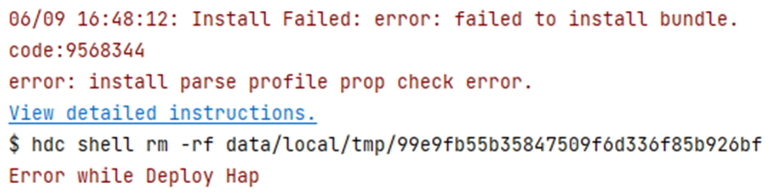
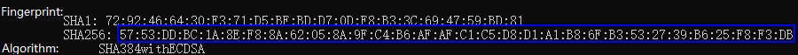
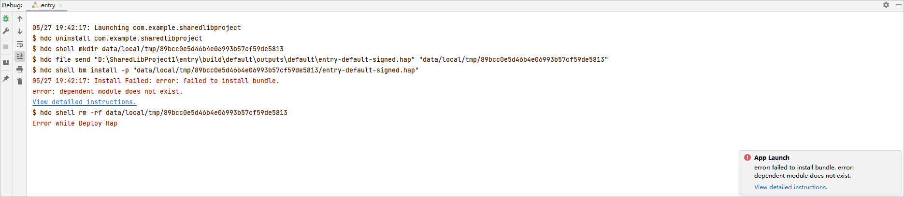
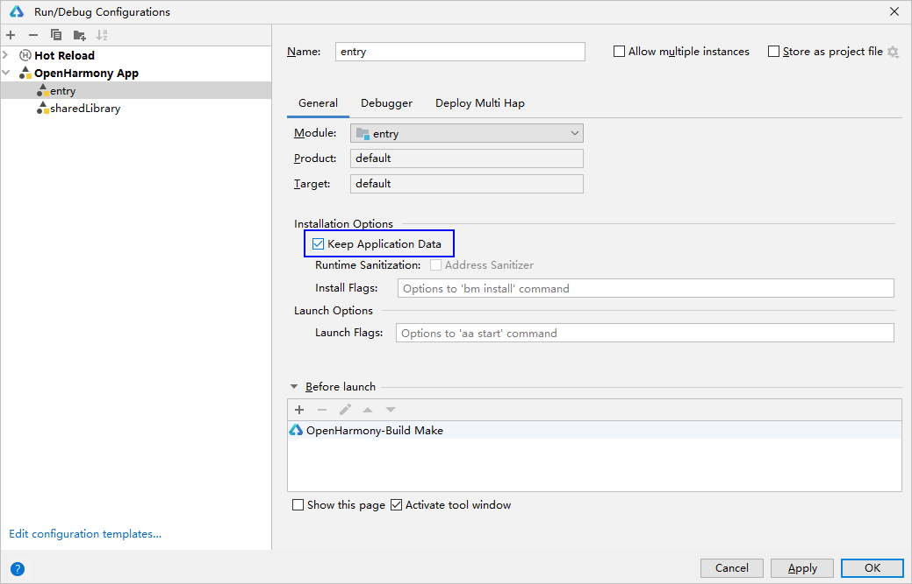
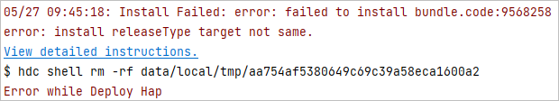
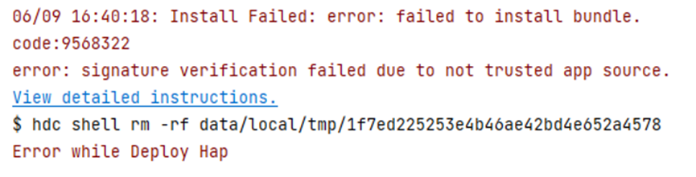
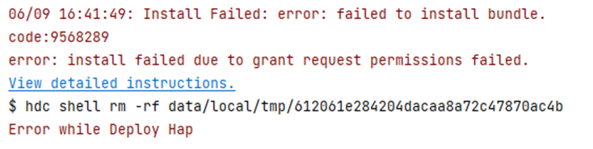
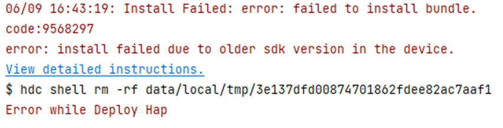

# Bundle Manager


The Bundle Manager enables you to install, uninstall, update, and query a bundle (application). It provides the bundle debugging capabilities, for example, installing and uninstalling a bundle and querying bundle information.

> **NOTE**
>
> Before using this tool, you must obtain the <!--Del-->[<!--DelEnd-->hdc tool<!--Del-->](../../device-dev/subsystems/subsys-toolchain-hdc-guide.md)<!--DelEnd--> and run the hdc shell command.


  **Table 1** bm commands

| Name| Description|
| -------- | -------- |
| help | Displays the commands supported by the Bundle Manager tool.|
| install | Installs a bundle.|
| uninstall | Uninstalls a bundle.|
| dump | Displays bundle information.|
| clean | Clears the cache and data of a bundle. This command is available in the root version and is available in the user version with developer mode enabled. It is unavailable in other cases.|
| enable | Enables a bundle. A bundle can be used after being enabled. This command is available in the root version but unavailable in the user version.|
| disable | Disables a bundle. A bundle cannot be used after being disabled. This command is available in the root version but unavailable in the user version.|
| get | Obtains the UDID of a device.|
| quickfix | Performs patch-related operations, such as installing or querying a patch.|


## Help Command

  **Table 2** Help command

| Name| Description|
| -------- | -------- |
| bm help | Used to display the commands supported by the Bundle Manager tool.|

Example


```bash
# Display the help information.
bm help
```


## Installation Command

```bash
bm install [-h] [-p path] [-u userId] [-r] [-w waitting-time]
```


  **Table 3** Installation command parameters

| Name| Mandatory| Description|
| -------- | -------- | -------- |
| -h | No| Used to display the parameters supported by the **install** command. By default, the help information is displayed.|
| -p | Yes| Path of the HAP to install. You can specify a path to install one or more HAPs at the same time.|
| -u | No| User whose HAP is to be installed. By default, the current user's HAP is installed. If a driver application is to be installed, this parameter is ignored and the HAP will be installed for all users.|
| -r | No| Whether to install the HAP in overwrite mode. By default, the HAP is installed in overwrite mode.|
| -w | No| Time that the Bundle Manager tool waits before installing the HAP. The minimum waiting time is 180s, and the maximum waiting time is 600s. The default waiting time is 180s.|


Example

```bash
bm install -p /data/app/ohosapp.hap -u 100 -w 300s -r
// The execution result is as follows:
install bundle successfully.
```


## Uninstall Command

```bash
bm uninstall [-h help] [-n bundleName] [-m moduleName] [-u userId] [-k]
```


  **Table 4** Uninstall command parameters

| Name| Mandatory| Description|
| -------- | -------- | -------- |
| -h | No| Used to display the parameters supported by the **uninstall** command. By default, the help information is displayed.|
| -n | Yes| Name of the bundle to uninstall.|
| -m | No| Module of the bundle to uninstall. By default, all modules are uninstalled.|
| -u | No| User whose bundle is to be uninstalled. By default, the current active user's bundle is uninstalled. If a driver application is to be uninstalled, this parameter is ignored and the bundles of all users are uninstalled.|
| -k | No| Whether the application data is retained when the bundle is uninstalled. By default, the application data is deleted along the uninstall.|
| -v | No| Version number of the shared bundle. By default, all shared bundles with the specified bundle name are uninstalled.|


Example

```bash
bm uninstall -n com.ohos.app -m com.ohos.app.EntryAbility -u 100 -k
// The execution result is as follows:
uninstall bundle successfully.
```


## Dump Command

```bash
bm dump [-h help] [-a] [-n bundleName] [-s shortcutInfo] [-u userId] [-d deviceId]
```


If **-u** is not specified, the command applies to all users.


  **Table 5** Dump command parameters

| Name| Mandatory| Description|
| -------- | -------- | -------- |
| -h | No| Used to display the parameters supported by the **dump** command. By default, the help information is displayed.|
| -a | Yes| Used to display all bundles installed in the system.|
| -n | Yes| Used to display the details of a bundle.|
| -s | Yes| Used to display the shortcut information of a bundle.|
| -d | No| Used to display the bundle information on a given device. By default, the bundle information on the current device is queried.|
| -u | No| Used to display the bundle information for a given user. By default, the bundle information of the current user is queried.|


Example

```bash
# Display the names of all bundles installed in the system.
bm dump -a
# Display the details of a bundle.
bm dump -n com.ohos.app -u 100
# Display the shortcut information of a bundle.
bm dump -s -n com.ohos.app -u 100
# Display cross-device bundle information.
bm dump -n com.ohos.app -d xxxxx
```


## Clean Command

```bash
bm clean [-h] [-c] [-n  bundleName] [-d] [-u userId]
```


If **-u** is not specified, the command applies to all active users.


  **Table 6** Clean command parameters

| Name| Description|
| -------- | -------- |
| -h | Used to display the parameters supported by the **clean** command.|
| -c -n | Used to clear the cache data of a bundle.|
| -d -n | Used to clear the data directory of a bundle.|
| -u | Used to clear the cache data of a bundle for a given user.|


Example

```bash
# Clear the cache data of a bundle.
bm clean -c -n com.ohos.app -u 100
// The execution result is as follows:
clean bundle cache files successfully.
# Clear the user data of a bundle.
bm clean -d -n com.ohos.app -u 100
// The execution result is as follows:
clean bundle data files successfully.
```


## Enable Command

```bash
bm enable [-h] [-n bundleName] [-a abilityName] [-u userId]
```


If **-u** is not specified, the command applies to all active users.


  **Table 7** Enable command parameters

| Name| Description|
| -------- | -------- |
| -h | Used to display the parameters supported by the **enable** command.|
| -n | Used to enable a bundle.|
| -a | Used to enable an ability with a specified bundle name.|
| -u | Used to enable a bundle for a given user.|


Example

```bash
# Enable a bundle.
bm enable -n com.ohos.app -a com.ohos.app.EntryAbility -u 100
// The execution result is as follows:
enable bundle successfully.
```


## Disable Command

```bash
bm disable [-h] [-n bundleName] [-a abilityName] [-u userId]
```


If **-u** is not specified, the command applies to all active users.


  **Table 8** Disabled command parameters

| Name| Description|
| -------- | -------- |
| -h | Used to display the parameters supported by the **disable** command.|
| -n | Used to disable a bundle.|
| -a | Used to disable an ability with a specified bundle name.|
| -u | Used to disable a bundle for a given user.|

Example

```bash
# Disable a bundle.
bm disable -n com.ohos.app -a com.ohos.app.EntryAbility -u 100
// The execution result is as follows:
disable bundle successfully.
```


## Obtaining UDID

```bash
bm get [-h] [-u]
```


  **Table 9** Parameters used in the command for obtaining the UDID

| Name| Description|
| -------- | -------- |
| -h | Used to display the parameters supported by the **get** command.|
| -u | Used to obtain the UDID of a device.|


Example

```bash
# Obtain the UDID of a device.
bm get -u
// The execution result is as follows:
udid of current device is :
23CADE0C
```


## Quick Fix

```bash
bm quickfix [-h] [-a -f filePath [-t targetPath] [-d]] [-q -b bundleName] [-r -b bundleName] 
```


  **Table 10** Parameters used in the command for quick fix

| Name| Description|
| -------- | -------- |
| -h | Used to display the commands supported by **quickfix**.|
| -a -f | Used to run the quick fix patch installation command. **file-path** corresponds to the .hqf file. You can pass in one or more .hqf files or the directory where the .hqf file is located.|
| -t | Used to specify the installation directory name of the quick fix patch. The patch is not enabled after being installed. The name must be a one-level directory and cannot contain characters such as **..** and **/**. The actual installation directory is the directory under the **patch** directory. For example, if **-t mydir** is specified, the actual installation directory is **patch/mydir**.|
| -d | Used to select the debug mode to run the patch installation command.|
| -q -b | Used to display the patch information based on the bundle name. **bundleName** indicates the bundle name.|
| -r&nbsp;-b | Used to uninstall a patch based on the bundle name. **bundleName** indicates the bundle name. Only the patch that is not enabled yet and for which the installation directory name is specified by **-t** can be uninstalled.|


Example

```bash
# Display patch package information by the bundle name.
bm quickfix -q -b com.ohos.app
// The execution result is as follows:
// Information as follows:            
// ApplicationQuickFixInfo:           
//  bundle name: com.ohos.app 
//  bundle version code: xxx     
//  bundle version name: xxx       
//  patch version code: x            
//  patch version name:              
//  cpu abi:                          
//  native library path:             
//  type:                            
# Install a quick fix patch:
bm quickfix -a -f /data/app/
// The execution result is as follows:
apply quickfix succeed.
# Uninstall a quick fix patch:
bm quickfix -r -b com.ohos.app
// The execution result is as follows:
delete quick fix successfully
```

## Commands for Querying the Shared Library

```bash
bm dump-shared [-h help] [-a] [-n bundleName] [-m moudleName]
```

  **Table 11** Commands for querying the shared library

| Name                                            | Description                                  |
| ------------------------------------------------ | -------------------------------------- |
| bm dump-shared -h                                | Displays the parameters supported by the **dump-shared** command.         |
| bm dump-shared -a                                | Displays all shared libraries installed in the system.            |
| bm dump-shared -n                                | Displays details about a shared library.          |
| bm dump-dependencies -h                          | Displays the parameters supported by the **bm dump-dependencies** command.|
| bm dump-dependencies -n bundleName -m moudleName | Displays information about the shared library on which a specified module of an application depends.  |

Example

```bash
# Display the bundle names of all shared libraries installed in the system.
bm dump-shared -a
# Display the details about the specified shared library.
bm dump-shared -n com.ohos.lib
# Display information about the shared library on which a specified module of an application depends.
bm dump-dependencies -n com.ohos.app -m entry
```

## Error Codes

### 9568320
**Error Message**

Failed to install bundle, no signature file.


**Symptom**

An unsigned HAP file is installed.

**Possible Causes**

The HAP file is not signed.

**Solution**

- Use automatic signature. After the device is connected, sign the application again.
- To use manual signature, follow the instructions provided in [hapsigner Guide](../security/hapsigntool-guidelines.md).
  <br></br>

### 9568347
**Error Message**

Error: install parse native so failed.

**Symptom**

When you start debugging or running a C++ app/service, the error message "error: install parse native so failed" is displayed during the installation of the HAP.

**Possible Causes**

The Application Binary Interface (ABI) supported by the device does not match that configured in the C++ project.

**Solution**

- Connect the device to DevEco Studio.
- Open the command line tool and go to the **toolchains\{*Version*}** directory in the OpenHarmony SDK installation directory.
    ```
    To check the OpenHarmony SDK installation directory, choose **File** > **Settings** > **SDK**.
    ```
- Run the following command to obtain the list of ABI types supported by the device, which include one or more of the following: default, armeabi-v7a, armeabi, arm64-v8a, x86, and x86_64.
    ```
    hdc shell
    param get const.product.cpu.abilist
    ```
- Depending on the obtained list, modify the **abiFilters** settings in the module-level **build-profile.json5** file. The rules are as follows:
    * If the list includes only **default**, run the following command to check whether the **lib64** folder exists:
      ```
      cd /system/
      ls
      ```
      
      * If the **lib64** folder exists, add the arm64-v8a type to **abiFilters**.
      * If the **lib64** folder does not exist, add armeabi, armeabi-v7a, or both types to **abiFilters**.
    * If the list includes one or more of the following, add at least one of them to **abiFilters**: armeabi-v7a, armeabi, arm64-v8a, x86, and x86_64.
    <br></br>


### 9568344
**Error Message**

Error: install parse profile prop check error.


**Symptom**

When you start debugging or run an application, the error message "error: install parse profile prop check error" is displayed during the installation of the HAP.

**Possible Causes**

The application uses the privileges, but the new signature fingerprint is not added to the **install_list_capability.json** file of the device after the signature file of the application is changed.

**Solution**

1. Obtain the new signature fingerprint.

    a. Obtain the storage path of the signature file, which is the value of **profile** in the **signingConfigs** field in the project-level **build-profile.json5** file.

    b. Open the signature file (with the file name extension .p7b), search for **development-certificate** in the file, copy **-----BEGIN CERTIFICATE-----**, **-----END CERTIFICATE-----**, and the information between them to a new text file, delete the newline characters, and save the file as a new .cer file.

    The format of the new .cer file is shown below. (The file content is an example.)

    
    
    c. Use the keytool (available in the **jbr/bin** folder of the DevEco Studio installation directory) to obtain the SHA-256 value of the certificate fingerprint from the .cer file:
    
      keytool -printcert -file xxx.cer
    
    d. Remove the colon (:) from the SHA-256 content in the certificate fingerprint. What you get is the signature fingerprint.
    
    An example SHA-256 value is shown below.
    
    
    The signature fingerprint obtained by removing the colon is 5753DDBC1A8EF88A62058A9FC4B6AFAFC1C5D8D1A1B86FB3532739B625F8F3DB.
    
2. Obtain the **install_list_capability.json** file of the device.

    a. Connect the device.

    b. Run the following command to view the **install_list_capability.json** file of the device:
    ```
    find /system -name install_list_capability.json
    ```
    The **install_list_capability.json** file of the device is stored in the following directory. Find the corresponding configuration file based on the bundle name.
    ```
    /system/etc/app/install_list_capability.json
    ```
    c. Run the following command to obtain the **install_list_capability.json** file:
    ```
    hdc shell mount -o rw,remount /
    hdc file recv /system/etc/app/install_list_capability.json
    ```

3. Add the signature fingerprint obtained to **app_signature** in the **install_list_capability.json** file. Note that the signature fingerprint must be configured under the corresponding bundle name.
     

4. Push the modified **install_list_capability.json** file to the device and restart the device.

    ```
    hdc shell mount -o rw,remount / 
    hdc file send install_list_capability.json /system/etc/app/install_list_capability.json 
    hdc shell chmod 644 /system/etc/app/install_list_capability.json 
    hdc shell reboot
    ```

5. Reinstall the application.


### 9568305
**Error Message**

Error: dependent module does not exist.


**Symptom**

When you start debugging or run an application, the error message "error: dependent module does not exist" is displayed during the installation of the HAP.

**Possible Causes**

The SharedLibrary module on which the application to be run or debugged depends is not installed.

**Solution**

- Install the dependent SharedLibrary module. On the **Run/Debug Configurations** page of DevEco Studio, select **Keep Application Data** on the **General** tab page, and click **OK** to save the configuration. Then run or debug the application again.
  
- On the **Run/Debug Configurations** page of DevEco Studio, click the **Deploy Multi Hap** tab, select **Deploy Multi Hap Packages**, select the dependent module SharedLibrary, and click **OK** to save the configuration. Then run or debug the application again.
  


### 9568259
**Error Message**

Error: install parse profile missing prop.<br>


**Symptom**

When you start debugging or run an application, the error message "error: install parse profile missing prop" is displayed during the installation of the HAP.

**Possible Causes**

Mandatory fields are missing in the **app.json5** and **module.json5** files.

**Solution**

* Check and add mandatory fields by referring to the [app.json5 file](../quick-start/app-configuration-file.md) and [module.json5 file](../quick-start/module-configuration-file.md).
* Determine the missing fields based on the HiLog.

    Run the following command to enable disk flushing:
    ```
    hilog -w start
    ```

    Disk location: /data/log/hilog

    Open the log file and find **profile prop %{public}s is mission**. For example, **profile prop icon is mission** indicates that the **icon** field is missing.


### 9568258
**Error Message**

Error: install releaseType target not same.<br>


**Symptom**

When you start debugging or run an application, the error message "error: install releaseType target not same" is displayed during the installation of the HAP.

**Possible Causes**

The value of **releaseType** in the SDK used by the existing HAP is different from that used by the new HAP.

**Solution**

Uninstall the existing HAP on the device, and then install the new HAP.


### 9568322
**Error Message**

Error: signature verification failed due to not trusted app source.


**Symptom**

When you start debugging or run an application, the error message "error: signature verification failed due to not trusted app source" is displayed during the installation of the HAP.

**Possible Causes**

The signature does not contain the UDID of the debugging device.

**Solution**

- Use automatic signature. After the device is connected, sign the application again.
- If manual signature is used, add the UDID of the device to the **UnsgnedDebugProfileTemplate.json** file. For details, see [OpenHarmony Application Manual Signature](../security/hapsigntool-guidelines.md).
  ```
  // Command for obtaining the UDID
  hdc shell bm get -u
  ```


### 9568289
**Error Message**

Error: install failed due to grant request permissions failed.


**Symptom**

When you start debugging or run an application, the error message "error: install failed due to grant request permissions failed" is displayed during the installation of the HAP.

**Possible Causes**

The application uses the default Ability Privilege Level (APL), which is normal, and requires the system_basic or system_core permission.

**Solution**

Change the API in the **UnsgnedDebugProfileTemplate.json** file to **system_basic** or **system_core**, and sign and pack the application again.


### 9568297
**Error Message**

Error: install failed due to older sdk version in the device.


**Symptom**

When you start debugging or run an application, the error message "error: install failed due to older sdk version in the device" is displayed during the installation of the HAP.

**Possible Causes**

The SDK version used for build and packing does not match the device image version.

**Solution**

* Scenario 1: The device image version is earlier than the SDK version for build and packing. Update the device image version. Run the following command to query the device image version:
  ```
  hdc shell param get const.ohos.apiversion
  ```
  If the API version provided by the image is 10 and the SDK version used for application build is also 10, the possible cause is that the image version is too early to be compatible with the SDK verification rules of the new version. In this case, update the image version to the latest version.

* Scenario 2: For applications that need to run on OpenHarmony devices, ensure that runtimeOS has been changed to OpenHarmony.


### 9568332
**Error Message**

Error: install sign info inconsistent.


**Symptom**

When you start debugging or run an application, the error message "error: install sign info inconsistent" is displayed during the installation of the HAP.

**Possible Causes**

The signature of the application installed on the device is different from that of the new application. **Keep Application Data** is selected in **Edit Configurations** (the app installation is overwritten) and the app is re-signed.

**Solution**

Uninstall the application, or deselect **Keep Application Data**. Then install the new application.


### 9568266
**Error Message**

Error: install permission denied.


**Symptom**

When you run the **hdc install** command to install the HAP file, the error message "code:9568266 error: install permission denied"  is displayed.

**Possible Causes**

The **hdc install** command cannot be used to install the enterprise application with the **release** signature.

**Solution**

Run the **hdc install** command to install and debug the enterprise application with the **debug** signature.


### 9568337
**Error Message**

Error: install parse unexpected.

**Symptom**

When an application is pushed to a device, an error message is displayed, indicating that the HAP file fails to be opened.

**Possible Causes**

* The storage space of the system partition is full. As a result, when you run the **hdc file send** command, files on the device are damaged due to insufficient storage space.

* The HAP file is damaged when it is pushed to the device.

**Solution**

* Check the storage space allocated to the system partition. If the storage space is full, clear the storage space to install the HAP file.
  
  ```
  hdc shell param get const.ohos.apiversion
  ```

* Check the MD5 values of the local HAP file and the HAP file pushed to the device. If they are different, the HAP is damaged during the push. In this case, push the file again.


### 9568316
**Error Message**

Error: apl of required permission in proxy data is too low.

**Symptom**

**requiredReadPermission** and **requiredWritePermission** of the **proxyData** tag fail to be verified.

**Possible Causes**

In the **module.json** file of the application project, **requiredReadPermission** and **requiredWritePermission** of the **proxyData** tag fail to be verified, because they can only be configured when the application has the permission level of **system_basic** or **system_core**.

**Solution**

Check whether the **proxyData** tag of the application is specified as required. For details, see <!--RP6-->[proxyData](https://gitee.com/openharmony/docs/blob/master/zh-cn/application-dev/quick-start/module-configuration-file.md#proxydata%E6%A0%87%E7%AD%BE)<!--RP6End-->.


### 9568315
**Error Message**

Error: uri in proxy data is wrong.

**Symptom**

**uri** of the **proxyData** tag fails to be verified.

**Possible Causes**

In the **module.json** file of the application project, **uri** of the **proxyData** tag fails to be verified because it's format does not meet the requirement.

**Solution**

Check whether the **proxyData** tag of the application is set as required. For details, see <!--RP7-->[proxyData](https://gitee.com/openharmony/docs/blob/master/zh-cn/application-dev/quick-start/module-configuration-file.md#proxydata%E6%A0%87%E7%AD%BE)<!--RP7End-->.


### 9568336
**Error Message**

Error: install debug type not same.

**Symptom**

The debugging type of the application (the **debug** field in the **app.json** file) is different from that of the installed application.

**Possible Causes**

You have installed the application using the **Debug** button of the DevEco studio, and then you run the **hdc install** command to install the HAP file of the application.

**Solution**

Uninstall the existing application and install a new application.

### 9568296
**Error Message**

Error: install failed due to error bundle type.

**Symptom**   

The installation fails to be installed because the **bundleType** tag is incorrect.

**Possible Causes**

The **bundleType** of the application to be installed is different from that of an existing application with the same **bundleName**.

**Solution**

* Uninstall the existing application and install the application again.

* Set the **bundleType** of the application to the same as that of the existing application.


### 9568292
**Error Message**

Error: install failed due to zero user can only install singleton app.

**Symptom**

The user with **UserID 0** is only allowed to install the application with the **singleton** permission, and the application with the **singleton** permission is only allowed to be installed by the user with **UserID 0**.

**Possible Causes**

The **UserID** is not set to **0** for the application with the **singleton** permission.

**Solution**

If the application has the **singleton** permission, set the **UserID** to **0** during installation.

```
// Set the user ID to 0.
hdc install -p name of the HAP file.hap -u 0
```

### 9568263
**Error Message**

Error: install version downgrade.

**Symptom**

The installation fails because **versionCode** of the application to be installed is earlier than that of the existing application.

**Possible Causes**

The **versionCode** of the application to be installed is earlier than that of the existing application.

**Solution**

Uninstall the existing application and install a new application.


### 9568304
**Error Message**

Error: device type is not supported.

**Symptom**

The installation fails because the application does not support the current device type.

**Possible Causes**

The application does not support the current device type.

**Solution**

To adapt to the current device, add the current device type to the value of **deviceTypes** of the application. The value of **deviceTypes** can be any of the following: phone, tablet, 2in1, tv, wearable, and car.


### 9568317
**Error Message**

Error: isolationMode does not match the system.

**Symptom**

The installation fails because the **isolationMode** of the appllication is not supported by the system.

**Possible Causes**

* The device supports the isolation mode (the value of **persist.bms.supportIsolationMode** is **true**), whereas the value of **isolationMode** in the HAP is **nonisolationOnly**.

* The device does not support the isolation mode (the value of **persist.bms.supportIsolationMode** is **false**), whereas the value of **isolationMode** in the HAP is **isolationOnly**.

**Solution**

Set the value of **isolationMode** in the HAP configuration file based on the isolation mode of the device. 

```
// Query the value of persist.bms.supportIsolationMode. If errNum is:106 is returned, persist.bms.supportIsolationMode is not configured.
hdc shell
param get persist.bms.supportIsolationMode
// Set persist.bms.supportIsolationMode.
hdc shell
param set persist.bms.supportIsolationMode [true|false]
```

### 9568315
**Error Message**

Error: uri in proxy data is wrong.

**Symptom**

**uri** of the **proxyData** tag in the **module.json** file fails to be verified.

**Possible Causes**

The **uri** does not meet the format requirements.

**Solution**

Ensure that the uri meets the format requirements.

```
// uri format specifications:
The uri of a data proxy must be unique and must be in the format of datashareproxy://bundle name of the current application/xxx.
```

### 9568310     
**Error Message**

Error: compatible policy not same.

**Symptom**

The compatibility policy of the new package is different from that of the existing package.

**Possible Causes**

An HAP with the same name has been installed on the device.

**Solution**

Uninstall the HAP with the same name and install the new HAP.


### 9568391     
**Error Message**

Error: bundle manager service is died.

**Symptom**

The bundle manager service is stopped.

**Possible Causes**

When you run the **bm install -p *******.hap** command to install a pre-installed application, the running application is killed, causing an exception (for example, the foundation process restarts).

**Solution**

Install the pre-installed applications based on the reference to the OTA upgrade.


### 9568393     
**Error Message**

Error: verify code signature failed.

**Symptom**

The code signature fails to be verified.

**Possible Causes**

* The bundle does not contain code signature information.

* The signature certificate is incorrect.


**Solution**

* Use the signing tool SDK to check whether the bundle is signed.
	
```
	// Verify the signature.
	java -jar SDK installation path (SDK in the DevEco installation directory) \toolchains\lib\hap-sign-tool.jar verify-app -outCertChain out.cer -outProfile out.p7b -inFile bundle path\**.hap
	// 1. "is can not find codesign block" is returned, indicating that the bundle is not signed.
	// 2. "verify codesign success," is returned, indicating that the bundle is signed.
```
	
	
	
	
* Check the signing process and signing certificate. For details, see <!--RP8--> [App/Service Signing](https://developer.huawei.com/consumer/cn/doc/harmonyos-guides-V5/ide-signing-0000001587684945-V5)<!--RP8End-->.
