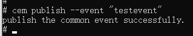
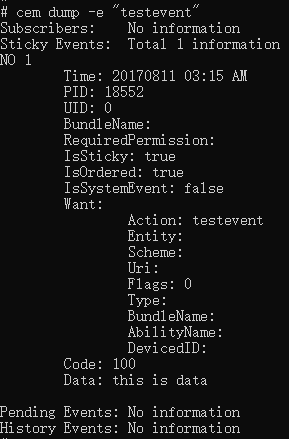

# Common Event Manager

The Common Event Manager enables you to print common event information and publish common events. It provides the common event debugging and testing capabilities, for example, printing all public event subscribers, sent public events, and recipients, and simulating public event release.

> **NOTE**
>
> Before using this tool, you must obtain the <!--Del-->[<!--DelEnd-->hdc tool<!--Del-->](../../device-dev/subsystems/subsys-toolchain-hdc-guide.md)<!--DelEnd--> and run the hdc shell command.

## Commands

### help

* Function

  Prints help information.

* Method

  ```
  cem help
  ```

### publish

* Function

  Publishes a common event.

* Method

  ```
  cem publish [<options>]
  ```

  The table below describes the available options.

  | Name        | Description                                  |
  | ------------ | ------------------------------------------ |
  | -e/--event   | Name of the common event to publish. Mandatory.                    |
  | -o/--ordered | Indicates that the common event to publish is ordered. Optional. By default, non-ordered events are published.  |
  | -c/--code    | Result code of the common event. Optional.                  |
  | -d/--data    | Data carried in the common event. Optional.                |
  | -h/--help    | Help information.                                  |

* Example

  ```bash
  # Publish a common event named testevent.
  cem publish --event "testevent"
  ```
  
  
  
  ```bash
  # Publish an ordered common event named testevent. The result code of the event is 100 and the data carried is "this is data".
  cem publish -e "testevent" -o -c 100 -d "this is data"
  ```
  
  

### dump

> **NOTE**
> 
> The Common Event Manager has two editions: **eng** and **user**. The **dump** command can be used only in the **eng** edition. If it is used in the **user** edition, the message **error: user version cannot use dump** is reported.

* Function

  Displays information about common events.

* Method

  ```
  cem dump [<options>]
  ```

  The table below describes the available options.

  | Name      | Description                                    |
  | ---------- | -------------------------------------------- |
  | -a/--all   | Information about all common events that have been sent since system startup.|
  | -e/--event | Information about a specific event.                  |
  | -h/--help  | Help information.                                    |

* Example

  ```bash
  # Display details of a common event named testevent.
  cem dump -e "testevent"
  ```

  
