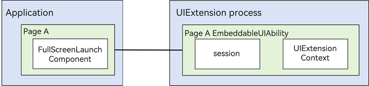
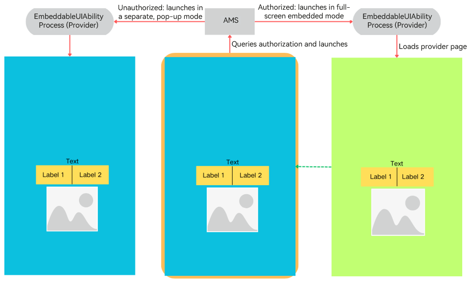

# Atomic Service Full Screen Launch Component (FullScreenLaunchComponent)

With the **FullScreenLaunchComponent** component, you can launch atomic services in full screen mode, providing a more native and user-friendly experience within applications.

## Basic Concepts

- [FullScreenLaunchComponent](../reference/apis-arkui/arkui-ts/ohos-arkui-advanced-FullScreenLaunchComponent.md) component

  Provided by ArkUI, **FullScreenLaunchComponent** is a component that allows you to define and use it in your application through the ArkTS-based declarative development paradigm. This component<!--Del--> is encapsulated based on [UIExtension](./arkts-ui-extension-components.md), but unlike the system API [UIExtensionComponent](../reference/apis-arkui/arkui-ts/ts-container-ui-extension-component-sys.md), it<!--DelEnd--> grants usage permissions to third-party applications. If the atomic service to be launched grants permission for full-screen embedding, the host application can run the atomic service in full-screen embedded mode. Without permission, the application will launch the atomic service in a separate, pop-up mode.

- [EmbeddableUIAbility](../reference/apis-ability-kit/js-apis-app-ability-embeddableUIAbility.md) component

  Defined and used in the provider application, **UIExtensionAbility** allows the provider to run in a separate process. It offers two launch modes: one for redirecting to the provider and another for embedding the provider directly within the application.

## Implementation Principles

**FullScreenLaunchComponent** offers the capability to launch atomic services in full-screen mode. When an atomic service needs to be launched, the AMS checks whether the provider has authorized the host application to run the atomic service in an embedded manner. If authorization is granted, the host application runs the atomic service in full-screen embedded mode; otherwise, the host application launches the atomic service in a separate, pop-up mode.

Running an atomic service in full-screen embedded mode means to embed it into the host application's component tree using **UIExtensionComponent** and, by launching the EmbeddableUIAbility, display the content of the provider, offering a seamless, component-based interaction experience.

Launching an atomic service in a separate, pop-up mode means to launch the EmbeddableUIAbility outside of the component hierarchy, offering an interaction experience similar to that of a standalone window.

## Available Capabilities

### Basic Component Capabilities

- When the service provider authorizes the host application to run the atomic service in an embedded manner, the host application runs the atomic service EmbeddableUIAbility in full-screen embedded mode.
- When the service provider does not authorize the host application to run the atomic service in an embedded manner, the host application launches the atomic service EmbeddableUIAbility in a separate, pop-up mode.
- You can customize an icon placeholder component, which, when touched, launches the atomic service.

### Available Capabilities of the EmbeddableUIAbility Process

The **FullScreenLaunchComponent** is designed to facilitate the sharing of capabilities across different applications, offering a high degree of flexibility. It operates by launching the provider application's capabilities through a cross-process approach for use by the current (host) application. This mechanism involves service interactions between two separate processes, which is fundamentally different from the interactions between common components and their host applications.

Below is a detailed list of the attributes, events, components, Node-APIs, and other features that the provider application can utilize within the **FullScreenLaunchComponent**.

This list specifies the features that are not supported and those that are partially supported.

**Universal Attributes**

The universal attributes are not supported.

**Components**

By default, the provider application cannot interact with the host application's components or process context. Specifically, the following are not supported:

- Effects that exceed a component's boundaries, such as the **Navigation** component displaying into the safe area
- Components that rely on other components or require cross-component or cross-application control and access, for example, **PluginComponent** for accessing other components or **FormComponent** for displaying pages from other applications across processes
- Components that depend on the host application's window information or process **UIContext** instance for capabilities, interactions, or animations, such as the **FolderStack** component

The details are as follows.

| Component                                                        | Capability Support| Description                                                    | Remarks                                                |
| ------------------------------------------------------------ | -------- | ------------------------------------------------------------ | ------------------------------------------------------------ |
| [FullScreenLaunchComponent](../reference/apis-arkui/arkui-ts/ohos-arkui-advanced-FullScreenLaunchComponent.md) | Not supported  | **FullScreenLaunchComponent** is a component designed for launching atomic services in full screen. If the invoked application (the one being launched) grants the invoker the authorization to run the atomic service in an embedded manner, the invoker can operate the atomic service in full-screen embedded mode. If authorization is not provided, the invoker will launch the atomic service in a pop-up manner.| Due to its cross-application scheduling capability, the **FullScreenLaunchComponent** does not support nested launching of this component. |
| <!--DelRow-->[PluginComponent (System API)](../reference/apis-arkui/arkui-ts/ts-basic-components-plugincomponent-sys.md) | Not supported  | **PluginComponent** enables users of the component to request both the component and the data it needs. The users send a component template and the corresponding data. It supports the SystemUI in integrating UI elements provided by various services through a plug-in-based approach.| 1. Similar to **FullScreenLaunchComponent**, this component is prone to nesting, which increases complexity. 2. Since the provider of the **FullScreenLaunchComponent** component operates in a separate process, it cannot access or interact with components within the host application by default.|
| <!--DelRow-->[FormComponent (System API)](../reference/apis-arkui/arkui-ts/ts-basic-components-formcomponent-sys.md) | Not supported  | **FormComponent** is a component used to display widgets.                          | This component facilitates cross-process component calls. However, nesting it within the **FullScreenLaunchComponent** can complicate the process relationships, potentially leading to functional and performance issues.|
| <!--DelRow-->[IsolatedComponent (System API)](../reference/apis-arkui/arkui-ts/ts-container-isolated-component-sys.md) | Not supported  | **IsolatedComponent** is designed to support the embedding and display of UIs provided by independent .abc files within the current page, with the displayed content running in a restricted worker thread.| Due to its cross-application scheduling capability, the **FullScreenLaunchComponent** does not support nested launching of this component.|
| [EmbeddedComponent](../reference/apis-arkui/arkui-ts/ts-container-embedded-component.md) | Not supported  | The **EmbeddedComponent** is a component used to embed into the current page the UI provided by another [EmbeddedUIExtensionAbility](../reference/apis-ability-kit/js-apis-app-ability-embeddedUIExtensionAbility.md) in the same application. The EmbeddedUIExtensionAbility runs in an independent process for UI layout and rendering.| Due to its cross-application scheduling capability, the **FullScreenLaunchComponent** does not support nested launching of this component. |
| <!--DelRow-->[RemoteWindow](../reference/apis-arkui/arkui-ts/ts-basic-components-remotewindow-sys.md) | Not supported  | **RemoteWindow** is a component that enables remote control of application windows, offering the capability to create synchronized animations between the application window and components during application startup and exit.| The components in the **FullScreenLaunchComponent** are already in another process and cannot affect or control the host application's window.|
| [RichText](../reference/apis-arkui/arkui-ts/ts-basic-components-richtext.md) | Not supported  | The **RichText** component parses and displays HTML text.                        | —                                                            |
| [FolderStack](../reference/apis-arkui/arkui-ts/ts-container-folderstack.md) | Not supported  | The **FolderStack** component is usually used in modular development scenarios where .abc file hot update is required. The **FolderStack** component extends the **Stack** component by adding the hover feature for foldable devices. With the **upperItems** parameter set, it can automatically avoid the crease area of the foldable device and move the content to the upper half screen.| The component's capabilities require linkage with the host application's window, necessitating access to the host application's main window information within the provider. Therefore, this component is not supported at present.|
| [XComponent](../reference/apis-arkui/arkui-ts/ts-basic-components-xcomponent.md) | Not supported  | The **XComponent** can accept and display the EGL/OpenGL ES and media data input.  | —                                                            |
| [FormLink](../reference/apis-arkui/arkui-ts/ts-container-formlink.md) | Not supported  | The **FormLink** component is provided for interactions between static widgets and widget providers. It supports three types of events: router, message, and call.| This component facilitates cross-process component calls. However, nesting it within the **FullScreenLaunchComponent** can complicate the process relationships, potentially leading to functional and performance issues.|
| [HyperLink](../reference/apis-arkui/arkui-ts/ts-container-hyperlink.md) | Not supported  | The **Hyperlink** component implements a link from a location in the component to another location.                    | —                                                            |
| [ContextMenu](../reference/apis-arkui/arkui-ts/ts-methods-menu.md) | Not supported  | The menu bound to a component through [bindContextMenu](../reference/apis-arkui/arkui-ts/ts-universal-attributes-menu.md#bindcontextmenu12) on a page can be closed as needed.| —                                                            |
| [Alert Dialog Box (AlertDialog)](../reference/apis-arkui/arkui-ts/ts-methods-alert-dialog-box.md)| Partially supported| You can set the text content and response callback for an alert dialog box. If **showInSubWindow** is set to **true** in the **FullScreenLaunchComponent**, the dialog box is aligned with the host window based on the **FullScreenLaunchComponent**.| The dialog box achieves alignment with the host application's window by utilizing data obtained from the **FullScreenLaunchComponent** regarding the application's window. Yet, only window alignment is supported.|
| [Action Sheet (ActionSheet)](../reference/apis-arkui/arkui-ts/ts-methods-action-sheet.md)| Partially supported| An action sheet is a dialog box that displays actions a user can take. If **showInSubWindow** is set to **true** in the **FullScreenLaunchComponent**, the dialog box is aligned with the host window based on the **FullScreenLaunchComponent**.| The dialog box achieves alignment with the host application's window by utilizing data obtained from the **FullScreenLaunchComponent** regarding the application's window. Yet, only window alignment is supported.|
| [Custom Dialog Box](../reference/apis-arkui/arkui-ts/ts-methods-custom-dialog-box.md)| Partially supported| A custom dialog box is a dialog box you customize by using APIs of the **CustomDialogController** class. You can set the style and content to your preference for a custom dialog box. If **showInSubWindow** is set to **true** in the **FullScreenLaunchComponent**, the dialog box is aligned with the host window based on the **FullScreenLaunchComponent**.| The dialog box achieves alignment with the host application's window by utilizing data obtained from the **FullScreenLaunchComponent** regarding the application's window. Yet, only window alignment is supported.|
| [Navigation](../reference/apis-arkui/arkui-ts/ts-basic-components-navigation.md) | Partially supported| Since API version 11, this component supports the safe area attribute by default, with the default attribute value being **expandSafeArea([SafeAreaType.SYSTEM], [SafeAreaEdge.TOP, SafeAreaEdge.BOTTOM])**. You can override this attribute to change the default behavior.| 1. If **FullScreenLaunchComponent** does not have modal or immersive settings configured, **Navigation** cannot extend into the safe area. 2. Routing to pages within the host application is not supported.|

**Node-API**

The capabilities provided by Node-APIs in the **FullScreenLaunchComponent** scenario must account for their potential to extend beyond the current component and interact with the host application's components and process context. Specifically, the following are not supported:

- The API may require information from the host application's context or window, such as **UIContext**.
- The API may control or influence not just the component itself but also other components or aspects of the host application, such as UI appearance.

The details are as follows.

| Module                                                        | Capability Support| Description                                                    | Remarks                                                |
| ------------------------------------------------------------ | -------- | ------------------------------------------------------------ | ------------------------------------------------------------ |
| [Page Transition](../reference/apis-arkui/arkui-ts/ts-page-transition-animation.md) | Not supported  | You can customize the page entrance and exit animations in the **pageTransition** API for transition between pages.| —                                                            |
| [Implicit Shared Element Transition (geometryTransition)](../reference/apis-arkui/arkui-ts/ts-transition-animation-geometrytransition.md)| Not supported  | **geometryTransition** is used to create a smooth, seamless transition between views. By specifying the frame and position of the in and out components through **geometryTransition**, you can create a spatial linkage between the transition effects (such as opacity and scale) defined through the **transition** mechanism. In this way, you can guide the visual focus from the previous view (out component) to the new view (in component).| —                                                            |
| [componentUtils](../reference/apis-arkui/js-apis-arkui-componentUtils.md) | Not supported  | The **componentUtils** module provides API for obtaining the coordinates and size of the drawing area of a component.                      | The information obtained pertains to the window, and by default, it is the information about **WindowProxy** of the EmbeddableUIAbility, not the main window information of the host application.|
| [UIContext](../reference/apis-arkui/js-apis-arkui-UIContext.md) | Not supported  | **@ohos.window** adds the [getUIContext](../reference/apis-arkui/js-apis-window.md#getuicontext10) API in API version 10 for obtaining the **UIContext** object of a UI instance. The API provided by the **UIContext** object can be directly applied to the corresponding UI instance.| In the default **FullScreenLaunchComponent** configuration, the provider lacks an actual window, and therefore it is not possible to obtain the correct **UIContext** through this API.|
| [DragController](../reference/apis-arkui/js-apis-arkui-dragController.md) | Not supported  | The **dragController** module provides APIs for initiating drag actions. When receiving a gesture event, such as a touch or long-press event, an application can initiate a drag action and carry drag information therein. The functionality of this module depends on UI context. This means that the APIs of this module cannot be used where the UI context is unclear. For details, see **UIContext**.| Drag event transmission between components relies on **UIContext** instances. Since the host and provider applications do not share the **UIContext** content, drag event transmission is not supported by default.|
| [@ohos.arkui.inspector (Layout Callback)](../reference/apis-arkui/js-apis-arkui-inspector.md) | Partially supported| The **Inspector** module provides APIs for registering the component layout and drawing completion callbacks.                  | If a **FullScreenLaunchComponent** component is specified, all the component information in the **FullScreenLaunchComponent** is expected to be obtained. This capability is not supported yet. The provider can use this capability internally.|
| <!--DelRow-->[@ohos.arkui.performanceMonitor (Performance Monitoring)](../reference/apis-arkui/js-apis-arkui-performancemonitor-sys.md) | Not supported  | The **performanceMonitor** module provides APIs for performance monitoring indicators: response delay, completion delay, and frame loss rate.| —                                                            |
| [@ohos.font (Custom Font Registration)](../reference/apis-arkui/js-apis-font.md)    | Not supported  | The **font** module provides APIs for registering custom fonts.                                  | The registered fonts have a restricted scope, and the provider is unable to influence the font settings within the host application.|
| [PluginComponentManager](../reference/apis-arkui/js-apis-plugincomponent.md) | Not supported  | The **PluginComponentManager** module provides APIs for the **PluginComponent** user to request components and data and send component templates and data.| The provider component, residing in a separate process, is unable to access data from other components. As such, the capability to interact with the host application's components is not supported.|
| <!--DelRow-->[@ohos.uiAppearance (UI Appearance) (System API)](../reference/apis-arkui/js-apis-uiappearance-sys.md) | Not supported  | The **uiAppearance** module provides basic capabilities for managing the system appearance. It allows for color mode configuration currently, and will introduce more features over time.| The provider application cannot influence the host application through this capability.                            |

## Constraints

### Security Capability Constraints

The **FullScreenLaunchComponent** (on the host) can access applications that have integrated the EmbeddableUIAbility (on the provider side), offering a universal capability for application sharing. As capabilities of the **FullScreenLaunchComponent** do not independently include a security mechanism, the provider application must utilize other ArkUI capabilities to protect against potential attacks from the host application.

Considering the extensive capabilities of the **FullScreenLaunchComponent**, if there are security concerns within the provider application that cannot be resolved within the **FullScreenLaunchComponent**, alternative approaches should be considered. Using the **FullScreenLaunchComponent** without proper security measures poses potential risks to both the provider and host applications.

**Usage modes:**

- When the service provider authorizes the host application to run the atomic service in an embedded manner, the host application runs the atomic service in full-screen embedded mode.
- When the service provider does not authorize the host application to run the atomic service in an embedded manner, the host application runs the atomic service in a separate, pop-up mode.

The full-screen embedded mode restricts the host application's interaction capabilities, as it can no longer create subwindows that could cover the provider application's window.

### Nesting Constraints

The **FullScreenLaunchComponent** does not allow for a nested dependency chain, for example, application A (UIAbility) -> application B (EmbeddableUIAbility) -> application C (EmbeddableUIAbility).

### Event Processing Mechanism Constraints

The **FullScreenLaunchComponent** does not support the universal events. Instead, it passes events to the provider's EmbeddableUIAbility after coordinate transformation.

Events are handled synchronously or asynchronously based on their use case:

- Interactions between the host process and the provider process are handled asynchronously by default: This avoids performance issues and deadlocks, which could affect the overall interaction experience.
- Synchronous event handling principles: Synchronous events are supported where they have a low trigger frequency and minimal performance impact; they should meet the actual use scenarios.

When using the **FullScreenLaunchComponent**, comply with the following design constraints:

Asynchronous event handling scenarios: Both the **FullScreenLaunchComponent** component and the host application's components may receive events simultaneously. You need to manage this based on the use scenario. For example, you can configure the host application components not to handle the events. If this is not feasible, you are advised to replace the **FullScreenLaunchComponent** component to ensure a seamless interaction experience.

| Scenario    | Category                      | Supported or Not| Synchronous/Asynchronous (Host and Provider)| Remarks                                                        |
| -------- | -------------------------- | -------- | ------------------------- | ------------------------------------------------------------ |
| Universal event| Click event (**Click**)         | Supported    | Asynchronous                     | —                                                            |
| Universal event| Touch event (**Touch**)         | Supported    | Asynchronous                     | —                                                            |
| Universal event| Drag event (**onDrag*XXX***)     | Supported    | Asynchronous                     | —                                                            |
| Universal event| Key event (**KeyEvent**)      | Supported    | Synchronous                     | A timeout mechanism is provided to manage waiting periods. If the timeout threshold is exceeded, the waiting is automatically aborted. From the perspective of the upper layer, this is treated as if the event was not processed at all.|
| Universal event| Focus event (**onFocus**/**onBlur**)| Supported    | Synchronous                     | A timeout mechanism is provided to manage waiting periods. If the timeout threshold is exceeded, the waiting is automatically aborted. From the perspective of the upper layer, this is treated as if the event was not processed at all.|
| Universal event| Mouse event (**onHove**/**onMouse**) | Supported    | Asynchronous                     | —                                                            |
| Gesture handling| —                          | Supported    | Asynchronous                     | —                                                            |
| Accessibility  | —                          | Supported    | Synchronous                     | A timeout mechanism is provided to manage waiting periods. If the timeout threshold is exceeded, the waiting is automatically aborted. From the perspective of the upper layer, this is treated as if the event was not processed at all.|

### Page Rendering Experience Constraints

As the **FullScreenLaunchComponent** involves cross-process application calls, the processing between the host application process and the provider application process cannot be synchronized, leading to different experience issues compared to regular components. Be aware of the performance constraints of rendering pages across multiple processes with this component and take targeted measures.

- **Flickering white screen**: Initiating a new process through the **FullScreenLaunchComponent** to deliver functionality involves a sequence of steps – creation, launch, and page rendering – that require time to complete. During this period, users may notice a brief display of the **FullScreenLaunchComponent**'s default white background, resulting in a flickering white screen.
- **Desynchronization between rendering and display**: When the host application page changes rapidly (such as during screen rotation or window resizing), there can be a desynchronization between the rendering of the host application page and the content displayed within the **FullScreenLaunchComponent** component. This issue arises from cross-process interactions; while the provider application's process tasks are triggered by the host application, layout tasks are handled in the respective process's JavaScript thread. There is no guarantee of synchronization between the host application's and provider application's rendering tasks, resulting in desynchronization.

When developing the provider application, consider the following design constraints:

- Use scenarios with minimal layout changes.
- When layout changes occur, the provider application's JavaScript thread should execute as few tasks as possible to ensure that it can respond to layout change tasks promptly.

You can mitigate the flickering white screen issue with the provider application in the following ways:

- Adjust the background color of the **FullScreenLaunchComponent** (for instructions, see [Background](../reference/apis-arkui/arkui-ts/ts-universal-attributes-background.md)) to match the background color of the host application's and provider application's pages, to deliver a seamless transition and prevent noticeable changes during the loading process.

If the mitigation does not fully meet the application's interaction requirements due to the constraints of cross-process capabilities, it is recommended that you consider alternative solutions.

### Other Constraints

- Modifying or switching the atomic service EmbeddableUIAbility launched from the background is not supported during runtime.

- This component cannot be previewed from the DevEco Studio Previewer.
