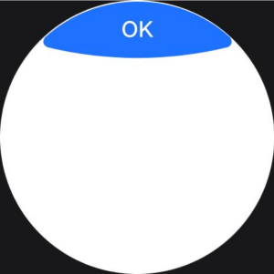
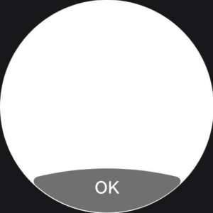
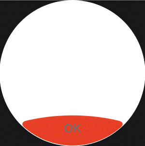
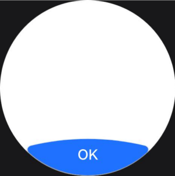
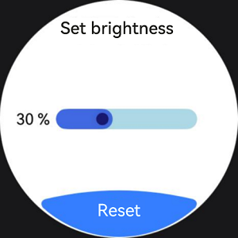

# Arc Button (ArcButton)


The **ArcButton** component represents an arc button specifically designed for circular screens on wearable devices. It offers various button styles, such as emphasized, normal, and warning, tailored for watch UIs. For details, see [ArcButton](../reference/apis-arkui/arkui-ts/ohos-arkui-advanced-ArcButton.md).


## Creating a Button

To create an **ArcButton** component, use the following:

  ```ts
ArcButton({
  options: new ArcButtonOptions({
    label: 'OK',
    position: ArcButtonPosition.TOP_EDGE,
    styleMode: ArcButtonStyleMode.EMPHASIZED_LIGHT
  })
})
  ```

- [label](../reference/apis-arkui/arkui-ts/ohos-arkui-advanced-ArcButton.md#arcbuttonoptions): sets the text displayed on the button.

- [position](../reference/apis-arkui/arkui-ts/ohos-arkui-advanced-ArcButton.md#arcbuttonoptions): sets the type of the button.

- [styleMode](../reference/apis-arkui/arkui-ts/ohos-arkui-advanced-ArcButton.md#arcbuttonoptions): sets the style mode of the button.

  

## Setting the Button Type

The **ArcButton** component offers two types: top arc button and bottom arc button. Use the [position](../reference/apis-arkui/arkui-ts/ohos-arkui-advanced-ArcButton.md#arcbuttonoptions) attribute to set the type.

- Lower arc button (default type)

  Set [position](../reference/apis-arkui/arkui-ts/ohos-arkui-advanced-ArcButton.md#arcbuttonoptions) to **ArcButtonPosition.BOTTOM_EDGE**.

  ```ts
  ArcButton({
    options: new ArcButtonOptions({
      label: 'OK',
      position: ArcButtonPosition.BOTTOM_EDGE,
      styleMode: ArcButtonStyleMode.EMPHASIZED_LIGHT
    })
  })
  ```

  

- Upper arc button

  Set [position](../reference/apis-arkui/arkui-ts/ohos-arkui-advanced-ArcButton.md#arcbuttonoptions) to **ArcButtonPosition.TOP_EDGE**.

  ```ts
  ArcButton({
    options: new ArcButtonOptions({
      label: 'OK',
      position: ArcButtonPosition.TOP_EDGE,
      styleMode: ArcButtonStyleMode.EMPHASIZED_LIGHT
    })
  })
  ```

  

## Customizing the Style

- Setting the background color

  Use the [backgroundColor](../reference/apis-arkui/arkui-ts/ohos-arkui-advanced-ArcButton.md#arcbuttonoptions) attribute to set the background color of the button.

  ```ts
  ArcButton({
    options: new ArcButtonOptions({
      label: 'OK',
      styleMode: ArcButtonStyleMode.CUSTOM,
      backgroundColor: ColorMetrics.resourceColor('#707070')
    })
  })
  ```

  

- Setting the font color

  Use the [fontColor](../reference/apis-arkui/arkui-ts/ohos-arkui-advanced-ArcButton.md#arcbuttonoptions) attribute to set the font color of the button.

  ```ts
  ArcButton({
    options: new ArcButtonOptions({
      label: 'OK',
      styleMode: ArcButtonStyleMode.CUSTOM,
      backgroundColor: ColorMetrics.resourceColor('#E84026'),
      fontColor: ColorMetrics.resourceColor('#707070')
    })
  })
  ```

  

- Setting the shadow color

  Enable the button shadow using the [shadowEnabled](../reference/apis-arkui/arkui-ts/ohos-arkui-advanced-ArcButton.md#arcbuttonoptions) attribute and set the shadow color using the [shadowColor](../reference/apis-arkui/arkui-ts/ohos-arkui-advanced-ArcButton.md#arcbuttonoptions) attribute.

  ```ts
  ArcButton({
    options: new ArcButtonOptions({
      label: 'OK',
      shadowEnabled: true,
      shadowColor: ColorMetrics.resourceColor('#707070')
    })
  })
  ```

  

## Adding Events

- Bind the **onClick** event to define custom behavior to be executed when the button is clicked.

  ```ts
  ArcButton({
    options: new ArcButtonOptions({
      label: 'OK',
      onClick: () => {
        console.info('ArcButton onClick')
      }
    })
  })
  ```

- Bind the **onTouch** event to define custom behavior to be executed when the button is touched.

  ```ts
  ArcButton({
    options: new ArcButtonOptions({
      label: 'OK',
      onTouch: (event: TouchEvent) => {
        console.info('ArcButton onTouch')
      }
    })
  })
  ```

## Example

This example demonstrates a brightness settings screen where a slider displays the current brightness level at 30%. When the reset button is clicked, the brightness value is reset to the default value of 50%.

  ```ts
import { LengthMetrics, LengthUnit, ArcButton, ArcButtonOptions, ArcButtonStyleMode, } from '@kit.ArkUI';

@Entry
@ComponentV2
struct BrightnessPage {
  @Local brightnessValue: number = 30
  private defaultBrightnessValue: number = 50

  build() {
    RelativeContainer() {
      Text('Set brightness')
        .fontColor(Color.Black)
        .id('id_brightness_set_text')
        .fontSize(24)
        .margin({ top: 16 })
        .alignRules({
          middle: { anchor: '__container__', align: HorizontalAlign.Center }
        })

      Text(`${this.brightnessValue} %`)
        .fontColor(Color.Black)
        .id('id_brightness_min_text')
        .margin({ left: 16 })
        .alignRules({
          start: { anchor: '__container__', align: HorizontalAlign.Start },
          center: { anchor: '__container__', align: VerticalAlign.Center }
        })

      Slider({
        value: this.brightnessValue,
        min: 0,
        max: 100,
        style: SliderStyle.InSet
      })
        .blockColor('#191970')
        .trackColor('#ADD8E6')
        .selectedColor('#4169E1')
        .width(150)
        .id('id_brightness_slider')
        .margin({ left: 16, right: 16 })
        .onChange((value: number, mode: SliderChangeMode) => {
          this.brightnessValue = value
        })
        .alignRules({
          center: { anchor: 'id_brightness_min_text', align: VerticalAlign.Center },
          start: { anchor: 'id_brightness_min_text', align: HorizontalAlign.End },
          end: { anchor: 'id_brightness_max_text', align: HorizontalAlign.Start }
        })

      ArcButton({
        options: new ArcButtonOptions({
          label: 'Reset',
          styleMode: ArcButtonStyleMode.EMPHASIZED_LIGHT,
          fontSize: new LengthMetrics(19, LengthUnit.FP),
          onClick: () => {
            this.brightnessValue = this.defaultBrightnessValue
          }
        })
      })
        .alignRules({
          middle: { anchor: '__container__', align: HorizontalAlign.Center },
          bottom: { anchor: '__container__', align: VerticalAlign.Bottom }
        })
    }
    .height('100%')
    .width('100%')
    .backgroundColor(Color.White)
  }
}
  ```

  
