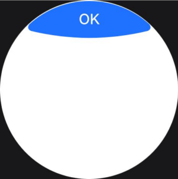
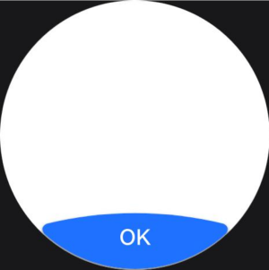
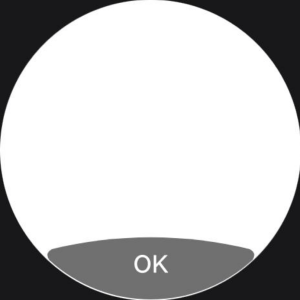
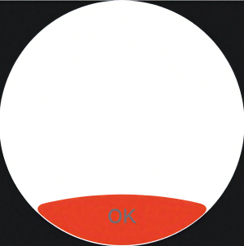
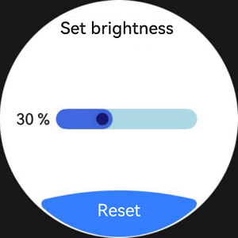

# Arc Button (ArcButton) (Recommended for Circular Screens)

<!--Kit: ArkUI-->
<!--Subsystem: ArkUI-->
<!--Owner: @liyi0309-->
<!--Designer: @liyi0309-->
<!--Tester: @lxl007-->
<!--Adviser: @Brilliantry_Rui-->
<!-- md-trans-meta sourceCommit=c88ab947462f95e06ee03413c4608c88b4b79178 translatedAt=2026-07-31T03:31:12.985Z pushedAt=2026-07-31T03:49:19.952Z -->

Supported since API version 18, the **ArcButton** component represents an arc button. It is recommended for circular screens. It offers various button styles, such as emphasized, normal, and warning, tailored for users. For details, see [ArcButton](../reference/apis-arkui/arkui-ts/ohos-arkui-advanced-ArcButton.md).

## Creating a Button

To create an **ArcButton** component, use the following:

<!-- @[button_align_top](https://gitcode.com/openharmony/applications_app_samples/blob/master/code/DocsSample/ArkUISample/ButtonComponent/entry/src/main/ets/pages/ButtonAlignTop.ets) -->

``` TypeScript
ArcButton({
  options: new ArcButtonOptions({
    label: 'OK',
    position: ArcButtonPosition.TOP_EDGE,
    styleMode: ArcButtonStyleMode.EMPHASIZED_LIGHT,
  // ···
  })
})
```

  [label](../reference/apis-arkui/arkui-ts/ohos-arkui-advanced-ArcButton.md#arcbuttonoptions): sets the text displayed on the button.<br>[position](../reference/apis-arkui/arkui-ts/ohos-arkui-advanced-ArcButton.md#arcbuttonoptions): sets the type of the button.<br>[styleMode](../reference/apis-arkui/arkui-ts/ohos-arkui-advanced-ArcButton.md#arcbuttonoptions): sets the style mode of the button.

  

## Setting the Button Type

The **ArcButton** component offers two types: top arc button and bottom arc button. Use the [position](../reference/apis-arkui/arkui-ts/ohos-arkui-advanced-ArcButton.md#arcbuttonoptions) attribute to set the type.

- Bottom arc button (default type)

  Set [position](../reference/apis-arkui/arkui-ts/ohos-arkui-advanced-ArcButton.md#arcbuttonoptions) to **ArcButtonPosition.BOTTOM_EDGE**.

  <!-- @[button_align_bottom](https://gitcode.com/openharmony/applications_app_samples/blob/master/code/DocsSample/ArkUISample/ButtonComponent/entry/src/main/ets/pages/ButtonAlignBottom.ets) -->

  ``` TypeScript
  ArcButton({
    options: new ArcButtonOptions({
      label: 'OK',
      position: ArcButtonPosition.BOTTOM_EDGE,
      styleMode: ArcButtonStyleMode.EMPHASIZED_LIGHT,
    // ···
    })
  
  })
  ```

  

- Top arc button

  Set [position](../reference/apis-arkui/arkui-ts/ohos-arkui-advanced-ArcButton.md#arcbuttonoptions) to **ArcButtonPosition.TOP_EDGE**.

  <!-- @[button_align_top](https://gitcode.com/openharmony/applications_app_samples/blob/master/code/DocsSample/ArkUISample/ButtonComponent/entry/src/main/ets/pages/ButtonAlignTop.ets) -->

  ``` TypeScript
  ArcButton({
    options: new ArcButtonOptions({
      label: 'OK',
      position: ArcButtonPosition.TOP_EDGE,
      styleMode: ArcButtonStyleMode.EMPHASIZED_LIGHT,
    // ···
    })
  })
  ```

  

## Customizing the Style

- Setting the background color

  Use the [backgroundColor](../reference/apis-arkui/arkui-ts/ohos-arkui-advanced-ArcButton.md#arcbuttonoptions) attribute to set the background color of the button.

  <!-- @[button_bcg_color](https://gitcode.com/openharmony/applications_app_samples/blob/master/code/DocsSample/ArkUISample/ButtonComponent/entry/src/main/ets/pages/ButtonBcgColor.ets) -->

  ``` TypeScript
  ArcButton({
    options: new ArcButtonOptions({
      label: 'OK',
      styleMode: ArcButtonStyleMode.CUSTOM,
      backgroundColor: ColorMetrics.resourceColor('#707070')
    })
  })
  ```

  

- Setting the font color

  Use the [fontColor](../reference/apis-arkui/arkui-ts/ohos-arkui-advanced-ArcButton.md#arcbuttonoptions) attribute to set the font color of the button.

  <!-- @[button_font_color](https://gitcode.com/openharmony/applications_app_samples/blob/master/code/DocsSample/ArkUISample/ButtonComponent/entry/src/main/ets/pages/ButtonFontColor.ets) -->

  ``` TypeScript
  ArcButton({
    options: new ArcButtonOptions({
      label: 'OK',
      styleMode: ArcButtonStyleMode.CUSTOM,
      backgroundColor: ColorMetrics.resourceColor('#E84026'),
      fontColor: ColorMetrics.resourceColor('#707070')
    })
  })
  ```

  

- Setting the shadow color

  Enable the button shadow using the [shadowEnabled](../reference/apis-arkui/arkui-ts/ohos-arkui-advanced-ArcButton.md#arcbuttonoptions) attribute and set the shadow color using the [shadowColor](../reference/apis-arkui/arkui-ts/ohos-arkui-advanced-ArcButton.md#arcbuttonoptions) attribute.

  <!-- @[button_shadow_color](https://gitcode.com/openharmony/applications_app_samples/blob/master/code/DocsSample/ArkUISample/ButtonComponent/entry/src/main/ets/pages/ButtonShadow.ets) -->

  ``` TypeScript
  ArcButton({
    options: new ArcButtonOptions({
      label: 'OK',
      shadowEnabled: true,
      shadowColor: ColorMetrics.resourceColor('#ffec1022')
    })
  })
  ```

  

## Adding Events

- Bind the **onClick** event to define custom behavior to be executed when the button is clicked.

  <!-- @[button_click](https://gitcode.com/openharmony/applications_app_samples/blob/master/code/DocsSample/ArkUISample/ButtonComponent/entry/src/main/ets/pages/ButtonAlignTop.ets) -->

  ``` TypeScript
  ArcButton({
    options: new ArcButtonOptions({
      label: 'OK',
    // ···
      onClick: () => {
        hilog.info(DOMAIN, TAG, 'ArcButton onClick');
      },
    })
  })
  ```

- Bind the **onTouch** event to define custom behavior to be executed when the button is touched.

  <!-- @[button_touch](https://gitcode.com/openharmony/applications_app_samples/blob/master/code/DocsSample/ArkUISample/ButtonComponent/entry/src/main/ets/pages/ButtonAlignBottom.ets) -->

  ``` TypeScript
  ArcButton({
    options: new ArcButtonOptions({
      label: 'OK',
    // ···
      onTouch: (event: TouchEvent) => {
        hilog.info(DOMAIN, TAG, 'ArcButton onTouch');
      }
    })
  
  })
  ```

## Example

This example demonstrates a brightness settings screen where a slider displays the current brightness level at 30%. When the reset button is clicked, the brightness value is reset to the default value of 50%.

You are advised to run this example on a wearable for optimal display effects and it can also run on other devices. To run the example on a wearable, configure **wearable** under the [deviceTypes](../quick-start/module-configuration-file.md#devicetypes) tag in the [module.json5](../quick-start/module-configuration-file.md) configuration file in the **src/main** directory.

<!-- @[module_json_config](https://gitcode.com/openharmony/applications_app_samples/blob/master/code/DocsSample/ArkUISample/ButtonComponent/entry/src/main/module.json5) -->

``` JSON5
"module": {
  // ...
  "deviceTypes": [
    "default",
    "wearable"
  ],
  // ...
}
```

<!-- @[brightness_page](https://gitcode.com/openharmony/applications_app_samples/blob/master/code/DocsSample/ArkUISample/ButtonComponent/entry/src/main/ets/pages/ButtonBrightness.ets) -->

``` TypeScript
import { LengthMetrics, LengthUnit, ArcButton, ArcButtonOptions, ArcButtonStyleMode } from '@kit.ArkUI';

const BRIGHT_NESS_VALUE = 30;
const BRIGHT_NESS_VALUE_DEFAULT = 50;

@Entry
@ComponentV2
struct BrightnessPage {
  @Local brightnessValue: number = BRIGHT_NESS_VALUE;
  private defaultBrightnessValue: number = BRIGHT_NESS_VALUE_DEFAULT;

  build() {
    RelativeContainer() {
      // Replace $r('app.string.Brightness') with the actual resource file. In this example, the value in the resource file is "Set brightness."
      Text($r('app.string.Brightness'))
        .fontColor(Color.White)
        .id('id_brightness_set_text')
        .fontSize(24)
        .margin({ top: 16 })
        .alignRules({
          middle: { anchor: '__container__', align: HorizontalAlign.Center }
        })

      Text(`${this.brightnessValue} %`)
        .fontColor(Color.White)
        .id('id_brightness_min_text')
        .margin({ left: 16 })
        .alignRules({
          start: { anchor: '__container__', align: HorizontalAlign.Start },
          center: { anchor: '__container__', align: VerticalAlign.Center }
        })

      Slider({
        value: this.brightnessValue,
        min: 0,
        max: 100,
        style: SliderStyle.InSet
      })
        .blockColor('#191970')
        .trackColor('#ADD8E6')
        .selectedColor('#4169E1')
        .width(150)
        .id('id_brightness_slider')
        .margin({ left: 16, right: 16 })
        .onChange((value: number, mode: SliderChangeMode) => {
          this.brightnessValue = value;
        })
        .alignRules({
          center: { anchor: 'id_brightness_min_text', align: VerticalAlign.Center },
          start: { anchor: 'id_brightness_min_text', align: HorizontalAlign.End }
        })

      ArcButton({
        options: new ArcButtonOptions({
          // Replace $r('app.string.Reset') with the actual resource file. In this example, the value in the resource file is "Reset."
          label: $r('app.string.Reset'),
          styleMode: ArcButtonStyleMode.EMPHASIZED_LIGHT,
          fontSize: new LengthMetrics(19, LengthUnit.FP),
          onClick: () => {
            this.brightnessValue = this.defaultBrightnessValue;
          }
        })
      })
        .alignRules({
          middle: { anchor: '__container__', align: HorizontalAlign.Center },
          bottom: { anchor: '__container__', align: VerticalAlign.Bottom }
        })
    }
    .height('100%')
    .width('100%')
    .backgroundColor(Color.Black)
  }
}
```

