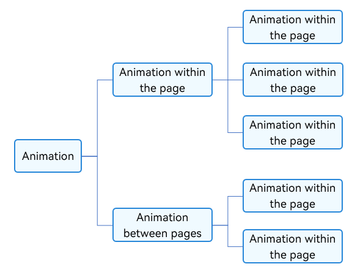
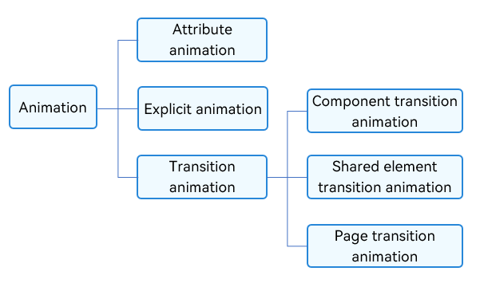

# Animation Overview

The principle of animation is that the UI appearance is changed for multiple times within a period of time. Because human eyes generate visual persistence, what you finally see is a continuous animation. A change of the UI is called an animation frame, which corresponds to a screen refresh. An important indicator that determines the animation smoothness is the frame rate (FPS), that is, the number of animation frames per second. The higher the frame rate, the smoother the animation.

In ArkUI, an animation is generated by changing the attribute value and specifying the animation parameters. Animation parameters include parameters such as animation duration and change rule (that is, curve). After the attribute value changes, the original state is transited to the new state according to the animation parameter, that is, an animation is formed.

The animation capability provided by the ArkUI can be classified into intra-page animation and inter-page animation based on the page classification mode. As shown in the following figure, an animation on a page refers to an animation that can occur on a page, and an animation between pages refers to an animation that occurs only when two pages jump.

  Figure 1 Animation by page 

Based on the basic capability, the animation can be divided into three parts: attribute animation, explicit animation, and transition animation. as shown in the following figure.

  Figure 2 Animation classified by basic capability 

Based on the page classification mode and application scenarios, this document provides the usage methods and precautions of various animations for developers to quickly learn animations.
