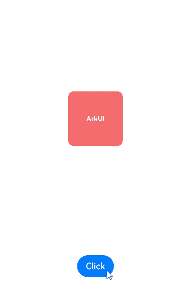
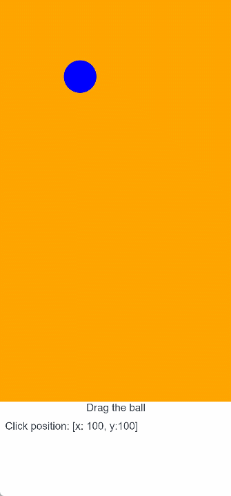

# Animation Smoothing


When running animations, the UI is also interacting with users in real time. It must respond immediately to changes in user behavior. For example, if the user swipes up to exit in the midst of an application launch process, the UI should immediately transit from the startup animation to the exit animation, rather than finishing the startup animation before exiting. In the scenario where the animation triggered when the user lifts their fingers off the screen, the initial velocity of the animation must inherit the gesture speed, so as to avoid pauses caused by speed disconnection. For the preceding and similar scenarios, the system provides efficient APIs for smoothing between animations and between animations and gestures.

Assume that there is a running animation for an animatable property. If the end value of the property changes due to an operation on the UI, you can create a new animation for it, by changing the property value in the [animateTo](../reference/apis-arkui/arkui-ts/ts-explicit-animation.md) closure or by changing the input parameter value of the [animation](../reference/apis-arkui/arkui-ts/ts-animatorproperty.md) API. The system then automatically connects the previous animation with the new animation.

The following is an example: By clicking **click**, you change the **scale** property of the red square. When you click **click** repeatedly, the end value of the **scale** property changes continuously, and the current animation smoothly moves towards the new end value of the **scale** property.

```ts
import { curves } from '@kit.ArkUI';
class SetSlt{
  isAnimation:boolean = true
  set():void{
    this.isAnimation = !this.isAnimation;
  }
}
@Entry
@Component
struct AnimationToAnimationDemo {
// Step 1: Declare the related state variable.
  @State SetAnimation: SetSlt = new SetSlt();

  build() {
    Column() {
      Text('ArkUI')
        .fontWeight(FontWeight.Bold)
        .fontSize(12)
        .fontColor(Color.White)
        .textAlign(TextAlign.Center)
        .borderRadius(10)
        .backgroundColor(0xf56c6c)
        .width(100)
        .height(100)
        // Step 2: Set the declared state variable to the related animatable property API.
        .scale({ x: this.SetAnimation.isAnimation ? 2 : 1, y: this.SetAnimation.isAnimation ? 2 : 1 })
        // Step 4: Enable the implicit animation. When the end value of the animation changes, the system automatically adds the smoothing animation.
        .animation({ curve: curves.springMotion(0.4, 0.8) })

      Button('Click')
        .margin({ top: 200 })
        // Step 3: Change the state variable value through the click event, which then changes the property value.
        .onClick(() => {
          this.SetAnimation.set()
        })
    }
    .width('100%')
    .height('100%')
    .justifyContent(FlexAlign.Center)
  }
}
```




## Smoothing Between Gestures and Animations

In scenarios where gestures are used, a property change is generally triggered when the user places or moves their finger (or fingers) on the screen, and continues after the user lifts their finger (or fingers) off the screen until the end value of the property is reached.

The initial velocity of the property change after the user lifts their finger (or fingers) should be consistent with the velocity of the property change at the moment before the user lifts their finger (or fingers). If the former is **0**, it feels like a running car stops suddenly, an unusual abrupt change not comfortable to users.

In cases where smoothing between [tap gestures](../reference/apis-arkui/arkui-ts/ts-basic-gestures-tapgesture.md) and [animations](./arkts-animation.md) is critical, for example, when scrolling a list, you can apply a responsive spring curve to the property animation running when the user places or moves their finger (or fingers) on the screen; and apply a spring curve to the property animation running after the user lifts their finger (or fingers) off the screen. For the animation following the [springMotion](../reference/apis-arkui/js-apis-curve.md#curvesspringmotion9) curve, its portion that is running after the user lifts their finger (or fingers) off the screen automatically inherits the previous velocity and starts from where the previous portion leaves off.

The following example implements a ball moving smoothly with the gesture.

```ts
import { curves } from '@kit.ArkUI';

@Entry
@Component
struct SpringMotionDemo {

  // Step 1: Declare the related state variable.
  @State positionX: number = 100;
  @State positionY: number = 100;
  diameter: number = 50;

  build() {
    Column() {
      Row() {
        Circle({ width: this.diameter, height: this.diameter })
          .fill(Color.Blue)
          // Step 2: Set the declared state variable to the related animatable property API.
          .position({ x: this.positionX, y: this.positionY })
          // Step 3: Change the state variable value for the time when the user places or moves their finger (or fingers) on the screen and use responsiveSpringMotion for movement toward the new value.
          .onTouch((event?: TouchEvent) => {
            if(event){
              if (event.type === TouchType.Move) {
                // When the user places or moves their finger on the screen, use the responsiveSpringMotion curve.
                this.getUIContext()?.animateTo({ curve: curves.responsiveSpringMotion() }, () => {
                  // Subtract the radius so that the center of the ball moves to where the finger is placed.
                  this.positionX = event.touches[0].windowX - this.diameter / 2;
                  this.positionY = event.touches[0].windowY - this.diameter / 2;
                  console.info(`move, animateTo x:${this.positionX}, y:${this.positionY}`);
                })
              } else if (event.type === TouchType.Up) {
                // Step 4: Set the end value of the state variable for after the user lifts their finger (or fingers), and use springMotion for movement toward the new value. The springMotion animation inherits the previous velocity.
                this.getUIContext()?.animateTo({ curve: curves.springMotion() }, () => {
                  this.positionX = 100;
                  this.positionY = 100;
                  console.info(`touchUp, animateTo x:100, y:100`);
                })
              }
            }
          })
      }
      .width("100%").height("80%")
      .clip(true) // If the ball moves beyond the parent component, it is invisible.
      .backgroundColor(Color.Orange)

      Flex({ direction: FlexDirection.Row, alignItems: ItemAlign.Start, justifyContent: FlexAlign.Center }) {
        Text("Drag the ball").fontSize(16)
      }
      .width("100%")

      Row() {
        Text('Click position: [x: ' + Math.round(this.positionX) + ', y:' + Math.round(this.positionY) + ']').fontSize(16)
      }
      .padding(10)
      .width("100%")
    }.height('100%').width('100%')
  }
}
```


