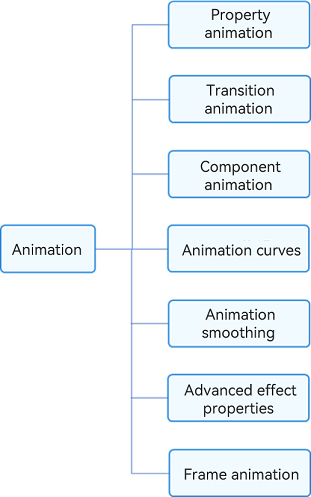

# Animation Overview

The UI contains various components (such as time and wallpaper) that users can see when interacting with their devices. Attributes are APIs used to control the behavior of components. For example, you can adjust the location of a component on the screen through the location attribute.

In general cases, if the value of an attribute is changed, the UI will be updated accordingly. Animation can add smooth transition effects when the UI is updated. Let's look at an example. When the user touches an application icon on the home screen, the application window opens and replaces the home screen as the primary display area. In this application launch process, if no animation is added, the related attributes change immediately, and the application window directly replaces the home screen, resulting in a sense of visual discontinuity. By adding animation, we enable attribute changes to take place over time, thereby creating an illusion of visual continuity.

ArkUI provides a wide range of animation APIs (such as attribute animation and transition animation), which you can leverage to cause attributes to gradually change from the start value to the end value based on the specified settings. Although the attribute values are not absolutely continuous during the change, but rather discrete to some extent, what you finally see is a continuous animation, since human eyes retain persistence of vision. A change of the UI is called an animation frame, which corresponds to a screen refresh. An important indicator that determines the animation smoothness is the frame rate (FPS), that is, the number of animation frames per second. The higher the frame rate, the smoother the animation. In ArkUI, animation parameters include animation duration, animation curve, and more. As the main factor of the animation, the animation curve determines the law of attribute value changes. For example, with a linear animation curve, the attribute changes from the start value to the end value at a constant speed over the given duration. If the attribute changes too fast or too slow, the visual experience may suffer. Therefore, animation parameters, especially animation curves, must be well designed and adjusted to be tailored to use cases.

Animation APIs drive attribute values to continuously transit from one state to another according to the rule determined by the animation parameters, and thereby generate a continuous visual effect on the UI. This walkthrough demonstrates the steps and precautions to follow, for creating a fascinating animation experience for users. It is organized as follows.

- Attribute animation: It is the most basic animation type. It drives attribute changes frame by frame based on animation parameters to create an animation on a frame-by-frame basis.

- Transition animation: animation for transitioning when components appear and disappear. To maintain animation consistency, some animation curves have been built in and cannot be customized.
  - Whenever possible, avoid ability redirection in the animation. An ability is a task in effect and is individually displayed on the recent tasks screen. Redirection between abilities is redirection between tasks. In the typical scenario of viewing large images in an application, if you call the gallery ability from the application to open large images, then the gallery ability will appear on the recent tasks screen. This is not recommended. A more recommended practice is as follows: Build a large image component in the application and invoke that component through modal transition. In this way, the entire animation can be completed in one ability.
  - To implement navigation, use the **\<Navigation>** component, instead of the page routing mode. The page routing mode causes page separation, which is inconvenient for implementing linked transition effects. In addition, it does not allow for one-time development for multi-device deployment.

- Component animation: Components provide default animations (such as the slide animation of the **\<List>** component). Some of them even support custom animations.

- Animation curve: You can use traditional and spring curves to control how the attribute values change, to create an engaging animation effect.

- Animation connection: Make the transition between animations and between gestures and animations as natural as possible.

- Advanced animation effect: You can up your animation game with advanced effects such as blur, shadow, color gradient, and the like.
