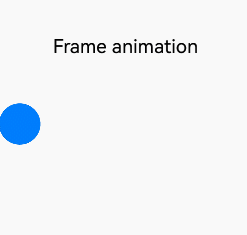
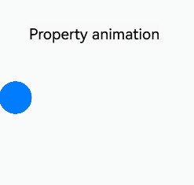
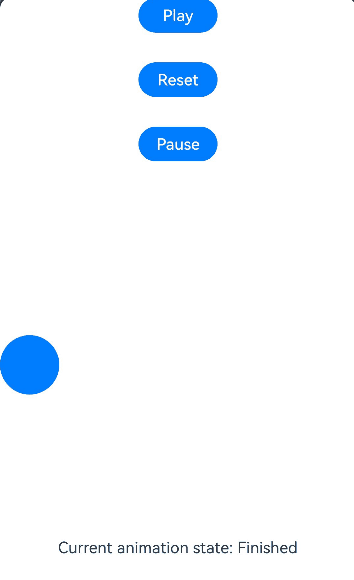

# Frame Animation (ohos.animator)

The frame animation allows you to adjust your animation properties on each frame, thanks to its per-frame callback. By leveraging the **onFrame** callback, you can dynamically set property values on each frame, creating smooth and natural animations. For details about the frame animation APIs, see [@ohos.animator (Animator)](../reference/apis-arkui/js-apis-animator.md).

Compared with the property animation, the frame animation offers the benefits of real-time visibility into the animation process and allows you to modify UI values on the fly. In addition, it provides high responsiveness to events and can be paused as needed. However, it is worth noting that the frame animation may not be as performant as the property animation. Therefore, where the property animation meets the requirements, you are advised to use the property animation APIs. For details, see [Implementing Property Animation](./arkts-attribute-animation-apis.md). The table below provides a comparison between the property animation and frame animation.

| Name| Implementation| Event Response| Pausable| Performance|
| -------- | -------- | -------- | -------- |-------- |
| Frame animation (ohos.animator)| Allows real-time modification and updating of UI properties on each frame.| Responds in real time| Yes| Relatively lower|
| Property animation| Calculates the final state of the animation, with the UI reflecting only the end state, not the intermediate rendering values.| Responds to the end state| No| Generally higher|

The following figures illustrate the difference: The frame animation offers real-time responsiveness, whereas the property animation reacts to the final state of the animation.





## Using Frame Animation to Implement Animation Effects

To create a simple animator and print the current interpolation value in each frame callback:

1. Import dependencies.

   ```ts
   import { AnimatorOptions, AnimatorResult } from '@kit.ArkUI';
   ```

2. Create an animator object.

   ```ts
   // Initial options for creating an animator object
   let options: AnimatorOptions = {                        
      duration: 1500,                               
      easing: "friction",                        
      delay: 0,                           
      fill: "forwards",                                  
      direction: "normal",                                  
      iterations: 2,                                        
      // Initial frame value used for interpolation in the onFrame callback                             
      begin: 200.0,                                         
      // End frame value used for interpolation in the onFrame callback                                
      end: 400.0                                            
   }; 
   let result: AnimatorResult = this.getUIContext().createAnimator(options);
   // Set up a callback for when a frame is received, so that the onFrame callback is called for every frame throughout the animation playback process.
       result.onFrame = (value: number) => {
       console.log("current value is :" + value);
   }
   ```

3. Play the animation.

   ```ts
   // Play the animation.
   result.play();
   ```

4. After the animation has finished executing, manually release the **AnimatorResult** object.

   ```ts
   // Release the animation object.
   result = undefined;
   ```

## Using Frame Animation to Implement a Ball's Parabolic Motion

1. Import dependencies.

   ```ts
   import { AnimatorOptions, AnimatorResult } from '@kit.ArkUI';
   ```

2. Define the component to be animated.

   ```ts
   Button()
     .width(60)
     .height(60)
     .translate({ x: this.translateX, y: this.translateY })
   ```

3. Create an **AnimatorResult** Object in **onPageShow**.

   ```ts
   onPageShow(): void {
       // Create an animatorResult object.
       this.animatorOptions = this.getUIContext().createAnimator(options);
       this.animatorOptions.onFrame = (progress: number) => {
       this.translateX = progress;
       if (progress > this.topWidth && this.translateY < this.bottomHeight) {
          this.translateY = Math.pow(progress - this.topWidth, 2) * this.g;
       }
    }
    // Invoked when the animation is canceled.
    this.animatorOptions.onCancel = () => {
       this.animatorStatus = 'Canceled'
    }
    // Invoked when the animation finishes playing.
    this.animatorOptions.onFinish = () => {
       this.animatorStatus = 'Finished'
    }
    // Invoked when the animation repeats.
    this.animatorOptions.onRepeat = () => {
       console.log("Animation repeating");
    }
   }
   ```

4. Define buttons for controlling the animation.

   ```ts
   Button('Play').onClick(() => {
     this.animatorOptions?.play();
     this.animatorStatus = 'Playing'
   }).width(80).height(35)
   Button("Reset").onClick(() => {
     this.translateX = 0;
     this.translateY = 0;
   }).width(80).height(35)
   Button("Pause").onClick(() => {
     this.animatorOptions?.pause();
     this.animatorStatus = 'Paused'
   }).width(80).height(35)
   ```
5. Destroy the animation in the page's **onPageHide** lifecycle callback to avoid memory leak.
   ```ts
   onPageHide(): void {
     this.animatorOptions = undefined;
   }
   ```

A complete example is as follows:

```ts
import { AnimatorOptions, AnimatorResult } from '@kit.ArkUI';

@Entry
@Component
struct Index {
  @State animatorOptions: AnimatorResult | undefined = undefined;
  @State animatorStatus: string =' Created'
  begin: number = 0;
  end: number = 300
  topWidth: number = 150;
  bottomHeight: number = 100;
  g: number = 0.18
  animatorOption: AnimatorOptions = {
    duration: 4000,
    delay: 0,
    easing: 'linear',
    iterations: 1,
    fill: "forwards",
    direction: 'normal',
    begin: this.begin,
    end: this.end
  };
  @State translateX: number = 0;
  @State translateY: number = 0;

  onPageShow(): void {
    this.animatorOptions = this.getUIContext().createAnimator(this.animatorOption)
    this.animatorOptions.onFrame = (progress: number) => {
      this.translateX = progress;
      if (progress > this.topWidth && this.translateY < this.bottomHeight) {
        this.translateY = Math.pow(progress - this.topWidth, 2) * this.g;
      }
    }
    this.animatorOptions.onCancel = () => {
      this.animatorStatus = 'Canceled'
    }
    this.animatorOptions.onFinish = () => {
      this.animatorStatus = 'Finished'
    }
    this.animatorOptions.onRepeat = () => {
      console.log("Animation repeating");
    }
  }

  onPageHide(): void {
    this.animatorOptions = undefined;
  }

  build() {
    Column() {
      Column({ space: 30 }) {
        Button('Play').onClick(() => {
          this.animatorOptions?.play();
          this.animatorStatus = 'Playing';
        }).width(80).height(35)
        Button("Reset").onClick(() => {
          this.translateX = 0;
          this.translateY = 0;
        }).width(80).height(35)
        Button("Pause").onClick(() => {
          this.animatorOptions?.pause();
          this.animatorStatus = 'Paused';
        }).width(80).height(35)
      }.width("100%").height('25%')

      Stack() {
        Button()
          .width(60)
          .height(60)
          .translate({ x: this.translateX, y: this.translateY })
      }
      .width("100%")
      .height('45%')
      .align(Alignment.Start)

      Text("Current animation state: "+ this.animatorStatus)
    }.width("100%").height('100%')
  }
}
```


