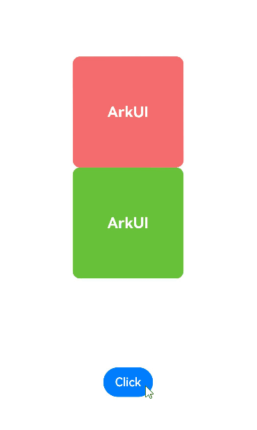
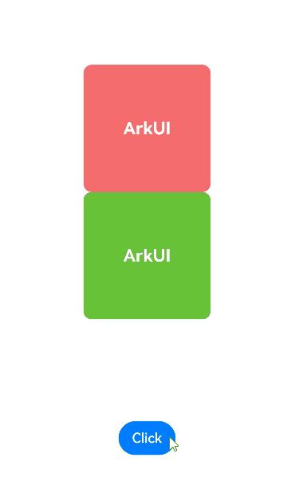

# Implementing Property Animation


ArkUI provides two types of APIs, namely, [animateTo](../reference/apis-arkui/arkui-ts/ts-explicit-animation.md) and [animation](../reference/apis-arkui/arkui-ts/ts-animatorproperty.md), to implement a property animation – an illusion of continuity created by driving component properties to change over time based on animation parameters such as the animation curve.


| Property Animation API| Scope| Principle| Use Scenario|
| -------- | -------- | -------- | -------- |
| animateTo | UI changes caused by property changes in closures.<br>Transition for appearance and disappearance.| This API is a common function. It animates the differences between the UIs before and after the state variable in the closure is changed.<br>This API can be called multiple times and can be nested.| A single set of animation parameters is used to animate multiple properties.<br>Animations need to be nested.|
| animation | GUI changes caused by attribute changes bound to components through attribute APIs.| This API identifies the change of the animatable properties of a component and automatically adds an animation.<br>As the API call sequence of the component is from bottom to top, this API applies only to the properties above it.<br>In a component, you can set **animation** for individual properties based on the API call sequence.| Different sets of animation parameters are used to animate different properties.|

## animateTo


```
animateTo(value: AnimateParam, event: () => void): void
```

Among the parameters of [animateTo](../reference/apis-arkui/arkui-ts/ts-explicit-animation.md), **value** specifies an [AnimateParam object](../reference/apis-arkui/arkui-ts/ts-explicit-animation.md#animateparam) (including duration and [curve](../reference/apis-arkui/js-apis-curve.md#curve)); **event** indicates the closure of the animation. Property animations generated by variable changes within a closure follow the same animation parameters.

> **NOTE**
> 
> Directly using **animateTo** can lead to ambiguous instance issues. To avoid this, it is recommended that you obtain a [UIContext](../reference/apis-arkui/js-apis-arkui-UIContext.md#uicontext) instance using the [UIContext](../reference/apis-arkui/js-apis-arkui-UIContext.md#uicontext) API, and then call the [animateTo](../reference/apis-arkui/js-apis-arkui-UIContext.md#animateto) API on this instance.

```ts
import { curves } from '@kit.ArkUI';

@Entry
@Component
struct AnimateToDemo {
  @State animate: boolean = false;
  // Step 1: Declare related state variables.
  @State rotateValue: number = 0; // Rotation angle of component 1.
  @State translateX: number = 0; // Offset of component 2
  @State opacityValue: number = 1; // Opacity of component 2.

  // Step 2: Set the declared state variables to the related animatable property APIs.
  build() {
    Row() {
      // Component 1
      Column() {
      }
      .rotate({ angle: this.rotateValue })
      .backgroundColor('#317AF7')
      .justifyContent(FlexAlign.Center)
      .width(100)
      .height(100)
      .borderRadius(30)
      .onClick(() => {
        this.getUIContext()?.animateTo({ curve: curves.springMotion() }, () => {
          this.animate = !this.animate;
          // Step 3: Change the state variables in the closure to update the UI.
          // You can write any logic that can change the UI, such as array adding and visibility control. The system detects the differences between the new UI and the previous UI and adds animations for the differences.
          // The rotate property of component 1 is changed. Therefore, a rotate animation is added to component 1.
          this.rotateValue = this.animate ? 90 : 0;
          // The opacity property of component 2 is changed. Therefore, an opacity animation is added to component 2.
          this.opacityValue = this.animate ? 0.6 : 1;
          // The translate property of component 2 is changed. Therefore, a translate animation is added to component 2.
          this.translateX = this.animate ? 50 : 0;
        })
      })

      // Component 2
      Column() {

      }
      .justifyContent(FlexAlign.Center)
      .width(100)
      .height(100)
      .backgroundColor('#D94838')
      .borderRadius(30)
      .opacity(this.opacityValue)
      .translate({ x: this.translateX })
    }
    .width('100%')
    .height('100%')
    .justifyContent(FlexAlign.Center)
  }
}
```




## animation

Unlike the **animateTo** API, the [animation](../reference/apis-arkui/arkui-ts/ts-animatorproperty.md) API does not need to use a closure. Just add it to the end of the target animatable property, and the API will automatically add a property animation once it detects that the bound property is changed.


```ts
import { curves } from '@kit.ArkUI';

@Entry
@Component
struct AnimationDemo {
  @State animate: boolean = false;
  // Step 1: Declare related state variables.
  @State rotateValue: number = 0; // Rotation angle of component 1.
  @State translateX: number = 0; // Offset of component 2
  @State opacityValue: number = 1; // Opacity of component 2.

  // Step 2: Set the declared state variables to the related animatable property APIs.
  build() {
    Row() {
      // Component 1
      Column() {
      }
      .opacity(this.opacityValue)
      .rotate({ angle: this.rotateValue })
      // Step 3: Enable property animation.
      .animation({ curve: curves.springMotion() })
      .backgroundColor('#317AF7')
      .justifyContent(FlexAlign.Center)
      .width(100)
      .height(100)
      .borderRadius(30)
      .onClick(() => {
        this.animate = !this.animate;
        // Step 4: Change the state variables in the closure to update the UI.
        // You can write any logic that can change the UI, such as array adding and visibility control. The system detects the differences between the new UI and the previous UI and adds animations for the differences.
        // The rotate property of component 1 is changed. Therefore, a rotate animation is added to component 1.
        this.rotateValue = this.animate ? 90 : 0;
        // The translate property of component 2 is changed. Therefore, a translate animation is added to component 2.
        this.translateX = this.animate ? 50 : 0;
        // The opacity property of the parent component <Column> is changed, which results in an opacity change of its child components. Therefore, opacity animations are added to <Column> and its child components.
        this.opacityValue = this.animate ? 0.6 : 1;
      })

      // Component 2
      Column() {
      }
      .justifyContent(FlexAlign.Center)
      .width(100)
      .height(100)
      .backgroundColor('#D94838')
      .borderRadius(30)
      .opacity(this.opacityValue)
      .translate({ x: this.translateX })
      .animation({ curve: curves.springMotion() })
    }
    .width('100%')
    .height('100%')
    .justifyContent(FlexAlign.Center)
  }
}
```



> **NOTE**
> - When an animation is applied to the position or size change of a component, as layout measurement is involved, performance overheads are high. To reduce performance overheads, use the [scale](../reference/apis-arkui/arkui-ts/ts-universal-attributes-transformation.md#scale) attribute instead, whose value change does not involve layout re-measurement. This practice is applicable where the component location and size change continuously, for example, where the component size changes as a response to gestures.
> 
> - Property animations should be applied to the components that are always visible. For those components whose visibility may change, use the [transition animation](arkts-transition-overview.md).
> 
> - Avoid using end callbacks for property animations. Property animations are applied to states that have occurred. As such, you do not need to process the end logic. If end callbacks are needed, be sure to correctly handle the data management for continuous operations.
