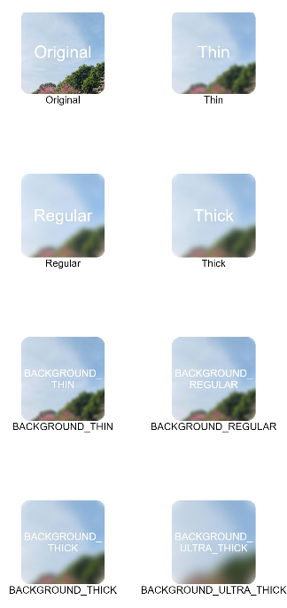
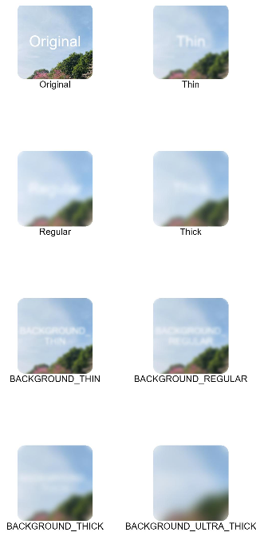

# Blur Effect

Animation effects can add detail to your animations and create a sense of realism. For example, blur and shadow effects can lend a 3D look to objects and deliver a more engaging animation experience. ArkUI provides a diverse array of efficient APIs for you to develop exquisite and personalized effects. This topic covers the common blur, shadow, and color effects.


Blur effects add a sense of depth and allow for distinction of hierarchical relationship between elements.


| API                                                        | Description                                        |
| ------------------------------------------------------------ | -------------------------------------------- |
| [backdropBlur](../reference/apis-arkui/arkui-ts/ts-universal-attributes-background.md#backdropblur) | Applies a background blur effect to the component. The input parameter is the blur radius.|
| [blur](../reference/apis-arkui/arkui-ts/ts-universal-attributes-image-effect.md#blur) | Applies a foreground blur effect to the component. The input parameter is the blur radius.|
| [backgroundBlurStyle](../reference/apis-arkui/arkui-ts/ts-universal-attributes-background.md#backgroundblurstyle9) | Applies a background blur effect to the component. The input parameter is the blur style.|
| [foregroundBlurStyle](../reference/apis-arkui/arkui-ts/ts-universal-attributes-foreground-blur-style.md#foregroundblurstyle) | Applies a foreground blur effect to the component. The input parameter is the blur style.|
| [motionBlur](../reference/apis-arkui/arkui-ts/ts-universal-attributes-motionBlur.md#motionblur) | Applies a motion blur effect to the component being scaled or moved. The input parameters are the blur radius and anchor point coordinates.|

>  **NOTE**
>
>  The preceding APIs provide real-time blurring by rendering each frame, which can be performance-intensive. For static blur effects where content and radius remain unchanged, you are advised to use the static [blur](../reference/apis-arkgraphics2d/js-apis-effectKit.md#blur) API to reduce the load.

## Applying Background Blur with backdropBlur


```ts
@Entry
@Component
struct BlurEffectsExample {
  build() {
    Column({ space: 10 }) {
      Text('backdropBlur')
        .width('90%')
        .height('90%')
        .fontSize(20)
        .fontColor(Color.White)
        .textAlign(TextAlign.Center)
        .backdropBlur(10) // Apply background blur.
        .backgroundImage($r('app.media.share'))
        .backgroundImageSize({ width: 400, height: 300 })
    }
    .width('100%')
    .height('50%')
    .margin({ top: 20 })
  }
}
```


## Applying Foreground Blur with blur


```ts
@Entry
@Component
struct Index1 {
  @State radius: number = 0;
  @State text: string = '';
  @State y: string = 'Finger not on the screen';

  aboutToAppear() {
    this.text = "Press a finger on the screen and slide up and down\n" + "Current finger position on the y-axis: " + this.y +
    "\n" + "Blur radius:" + this.radius;
  }

  build() {
    Flex({ direction: FlexDirection.Column, alignItems: ItemAlign.Center, justifyContent: FlexAlign.SpaceBetween }) {
      Text(this.text)
        .height(200)
        .fontSize(20)
        .fontWeight(FontWeight.Bold)
        .fontFamily("cursive")
        .fontStyle(FontStyle.Italic)
      Image($r("app.media.wall"))
        .blur(this.radius) // Apply foreground blur.
        .height('100%')
        .width("100%")
        .objectFit(ImageFit.Cover)
    }.height('100%')
    .width("100%")
    .onTouch((event?: TouchEvent) => {
      if(event){
        if (event.type === TouchType.Move) {
          this.y = Number(event.touches[0].y.toString()).toString();
          this.radius = Number(this.y) / 10; // Modify the blur radius based on the sliding distance.
        }
        if (event.type === TouchType.Up) {
          this.radius = 0;
          this.y = 'Finger off the screen';
        }
      }
      this.text = "Press a finger on the screen and slide up and down\n" + "Current finger position on the y-axis: " + this.y +
      "\n" + "Blur radius:" + this.radius;
    })
  }
}
```


## Applying Background Blur with backgroundBlurStyle


```ts
@Entry
@Component
struct BackDropBlurStyleDemo {
  build() {
    Grid() {
      GridItem() {
        Column() {
          Column() {
            Text('Original')
              .fontSize(20)
              .fontColor(Color.White)
              .textAlign(TextAlign.Center)
              .width('100%')
              .height('100%')
          }
          .height(100)
          .aspectRatio(1)
          .borderRadius(10)
          .backgroundImage($r('app.media.share'))

          Text('Original')
            .fontSize(12)
            .fontColor(Color.Black)
        }
        .height('100%')
        .justifyContent(FlexAlign.Start)
      }
      .width(200)
      .height(200)

      GridItem() {
        Column() {
          Column() {
            Text('Thin')
              .fontSize(20)
              .fontColor(Color.White)
              .textAlign(TextAlign.Center)
              .width('100%')
              .height('100%')
          }
          .height(100)
          .aspectRatio(1)
          .borderRadius(10)
          .backgroundImage($r('app.media.share'))
          // BlurStyle.Thin: Thin blur is applied.
          // ThemeColorMode.LIGHT: The light color mode is used.
          // AdaptiveColor.DEFAULT: Adaptive color mode is not used. The default color is used as the mask color.
          // scale: blurredness of the background material. The default value is 1.
          .backgroundBlurStyle(BlurStyle.Thin, {
            colorMode: ThemeColorMode.LIGHT,
            adaptiveColor: AdaptiveColor.DEFAULT,
            scale: 0.1
          })

          Text('Thin')
            .fontSize(12)
            .fontColor(Color.Black)
        }
        .height('100%')
        .justifyContent(FlexAlign.Start)
      }
      .width(200)
      .height(200)

      GridItem() {
        Column() {
          Column() {
            Text('Regular')
              .fontSize(20)
              .fontColor(Color.White)
              .textAlign(TextAlign.Center)
              .width('100%')
              .height('100%')
          }
          .height(100)
          .aspectRatio(1)
          .borderRadius(10)
          .backgroundImage($r('app.media.share'))
          .backgroundBlurStyle(BlurStyle.Regular, {
            colorMode: ThemeColorMode.LIGHT,
            adaptiveColor: AdaptiveColor.DEFAULT,
            scale: 0.1
          })

          Text('Regular')
            .fontSize(12)
            .fontColor(Color.Black)
        }
        .height('100%')
        .justifyContent(FlexAlign.Start)
      }
      .width(200)
      .height(200)

      GridItem() {
        Column() {
          Column() {
            Text('Thick')
              .fontSize(20)
              .fontColor(Color.White)
              .textAlign(TextAlign.Center)
              .width('100%')
              .height('100%')
          }
          .height(100)
          .aspectRatio(1)
          .borderRadius(10)
          .backgroundImage($r('app.media.share'))
          .backgroundBlurStyle(BlurStyle.Thick, {
            colorMode: ThemeColorMode.LIGHT,
            adaptiveColor: AdaptiveColor.DEFAULT,
            scale: 0.1
          })

          Text('Thick')
            .fontSize(12)
            .fontColor(Color.Black)
        }
        .height('100%')
        .justifyContent(FlexAlign.Start)
      }
      .width(200)
      .height(200)

      GridItem() {
        Column() {
          Column() {
            Text('BACKGROUND_THIN')
              .fontSize(12)
              .fontColor(Color.White)
              .textAlign(TextAlign.Center)
              .width('100%')
              .height('100%')
          }
          .height(100)
          .aspectRatio(1)
          .borderRadius(10)
          .backgroundImage($r('app.media.share'))
          .backgroundBlurStyle(BlurStyle.BACKGROUND_THIN, {
            colorMode: ThemeColorMode.LIGHT,
            adaptiveColor: AdaptiveColor.DEFAULT,
            scale: 0.1
          })

          Text('BACKGROUND_THIN')
            .fontSize(12)
            .fontColor(Color.Black)
        }
        .height('100%')
        .justifyContent(FlexAlign.Start)
      }
      .width(200)
      .height(200)

      GridItem() {
        Column() {
          Column() {
            Text('BACKGROUND_REGULAR')
              .fontSize(12)
              .fontColor(Color.White)
              .textAlign(TextAlign.Center)
              .width('100%')
              .height('100%')
          }
          .height(100)
          .aspectRatio(1)
          .borderRadius(10)
          .backgroundImage($r('app.media.share'))
          .backgroundBlurStyle(BlurStyle.BACKGROUND_REGULAR, {
            colorMode: ThemeColorMode.LIGHT,
            adaptiveColor: AdaptiveColor.DEFAULT,
            scale: 0.1
          })

          Text('BACKGROUND_REGULAR')
            .fontSize(12)
            .fontColor(Color.Black)
        }
        .height('100%')
        .justifyContent(FlexAlign.Start)
      }
      .width(200)
      .height(200)

      GridItem() {
        Column() {
          Column() {
            Text('BACKGROUND_THICK')
              .fontSize(12)
              .fontColor(Color.White)
              .textAlign(TextAlign.Center)
              .width('100%')
              .height('100%')
          }
          .height(100)
          .aspectRatio(1)
          .borderRadius(10)
          .backgroundImage($r('app.media.share'))
          .backgroundBlurStyle(BlurStyle.BACKGROUND_THICK, {
            colorMode: ThemeColorMode.LIGHT,
            adaptiveColor: AdaptiveColor.DEFAULT,
            scale: 0.1
          })

          Text('BACKGROUND_THICK')
            .fontSize(12)
            .fontColor(Color.Black)
        }
        .height('100%')
        .justifyContent(FlexAlign.Start)
      }
      .width(200)
      .height(200)

      GridItem() {
        Column() {
          Column() {
            Text('BACKGROUND_ULTRA_THICK')
              .fontSize(12)
              .fontColor(Color.White)
              .textAlign(TextAlign.Center)
              .width('100%')
              .height('100%')
          }
          .height(100)
          .aspectRatio(1)
          .borderRadius(10)
          .backgroundImage($r('app.media.share'))
          .backgroundBlurStyle(BlurStyle.BACKGROUND_ULTRA_THICK, {
            colorMode: ThemeColorMode.LIGHT,
            adaptiveColor: AdaptiveColor.DEFAULT,
            scale: 0.1
          })

          Text('BACKGROUND_ULTRA_THICK')
            .fontSize(12)
            .fontColor(Color.Black)
        }
        .height('100%')
        .justifyContent(FlexAlign.Start)
      }
      .width(200)
      .height(200)
    }
    .columnsTemplate('1fr 1fr')
    .rowsTemplate('1fr 1fr 1fr 1fr')
    .width('100%')
    .height('100%')
    .margin({ top: 40 })
  }
}
```





## Applying Foreground Blur with foregroundBlurStyle


```ts
@Entry
@Component
struct ForegroundBlurStyleDemo {
  build() {
    Grid() {
      GridItem() {
        Column() {
          Column() {
            Text('Original')
              .fontSize(20)
              .fontColor(Color.White)
              .textAlign(TextAlign.Center)
              .width('100%')
              .height('100%')
          }
          .height(100)
          .aspectRatio(1)
          .borderRadius(10)
          .backgroundImage($r('app.media.share'))

          Text('Original')
            .fontSize(12)
            .fontColor(Color.Black)
        }
        .height('100%')
        .justifyContent(FlexAlign.Start)
      }
      .width(200)
      .height(200)

      GridItem() {
        Column() {
          Column() {
            Text('Thin')
              .fontSize(20)
              .fontColor(Color.White)
              .textAlign(TextAlign.Center)
              .width('100%')
              .height('100%')
          }
          .height(100)
          .aspectRatio(1)
          .borderRadius(10)
          .backgroundImage($r('app.media.share'))
          // BlurStyle.Thin: Thin blur is applied.
          // ThemeColorMode.LIGHT: The light color mode is used.
          // AdaptiveColor.DEFAULT: Adaptive color mode is not used. The default color is used as the mask color.
          // scale: blurredness of the background material. The default value is 1.
          .foregroundBlurStyle(BlurStyle.Thin, {
            colorMode: ThemeColorMode.LIGHT,
            adaptiveColor: AdaptiveColor.DEFAULT,
            scale: 0.1
          })

          Text('Thin')
            .fontSize(12)
            .fontColor(Color.Black)
        }
        .height('100%')
        .justifyContent(FlexAlign.Start)
      }
      .width(200)
      .height(200)

      GridItem() {
        Column() {
          Column() {
            Text('Regular')
              .fontSize(20)
              .fontColor(Color.White)
              .textAlign(TextAlign.Center)
              .width('100%')
              .height('100%')
          }
          .height(100)
          .aspectRatio(1)
          .borderRadius(10)
          .backgroundImage($r('app.media.share'))
          .foregroundBlurStyle(BlurStyle.Regular, {
            colorMode: ThemeColorMode.LIGHT,
            adaptiveColor: AdaptiveColor.DEFAULT,
            scale: 0.1
          })

          Text('Regular')
            .fontSize(12)
            .fontColor(Color.Black)
        }
        .height('100%')
        .justifyContent(FlexAlign.Start)
      }
      .width(200)
      .height(200)

      GridItem() {
        Column() {
          Column() {
            Text('Thick')
              .fontSize(20)
              .fontColor(Color.White)
              .textAlign(TextAlign.Center)
              .width('100%')
              .height('100%')
          }
          .height(100)
          .aspectRatio(1)
          .borderRadius(10)
          .backgroundImage($r('app.media.share'))
          .foregroundBlurStyle(BlurStyle.Thick, {
            colorMode: ThemeColorMode.LIGHT,
            adaptiveColor: AdaptiveColor.DEFAULT,
            scale: 0.1
          })

          Text('Thick')
            .fontSize(12)
            .fontColor(Color.Black)
        }
        .height('100%')
        .justifyContent(FlexAlign.Start)
      }
      .width(200)
      .height(200)

      GridItem() {
        Column() {
          Column() {
            Text('BACKGROUND_THIN')
              .fontSize(12)
              .fontColor(Color.White)
              .textAlign(TextAlign.Center)
              .width('100%')
              .height('100%')
          }
          .height(100)
          .aspectRatio(1)
          .borderRadius(10)
          .backgroundImage($r('app.media.share'))
          .foregroundBlurStyle(BlurStyle.BACKGROUND_THIN, {
            colorMode: ThemeColorMode.LIGHT,
            adaptiveColor: AdaptiveColor.DEFAULT,
            scale: 0.1
          })

          Text('BACKGROUND_THIN')
            .fontSize(12)
            .fontColor(Color.Black)
        }
        .height('100%')
        .justifyContent(FlexAlign.Start)
      }
      .width(200)
      .height(200)

      GridItem() {
        Column() {
          Column() {
            Text('BACKGROUND_REGULAR')
              .fontSize(12)
              .fontColor(Color.White)
              .textAlign(TextAlign.Center)
              .width('100%')
              .height('100%')
          }
          .height(100)
          .aspectRatio(1)
          .borderRadius(10)
          .backgroundImage($r('app.media.share'))
          .foregroundBlurStyle(BlurStyle.BACKGROUND_REGULAR, {
            colorMode: ThemeColorMode.LIGHT,
            adaptiveColor: AdaptiveColor.DEFAULT,
            scale: 0.1
          })

          Text('BACKGROUND_REGULAR')
            .fontSize(12)
            .fontColor(Color.Black)
        }
        .height('100%')
        .justifyContent(FlexAlign.Start)
      }
      .width(200)
      .height(200)

      GridItem() {
        Column() {
          Column() {
            Text('BACKGROUND_THICK')
              .fontSize(12)
              .fontColor(Color.White)
              .textAlign(TextAlign.Center)
              .width('100%')
              .height('100%')
          }
          .height(100)
          .aspectRatio(1)
          .borderRadius(10)
          .backgroundImage($r('app.media.share'))
          .foregroundBlurStyle(BlurStyle.BACKGROUND_THICK, {
            colorMode: ThemeColorMode.LIGHT,
            adaptiveColor: AdaptiveColor.DEFAULT,
            scale: 0.1
          })

          Text('BACKGROUND_THICK')
            .fontSize(12)
            .fontColor(Color.Black)
        }
        .height('100%')
        .justifyContent(FlexAlign.Start)
      }
      .width(200)
      .height(200)

      GridItem() {
        Column() {
          Column() {
            Text('BACKGROUND_ULTRA_THICK')
              .fontSize(12)
              .fontColor(Color.White)
              .textAlign(TextAlign.Center)
              .width('100%')
              .height('100%')
          }
          .height(100)
          .aspectRatio(1)
          .borderRadius(10)
          .backgroundImage($r('app.media.share'))
          .foregroundBlurStyle(BlurStyle.BACKGROUND_ULTRA_THICK, {
            colorMode: ThemeColorMode.LIGHT,
            adaptiveColor: AdaptiveColor.DEFAULT,
            scale: 0.1
          })

          Text('BACKGROUND_ULTRA_THICK')
            .fontSize(12)
            .fontColor(Color.Black)
        }
        .height('100%')
        .justifyContent(FlexAlign.Start)
      }
      .width(200)
      .height(200)
    }
    .columnsTemplate('1fr 1fr')
    .rowsTemplate('1fr 1fr 1fr 1fr')
    .width('100%')
    .height('100%')
    .margin({ top: 40 })
  }
}
```





## Applying Motion Blur with motionBlur

```ts
import { curves } from '@kit.ArkUI';

@Entry
@Component
struct motionBlurTest {
  @State widthSize: number = 400
  @State heightSize: number = 320
  @State flag: boolean = true
  @State radius: number = 0
  @State x: number = 0
  @State y: number = 0

  build() {
    Column() {
      Column() {
        Image($r('app.media.testImg'))
          .width(this.widthSize)
          .height(this.heightSize)
          .onClick(() => {
            this.radius = 5;
            this.x = 0.5;
            this.y = 0.5;
            if (this.flag) {
              this.widthSize = 100;
              this.heightSize = 80;
            } else {
              this.widthSize = 400;
              this.heightSize = 320;
            }
            this.flag = !this.flag;
          })
          .animation({
            duration: 2000,
            curve: curves.springCurve(10, 1, 228, 30),
            onFinish: () => {
              this.radius = 0;
            }
          })
          .motionBlur({ radius: this.radius, anchor: { x: this.x, y: this.y } })
      }
    }.width('100%').margin({ top: 5 })
  }
}
```


