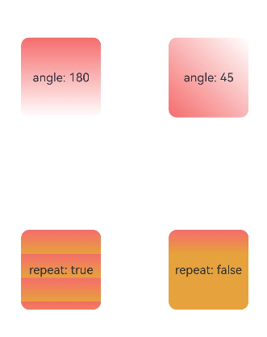
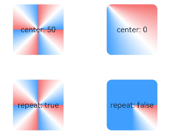

# Color Effect


## Color

You can use the color gradient APIs to apply a background color gradient effect to a component.

| API| Description|
| -------- | -------- |
| [linearGradient](../reference/apis-arkui/arkui-ts/ts-universal-attributes-gradient-color.md#lineargradient) | Applies a linear gradient to the component.|
| [sweepGradient](../reference/apis-arkui/arkui-ts/ts-universal-attributes-gradient-color.md#sweepgradient) | Applies a sweep gradient effect to the component.|
| [radialGradient](../reference/apis-arkui/arkui-ts/ts-universal-attributes-gradient-color.md#radialgradient) | Applies a radial gradient effect to the component.|


## Applying Linear Gradient Effect


```ts
@Entry
@Component
struct LinearGradientDemo {
  build() {
    Grid() {
      GridItem() {
        Column() {
          Text('angle: 180')
            .fontSize(15)
        }
        .width(100)
        .height(100)
        .justifyContent(FlexAlign.Center)
        .borderRadius(10)
        .linearGradient({
          // A positive value indicates a clockwise rotation from the origin, (0, 0). The default value of the linear gradient start angle is 180°.
          colors: [
            [0xf56c6c, 0.0], // Color and weight of color stop 1, corresponding to the start position of the component in the 180° direction.
            [0xffffff, 1.0], // Color and weight of color stop 2, corresponding to the end position of the component in the 180° direction.
          ]
        })
      }

      GridItem() {
        Column() {
          Text('angle: 45')
            .fontSize(15)
        }
        .width(100)
        .height(100)
        .justifyContent(FlexAlign.Center)
        .borderRadius(10)
        .linearGradient({
          angle: 45, // Set the linear gradient start angle to 45°.
          colors: [
            [0xf56c6c, 0.0],
            [0xffffff, 1.0],
          ]
        })
      }

      GridItem() {
        Column() {
          Text('repeat: true')
            .fontSize(15)
        }
        .width(100)
        .height(100)
        .justifyContent(FlexAlign.Center)
        .borderRadius(10)
        .linearGradient({
          repeating: true, // Repeat the gradients of the area from 0 to 0.3 in the area from 0.3 to 1.0.
          colors: [
            [0xf56c6c, 0.0],
            [0xE6A23C, .3],
          ]
        })
      }

      GridItem() {
        Column() {
          Text('repeat: false')
            .fontSize(15)
        }
        .width(100)
        .height(100)
        .justifyContent(FlexAlign.Center)
        .borderRadius(10)
        .linearGradient({
          colors: [
            [0xf56c6c, 0.0], // As repeating is not specified, the default value false is used. In this case, only the area from 0 to 0.3 in the component have the color gradient effect.
            [0xE6A23C, .3],
          ]
        })
      }
    }
    .columnsGap(10)
    .rowsGap(10)
    .columnsTemplate('1fr 1fr')
    .rowsTemplate('1fr 1fr 1fr')
    .width('100%')
    .height('100%')
  }
}
```




## Applying Sweep Gradient Effect


```ts
@Entry
@Component
struct SweepGradientDemo {
  build() {
    Grid() {
      GridItem() {
        Column() {
          Text('center: 50')
            .fontSize(15)
        }
        .width(100)
        .height(100)
        .justifyContent(FlexAlign.Center)
        .borderRadius(10)
        .sweepGradient({
          center: [50, 50], // Center point of the sweep gradient.
          start: 0, // Start point of the sweep gradient.
          end: 360, // End point of the sweep gradient.
          repeating: true, // The gradients are repeated.
          colors: [
          // Based on the center point, start point, and end point settings,
          // the color changes from color stop 1 to color stop 2 in the area within angles from 0 to 0.125;
          // the color changes from color stop 2 to color stop 3 in the area within angles from 0.125 to 0.25;
          // the color gradients of the area within angles from 0 to 0.25 are repeated in the area within angles from 0.25 to 1.
            [0xf56c6c, 0], // Color and weight of color stop 1. The corresponding angle is 0° (0 x 360°), and the corner is the center point.
            [0xffffff, 0.125], // Color and weight of color stop 2.
            [0x409EFF, 0.25] // Color and weight of color stop 3.
          ]
        })
      }

      GridItem() {
        Column() {
          Text('center: 0')
            .fontSize(15)
        }
        .width(100)
        .height(100)
        .justifyContent(FlexAlign.Center)
        .borderRadius(10)
        .sweepGradient({
          center: [0, 0], // Center point of the sweep gradient, which is the coordinate of the upper left corner of the component in this example.
          start: 0,
          end: 360,
          repeating: true,
          colors: [
          // In the current component, the sweep gradient center is the upper left corner of the component. Therefore, the angle range from color stop 1 to color stop 3 can cover the entire component.
            [0xf56c6c, 0], // Color and weight of color stop 1. The corresponding angle is 0° (0 x 360°)
            [0xffffff, 0.125], // Color and weight of color stop 2. The corresponding angle is 45° (0.125 x 360°).
            [0x409EFF, 0.25] // Color and weight of color stop 3. The corresponding angle is 90° (0.25 x 360°).
          ]
        })
      }

      GridItem() {
        Column() {
          Text('repeat: true')
            .fontSize(15)
        }
        .width(100)
        .height(100)
        .justifyContent(FlexAlign.Center)
        .borderRadius(10)
        .sweepGradient({
          center: [50, 50],
          start: 0,
          end: 360,
          repeating: true,
          colors: [
            [0xf56c6c, 0],
            [0xffffff, 0.125],
            [0x409EFF, 0.25]
          ]
        })
      }

      GridItem() {
        Column() {
          Text('repeat: false')
            .fontSize(15)
        }
        .width(100)
        .height(100)
        .justifyContent(FlexAlign.Center)
        .borderRadius(10)
        .sweepGradient({
          center: [50, 50],
          start: 0,
          end: 360,
          repeating: false, // The color gradient effect is generated only within the coverage of the color stop angles.
          colors: [
            [0xf56c6c, 0],
            [0xffffff, 0.125],
            [0x409EFF, 0.25]
          ]
        })
      }
    }
    .columnsGap(10)
    .rowsGap(10)
    .columnsTemplate('1fr 1fr')
    .rowsTemplate('1fr 1fr 1fr')
    .width('100%')
    .height(437)
  }
}
```




## Applying Radial Gradient Effect


```ts
@Entry
@Component
struct radialGradientDemo {
  build() {
    Grid() {
      GridItem() {
        Column() {
          Text('center: 50')
            .fontSize(15)
        }
        .width(100)
        .height(100)
        .justifyContent(FlexAlign.Center)
        .borderRadius(10)
        .radialGradient({
          center: [50, 50], // Center point of the radial gradient.
          radius: 100, // Radius of the radial gradient.
          repeating: true, // The gradients are repeated outside the specified range to fill the entire component.
          colors: [
            // With [50, 50] as the center point, the gradient changes from color stop 1 to color stop 2 within the range of radius 0 to 12.5;
            // the gradient changes from color stop 2 to color stop 3 within the range of radius 12.5 to 25;
            // the gradients in the range of radius 0 to 25 are repeated to fill the entire component.
            [0xf56c6c, 0], // Color and weight of color stop 1. The corresponding radius is 0 (0 x 100).
            [0xffffff, 0.125], // Color and weight of color stop 2. The corresponding radius is 12.5 (0.125 x 100).
            [0x409EFF, 0.25] // Color and weight of color stop 3. The corresponding radius is 25 (0.25 x 100).
          ]
        })
      }

      GridItem() {
        Column() {
          Text('center: 0')
            .fontSize(15)
        }
        .width(100)
        .height(100)
        .justifyContent(FlexAlign.Center)
        .borderRadius(10)
        .radialGradient({
          center: [0, 0], // Center point of the radial gradient, which is the coordinate of the upper left corner of the component in this example.
          radius: 100,
          repeating: true,
          colors: [
            [0xf56c6c, 0],
            [0xffffff, 0.125],
            [0x409EFF, 0.25]
          ]
        })
      }

      GridItem() {
        Column() {
          Text('repeat: true')
            .fontSize(15)
        }
        .width(100)
        .height(100)
        .justifyContent(FlexAlign.Center)
        .borderRadius(10)
        .radialGradient({
          center: [50, 50],
          radius: 100,
          repeating: true,
          colors: [
            [0xf56c6c, 0],
            [0xffffff, 0.125],
            [0x409EFF, 0.25]
          ]
        })
      }

      GridItem() {
        Column() {
          Text('repeat: false')
            .fontSize(15)
        }
        .width(100)
        .height(100)
        .justifyContent(FlexAlign.Center)
        .borderRadius(10)
        .radialGradient({
          center: [50, 50],
          radius: 100,
          repeating: false, // The gradients are not repeated.
          colors: [
            [0xf56c6c, 0],
            [0xffffff, 0.125],
            [0x409EFF, 0.25]
          ]
        })
      }
    }
    .columnsGap(10)
    .rowsGap(10)
    .columnsTemplate('1fr 1fr')
    .rowsTemplate('1fr 1fr 1fr')
    .width('100%')
    .height('100%')
  }
}
```


