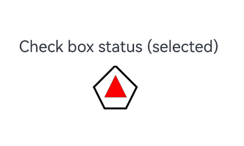

# Content Modifier (ContentModifier)
<!--Kit: ArkUI-->
<!--Subsystem: ArkUI-->
<!--Owner: @liyi0309-->
<!--Designer: @liyi0309-->
<!--Tester: @lxl007-->
<!--Adviser: @HelloCrease-->

**ContentModifier** allows you to customize the content area of supported components. For example, you can display a star inside a **Checkbox** component.

Currently, the following components support **ContentModifier**: [Button](../reference/apis-arkui/arkui-ts/ts-basic-components-button.md), [Checkbox](../reference/apis-arkui/arkui-ts/ts-basic-components-checkbox.md), [DataPanel](../reference/apis-arkui/arkui-ts/ts-basic-components-datapanel.md), [TextTimer](../reference/apis-arkui/arkui-ts/ts-basic-components-texttimer.md), [Slider](../reference/apis-arkui/arkui-ts/ts-basic-components-slider.md), [Select](../reference/apis-arkui/arkui-ts/ts-basic-components-select.md), [Rating](../reference/apis-arkui/arkui-ts/ts-basic-components-rating.md), [Radio](../reference/apis-arkui/arkui-ts/ts-basic-components-radio.md), [Gauge](../reference/apis-arkui/arkui-ts/ts-basic-components-gauge.md), [Toggle](../reference/apis-arkui/arkui-ts/ts-basic-components-toggle.md), [TextClock](../reference/apis-arkui/arkui-ts/ts-basic-components-textclock.md).

The following example shows how to use **ContentModifier** to replace the default check box with a pentagon shape. When the check box is selected, a red triangle appears inside the pentagon and the title updates to **selected**. When the check box is deselected, the triangle disappears and the title changes to **not selected**.

```ts
// xxx.ets
class MyCheckboxStyle implements ContentModifier<CheckBoxConfiguration> {
  selectedColor: Color = Color.White;

  constructor(selectedColor: Color) {
    this.selectedColor = selectedColor;
  }

  applyContent(): WrappedBuilder<[CheckBoxConfiguration]> {
    return wrapBuilder(buildCheckbox);
  }
}

@Builder
function buildCheckbox(config: CheckBoxConfiguration) {
  Column({ space: 10 }) {
    Text(config.name + (config.selected ? " (selected)" : " (unselected)"))
    Shape() {
      // Pentagon check box style
      Path()
        .width(200)
        .height(60)
        .commands('M100 0 L0 100 L50 200 L150 200 L200 100 Z')
        .fillOpacity(0)
        .strokeWidth(3)
      // Red triangle pattern style
      Path()
        .width(10)
        .height(10)
        .commands('M50 0 L100 100 L0 100 Z')
        .visibility(config.selected ? Visibility.Visible : Visibility.Hidden)
        .fill(config.selected ? (config.contentModifier as MyCheckboxStyle).selectedColor : Color.Black)
        .stroke((config.contentModifier as MyCheckboxStyle).selectedColor)
        .margin({ left: 11, top: 10 })
    }
    .width(300)
    .height(200)
    .viewPort({
      x: 0,
      y: 0,
      width: 310,
      height: 310
    })
    .strokeLineJoin(LineJoinStyle.Miter)
    .strokeMiterLimit(5)
    .onClick(() => {
      // Trigger the check box state change upon click.
      if (config.selected) {
        config.triggerChange(false);
      } else {
        config.triggerChange(true);
      }
    })
    .margin({ left: 150 })
  }
}

@Entry
@Component
struct Index {
  build() {
    Row() {
      Column() {
        Checkbox({ name: 'Check box status', group: 'checkboxGroup' })
          .select(true)
          .contentModifier(new MyCheckboxStyle(Color.Red))
          .onChange((value: boolean) => {
            console.info('Checkbox change is' + value);
          })
      }
      .width('100%')
    }
    .height('100%')
  }
}
```


