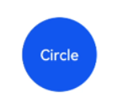
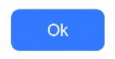
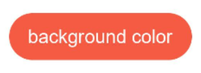
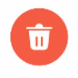
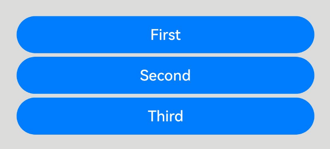
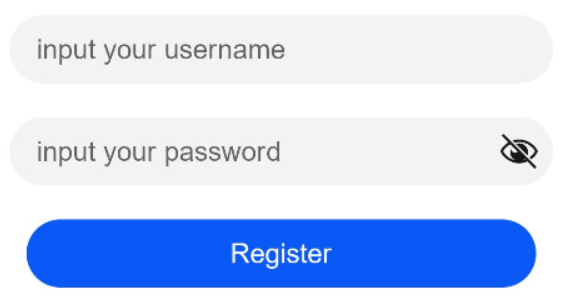

# Button


The **Button** component is usually activated by user clicks to perform a specific action. Buttons are classified as capsule, circle, or normal buttons. When used as a container, the **Button** component accepts child components such as text and images. For details, see [Button](../reference/apis-arkui/arkui-ts/ts-basic-components-button.md).


## Creating a Button

You can create a button that contains or does not contain child components.


- Create a button that does not contain child components.

  ```ts
  Button(label?: ResourceStr, options?: { type?: ButtonType, stateEffect?: boolean })
  ```

  In this API, **label** indicates the button text, **type** indicates the button type, and **stateEffect** specifies whether to enable the pressed effect on the click of the button.

  ```ts
  Button('Ok', { type: ButtonType.Normal, stateEffect: true }) 
    .borderRadius(8) 
    .backgroundColor(0x317aff) 
    .width(90)
    .height(40)
  ```

  


- Create a button that contains a single child component.

  ```ts
  Button(options?: {type?: ButtonType, stateEffect?: boolean})
  ```

  The child component contained can either be a basic component or a container component.

  ```ts
  Button({ type: ButtonType.Normal, stateEffect: true }) {
    Row() {
      Image($r('app.media.loading')).width(20).height(40).margin({ left: 12 })
      Text('loading').fontSize(12).fontColor(0xffffff).margin({ left: 5, right: 12 })
    }.alignItems(VerticalAlign.Center)
  }.borderRadius(8).backgroundColor(0x317aff).width(90).height(40)
  ```

  


## Setting the Button Type

Use the **type** parameter to set the button type to **Capsule**, **Circle**, or **Normal**.


- Capsule button (default type)

  Buttons of this type have rounded corners whose radius is automatically set to half of the button height. The rounded corners cannot be reset through the **borderRadius** attribute.

  ```ts
  Button('Disable', { type: ButtonType.Capsule, stateEffect: false }) 
    .backgroundColor(0x317aff) 
    .width(90)
    .height(40)
  ```

  


- Circle button

  Buttons of this type are round. The rounded corners cannot be reset through the **borderRadius** attribute.

  ```ts
  Button('Circle', { type: ButtonType.Circle, stateEffect: false }) 
    .backgroundColor(0x317aff) 
    .width(90) 
    .height(90)
  ```

  

- Normal button

  Buttons of this type have rounded corners set to 0. The rounded corners can be reset through the **borderRadius** attribute.

  ```ts
  Button('Ok', { type: ButtonType.Normal, stateEffect: true }) 
    .borderRadius(8) 
    .backgroundColor(0x317aff) 
    .width(90)
    .height(40)
  ```

  

- Rounded rectangle button
  The rounded rectangle button has a default corner radius of 20 vp when [controlSize](../reference/apis-arkui/arkui-ts/ts-basic-components-button.md#controlsize11) is **NORMAL**, and 14 vp when [controlSize](../reference/apis-arkui/arkui-ts/ts-basic-components-button.md#controlsize11) is **SMALL**. You can define custom corner radius settings through **borderRadius**.

  ```ts
  Button('Disable', { type: ButtonType.ROUNDED_RECTANGLE, stateEffect: true }) 
    .backgroundColor(0x317aff) 
    .width(90)
    .height(40)
  ```

  

## Setting Styles

- Setting the border radius

  You can use universal attributes to define the button styles. For example, you can use the **borderRadius** attribute to set the border radius.

  ```ts
  Button('circle border', { type: ButtonType.Normal }) 
    .borderRadius(20)
    .height(40)
  ```

  


- Setting the text style

  Add text style attributes for the button.

  ```ts
  Button('font style', { type: ButtonType.Normal }) 
    .fontSize(20) 
    .fontColor(Color.Pink) 
    .fontWeight(800)
  ```

  


- Setting the background color

  Add the **backgroundColor** attribute for the button.

  ```ts
  Button('background color').backgroundColor(0xF55A42)
  ```

  


- Assigning a function to the button

  In this example, the delete function is assigned to the button.

  ```ts
  let MarLeft: Record<string, number> = { 'left': 20 }
  Button({ type: ButtonType.Circle, stateEffect: true }) {
    Image($r('app.media.ic_public_delete_filled')).width(30).height(30)
  }.width(55).height(55).margin(MarLeft).backgroundColor(0xF55A42)
  ```

  


## Adding Events

The **Button** component is usually used to trigger actions. You can bind the **onClick** event to the button to have it respond with custom behavior after being clicked.

```ts
Button('Ok', { type: ButtonType.Normal, stateEffect: true }) 
  .onClick(()=>{ 
    console.info('Button onClick') 
  })
```


## Example

- Using the button for startup

  You can use the button for any UI element that involves the startup operation. The button triggers the predefined event based on the user's operation. For example, you can use a button in the **List** container to redirect the user to another page.

  ```ts
  // xxx.ets
  @Entry
  @Component
  struct ButtonCase1 {
    pathStack: NavPathStack = new NavPathStack();

    @Builder
    PageMap(name: string) {
      if (name === "first_page") {
        pageOneTmp()
      } else if (name === "second_page") {
        pageTwoTmp()
      } else if (name === "third_page") {
        pageThreeTmp()
      }
    }

    build() {
      Navigation(this.pathStack) {
        List({ space: 4 }) {
          ListItem() {
            Button("First").onClick(() => {
              this.pathStack.pushPath({ name: "first_page"})
            })
              .width('100%')
          }

          ListItem() {
            Button("Second").onClick(() => {
              this.pathStack.pushPath({ name: "second_page"})
            })
              .width('100%')
          }

          ListItem() {
            Button("Third").onClick(() => {
              this.pathStack.pushPath({ name: "third_page"})
            })
              .width('100%')
          }
        }
        .listDirection(Axis.Vertical)
        .backgroundColor(0xDCDCDC).padding(20)
      }
      .mode(NavigationMode.Stack)
      .navDestination(this.PageMap)
    }
  }

  // pageOne
  @Component
  export struct pageOneTmp {
    pathStack: NavPathStack = new NavPathStack();
  
    build() {
      NavDestination() {
        Column() {
          Text("first_page")
        }.width('100%').height('100%')
      }.title("pageOne")
      .onBackPressed(() => {
        const popDestinationInfo = this.pathStack.pop() // Pop the top element out of the navigation stack.
        console.log('pop' + 'Return value' + JSON.stringify(popDestinationInfo))
        return true
      })
      .onReady((context: NavDestinationContext) => {
        this.pathStack = context.pathStack
      })
    }
  }

  // pageTwo
  @Component
  export struct pageTwoTmp {
    pathStack: NavPathStack = new NavPathStack();

    build() {
      NavDestination() {
        Column() {
          Text("second_page")
        }.width('100%').height('100%')
      }.title("pageTwo")
      .onBackPressed(() => {
        const popDestinationInfo = this.pathStack.pop() // Pop the top element out of the navigation stack.
        console.log('pop' + 'Return value' + JSON.stringify(popDestinationInfo))
        return true
      })
      .onReady((context: NavDestinationContext) => {
        this.pathStack = context.pathStack
      })
    }
  }

  // pageThree
  @Component
  export struct pageThreeTmp {
    pathStack: NavPathStack = new NavPathStack();

    build() {
      NavDestination() {
        Column() {
          Text("third_page")
        }.width('100%').height('100%')
      }.title("pageThree")
      .onBackPressed(() => {
        const popDestinationInfo = this.pathStack.pop() // Pop the top element out of the navigation stack.
        console.log('pop' + 'Return value' + JSON.stringify(popDestinationInfo))
        return true
      })
      .onReady((context: NavDestinationContext) => {
        this.pathStack = context.pathStack
      })
    }
  }
  ```

  


- Using the button for submitting forms

  On the user login/registration page, you can use a button to submit a login or registration request.

  ```ts
  // xxx.ets
  @Entry
  @Component
  struct ButtonCase2 {
    build() {
      Column() {
        TextInput({ placeholder: 'input your username' }).margin({ top: 20 })
        TextInput({ placeholder: 'input your password' }).type(InputType.Password).margin({ top: 20 })
        Button('Register').width(300).margin({ top: 20 })
          .onClick(() => {
            // Operation
          })
      }.padding(20)
    }
  }
  ```

  

- Configuring the button to float

  The button can remain floating when the user swipes on the screen.

  ```ts
  // xxx.ets
  @Entry
  @Component
  struct HoverButtonExample {
    private arr: number[] = [0, 1, 2, 3, 4, 5, 6, 7, 8, 9]
    build() {
      Stack() {
        List({ space: 20, initialIndex: 0 }) {
          ForEach(this.arr, (item:number) => {
            ListItem() {
              Text('' + item)
                .width('100%').height(100).fontSize(16)
                .textAlign(TextAlign.Center).borderRadius(10).backgroundColor(0xFFFFFF)
            }
          }, (item:number) => item.toString())
        }.width('90%')
        Button() {
          Image($r('app.media.ic_public_add'))
            .width(50)
            .height(50)
        }
        .width(60)
        .height(60)
        .position({x: '80%', y: 600})
        .shadow({radius: 10})
        .onClick(() => {
          // Operation
        })
      }
      .width('100%')
      .height('100%')
      .backgroundColor(0xDCDCDC)
      .padding({ top: 5 })
    }
  }
  ```

  
