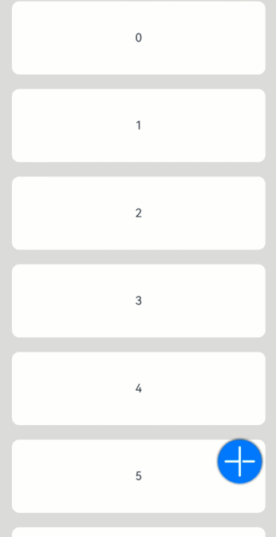

# Button

<!--Kit: ArkUI-->
<!--Subsystem: ArkUI-->
<!--Owner: @liyi0309-->
<!--Designer: @liyi0309-->
<!--Tester: @lxl007-->
<!--Adviser: @Brilliantry_Rui-->
<!-- md-trans-meta sourceCommit=b8421fa94775fa4bceb1b522857b705478302935 translatedAt=2026-07-29T12:45:06.136Z pushedAt=2026-07-30T02:18:33.611Z -->

The **Button** component is usually activated by user clicks to perform a specific action. It comes in four types: capsule, circle, normal, and rounded rectangle. When used as a container, the **Button** component accepts child components such as text and images. For details, see [Button](../reference/apis-arkui/arkui-ts/ts-basic-components-button.md).

## Creating a Button

You can create a button using the following methods:

- Creating a button without child components using **label** and [ButtonOptions](../reference/apis-arkui/arkui-ts/ts-basic-components-button.md#buttonoptions)<br>Take **type** and **stateEffect** in **ButtonOptions** as an example:

  ```ts
  Button(label?: ResourceStr, options?: { type?: ButtonType, stateEffect?: boolean })
  ```

  In this API, **label** indicates the button text, **type** indicates the button type, and **stateEffect** specifies whether to enable the click effect.

  <!-- @[create_button_by_label2](https://gitcode.com/openharmony/applications_app_samples/blob/master/code/DocsSample/ArkUISample/ChooseComponent/entry/src/main/ets/pages/button/CreateButton.ets) -->

  ``` TypeScript
  Button('Ok', { type: ButtonType.Normal, stateEffect: true })
    .borderRadius(8)
    .backgroundColor(0x317aff)
    .width(90)
    .height(40)
  ```

  

- Creating a button with child components using [ButtonOptions](../reference/apis-arkui/arkui-ts/ts-basic-components-button.md#buttonoptions)<br>Take **type** and **stateEffect** in **ButtonOptions** as an example:

  ```ts
  Button(options?: {type?: ButtonType, stateEffect?: boolean})
  ```

  Only one child component is supported, which can be either a basic component or a container component.

  <!-- @[create_button_by_button_options2](https://gitcode.com/openharmony/applications_app_samples/blob/master/code/DocsSample/ArkUISample/ChooseComponent/entry/src/main/ets/pages/button/CreateButton.ets) -->

  ``` TypeScript
  Button({ type: ButtonType.Normal, stateEffect: true }) {
    Row() {
      // Replace $r('app.media.loading') with the actual resource file.
      Image($r('app.media.loading')).width(20).height(40).margin({ left: 12 })
      Text('loading').fontSize(12).fontColor(0xffffff).margin({ left: 5, right: 12 })
    }.alignItems(VerticalAlign.Center)
  }.borderRadius(8).backgroundColor(0x317aff).width(90).height(40)
  ```

  

## Setting the Button Type

Buttons come in four types, set using the **type** parameter: Capsule, Circle, Normal, and ROUNDED_RECTANGLE.

- Capsule button (default type)

  Buttons of this type have rounded corners whose radius is automatically set to half of the button height. The rounded corners cannot be reset through the **borderRadius** attribute.

  <!-- @[create_capsule_button2](https://gitcode.com/openharmony/applications_app_samples/blob/master/code/DocsSample/ArkUISample/ChooseComponent/entry/src/main/ets/pages/button/SetButtonType.ets) -->

  ``` TypeScript
  Button('Disable', { type: ButtonType.Capsule, stateEffect: false })
    .backgroundColor(0x317aff)
    .width(90)
    .height(40)
  ```

  

- Circle button

  Buttons of this type are round. The rounded corners cannot be reset through the **borderRadius** attribute.

  <!-- @[create_circle_button2](https://gitcode.com/openharmony/applications_app_samples/blob/master/code/DocsSample/ArkUISample/ChooseComponent/entry/src/main/ets/pages/button/SetButtonType.ets) -->

  ``` TypeScript
  Button('Circle', { type: ButtonType.Circle, stateEffect: false })
    .backgroundColor(0x317aff)
    .width(90)
    .height(90)
  ```

  

- Normal button

  Buttons of this type have a default corner radius of **0**. The rounded corners can be reset through the **borderRadius** attribute.

  <!-- @[create_normal_button2](https://gitcode.com/openharmony/applications_app_samples/blob/master/code/DocsSample/ArkUISample/ChooseComponent/entry/src/main/ets/pages/button/SetButtonType.ets) -->

  ``` TypeScript
  Button('Ok', { type: ButtonType.Normal, stateEffect: true })
    .borderRadius(8)
    .backgroundColor(0x317aff)
    .width(90)
    .height(40)
  ```

  

- Rounded rectangle button

  The rounded rectangle button has a default corner radius of 20 vp when [controlSize](../reference/apis-arkui/arkui-ts/ts-basic-components-button.md#controlsize11) is **NORMAL**, and 14 vp when [controlSize](../reference/apis-arkui/arkui-ts/ts-basic-components-button.md#controlsize11) is **SMALL**. You can define custom corner radius settings through **borderRadius**.

  <!-- @[create_rounded_rectangle_button](https://gitcode.com/openharmony/applications_app_samples/blob/master/code/DocsSample/ArkUISample/ChooseComponent/entry/src/main/ets/pages/button/SetButtonType.ets) -->

  ``` TypeScript
  Button('Disable', { type: ButtonType.ROUNDED_RECTANGLE, stateEffect: true })
    .backgroundColor(0x317aff)
    .width(90)
    .height(40)
  ```

  

## Setting Styles

- Setting the border radius

  You can use universal attributes to define the button styles. For example, you can use the **borderRadius** attribute to set the border radius.

  <!-- @[custom_button_border_radius2](https://gitcode.com/openharmony/applications_app_samples/blob/master/code/DocsSample/ArkUISample/ChooseComponent/entry/src/main/ets/pages/button/ButtonCustomStyle.ets) -->

  ``` TypeScript
  Button('circle border', { type: ButtonType.Normal })
    .borderRadius(20)
    .height(40)
  ```

  

- Setting the text style

  Add text style attributes for the button.

  <!-- @[custom_font_style2](https://gitcode.com/openharmony/applications_app_samples/blob/master/code/DocsSample/ArkUISample/ChooseComponent/entry/src/main/ets/pages/button/ButtonCustomStyle.ets) -->

  ``` TypeScript
  Button('font style', { type: ButtonType.Normal })
    .fontSize(20)
    .fontColor(Color.Pink)
    .fontWeight(800)
  ```

  

- Setting the background color

  Add the **backgroundColor** attribute for the button.

  <!-- @[custom_background_color2](https://gitcode.com/openharmony/applications_app_samples/blob/master/code/DocsSample/ArkUISample/ChooseComponent/entry/src/main/ets/pages/button/ButtonCustomStyle.ets) -->

  ``` TypeScript
  Button('background color').backgroundColor(0xF55A42)
  ```

  

- Assigning a function to the button

  For example, to create a delete button:

  <!-- @[custom_create_function_button](https://gitcode.com/openharmony/applications_app_samples/blob/master/code/DocsSample/ArkUISample/ChooseComponent/entry/src/main/ets/pages/button/ButtonCustomStyle.ets) -->

  ``` TypeScript
  Button({ type: ButtonType.Circle, stateEffect: true }) {
    // Replace $r('app.media.ic_public_delete_filled') with the actual resource file.
    Image($r('app.media.ic_public_delete_filled')).width(30).height(30)
  }.width(55).height(55).margin({ 'left': 20 }).backgroundColor(0xF55A42)
  ```

  

## Adding Events

The **Button** component is usually used to trigger actions. You can bind the **onClick** event to the button to have it respond with custom behavior after being clicked.

<!-- @[button_case2_add_event](https://gitcode.com/openharmony/applications_app_samples/blob/master/code/DocsSample/ArkUISample/ChooseComponent/entry/src/main/ets/pages/button/ButtonCaseLogin.ets) -->

``` TypeScript
Button('Ok', { type: ButtonType.Normal, stateEffect: true })
  .onClick(()=>{
    hilog.info(DOMAIN, 'testTag', 'Button onClick');
  }).margin(10)
```

## Example

- Using the button for triggering actions

  You can use the button for any UI element that requires user-initiated actions. The button triggers the predefined event based on user interactions. For example, you can use a button in the **List** container to navigate to another page.

  <!-- @[button_case_1](https://gitcode.com/openharmony/applications_app_samples/blob/master/code/DocsSample/ArkUISample/ChooseComponent/entry/src/main/ets/pages/button/ButtonCaseTouch.ets) --> 

  ``` TypeScript
  import { hilog } from '@kit.PerformanceAnalysisKit';
  
  const DOMAIN = 0x0000;
  // xxx.ets
  @Entry
  @Component
  export struct ButtonCaseTouch {
    pathStack: NavPathStack = new NavPathStack();
  
    @Builder
    PageMap(name: string) {
      if (name === 'first_page') {
        pageOneTmp()
      } else if (name === 'second_page') {
        pageTwoTmp()
      } else if (name === 'third_page') {
        pageThreeTmp()
      }
    }
  
    build() {
      NavDestination() {
        Navigation(this.pathStack) {
          List({ space: 4 }) {
            ListItem() {
              Button('First').onClick(() => {
                this.pathStack.pushPath({ name: 'first_page' });
              })
                .width('100%')
            }
  
            ListItem() {
              Button('Second').onClick(() => {
                this.pathStack.pushPath({ name: 'second_page' });
              })
                .width('100%')
            }
  
            ListItem() {
              Button('Third').onClick(() => {
                this.pathStack.pushPath({ name: 'third_page' });
              })
                .width('100%')
            }
          }
          .listDirection(Axis.Vertical)
          .backgroundColor(0xDCDCDC).padding(20)
        }
        .mode(NavigationMode.Stack)
        .navDestination(this.PageMap)
      }
    }
  }
  
  // pageOne
  @Component
  export struct pageOneTmp {
    pathStack: NavPathStack = new NavPathStack();
  
    build() {
      NavDestination() {
        Column() {
          Text('first_page')
        }.width('100%').height('100%')
      }.title('pageOne')
      .onBackPressed(() => {
        const popDestinationInfo = this.pathStack.pop(); // Pop the top element out of the navigation stack.
        // Replace $r('app.string.return_value') with the actual resource file. In this example, the value in the resource file is "Return value."
        hilog.info(DOMAIN, 'testTag', 'pop' + $r('app.string.return_value') + JSON.stringify(popDestinationInfo));
        return true;
      })
      .onReady((context: NavDestinationContext) => {
        this.pathStack = context.pathStack;
      })
    }
  }
  
  // pageTwo
  @Component
  export struct pageTwoTmp {
    pathStack: NavPathStack = new NavPathStack();
  
    build() {
      NavDestination() {
        Column() {
          Text('second_page')
        }.width('100%').height('100%')
      }.title('pageTwo')
      .onBackPressed(() => {
        const popDestinationInfo = this.pathStack.pop(); // Pop the top element out of the navigation stack.
        // Replace $r('app.string.return_value') with the actual resource file. In this example, the value in the resource file is "Return value."
        hilog.info(DOMAIN, 'testTag', 'pop' + $r('app.string.return_value') + JSON.stringify(popDestinationInfo));
        return true;
      })
      .onReady((context: NavDestinationContext) => {
        this.pathStack = context.pathStack;
      })
    }
  }
  
  // pageThree
  @Component
  export struct pageThreeTmp {
    pathStack: NavPathStack = new NavPathStack();
  
    build() {
      NavDestination() {
        Column() {
          Text('third_page')
        }.width('100%').height('100%')
      }.title('pageThree')
      .onBackPressed(() => {
        const popDestinationInfo = this.pathStack.pop(); // Pop the top element out of the navigation stack.
        // Replace $r('app.string.return_value') with the actual resource file. In this example, the value of the resource file is "return value".
        hilog.info(DOMAIN, 'testTag', 'pop' + $r('app.string.return_value') + JSON.stringify(popDestinationInfo));
        return true;
      })
      .onReady((context: NavDestinationContext) => {
        this.pathStack = context.pathStack;
      })
    }
  }
  ```

  

- Using the button for submitting forms

  On the user login/registration page, you can use a button to submit a login or registration request.

  <!-- @[button_case_2](https://gitcode.com/openharmony/applications_app_samples/blob/master/code/DocsSample/ArkUISample/ChooseComponent/entry/src/main/ets/pages/button/ButtonCaseLogin.ets) -->

  ``` TypeScript
  // xxx.ets
  const DOMAIN = 0x0000;
  @Entry
  @Component
  export struct ButtonCaseLogin {
    build() {
      NavDestination() {
        Column() {
          TextInput({ placeholder: 'input your username' }).margin({ top: 20 })
          TextInput({ placeholder: 'input your password' }).type(InputType.Password).margin({ top: 20 })
          Button('Register').width(300).margin({ top: 20 })
            .onClick(() => {
              // Operation
            })
          // ···
        }.padding(20)
      }
    }
  }
  ```

  

- Configuring the button to float

  The button can remain floating when the user swipes on the screen.

  <!-- @[hover_button_example](https://gitcode.com/openharmony/applications_app_samples/blob/master/code/DocsSample/ArkUISample/ChooseComponent/entry/src/main/ets/pages/button/HoverButtonExample.ets) -->

  ``` TypeScript
  // xxx.ets
  @Entry
  @Component
  export struct HoverButtonExample {
    private arr: number[] = [0, 1, 2, 3, 4, 5, 6, 7, 8, 9];
    build() {
      NavDestination() {
        Stack() {
          List({ space: 20, initialIndex: 0 }) {
            ForEach(this.arr, (item: number) => {
              ListItem() {
                Text('' + item)
                  .width('100%')
                  .height(100)
                  .fontSize(16)
                  .textAlign(TextAlign.Center)
                  .borderRadius(10)
                  .backgroundColor(0xFFFFFF)
              }
            }, (item: number) => item.toString())
          }.width('90%')
  
          Button() {
            // Replace $r('app.media.ic_public_add') with the actual resource file.
            Image($r('app.media.ic_public_add'))
             .width(50)
             .height(50)
          }
          .width(60)
          .height(60)
          .position({ x: '80%', y: 600 })
          .shadow({ radius: 10 })
          .onClick(() => {
            // Operation
          })
        }
        .width('100%')
        .height('100%')
        .backgroundColor(0xDCDCDC)
        .padding({ top: 5 })
      }
    }
  }
  ```

  