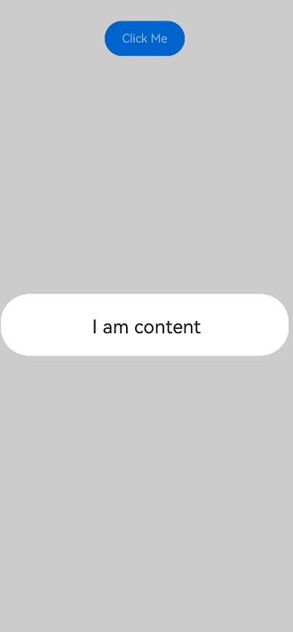
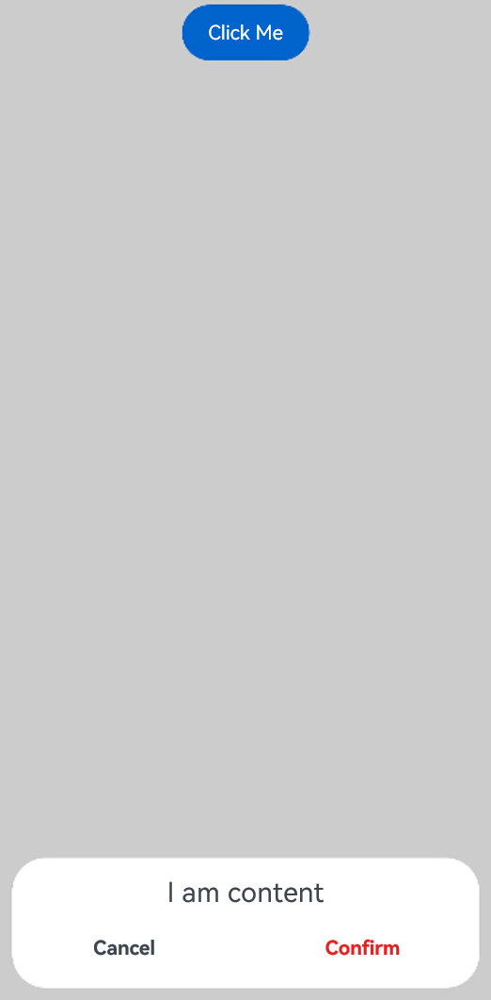
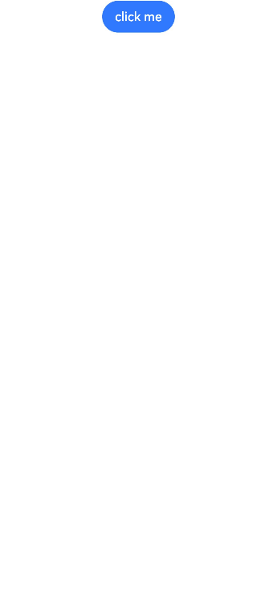
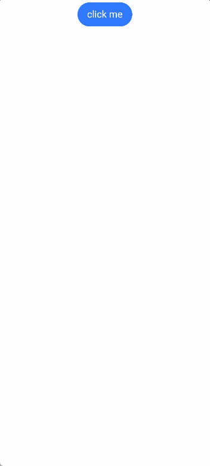
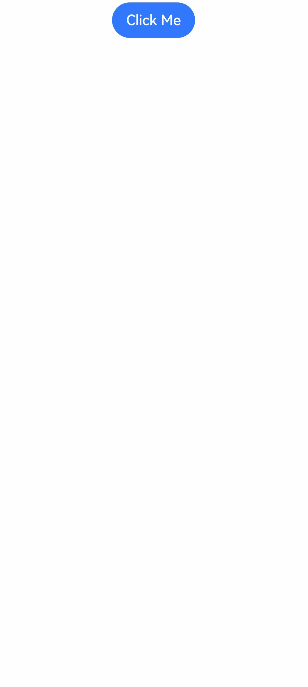

# Custom Dialog Box (CustomDialog)


A custom dialog box is a dialog box you customize by using APIs of the **CustomDialogController** class. It can be used for user interactions, showing an ad, prize, alert, software update message, and more. For details, see [Custom Dialog Box](../reference/apis-arkui/arkui-ts/ts-methods-custom-dialog-box.md).


## Creating a Custom Dialog Box

1. Use the \@CustomDialog decorator to create a custom dialog box.

2. Set the content for the \@CustomDialog decorated dialog box.

   ```ts
   @CustomDialog
   struct CustomDialogExample {
     controller: CustomDialogController = new CustomDialogController({
       builder: CustomDialogExample({}),
     })
   
     build() {
       Column() {
         Text ('I am content')
           .fontSize(20)
           .margin({ top: 10, bottom: 10 })
       }
     }
   }
   ```
   
3. Create a builder that is bound to the decorator.

   ```ts
    @Entry
    @Component
    struct CustomDialogUser {
      dialogController: CustomDialogController = new CustomDialogController({
        builder: CustomDialogExample(),
      })
    }
   ```
   
4. Click the component bound to the **onClick** event to display the dialog box.

   ```ts
   @Entry
   @Component
   struct CustomDialogUser {
     dialogController: CustomDialogController = new CustomDialogController({
       builder: CustomDialogExample(),
     })
   
     build() {
       Column() {
         Button('click me')
           .onClick(() => {
             this.dialogController.open()
           })
       }.width('100%').margin({ top: 5 })
     }
   }
   ```
   
   


## Interaction with Custom Dialog Box

Custom dialog boxes can be used for data interactions to complete a series of response operations.


1. Add buttons in the \@CustomDialog decorator structure and add data functions.

   ```ts
   @CustomDialog
   struct CustomDialogExample {
     cancel?: () => void
     confirm?: () => void
     controller: CustomDialogController
   
     build() {
       Column() {
         Text('I am content') .fontSize(20).margin({ top: 10, bottom: 10 })
         Flex({ justifyContent: FlexAlign.SpaceAround }) {
           Button('cancel')
             .onClick(() => {
               this.controller.close()
               if (this.cancel) {
                 this.cancel()
               }
             }).backgroundColor(0xffffff).fontColor(Color.Black)
           Button('confirm')
             .onClick(() => {
               this.controller.close()
               if (this.confirm) {
                 this.confirm()
               }
             }).backgroundColor(0xffffff).fontColor(Color.Red)
         }.margin({ bottom: 10 })
       }
     }
   }
   ```

2. Receive the page in the builder and create corresponding function operations.

     ```ts
   @Entry
   @Component
   struct CustomDialogUser {
       dialogController: CustomDialogController = new CustomDialogController({
         builder: CustomDialogExample({
           cancel: ()=> { this.onCancel() },
           confirm: ()=> { this.onAccept() },
         }),
       })
   
       onCancel() {
         console.info('Callback when the first button is clicked')
       }
   
       onAccept() {
         console.info('Callback when the second button is clicked')
       }
   
       build() {
         Column() {
           Button('click me')
             .onClick(() => {
               this.dialogController.open()
             })
         }.width('100%').margin({ top: 5 })
       }
     }
   ```

      
   
   3. Use the button in the dialog box to implement route redirection and obtain the parameters passed in from the redirection target page.
   
   ```ts
   // Index.ets
   import { router } from '@kit.ArkUI';
   
   @CustomDialog
   struct CustomDialogExample {
     @Link textValue: string
     controller?: CustomDialogController
     cancel: () => void = () => {
     }
     confirm: () => void = () => {
     }
   
     build() {
       Column({ space: 20 }) {
         if (this.textValue != '') {
           Text(`Content of the second page: ${this.textValue}`)
             .fontSize(20)
         } else {
           Text('Obtain the content of the second page?')
             .fontSize(20)
         }
         Flex({ justifyContent: FlexAlign.SpaceAround }) {
           Button('Cancel')
             .onClick(() => {
               if (this.controller != undefined) {
                 this.controller.close()
                 this.cancel()
               }
             }).backgroundColor(0xffffff).fontColor(Color.Black)
           Button('Obtain')
             .onClick(() => {
               if (this.controller != undefined && this.textValue != '') {
                 this.controller.close()
               } else if (this.controller != undefined) {
                 router.pushUrl({
                   url: 'pages/Index2'
                 })
                 this.controller.close()
               }
             }).backgroundColor(0xffffff).fontColor(Color.Red)
         }.margin({ bottom: 10 })
       }.borderRadius(10).padding({ top: 20 })
     }
   }
   
   @Entry
   @Component
   struct CustomDialogUser {
     @State textValue: string = ''
     dialogController: CustomDialogController | null = new CustomDialogController({
       builder: CustomDialogExample({
         cancel: () => {
           this.onCancel()
         },
         confirm: () => {
           this.onAccept()
         },
         textValue: $textValue
       })
     })
   
     // Set dialogController to null when the custom component is about to be destroyed.
     aboutToDisappear() {
       this.dialogController = null // Set dialogController to null.
     }
   
     onPageShow() {
       const params = router.getParams() as Record<string, string>; // Obtain the passed parameter object.
       if (params) {
         this.dialogController?.open()
         this.textValue = params.info as string; // Obtain the value of the id attribute.
       }
     }
   
     onCancel() {
       console.info('Callback when the first button is clicked')
     }
   
     onAccept() {
       console.info('Callback when the second button is clicked')
     }
   
     exitApp() {
       console.info('Click the callback in the blank area')
     }
   
     build() {
       Column() {
         Button('click me')
           .onClick(() => {
             if (this.dialogController != null) {
               this.dialogController.open()
             }
           }).backgroundColor(0x317aff)
       }.width('100%').margin({ top: 5 })
     }
   }
   ```
   
   ```ts
   // Index2.ets
   import { router } from '@kit.ArkUI';
   
   @Entry
   @Component
   struct Index2 {
     @State message: string =' Back';
     build() {
       Column() {
         Button(this.message)
           .fontSize(50)
           .fontWeight(FontWeight.Bold).onClick(() => {
           router.back({
             url: 'pages/Index',
             params: {
               info: 'Hello World'
             }
           });
         })
       }.width('100%').height('100%').margin({ top: 20 })
     }
   }
   ```
   
   

## Defining the Custom Dialog Box Animation

You can define the custom dialog box animation, including its duration and speed, through **openAnimation**.

```ts
@CustomDialog
struct CustomDialogExample {
  controller?: CustomDialogController

  build() {
    Column() {
      Text('Whether to change a text?').fontSize(16).margin({ bottom: 10 })
    }
  }
}

@Entry
@Component
struct CustomDialogUser {
  @State textValue: string = ''
  @State inputValue: string = 'click me'
  dialogController: CustomDialogController | null = new CustomDialogController({
    builder: CustomDialogExample(),
    openAnimation: {
      duration: 1200,
      curve: Curve.Friction,
      delay: 500,
      playMode: PlayMode.Alternate,
      onFinish: () => {
        console.info('play end')
      }
    },
    autoCancel: true,
    alignment: DialogAlignment.Bottom,
    offset: { dx: 0, dy: -20 },
    gridCount: 4,
    customStyle: false,
    backgroundColor: 0xd9ffffff,
    cornerRadius: 10,
  })

  // Set dialogController to null when the custom component is about to be destroyed.
  aboutToDisappear() {
    this.dialogController = null // Set dialogController to null.
  }

  build() {
    Column() {
      Button(this.inputValue)
        .onClick(() => {
          if (this.dialogController != null) {
            this.dialogController.open()
          }
        }).backgroundColor(0x317aff)
    }.width('100%').margin({ top: 5 })
  }
}
```



## Nesting a Custom Dialog Box

To nest a dialog box (dialog 2) within another dialog box (dialog 1), it is recommended that you define dialog 2 at the parent component of dialog 1 and open dialog 2 through the callback sent by the parent component to dialog 1.

```ts
@CustomDialog
struct CustomDialogExampleTwo {
  controllerTwo?: CustomDialogController
  @State message: string = "I'm the second dialog box."
  @State showIf: boolean = false;
  build() {
    Column() {
      if (this.showIf) {
        Text("Text")
          .fontSize(30)
          .height(100)
      }
      Text(this.message)
        .fontSize(30)
        .height(100)
      Button("Create Text")
        .onClick(()=>{
          this.showIf = true;
        })
      Button ('Close Second Dialog Box')
        .onClick(() => {
          if (this.controllerTwo != undefined) {
            this.controllerTwo.close()
          }
        })
        .margin(20)
    }
  }
}
@CustomDialog
struct CustomDialogExample {
  openSecondBox?: ()=>void
  controller?: CustomDialogController

  build() {
    Column() {
      Button ('Open Second Dialog Box and close this box')
        .onClick(() => {
          this.controller!.close();
          this.openSecondBox!();
        })
        .margin(20)
    }.borderRadius(10)
  }
}
@Entry
@Component
struct CustomDialogUser {
  @State inputValue: string = 'Click Me'
  dialogController: CustomDialogController | null = new CustomDialogController({
    builder: CustomDialogExample({
      openSecondBox: ()=>{
        if (this.dialogControllerTwo != null) {
          this.dialogControllerTwo.open()
        }
      }
    }),
    cancel: this.exitApp,
    autoCancel: true,
    alignment: DialogAlignment.Bottom,
    offset: { dx: 0, dy: -20 },
    gridCount: 4,
    customStyle: false
  })
  dialogControllerTwo: CustomDialogController | null = new CustomDialogController({
    builder: CustomDialogExampleTwo(),
    alignment: DialogAlignment.Bottom,
    offset: { dx: 0, dy: -25 } })

  aboutToDisappear() {
    this.dialogController = null
    this.dialogControllerTwo = null
  }

  onCancel() {
    console.info('Callback when the first button is clicked')
  }

  onAccept() {
    console.info('Callback when the second button is clicked')
  }

  exitApp() {
    console.info('Click the callback in the blank area')
  }
  build() {
    Column() {
      Button(this.inputValue)
        .onClick(() => {
          if (this.dialogController != null) {
            this.dialogController.open()
          }
        }).backgroundColor(0x317aff)
    }.width('100%').margin({ top: 5 })
  }
}
```


If you define dialog 2 at dialog 1 instead, due to the parent-child relationship between custom dialog boxes on the state management side, you will not be able to create any component in dialog 2 once dialog 1 is destroyed (closed).

