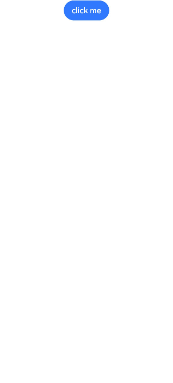
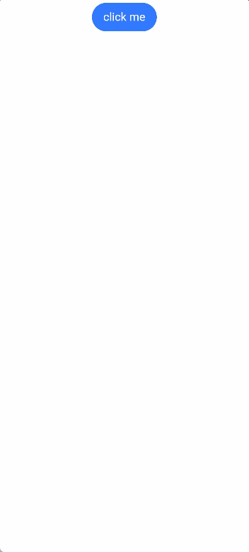

# Basic Custom Dialog (CustomDialog)

<!--Kit: ArkUI-->
<!--Subsystem: ArkUI-->
<!--Owner: @houguobiao-->
<!--Designer: @houguobiao-->
<!--Tester: @lxl007-->
<!--Adviser: @Brilliantry_Rui-->
<!-- md-trans-meta sourceCommit=d0654055576ab02270c2677e50b67065ca2d2e7e translatedAt=2026-07-29T12:44:45.644Z pushedAt=2026-07-31T01:52:31.239Z -->

CustomDialog is a custom dialog used for user interaction scenarios such as advertisements, prize notifications, warnings, and software updates. You can display a custom dialog through the **CustomDialogController** class. For details, see [Custom Dialog](../reference/apis-arkui/arkui-ts/ts-methods-custom-dialog-box.md).

> **NOTE**
>
> Currently, ArkUI dialogs are non-page-level by default. When a page route transition occurs, the dialog will not close automatically unless you call the close method. To overlay a dialog during page navigation, you can use the [dialog type for component navigation subpage display](./arkts-navigation-navdestination.md#page-display-mode) or [page-level dialog](arkts-embedded-dialog.md).

By default, the dialog is modal with a mask layer, and interaction with controls beneath the mask layer is not allowed (tap and gesture events cannot pass through to the underlying layer). You can configure the **isModal** attribute in [CustomDialogControllerOptions](../reference/apis-arkui/arkui-ts/ts-methods-custom-dialog-box.md#customdialogcontrolleroptions) to implement modal and non-modal dialogs. For details, see [Dialog Box Types](arkts-dialog-overview.md#types-of-popup-windows).

When **isModal** is set to **true**, the dialog is modal, and the mask area around the dialog does not support pass-through. When **isModal** is set to **false**, the dialog is non-modal, and the mask area around the dialog supports pass-through. Therefore, if you need to allow both interaction with the dialog and interaction with the page content outside the dialog, set the dialog to non-modal.

## Lifecycle

Starting from API version 19, the custom dialog provides lifecycle functions to notify you of the dialog lifecycle. The lifecycle trigger sequence is: onWillAppear -> onDidAppear -> onWillDisappear -> onDidDisappear.

| Name            |Type| Description                       |
| ----------------- | ------ | ---------------------------- |
| onWillAppear    | Callback&lt;void&gt; | Callback for the event before the dialog display animation. |
| onDidAppear    | Callback&lt;void&gt;  | Callback for the event after the dialog is displayed.    |
| onWillDisappear | Callback&lt;void&gt; | Callback for the event before the dialog exit animation. |
| onDidDisappear | Callback&lt;void&gt;  | Callback for the event after the dialog disappears.    |

## Creating a Custom Dialog Box

1. Use the \@CustomDialog decorator to decorate a custom dialog. You can customize the dialog content within this decorator. CustomDialogController must be defined inside @Component.

   <!-- @[create_custom_dialog_new_customDialog_controller_default](https://gitcode.com/openharmony/applications_app_samples/blob/master/code/DocsSample/ArkUISample/DialogProject/entry/src/main/ets/pages/customdialog/CreateCustomDialogNew.ets) -->

   ``` TypeScript
   @CustomDialog
   struct CustomDialogExample {
     controller?: CustomDialogController;
   
     build() {
       Column() {
         // Replace $r('app.string.i_am_content') with the actual resource file. In this example, the value of the resource file is "I am the content".
         Text($r('app.string.i_am_content'))
           .fontSize(20)
       }.height(60).justifyContent(FlexAlign.Center)
     }
   }
   ```

2. Create a constructor and connect it to the decorator.

   <!-- @[create_custom_dialog_new_customDialog_controller_constructor](https://gitcode.com/openharmony/applications_app_samples/blob/master/code/DocsSample/ArkUISample/DialogProject/entry/src/main/ets/pages/customdialog/CreateCustomDialogNew.ets) -->

   ``` TypeScript
   @Entry
   @Component
   export struct CreateCustomDialogNew {
     dialogController: CustomDialogController = new CustomDialogController({
       builder: CustomDialogExample(),
     })
   // ···
   }
   ```

3. Tap the component bound to the onClick event to display the dialog.

   <!-- @[create_custom_dialog_new_customDialog_controller_on_click](https://gitcode.com/openharmony/applications_app_samples/blob/master/code/DocsSample/ArkUISample/DialogProject/entry/src/main/ets/pages/customdialog/CreateCustomDialogNew.ets) -->

   ``` TypeScript
   @Entry
   @Component
   export struct CreateCustomDialogNew {
     dialogController: CustomDialogController = new CustomDialogController({
       builder: CustomDialogExample(),
     })
     build() {
       NavDestination() {
         Column() {
           Button('click me')
             .onClick(() => {
               this.dialogController.open();
             })
         }.width('100%').margin({ top: 5 })
       }
     }
   }
   ```

   

## Dialog Box Interaction

A dialog can be used for data interaction to complete a series of user response operations.

1. Add buttons and data functions inside the \@CustomDialog decorator.

   <!-- @[dialog_interaction_use_constructor_example](https://gitcode.com/openharmony/applications_app_samples/blob/master/code/DocsSample/ArkUISample/DialogProject/entry/src/main/ets/pages/customdialog/DialogInteractionUseConstructor.ets) -->

   ``` TypeScript
   @CustomDialog
   struct CustomDialogExample {
     cancel: () => void = () => {
     }
     confirm: () => void = () => {
     }
     controller?: CustomDialogController;
   
     build() {
       Column() {
         // Replace $r('app.string.i_am_content') with the actual resource file. In this example, the value of this resource file is "I am the content".
         Text($r('app.string.i_am_content')).fontSize(20).margin({ top: 10, bottom: 10 })
         Flex({ justifyContent: FlexAlign.SpaceAround }) {
           Button('cancel')
             .onClick(() => {
               this.controller?.close();
               if (this.cancel) {
                 this.cancel();
               }
             }).backgroundColor(0xffffff).fontColor(Color.Black)
           Button('confirm')
             .onClick(() => {
               this.controller?.close();
               if (this.confirm) {
                 this.confirm();
               }
             }).backgroundColor(0xffffff).fontColor(Color.Red)
         }.margin({ bottom: 10 })
       }
     }
   }
   ```

2. Receive them in the constructor on the page and create the corresponding function operations.

   <!-- @[dialog_interaction_use_constructor_user](https://gitcode.com/openharmony/applications_app_samples/blob/master/code/DocsSample/ArkUISample/DialogProject/entry/src/main/ets/pages/customdialog/DialogInteractionUseConstructor.ets) -->

   ``` TypeScript
   @Entry
   @Component
   export struct DialogInteractionUseConstructor {
     dialogController: CustomDialogController = new CustomDialogController({
       builder: CustomDialogExample({
         cancel: ()=> { this.onCancel() },
         confirm: ()=> { this.onAccept() },
       }),
     });
   
     onCancel() {
       hilog.info(DOMAIN, 'testTag', 'Callback when the first button is clicked');
     }
   
     onAccept() {
       hilog.info(DOMAIN, 'testTag', 'Callback when the second button is clicked');
     }
   
     build() {
       Column() {
         NavDestination() {
           Button('click me')
             .onClick(() => {
               this.dialogController.open();
             })
         }.width('100%').margin({ top: 5 })
       }
     }
   }
   ```

   

3. You can use buttons in a dialog to navigate to another page and obtain the parameters passed from that page to the current page.

    <!-- @[dialog_interaction_use_button](https://gitcode.com/openharmony/applications_app_samples/blob/master/code/DocsSample/ArkUISample/DialogProject/entry/src/main/ets/pages/customdialog/DialogInteractionUseButton.ets) -->

    ``` TypeScript
    @CustomDialog
    struct CustomDialogExample {
      @Link textValue: string;
      controller?: CustomDialogController;
      cancel: () => void = () => {
      }
      confirm: () => void = () => {
      }
    
      build() {
        Column({ space: 20 }) {
          if (this.textValue !== '') {
            // Replace $r('app.string.the_second_page_is') with the actual resource file. In this example, the value of this resource file is "The content of the second page is".
            Text($r('app.string.the_second_page_is')+`:${this.textValue}`)
              .fontSize(20)
          } else {
            // Replace $r('app.string.whether_to_get_the_second_page') with the actual resource file. In this example, the value of this resource file is "Whether to obtain the content of the second page".
            Text($r('app.string.whether_to_get_the_second_page'))
              .fontSize(20)
          }
          Flex({ justifyContent: FlexAlign.SpaceAround }) {
            Button('cancel')
              .onClick(() => {
                if (this.controller !== undefined) {
                  this.controller.close();
                  this.cancel();
                }
              }).backgroundColor(0xffffff).fontColor(Color.Black)
            Button('confirm')
              .onClick(() => {
                if (this.controller !== undefined && this.textValue !== '') {
                  this.controller.close();
                } else if (this.controller !== undefined) {
                  this.getUIContext().getRouter().pushUrl({
                    url: 'pages/Index2'
                  });
                  this.controller.close();
                }
              }).backgroundColor(0xffffff).fontColor(Color.Red)
          }.margin({ bottom: 10 })
        }.borderRadius(10).padding({ top: 20 })
      }
    }
    
    @Entry
    @Component
    export struct DialogInteractionUseButton {
      @State textValue: string = '';
      dialogController: CustomDialogController | null = new CustomDialogController({
        builder: CustomDialogExample({
          cancel: () => {
            this.onCancel()
          },
          confirm: () => {
            this.onAccept()
          },
          textValue: this.textValue
        })
      });
    
      // Set dialogController to null when the custom component is about to be destructed.
      aboutToDisappear() {
        this.dialogController = null; // Set dialogController to null.
      }
    
      onPageShow() {
        const params = this.getUIContext().getRouter().getParams() as Record<string, string>; // Obtain the passed parameter object.
        if (params) {
          this.dialogController?.open();
          this.textValue = params.info as string; // Obtain the value of the info property.
        }
      }
    
      onCancel() {
        hilog.info(DOMAIN, 'testTag', 'Callback when the first button is clicked');
      }
    
      onAccept() {
        hilog.info(DOMAIN, 'testTag', 'Callback when the second button is clicked');
      }
    
      exitApp() {
        hilog.info(DOMAIN, 'testTag', 'Click the callback in the blank area');
      }
    
      build() {
        Column() {
          NavDestination() {
            Button('click me')
              .onClick(() => {
                if (this.dialogController !== null) {
                  this.dialogController.open();
                }
              }).backgroundColor(0x317aff)
          }.width('100%').margin({ top: 5 })
        }
      }
    }
    ```

    <!-- @[index_new](https://gitcode.com/openharmony/applications_app_samples/blob/master/code/DocsSample/ArkUISample/DialogProject/entry/src/main/ets/pages/customdialog/IndexNew.ets) -->

    ``` TypeScript
    @Entry
    @Component
    struct IndexNew {
      // Replace $r('app.string.click_and_return') with the actual resource file. In this example, the value of this resource file is "tap to return".
      @State message: string = $r('app.string.click_and_return');
    
      build() {
        NavDestination() {
          Column() {
            Button(this.message)
              .type(ButtonType.Capsule)
              .onClick(() => {
                this.getUIContext().getRouter().back({
                  url: 'pages/Index',
                  params: {
                    info: 'Hello World'
                  }
                });
              })
          }.width('100%').height('100%').margin({ top: 20 })
        }
      }
    }
    ```



## Dialog Box Animation

A dialog controls parameters such as the duration and speed of the appearance animation through the **openAnimation** attribute defined in [CustomDialogControllerOptions](../reference/apis-arkui/arkui-ts/ts-methods-custom-dialog-box.md#customdialogcontrolleroptions).

<!-- @[dialog_animation_new](https://gitcode.com/openharmony/applications_app_samples/blob/master/code/DocsSample/ArkUISample/DialogProject/entry/src/main/ets/pages/customdialog/DialogAnimationNew.ets) --> 

``` TypeScript
@CustomDialog
struct CustomDialogExample {
  controller?: CustomDialogController;

  build() {
    NavDestination() {
      Column() {
        Text('Whether to change a text?').fontSize(16).margin({ bottom: 10 })
      }
    }
  }
}

@Entry
@Component
export struct DialogAnimationNew {
  @State inputValue: string = 'click me';
  dialogController: CustomDialogController | null = new CustomDialogController({
    builder: CustomDialogExample(),
    openAnimation: {
      duration: 1200,
      curve: Curve.Friction,
      delay: 500,
      playMode: PlayMode.Alternate,
      onFinish: () => {
        hilog.info(DOMAIN, 'testTag', 'play end');
      }
    },
    autoCancel: true,
    alignment: DialogAlignment.Bottom,
    offset: { dx: 0, dy: -20 },
    gridCount: 4,
    customStyle: false,
    backgroundColor: 0xd9ffffff,
    cornerRadius: 10,
  });

  // Set dialogController to null before the custom component is destructed.
  aboutToDisappear() {
    this.dialogController = null; // Set dialogController to null.
  }

  build() {
    NavDestination() {
      Column() {
        Button(this.inputValue)
          .onClick(() => {
            if (this.dialogController !== null) {
              this.dialogController.open();
            }
          }).backgroundColor(0x317aff)
      }.width('100%').margin({ top: 5 })
    }
  }
}
```



## Dialog Box Styles

You can control the style of a dialog by defining parameters such as its width, height, background color, and shadow.

<!-- @[dialog_style_new](https://gitcode.com/openharmony/applications_app_samples/blob/master/code/DocsSample/ArkUISample/DialogProject/entry/src/main/ets/pages/customdialog/DialogStyleNew.ets) -->

``` TypeScript
@CustomDialog
struct CustomDialogExample {
  controller?: CustomDialogController;

  build() {
    Column() {
      // Replace $r('app.string.i_am_content') with the actual resource file. In this example, the value of the resource file is "I am content".
      Text($r('app.string.i_am_content')).fontSize(16).margin({ bottom: 10 })
    }
  }
}

@Entry
@Component
export struct DialogStyleNew {
  @State inputValue: string = 'click me';
  dialogController: CustomDialogController | null = new CustomDialogController({
    builder: CustomDialogExample(),
    autoCancel: true,
    alignment: DialogAlignment.Center,
    offset: { dx: 0, dy: -20 },
    gridCount: 4,
    customStyle: false,
    backgroundColor: 0xd9ffffff,
    cornerRadius: 20,
    width: '80%',
    height: '100px',
    borderWidth: 1,
    borderStyle: BorderStyle.Dashed, //The borderStyle attribute must be used together with the borderWidth attribute.
    borderColor: Color.Blue, //The borderColor attribute must be used together with the borderWidth attribute.
    shadow: ({
      radius: 20,
      color: Color.Grey,
      offsetX: 50,
      offsetY: 0
    }),
  });

  // Set dialogController to null when the custom component is about to be destroyed.
  aboutToDisappear() {
    this.dialogController = null; // Set dialogController to null.
  }

  build() {
    NavDestination() {
      Column() {
        Button(this.inputValue)
          .onClick(() => {
            if (this.dialogController !== null) {
              this.dialogController.open();
            }
          }).backgroundColor(0x317aff)
      }.width('100%').margin({ top: 5 })
    }
  }
}
```


## Nesting Custom Dialog Boxes

When opening a second dialog from the first dialog, it is recommended to define the second dialog in the parent component of the first dialog, and open the second dialog through a callback passed from the parent component to the first dialog.

<!-- @[nest_dialog_new](https://gitcode.com/openharmony/applications_app_samples/blob/master/code/DocsSample/ArkUISample/DialogProject/entry/src/main/ets/pages/customdialog/NestDialogNew.ets) -->

``` TypeScript
@CustomDialog
struct CustomDialogExampleTwo {
  controllerTwo?: CustomDialogController;
  @State message: string = 'I am the second dialog.';
  @State showIf: boolean = false;

  build() {
    Column() {
      if (this.showIf) {
        Text('Text')
          .fontSize(30)
          .height(100)
      }
      Text(this.message)
        .fontSize(30)
        .height(100)
      Button('Create Text')
        .onClick(() => {
          this.showIf = true;
        })
      Button('Close Second Dialog Box')
        .onClick(() => {
          if (this.controllerTwo !== undefined) {
            this.controllerTwo.close();
          }
        })
        .margin(20)
    }
  }
}

@CustomDialog
struct CustomDialogExample {
  openSecondBox?: () => void;
  controller?: CustomDialogController;

  build() {
    Column() {
      Button('Open Second Dialog Box and close this box')
        .onClick(() => {
          this.controller!.close();
          this.openSecondBox!();
        })
        .margin(20)
    }.borderRadius(10)
  }
}

@Entry
@Component
export struct NestDialogNew {
  @State inputValue: string = 'Click Me';
  dialogController: CustomDialogController | null = new CustomDialogController({
    builder: CustomDialogExample({
      openSecondBox: () => {
        if (this.dialogControllerTwo !== null) {
          this.dialogControllerTwo.open()
        }
      }
    }),
    cancel: this.exitApp,
    autoCancel: true,
    alignment: DialogAlignment.Bottom,
    offset: { dx: 0, dy: -20 },
    gridCount: 4,
    customStyle: false
  });
  dialogControllerTwo: CustomDialogController | null = new CustomDialogController({
    builder: CustomDialogExampleTwo(),
    alignment: DialogAlignment.Bottom,
    offset: { dx: 0, dy: -25 }
  });

  aboutToDisappear() {
    this.dialogController = null;
    this.dialogControllerTwo = null;
  }

  onCancel() {
    hilog.info(DOMAIN, 'testTag', 'Callback when the first button is clicked');
  }

  onAccept() {
    hilog.info(DOMAIN, 'testTag', 'Callback when the second button is clicked');
  }

  exitApp() {
    hilog.info(DOMAIN, 'testTag', 'Click the callback in the blank area');
  }

  build() {
    NavDestination() {
      Column() {
        Button(this.inputValue)
          .onClick(() => {
            if (this.dialogController !== null) {
              this.dialogController.open();
            }
          }).backgroundColor(0x317aff)
      }.width('100%').margin({ top: 5 })
    }
  }
}
```


Because custom dialogs have a parent-child relationship in state management, if the second dialog is defined inside the first dialog, new components can no longer be created in the child component (the second dialog) when the parent component (the first dialog) is destroyed (closed).

## Implementing Physical Back Press Interception for a Dialog Box

When you perform interactive operations such as tapping the mask layer to close, swiping left or right, pressing the three-key Back button, or pressing ESC to close the dialog, if the onWillDismiss callback in [CustomDialogControllerOptions](../reference/apis-arkui/arkui-ts/ts-methods-custom-dialog-box.md#customdialogcontrolleroptions) is registered, the dialog is not closed immediately. In the callback, you can obtain the type of operation that prevented the dialog from closing through the reason property in [DismissDialogAction](../reference/apis-arkui/arkui-ts/ts-methods-custom-dialog-box.md#dismissdialogaction12), and decide whether to close the dialog based on the reason.

<!-- @[dialog_with_physical_back](https://gitcode.com/openharmony/applications_app_samples/blob/master/code/DocsSample/ArkUISample/DialogProject/entry/src/main/ets/pages/customdialog/DialogWithPhysicalBack.ets) -->

``` TypeScript
@CustomDialog
struct CustomDialogExample {
  cancel: () => void = () => {
  }
  confirm: () => void = () => {
  }
  controller?: CustomDialogController;

  build() {
    Column() {
      Text('Are you sure?')
        .fontSize(20)
        .margin({
          top: 10,
          bottom: 10
        })
      Row() {
        Button('cancel')
          .onClick(() => {
            if (this.controller !== undefined) {
              this.controller.close();
            }
            if (this.cancel) {
              this.cancel();
            }
          })
          .backgroundColor(0xffffff)
          .fontColor(Color.Black)
        Button('confirm')
          .onClick(() => {
            if (this.controller !== undefined) {
              this.controller.close();
            }
            if (this.confirm) {
              this.confirm();
            }
          })
          .backgroundColor(0xffffff)
          .fontColor(Color.Red)
      }
      .width('100%')
      .justifyContent(FlexAlign.SpaceAround)
      .margin({ bottom: 10 })
    }
  }
}

@Entry
@Component
export struct DialogWithPhysicalBack {
  dialogController: CustomDialogController = new CustomDialogController({
    builder: CustomDialogExample({
      cancel: () => {
        this.onCancel();
      },
      confirm: () => {
        this.onAccept();
      }
    }),
    onWillDismiss: (dismissDialogAction: DismissDialogAction) => {
      hilog.info(DOMAIN, 'testTag', 'dialog onWillDismiss reason: ' + dismissDialogAction.reason);
      // 1. PRESS_BACK: Press the three-key Back button, swipe left or right, or press ESC.
      // 2. TOUCH_OUTSIDE: Tap the mask layer.
      // 3. CLOSE_BUTTON: Tap the close button.
      if (dismissDialogAction.reason === DismissReason.PRESS_BACK) {
        // Process the service logic and then close the dialog by calling dismiss.
        dismissDialogAction.dismiss();
      }
      if (dismissDialogAction.reason === DismissReason.TOUCH_OUTSIDE) {
        dismissDialogAction.dismiss();
      }
    },
    alignment: DialogAlignment.Bottom,
    offset: { dx: 0, dy: -20 }
  })

  onCancel() {
    hilog.info(DOMAIN, 'testTag', 'Callback when the first button is clicked');
  }

  onAccept() {
    hilog.info(DOMAIN, 'testTag', 'Callback when the second button is clicked');
  }

  build() {
    NavDestination() {
      Column() {
        Button('click me')
          .onClick(() => {
            this.dialogController.open();
          })
      }
      .width('100%')
    }
  }
}
```


## Setting the Distance for Dialog Box to Avoid the Soft Keyboard

To ensure the independence of the displayed dialog, it avoids surrounding elements such as the status bar, navigation bar, and keyboard by maintaining a margin when it appears. Therefore, when the soft keyboard appears, the dialog automatically avoids it and keeps a distance of 16 vp by default. Starting from API version 15, you can use the **keyboardAvoidMode** and **keyboardAvoidDistance** configuration options in [CustomDialogControllerOptions](../reference/apis-arkui/arkui-ts/ts-methods-custom-dialog-box.md#customdialogcontrolleroptions) to set the behavior of the dialog when the soft keyboard appears, including whether to avoid the soft keyboard and the distance from it.

To set the distance from the soft keyboard, you must set **keyboardAvoidMode** to **KeyboardAvoidMode.DEFAULT**.

<!-- @[dialog_avoid_soft_key_board](https://gitcode.com/openharmony/applications_app_samples/blob/master/code/DocsSample/ArkUISample/DialogProject/entry/src/main/ets/pages/customdialog/DialogAvoidSoftKeyboard.ets) -->

``` TypeScript
// xxx.ets
import { LengthMetrics } from '@kit.ArkUI';

@CustomDialog
struct CustomDialogExample {
  controller?: CustomDialogController;

  build() {
    Column() {
      Column() {
        Text('keyboardAvoidDistance: 0vp')
          .fontSize(20)
          .margin({ bottom: 36 })
        TextInput({ placeholder: '' })
      }.backgroundColor('#FFF0F0F0')
    }
  }
}

@Entry
@Component
export struct DialogAvoidSoftKeyboard {
  dialogController: CustomDialogController | null = new CustomDialogController({
    builder: CustomDialogExample({}),
    autoCancel: true,
    gridCount: 4,
    showInSubWindow: true,
    isModal: true,
    customStyle: false,
    cornerRadius: 30,
    alignment: DialogAlignment.Bottom,
    keyboardAvoidMode: KeyboardAvoidMode.DEFAULT, // The dialog automatically avoids the soft keyboard when it appears.
    keyboardAvoidDistance: LengthMetrics.vp(0) // The distance between the dialog and the soft keyboard is 0 vp when the soft keyboard appears.
  })

  build() {
    NavDestination() {
      Row() {
        Row({ space: 20 }) {
          // Replace $r('app.string.open_windows') with the actual resource file. In this example, the value of this resource file is "Open dialog".
          Text($r('app.string.open_windows'))
            .fontSize(30)
            .onClick(() => {
              if (this.dialogController !== null) {
                this.dialogController.open();
              }
            })
        }
        .width('100%')
      }
      .height('100%')
    }
  }
}
```


## Obtaining the Dialog Box State

In a business module, multiple dialogs may appear on a page at the same time. To avoid opening the same dialog repeatedly, check its current state through the controller before displaying it. If the dialog is already in the displayed state, do not open it again.

Starting from API version 20, the **getState** API is provided for obtaining the current state of a dialog. For details about dialog states, see the [CommonState](../reference/apis-arkui/js-apis-promptAction.md#commonstate20) enumeration.

The following example demonstrates how to obtain the current state of a dialog using both [getDialogController](../reference/apis-arkui/arkui-ts/ts-custom-component-api.md#getdialogcontroller18) and [CustomDialogController](../reference/apis-arkui/arkui-ts/ts-methods-custom-dialog-box.md#customdialogcontroller).

<!-- @[get_dialog_status](https://gitcode.com/openharmony/applications_app_samples/blob/master/code/DocsSample/ArkUISample/DialogProject/entry/src/main/ets/pages/customdialog/GetDialogStatus.ets) -->

``` TypeScript
// xxx.ets
@CustomDialog
struct CustomDialogExample {
  controller?: CustomDialogController;

  build() {
    Column() {
      // Replace $r('app.string.search_by_dialog') with the actual resource file. In this example, the value of the resource file is "Tap to query dialog state: via the custom component's built-in controller".
      Button($r('app.string.search_by_dialog'))
        .onClick(() => {
          if (this.getDialogController() !== undefined) {
            hilog.info(DOMAIN, 'testTag', 'state:' + this.getDialogController().getState());
          } else {
            hilog.info(DOMAIN, 'testTag', 'state: no exist');
          }
        }).margin(20)
      // Replace $r('app.string.search_by_dialog_controller') with the actual resource file. In this sample, the value of this resource file is "Tap to query dialog status: via CustomDialogController".
      Button($r('app.string.search_by_dialog_controller'))
        .onClick(() => {
          hilog.info(DOMAIN, 'testTag', 'state:' + this.controller?.getState());
        }).margin(20)
      // Replace $r('app.string.close_widows') with the actual resource file. In this sample, the value of this resource file is "Tap to close the dialog".
      Button($r('app.string.close_widows'))
        .onClick(() => {
          if (this.getDialogController() !== undefined) {
            this.getDialogController().close()
          }
        }).margin(20)

    }
  }
}

@Entry
@Component
export struct GetDialogStatus {
  dialogController: CustomDialogController | null = new CustomDialogController({
    builder: CustomDialogExample({
    }),
    autoCancel: false
  })

  build() {
    NavDestination() {
      Column() {
        Button('click me')
          .onClick(() => {
            if (this.dialogController !== null) {
              this.dialogController.open()
            }
          })
      }.width('100%').margin({ top: 5 })
    }
  }
}
```


## Samples

The following samples are available for custom dialog box development:

- [Custom Dialog Box (ArkTS) (API 9)](https://gitcode.com/openharmony/codelabs/tree/master/ETSUI/CustomDialog)

- [Building Dialog Boxes with Multiple Styles (ArkTS) (API 9)](https://gitcode.com/openharmony/codelabs/tree/master/ETSUI/MultipleDialog)

- [Target Management (ArkTS) (API 9)](https://gitcode.com/openharmony/codelabs/tree/master/ETSUI/TargetManagement)