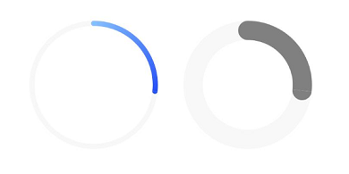
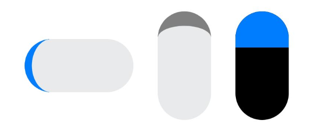
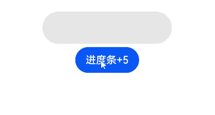

# Progress Indicator (Progress)


The **Progress** component is used to provide an indicator that shows the progress of an operation. For details, see [Progress](../reference/apis-arkui/arkui-ts/ts-basic-components-progress.md).


## Creating a Progress Indicator

You can create a progress indicator by calling the following API:

```ts
Progress(options: {value: number, total?: number, type?: ProgressType})
```


In this API, **value** indicates the initial progress, **total** indicates the total progress, and **type** indicates the style of the progress indicator.

```ts
Progress({ value: 24, total: 100, type: ProgressType.Linear }) // Create a linear progress indicator whose total progress is 100 and initial progress is 24.
```


## Setting the Progress Indicator Style

Progress indicators come in five styles. When creating a progress indicator, you can specify its style by setting the **ProgressType** parameter to any of the following: **ProgressType.Linear** (linear style), **ProgressType.Ring** (indeterminate ring style), **ProgressType.ScaleRing** (determinate ring style), **ProgressType.Eclipse** (eclipse style), and **ProgressType.Capsule** (capsule style).


- Linear style (default style)

  >**NOTE**
  >
  > Since API version 9, the progress indicator adaptively switches to the vertical layout if its height is greater than the width and remains the horizontal layout if the height is equal to the width.


  ```ts
  Progress({ value: 20, total: 100, type: ProgressType.Linear }).width(200).height(50)
  Progress({ value: 20, total: 100, type: ProgressType.Linear }).width(50).height(200)
  ```

  

- Indeterminate ring style

  ```ts
  // The progress indicator in the indeterminate ring style on the left: Retain its default settings for the foreground color (blue gradient) and stroke width (2.0 vp).
  Progress({ value: 40, total: 150, type: ProgressType.Ring }).width(100).height(100)
  // The right progress indicator in the indeterminate ring style on the right.
  Progress({ value: 40, total: 150, type: ProgressType.Ring }).width(100).height(100)
      .color(Color.Grey)	// Set the foreground color to gray.
      .style({ strokeWidth: 15})	// Set the stroke width to 15.0 vp.
  ```

  

- Determinate ring style

  ```ts
  Progress({ value: 20, total: 150, type: ProgressType.ScaleRing }).width(100).height(100)
      .backgroundColor(Color.Black)
      .style({ scaleCount: 20, scaleWidth: 5 })	// Set the total number of scales to 20 and the scale width to 5 vp.
  Progress({ value: 20, total: 150, type: ProgressType.ScaleRing }).width(100).height(100)
      .backgroundColor(Color.Black)
      .style({ strokeWidth: 15, scaleCount: 20, scaleWidth: 5 })	// Set the stroke width to 15, the total number of scales to 20, and the scale width to 5 vp.
  Progress({ value: 20, total: 150, type: ProgressType.ScaleRing }).width(100).height(100)
      .backgroundColor(Color.Black)
      .style({ strokeWidth: 15, scaleCount: 20, scaleWidth: 3 })	// Set the stroke width to 15, the total number of scales to 20, and the scale width to 3 vp.
  ```

  

- Eclipse style

  ```ts
  // The progress indicator in the eclipse style on the left: Retain its default settings for the foreground color (blue).
  Progress({ value: 10, total: 150, type: ProgressType.Eclipse }).width(100).height(100)
  // The progress indicator in the eclipse style on the right: Set its foreground color to gray.
  Progress({ value: 20, total: 150, type: ProgressType.Eclipse }).color(Color.Grey).width(100).height(100)
  ```

  

- Capsule style
  >**NOTE**
  >
  >-  At both ends, the progress indicator in the capsule style works in a same manner as that in the eclipse style.
  >-  In the middle part of the capsule, the progress indicator works in a same manner as the linear style.
  >
  >-  If the height is greater than the width, the progress indicator adaptively switches to the vertical layout.


  ```ts
  Progress({ value: 10, total: 150, type: ProgressType.Capsule }).width(100).height(50)
  Progress({ value: 20, total: 150, type: ProgressType.Capsule }).width(50).height(100).color(Color.Grey)
  Progress({ value: 50, total: 150, type: ProgressType.Capsule }).width(50).height(100).color(Color.Blue).backgroundColor(Color.Black)
  ```

  


## Example Scenario

In this example, the progress of the **Progress** component is updated by clicking the button. After the button is clicked, the value of **progressValue** is incremented and passed by the **value** attribute to the **Progress** component, which is then updated accordingly.

```ts
@Entry
@Component
struct ProgressCase1 { 
  @State progressValue: number = 0	// Set the initial progress of the progress indicator to 0.
  build() {
    Column() {
      Column() {
        Progress({value:0, total:100, type:ProgressType.Capsule}).width(200).height(50).value(this.progressValue)
        Row().width('100%').height(5)
        Button ("Progress + 5")
          .onClick(()=>{
            this.progressValue += 5
            if (this.progressValue > 100){
              this.progressValue = 0
            }
          })
      }
    }.width('100%').height('100%')
  }
}
```



