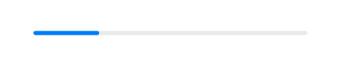
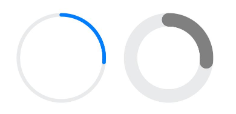
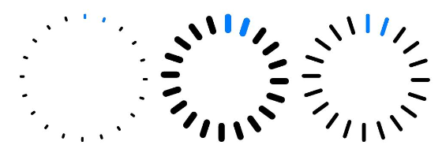
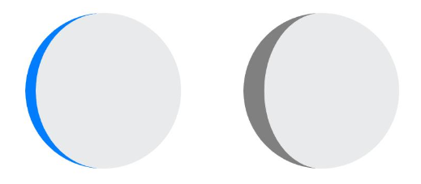
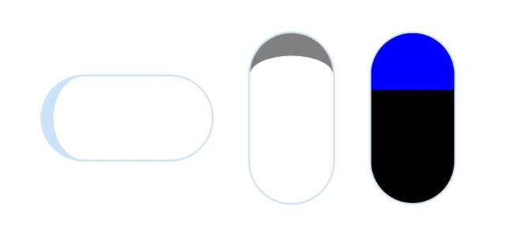
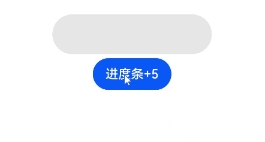

# Progress Indicator (Progress)

<!--Kit: ArkUI-->
<!--Subsystem: ArkUI-->
<!--Owner: @Zhang-Dong-hui-->
<!--Designer: @xiangyuan6-->
<!--Tester: @jiaoaozihao-->
<!--Adviser: @Brilliantry_Rui-->
<!-- md-trans-meta sourceCommit=58aa1a9b8318e579a2b513b7ba023ee57b8ecdda translatedAt=2026-07-29T12:44:17.877Z pushedAt=2026-07-31T01:39:29.139Z -->

The **Progress** component is used to provide an indicator that shows the progress of an operation. For details, see [Progress](../reference/apis-arkui/arkui-ts/ts-basic-components-progress.md).

## Creating a Progress Indicator

Progress is created by calling an API. The API call method is as follows:

```ts
Progress(options: {value: number, total?: number, type?: ProgressType})
```

In the API, **value** is used to set the current progress value, **total** is used to set the total progress length, and **type** is used to set the Progress style.

```ts
Progress({ value: 24, total: 100, type: ProgressType.Linear }) // Create a linear progress indicator with a total progress of 100 and a current progress value of 24.
```



## Setting the Progress Indicator Style

Progress provides five types. You can set the progress indicator style through [ProgressType](../reference/apis-arkui/arkui-ts/ts-basic-components-progress.md#progresstype8). The ProgressType types include: ProgressType.Linear (linear style), ProgressType.Ring (ring style without scale), ProgressType.ScaleRing (ring style with scale), ProgressType.Eclipse (circular style), and ProgressType.Capsule (capsule style).

- Linear style progress indicator (default type)

  > **NOTE**
  >
  > Since API version 9, when the component height is greater than its width, the progress indicator is displayed vertically in an adaptive manner. When the component height equals its width, it remains displayed horizontally.

  <!-- @[progress_style_1](https://gitcode.com/openharmony/applications_app_samples/blob/master/code/DocsSample/ArkUISample/InfoComponent/ProgressProject/entry/src/main/ets/pages/Index.ets) -->

  ``` TypeScript
  Progress({ value: 20, total: 100, type: ProgressType.Linear }).width(200).height(50)
  Progress({ value: 20, total: 100, type: ProgressType.Linear }).width(50).height(200)
  ```

  

- Ring-style progress indicator without scale marks

  <!-- @[progress_style_2](https://gitcode.com/openharmony/applications_app_samples/blob/master/code/DocsSample/ArkUISample/InfoComponent/ProgressProject/entry/src/main/ets/pages/Index.ets) -->

  ``` TypeScript
  // From left to right, ring progress indicator No. 1: the default foreground color is a blue gradient, and the default strokeWidth is 4.0 vp.
  Progress({ value: 40, total: 150, type: ProgressType.Ring }).width(100).height(100)
  // From left to right, ring progress indicator No. 2.
  Progress({ value: 40, total: 150, type: ProgressType.Ring }).width(100).height(100)
    .color(Color.Grey)    // The progress indicator foreground color is gray.
    .style({ strokeWidth: 15})    // Set the strokeWidth to 15.0 vp.
  ```

  

- Ring progress indicator with scale style

  <!-- @[progress_style_3](https://gitcode.com/openharmony/applications_app_samples/blob/master/code/DocsSample/ArkUISample/InfoComponent/ProgressProject/entry/src/main/ets/pages/Index.ets) -->

  ``` TypeScript
  Progress({ value: 20, total: 150, type: ProgressType.ScaleRing }).width(100).height(100)
    .backgroundColor(Color.Black)
    .style({ scaleCount: 20, scaleWidth: 5 })    // Set the total scale count of the ring progress bar with scale style to 20 and the scale width to 5 vp.
  Progress({ value: 20, total: 150, type: ProgressType.ScaleRing }).width(100).height(100)
    .backgroundColor(Color.Black)
    .style({ strokeWidth: 15, scaleCount: 20, scaleWidth: 5 })    // Set the ring progress bar with scale style to a width of 15, a total scale count of 20, and a scale width of 5 vp.
  Progress({ value: 20, total: 150, type: ProgressType.ScaleRing }).width(100).height(100)
    .backgroundColor(Color.Black)
    .style({ strokeWidth: 15, scaleCount: 20, scaleWidth: 3 })    // Set the ring progress bar with scale style to a width of 15, a total scale count of 20, and a scale width of 3 vp.
  ```

  

- Circular style progress indicator

  <!-- @[progress_style_4](https://gitcode.com/openharmony/applications_app_samples/blob/master/code/DocsSample/ArkUISample/InfoComponent/ProgressProject/entry/src/main/ets/pages/Index.ets) -->

  ``` TypeScript
  // From left to right, circular progress indicator No. 1, with the default foreground color blue.
  Progress({ value: 10, total: 150, type: ProgressType.Eclipse }).width(100).height(100)
  // From left to right, circular progress indicator No. 2, with the foreground color set to gray.
  Progress({ value: 20, total: 150, type: ProgressType.Eclipse }).color(Color.Grey).width(100).height(100)
  ```

  

- Capsule style progress indicator

  > **NOTE**
  >
  > - The progress display at the rounded ends is consistent with the ProgressType.Eclipse style.
  > - The progress display in the middle section is a rectangular indicator, similar to the ProgressType.Linear style.
  >
  > - When the component height is greater than the width, it automatically adapts to vertical display.

    <!-- @[progress_style_5](https://gitcode.com/openharmony/applications_app_samples/blob/master/code/DocsSample/ArkUISample/InfoComponent/ProgressProject/entry/src/main/ets/pages/Index.ets) -->

    ``` TypeScript
    Progress({ value: 10, total: 150, type: ProgressType.Capsule }).width(100).height(50)
    Progress({ value: 20, total: 150, type: ProgressType.Capsule }).width(50).height(100).color(Color.Grey)
    Progress({ value: 50, total: 150, type: ProgressType.Capsule }).width(50).height(100).color(Color.Blue).backgroundColor(Color.Black)
    ```

  

## Example

To update the current progress value, for example, in an app installation progress indicator, you can tap the **Button** to increase progressValue. The value attribute assigns progressValue to the `Progress` component, which then triggers a refresh and updates the current progress.

<!-- @[progress_example](https://gitcode.com/openharmony/applications_app_samples/blob/master/code/DocsSample/ArkUISample/InfoComponent/ProgressProject/entry/src/main/ets/pages/ProgressCase1.ets) -->

``` TypeScript
@Entry
@Component
struct ProgressCase1 {
  @State progressValue: number = 0;    // Set the initial value of the progress indicator to 0.
  build() {
    Column() {
      Column() {
        Progress({value:0, total:100, type:ProgressType.Capsule}).width(200).height(50).value(this.progressValue)
        Row().width('100%').height(5)
        // Replace $r('app.string.progress_add') with the actual resource file. In this sample, the value of the resource file is "progress indicator+5".
        Button($r('app.string.progress_add'))
          .onClick(()=>{
            this.progressValue += 5;
            if (this.progressValue > 100){
              this.progressValue = 0;
            }
          })
      }
    }.width('100%').height('100%')
  }
}
```



## Samples

The following related samples are available for progress indicator development:

- [Progress Indicator](https://gitcode.com/openharmony/applications_app_samples/tree/master/code/DocsSample/ArkUISample/InfoComponent/ProgressProject)