# Rich Text (RichEditor)
**RichEditor** is a component that supports interactive text editing and mixture of text and images. It is typically used in scenarios where mixed-content user input is expected, such as comment sections that accept both image and text submissions. For details, see [RichEditor](../reference/apis-arkui/arkui-ts/ts-basic-components-richeditor.md).

## Creating a RichEditor Component
You can create a **RichEditor** component with or without a styled string.

### Creating a RichEditor Component Without a Styled String
Use the **RichEditor(value: [RichEditorOptions](../reference/apis-arkui/arkui-ts/ts-basic-components-richeditor.md#richeditoroptions))** API to generate a **RichEditor** component from scratch. This approach is typically employed when you wish to present straightforward text and image content, for example, contact details. It can also serve in instances where a consistent content format is desired, such as in certain code editors.

```ts
controller: RichEditorController = new RichEditorController();
options: RichEditorOptions = { controller: this.controller };

RichEditor(this.options)
    .onReady(() => {
        this.controller.addTextSpan('Create a RichEditor component without using a styled string.', {
            style: {
                fontColor: Color.Black,
                fontSize: 15
            }
        })
    })
```
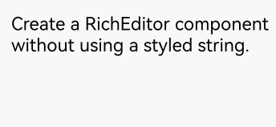

### Creating a RichEditor Component with a Styled String
Alternatively, you can use the **RichEditor(options: [RichEditorStyledStringOptions](../reference/apis-arkui/arkui-ts/ts-basic-components-richeditor.md#richeditorstyledstringoptions12))** API to create a **RichEditor** component that is based on a styled string. This approach is particularly useful when you aim to enhance the GUI's aesthetics and emphasize the content,

because it allows for a variety of text formatting options, including changing font size, adding font colors, making text interactive, and custom text rendering. In addition, this approach offers an array of style objects that cover a range of common text formatting styles, such as text with decorative lines, line height, and shadow effects.

```ts
mutableStyledString: MutableStyledString = new MutableStyledString("Create a RichEditor component using a styled string.",
    [{
        start: 0,
        length: 5,
        styledKey: StyledStringKey.FONT,
        styledValue: this.fontStyle
    }]);

controller: RichEditorStyledStringController = new RichEditorStyledStringController();
options: RichEditorStyledStringOptions = {controller: this.controller};

RichEditor(this.options)
    .onReady(() => {
        this.controller.setStyledString(this.mutableStyledString);
    })
```
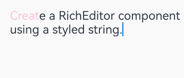

## Setting Attributes

### Setting the Custom Context Menu on Text Selection
You can set a custom context menu on text selection using the [bindSelectionMenu](../reference/apis-arkui/arkui-ts/ts-basic-components-richeditor.md#bindselectionmenu) API.

By default, the context menu on text selection includes the copy, cut, and select all options. You can offer additional options for enhanced interactions, for example, a translate option for multilingual support or a bold option for emphasizing selected text.

If the custom menu is too long, consider embedding a **Scroll** component to prevent the keyboard from being blocked.

```ts
RichEditor(this.options)
    .onReady(() => {
        this.controller.addTextSpan('The component has a custom menu that can be triggered by a long press.', {
            style: {
                fontColor: Color.Black,
                fontSize: 18
            }
        })
    })
    .bindSelectionMenu(RichEditorSpanType.TEXT, this.SystemMenu, ResponseType.LongPress, {
        onDisappear: () => {
            this.sliderShow = false
        }
    })
    .width(300)
    .height(300)

@Builder
SystemMenu() {
    Column() {
            Menu() {
                    if (this.controller) {
                        MenuItemGroup() {
                            MenuItem({
                                startIcon: this.theme.cutIcon,
                                content: "Cut",
                                labelInfo: "Ctrl+X",
                            })
                            MenuItem({
                                startIcon: this.theme.copyIcon,
                                content: "Copy",
                                labelInfo: "Ctrl+C"
                            })
                            MenuItem({
                                startIcon: this.theme.pasteIcon,
                                content: "Paste",
                                labelInfo: "Ctrl+V"
                            })
                        }
                    }
                }
                .radius(this.theme.containerBorderRadius)
                .clip(true)
                .backgroundColor(Color.White)
                .width(this.theme.defaultMenuWidth)
        }
        .width(this.theme.defaultMenuWidth)
}
```

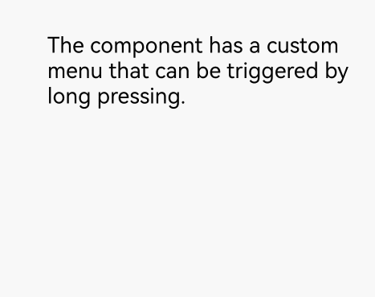

### Setting Caret and Selection Handle Colors in the Text Box
You can set the caret and selection handle colors in the text box using the [caretColor](../reference/apis-arkui/arkui-ts/ts-basic-components-richeditor.md#caretcolor12) API.

This feature allows for a more distinct visual representation of the caret and text selection, which can significantly aid users in navigating through complex UI that incorporate various input fields. It can also be particularly beneficial for text boxes that signify special features or states, such as a password text area.

```ts
RichEditor(this.options)
    .onReady(() => {
        this.controller.addTextSpan('The component has the color set for the caret and selection handle.', {
            style: {
                fontColor: Color.Black,
                fontSize: 15
            }
        })
    })
    .caretColor(Color.Orange)
    .width(300)
    .height(300)
```

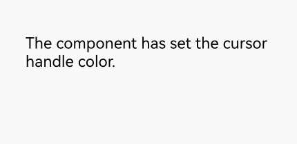

### Setting Placeholder Text
You can set the placeholder text, which is displayed when there is no input, using the [placeholder](../reference/apis-arkui/arkui-ts/ts-basic-components-richeditor.md#placeholder12) API.

Placeholder text serves as a useful cue, assisting users in navigating through your application's UI, particularly in scenarios where text areas require specific attention or instructions, such as a login screen, or a text editing box with a character limit.

```ts
RichEditor(this.options)
    .placeholder("Enter your content here", {
        fontColor: Color.Gray,
        font: {
            size: 15,
            weight: FontWeight.Normal,
            family: "HarmonyOS Sans",
            style: FontStyle.Normal
        }
    })
    .width(300)
    .height(300)
```

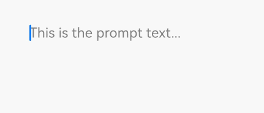

For details about all available attributes, see [RichEditor Attributes](../reference/apis-arkui/arkui-ts/ts-basic-components-richeditor.md#attributes).

## Adding Events

### Adding a Callback for Component Initialization
Use the [onReady](../reference/apis-arkui/arkui-ts/ts-basic-components-richeditor.md#onready) API to add a callback that is invoked after the component has been initialized.

This callback can be used to effectively display rich content including images, texts, and emoticons after the component is initialized. When the **RichEditor** component is used to display news, this callback can initiate the process of obtaining image and text data from the server. The obtained data is then populated into the component, ensuring that the complete news content is promptly displayed on the page after initialization.

```ts
RichEditor(this.options)
    .onReady(() => {
        this.controller.addTextSpan('The onReady callback content is preset text within the component.', {
            style: {
                fontColor: Color.Black,
                fontSize: 15
            }
        })
    })
```

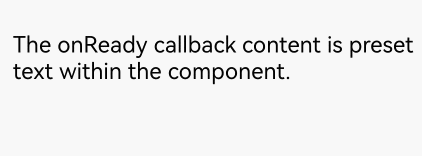

### Adding a Callback for Content Selection
Use the [onSelect](../reference/apis-arkui/arkui-ts/ts-basic-components-richeditor.md#onselect) API to add a callback that is invoked when content within the component is selected.

This callback can be used to enhance the user experience following text selection For example, it can be used to trigger a context menu, allowing users to modify text styles, or to perform content analysis and processing on the selected text, providing input suggestions and thereby improving the efficiency and convenience of text editing.

The callback can be triggered in two ways: by pressing and releasing the left mouse button to select content, or by selecting content with a finger touch and releasing the finger.

```ts
RichEditor(this.options)
    .onReady(() => {
        this.controller.addTextSpan('Select this text to invoke the onSelect callback.', {
            style: {
                fontColor: Color.Black,
                fontSize: 15
            }
        })
    })
    .onSelect((value: RichEditorSelection) => {
        this.controller1.addTextSpan(JSON.stringify(value), {
            style: {
                fontColor: Color.Gray,
                fontSize: 10
            }
        })
    })
    .width(300)
    .height(50)
Text('View callback content:').fontSize(10).fontColor(Color.Gray).width(300)
RichEditor(this.options1)
    .width(300)
    .height(70)
```


### Adding Callbacks for Before and After Text and Image Changes
Use the [onWillChange](../reference/apis-arkui/arkui-ts/ts-basic-components-richeditor.md#onwillchange12) API to add a callback invoked before text or image changes. This callback is applicable to real-time data verification and notification. For example, it can be used to enable features such as detecting sensitive words and displaying an alert dialog box immediately, as well as real-time character count statistics and limitation.

Use the [onDidChange](../reference/apis-arkui/arkui-ts/ts-basic-components-richeditor.md#ondidchange12) API to add a callback invoked after text or image changes. This callback applies to content saving and synchronization. For example, it can be used to automatically save the latest content to the local host or synchronizing it to the server, and for updating content status and rendering.

Note that the **RichEditor** component constructed with [RichEditorStyledStringOptions](../reference/apis-arkui/arkui-ts/ts-basic-components-richeditor.md#richeditorstyledstringoptions12) does not support these two types of callbacks.

```ts
RichEditor(this.options)
    .onReady(() => {
        this.controller.addTextSpan('The callback is invoked before the text or image change.\nThe callback is invoked after the text or image change.', {
            style: {
                fontColor: Color.Black,
                fontSize: 15
            }
        })
    })
    .onWillChange((value: RichEditorChangeValue) => {
        this.controller1.addTextSpan('The callback is invoked before the text or image change: \n' + JSON.stringify(value), {
            style: {
                fontColor: Color.Gray,
                fontSize: 10
            }
        })
        return true;
    })
    .onDidChange((rangeBefore: TextRange, rangeAfter: TextRange) => {
        this.controller1.addTextSpan('\nThe callback is invoked after the text or image change: \nrangeBefore: ' + JSON.stringify(rangeBefore) + '\nrangeAfter: ' + JSON.stringify(rangeBefore), {
            style: {
                fontColor: Color.Gray,
                fontSize: 10
            }
        })
        return true;
    })
    .width(300)
    .height(50)
Text('View callback content:').fontSize(10).fontColor(Color.Gray).width(300)
RichEditor(this.options1)
    .width(300)
    .height(70)
```

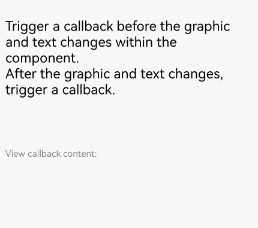

### Adding Callbacks for Before and After Content Input in the Input Method
To facilitate intelligent input assistance, use [aboutToIMEInput](../reference/apis-arkui/arkui-ts/ts-basic-components-richeditor.md#abouttoimeinput) to trigger a callback before adding input content, and [onIMEInputComplete](../reference/apis-arkui/arkui-ts/ts-basic-components-richeditor.md#onimeinputcomplete) to trigger a callback after the input is complete.

These callbacks can be used to provide text prediction before user input and to perform automatic error correction or format conversion after input completion.

Note that the **RichEditor** component constructed with [RichEditorStyledStringOptions](../reference/apis-arkui/arkui-ts/ts-basic-components-richeditor.md#richeditorstyledstringoptions12) does not support these two types of callbacks.

```ts
RichEditor(this.options)
          .onReady(() => {
            this.controller.addTextSpan('The callback is invoked before content input in the input method.\nThe callback is invoked when text input in the input method is complete.' , {
              style: {
                fontColor: Color.Black,
                fontSize: 15
              }
            })
          })
          .aboutToIMEInput((value: RichEditorInsertValue) => {
            this.controller1.addTextSpan('The callback is invoked before content input in the input method: \n'+JSON.stringify(value), {
              style: {
                fontColor: Color.Gray,
                fontSize: 10
              }
            })
            return true;
          })
          .onIMEInputComplete((value: RichEditorTextSpanResult) => {
            this.controller1.addTextSpan('The callback is invoked when text input in the input method is complete: \n'+ JSON.stringify(value), {
              style: {
                fontColor: Color.Gray,
                fontSize: 10
              }
            })
            return true;
          })
          .width(300)
          .height(50)
Text('View callback content:').fontSize(10).fontColor(Color.Gray).width(300)
RichEditor(this.options1)
    .width(300)
    .height(70)
```

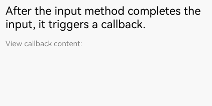

### Adding a Callback for Before Paste Completion
Use the [onPaste](../reference/apis-arkui/arkui-ts/ts-basic-components-richeditor.md#onpaste11) API to add a callback invoked when the paste is about to be completed.

This is useful for content format processing, such as converting text containing HTML tags to a format supported by the **RichEditor** component and removing unnecessary tags or retaining only plain text content.

You can use this API to override the default pasting behavior, which is limited to plain text, so that both images and text can be pasted.

```ts
RichEditor(this.options)
    .onReady(() => {
        this.controller.addTextSpan('Copy and paste operations on this text trigger the corresponding callbacks.', {
            style: {
                fontColor: Color.Black,
                fontSize: 15
            }
        })
    })
    .onPaste(() => {
        this.controller1.addTextSpan('The onPaste callback is invoked.\n', {
            style: {
                fontColor: Color.Gray,
                fontSize: 10
            }
        })
    })
    .width(300)
    .height(70)
```

### Adding a Callback for Before Cut Completion
Use the [onCut](../reference/apis-arkui/arkui-ts/ts-basic-components-richeditor.md#oncut12) API to add a callback invoked when text is about to be cut.

This can be used to temporarily store the cut content, ensuring accurate restoration in subsequent pasting operations.

You can use this API to override the default cutting behavior, which is limited to plain text, so that both images and text can be cut.

```ts
RichEditor(this.options)
    .onReady(() => {
        this.controller.addTextSpan('Copy and paste operations on this text trigger the corresponding callbacks.', {
            style: {
                fontColor: Color.Black,
                fontSize: 15
            }
        })
    })
    .onCut(() => {
        this.controller1.addTextSpan('The onCut callback is invoked.\n', {
            style: {
                fontColor: Color.Gray,
                fontSize: 10
            }
        })
    })
    .width(300)
    .height(70)
```

### Adding a Callback for Before Copy Completion
Use the [onCopy](../reference/apis-arkui/arkui-ts/ts-basic-components-richeditor.md#oncopy12) API to add a callback invoked when text is about to be copied.

This callback applies to content backup and sharing. For example, the following operations can be performed in the callback: saving the copied content and its format information to a local backup folder, or automatically generating copywriting that includes the copied content and a product purchase link for users to paste and share.

You can use this API to override the default copying behavior, which is limited to plain text, so that both images and text can be copied.

```ts
RichEditor(this.options)
    .onReady(() => {
        this.controller.addTextSpan('Copy and paste operations on this text trigger the corresponding callbacks.', {
            style: {
                fontColor: Color.Black,
                fontSize: 15
            }
        })
    })
    .onCopy(() => {
        this.controller1.addTextSpan('The onCopy callback is invoked.\n', {
            style: {
                fontColor: Color.Gray,
                fontSize: 10
            }
        })
    })
    .width(300)
    .height(70)
```

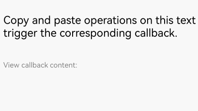


For details about all available events, see [RichEditor Events](../reference/apis-arkui/arkui-ts/ts-basic-components-richeditor.md#events).

## Setting the Typing Style
Use the [setTypingStyle](../reference/apis-arkui/arkui-ts/ts-basic-components-richeditor.md#settypingstyle11) API to set the typing style.

This allows you to deliver a personalized writing experience. For example, you might want to use this API to automatically apply corresponding formats to different levels of headings (such as level-1 and level-2 headings) as users type.

```ts
RichEditor(this.options)
    .onReady(() => {
        this.controller.addTextSpan('Click the button to change the preset typing style.', {
            style: {
                fontColor: Color.Black,
                fontSize: 15
            }
        })
    })
    .width(300)
    .height(60)
Button('setTypingStyle', {
        buttonStyle: ButtonStyleMode.NORMAL
    })
    .height(30)
    .fontSize(13)
    .onClick(() => {
        this.controller.setTypingStyle({
            fontWeight: 'medium',
            fontColor: Color.Pink,
            fontSize: 15,
            fontStyle: FontStyle.Italic,
            decoration: {
                type: TextDecorationType.Underline,
                color: Color.Gray
            }
        })
    })
```

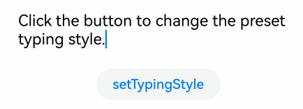

## Setting Highlight for Selected Content
Use the [setSelection](../reference/apis-arkui/arkui-ts/ts-basic-components-richeditor.md#setselection11) API to configure the component to highlight the background of the selected portion.

This API enables the implementation of text focus effects. For example, clicking a title or abstract can trigger the automatic selection and highlighting of the corresponding text content.

If this API is called when the text box is not focused, the selection effect is not displayed.

```ts
RichEditor(this.options)
    .onReady(() => {
        this.controller.addTextSpan('Click the button to select the text at positions 0 to 2 here.', {
            style: {
                fontColor: Color.Black,
                fontSize: 15
            }
        })
    })
    .width(300)
    .height(60)
Button('setSelection(0,2)', {
        buttonStyle: ButtonStyleMode.NORMAL
    })
    .height(30)
    .fontSize(13)
    .onClick(() => {
        this.controller.setSelection(0, 2)
    })
```

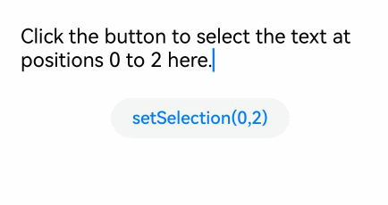

## Adding a Text Span
In addition to directly entering content into the component, you can add a text span using the [addTextSpan](../reference/apis-arkui/arkui-ts/ts-basic-components-richeditor.md#addtextspan) API.

This API offers a way to diversify text styles. For example, you can use it to create mixed text styles.

When the component is focused and the cursor is blinking, adding text content through **addTextSpan** updates the cursor position to the right of the newly added text.

```ts
RichEditor(this.options)
    .onReady(() => {
        this.controller.addTextSpan('Click the button to add text here.', {
            style: {
                fontColor: Color.Black,
                fontSize: 15
            }
        })
    })
    .width(300)
    .height(100)
Button('addTextSpan', {
        buttonStyle: ButtonStyleMode.NORMAL
    })
    .height(30)
    .fontSize(13)
    .onClick(() => {
        this.controller.addTextSpan('Add text.')
    })
```

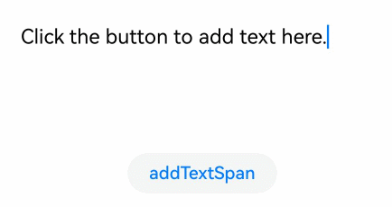

## Adding an Image Span
Use the [addImageSpan](../reference/apis-arkui/arkui-ts/ts-basic-components-richeditor.md#addimagespan) API to add an image span.

This API is useful in enriching and visualizing content. For example, you can use it to add images to news or data visualization graphics to documents.

When the component is focused and the cursor is blinking, adding image content through **addImageSpan** updates the cursor position to the right of the newly added image.

```ts
RichEditor(this.options)
    .onReady(() => {
        this.controller.addTextSpan('Click the button to add an image here.', {
            style: {
                fontColor: Color.Black,
                fontSize: 15
            }
        })
    })
    .width(300)
    .height(100)
Button('addImageSpan', {
        buttonStyle: ButtonStyleMode.NORMAL
    })
    .height(30)
    .fontSize(13)
    .onClick(() => {
        this.controller.addImageSpan($r("app.media.startIcon"), {
            imageStyle: {
                size: ["57px", "57px"]
            }
        })
    })
```

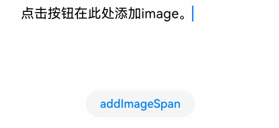

## Adding @Builder Decorated Content
Use [addBuilderSpan](../reference/apis-arkui/arkui-ts/ts-basic-components-richeditor.md#addbuilderspan11) to add the content decorated by the @Builder decorator.

This approach applies when you need to integrate customized complex components, such as custom charts.

With this API, you can specify the addition position using [RichEditorBuilderSpanOptions](../reference/apis-arkui/arkui-ts/ts-basic-components-richeditor.md#richeditorbuilderspanoptions11). If no position is specified or an abnormal value is provided, the builder is appended to the end of all content.

```ts
@Builder
TextBuilder() {
    Row() {
            Image($r('app.media.startIcon')).width(50).height(50).margin(16)
            Column() {
                Text("Text.txt").fontWeight(FontWeight.Bold).fontSize(16)
                Text("123.45KB").fontColor('#8a8a8a').fontSize(12)
            }.alignItems(HorizontalAlign.Start)
        }.backgroundColor('#f4f4f4')
        .borderRadius("20")
        .width(220)
}

Button('addBuilderSpan', {
        buttonStyle: ButtonStyleMode.NORMAL
    })
    .height(30)
    .fontSize(13)
    .onClick(() => {
        this.my_builder = () => {
            this.TextBuilder()
        }
        this.controller.addBuilderSpan(this.my_builder)
    })
```
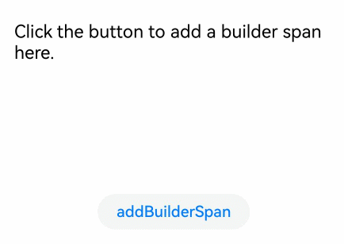   

## Adding a Symbol Span
Use the [addSymbolSpan](../reference/apis-arkui/arkui-ts/ts-basic-components-richeditor.md#addsymbolspan11) API to add symbol content. This API enables the addition and display of special characters, such as mathematical symbols in academic papers.

When the component is focused and the cursor is blinking, adding symbol content through **addSymbolSpan** updates the cursor position to the right of the newly added symbol.
Currently, gestures, copying, and dragging are not supported for the symbol content.

```ts
RichEditor(this.options)
    .onReady(() => {
        this.controller.addTextSpan('Click the button to add a symbol here.', {
            style: {
                fontColor: Color.Black,
                fontSize: 15
            }
        })
    })
    .width(300)
    .height(100)
Button('addSymbolSpan', {
        buttonStyle: ButtonStyleMode.NORMAL
    })
    .height(30)
    .fontSize(13)
    .onClick(() => {
        this.controller.addSymbolSpan($r("sys.symbol.basketball_fill"), {
            style: {
                fontSize: 30
            }
        })
    })
```
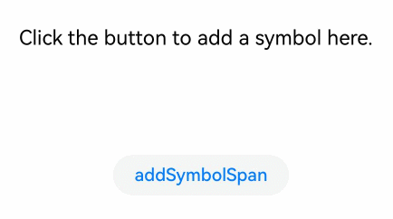

## Obtaining the Image and Text Information in a Component
Use the [getSpans](../reference/apis-arkui/arkui-ts/ts-basic-components-richeditor.md#getspans) API to obtain information about all images and text in the component, including content, ID, style, and position. After obtaining the position information, you can update the style of the content in the specified range.

This API is useful for obtaining and checking existing content styles, such as in template use cases, and for content parsing and processing, such as in text analysis applications.

```ts
RichEditor(this.options)
    .onReady(() => {
        this.controller.addTextSpan('Click the button to obtain the span information.', {
            style: {
                fontColor: Color.Black,
                fontSize: 15
            }
        })
    })
    .width(300)
    .height(50)
Text('View the return value of getSpans: ').fontSize(10).fontColor(Color.Gray).width(300)
RichEditor(this.options1)
    .width(300)
    .height(50)
Button('getSpans', {
        buttonStyle: ButtonStyleMode.NORMAL
    })
    .height(30)
    .fontSize(13)
    .onClick(() => {
        this.controller1.addTextSpan(JSON.stringify(this.controller.getSpans()), {
            style: {
                fontColor: Color.Gray,
                fontSize: 10
            }
        })

    })
```

<!--RP1--><!--RP1End-->
