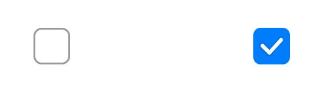
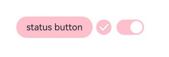
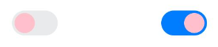

# Toggle


The **Toggle** component provides a clickable element in the check box, button, or switch type, typically used to switch between two states. For details, see [Toggle](../reference/apis-arkui/arkui-ts/ts-basic-components-toggle.md).


## Creating a Toggle

You can create a toggle by calling the following API:

```ts
Toggle(options: { type: ToggleType, isOn?: boolean })
```

In this API, **ToggleType** indicates the toggle type, which can be **Button**, **Checkbox**, or **Switch**, and **isOn** specifies whether the toggle is turned on.

Since API version 11, the default style of the **\<Checkbox>** component is changed from rounded square to circle.

The API can be called in either of the following ways:


- Create a toggle that does not contain child components.
  This can be achieved by calling the API with **ToggleType** set to **Checkbox** or **Switch**.
  
  
    ```ts
  Toggle({ type: ToggleType.Checkbox, isOn: false })
  Toggle({ type: ToggleType.Checkbox, isOn: true })
    ```

  
  
  ```ts
  Toggle({ type: ToggleType.Switch, isOn: false })
  Toggle({ type: ToggleType.Switch, isOn: true })
  ```
  
    
  
- Create a toggle that contains a child component.
  When **ToggleType** is set to **Button**, only one child component is allowed. If the child component has text set, the text content is displayed on the button.

  ```ts
  Toggle({ type: ToggleType.Button, isOn: false }) {
    Text('status button')
      .fontColor('#182431')
      .fontSize(12)
  }.width(100)
  Toggle({ type: ToggleType.Button, isOn: true }) {
    Text('status button')
      .fontColor('#182431')
      .fontSize(12)
  }.width(100)
  ```

    


## Setting Styles

- Use the **selectedColor** attribute to set the background color of the toggle for when it is turned on.

  ```ts
  Toggle({ type: ToggleType.Button, isOn: true }) {
    Text('status button')
    .fontColor('#182431')
    .fontSize(12)
  }.width(100).selectedColor(Color.Pink)
  Toggle({ type: ToggleType.Checkbox, isOn: true })
    .selectedColor(Color.Pink)
  Toggle({ type: ToggleType.Switch, isOn: true })
    .selectedColor(Color.Pink)
  ```

  

- Use the **switchPointColor** attribute to set the color of the circular slider. This attribute is valid only when **type** of the toggle is set to **ToggleType.Switch**.

  ```ts
  Toggle({ type: ToggleType.Switch, isOn: false })
    .switchPointColor(Color.Pink)
  Toggle({ type: ToggleType.Switch, isOn: true })
    .switchPointColor(Color.Pink)
  ```

  


## Adding Events

The **Toggle** component supports the [universal events](../reference/apis-arkui/arkui-ts/ts-universal-events-click.md). In addition, it can be bound to the **onChange** event so that it responds with custom behavior after being turned on or off.


```ts
Toggle({ type: ToggleType.Switch, isOn: false })
  .onChange((isOn: boolean) => {
      if(isOn) {
        // Operation
      }
  })
```


## Example Scenario

In this example, the **Toggle** component is used to enable or disable Bluetooth.

```ts
// xxx.ets
import { promptAction } from '@kit.ArkUI';
@Entry
@Component
struct ToggleExample {
  @State BOnSt:promptAction.ShowToastOptions = {'message': 'Bluetooth is on.'}
  @State BOffSt:promptAction.ShowToastOptions = {'message': 'Bluetooth is off.'}
  build() {
    Column() {
      Row() {
        Text("Bluetooth Mode")
          .height(50)
          .fontSize(16)
      }
      Row() {
        Text("Bluetooth")
          .height(50)
          .padding({left: 10})
          .fontSize(16)
          .textAlign(TextAlign.Start)
          .backgroundColor(0xFFFFFF)
        Toggle({ type: ToggleType.Switch })
          .margin({left: 200, right: 10})
          .onChange((isOn: boolean) => {
            if(isOn) {
              promptAction.showToast(this.BOnSt)
            } else {
              promptAction.showToast(this.BOffSt)
            }
          })
      }
      .backgroundColor(0xFFFFFF)
    }
    .padding(10)
    .backgroundColor(0xDCDCDC)
    .width('100%')
    .height('100%')
  }
}
```


