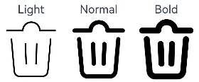
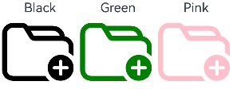
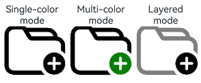
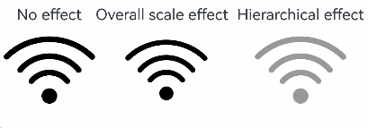
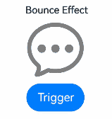
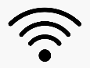
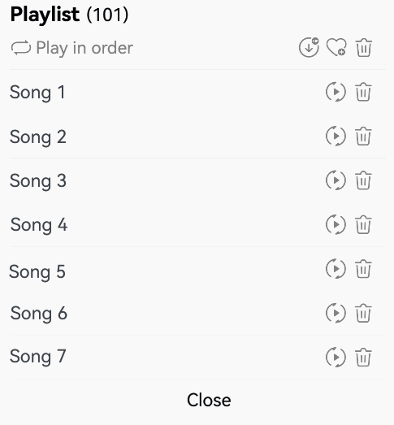

# Symbol Glyph (SymbolGlyph/SymbolSpan)

**SymbolGlyph** is a component designed for icon glyphs, making it easy to use sophisticated icons, including multi-colored icons. For details, see [SymbolGlyph](../reference/apis-arkui/arkui-ts/ts-basic-components-symbolGlyph.md).


## Creating a Symbol Glyph

Create a symbol glyph by referencing a **Resource** asset, which is instantiated as a **Resource** object using the **$r** notation.

  ```ts
  SymbolGlyph($r('sys.symbol.ohos_folder_badge_plus'))
      .fontSize(96)
      .renderingStrategy(SymbolRenderingStrategy.SINGLE)
      .fontColor([Color.Black, Color.Green, Color.White])
  ```
  


## Adding to Text

You can display icon glyphs by using [SymbolSpan](../reference/apis-arkui/arkui-ts/ts-basic-components-symbolSpan.md) as a child component within the [Text](../reference/apis-arkui/arkui-ts/ts-basic-components-text.md) component. You can add multiple **SymbolSpan** component into a **Text** component to show a sequence of icon glyphs.

- Create a **SymbolSpan** component.

  Place the **SymbolSpan** component within a **Text** component. It will not display if used alone.


  ```ts
  Text() {
    SymbolSpan($r('sys.symbol.ohos_trash'))
      .fontWeight(FontWeight.Normal)
      .fontSize(96)
  }
  ```
  


- Set the size of the **SymbolSpan** component using the **fontSize** attribute.


  ```ts
  Row() {
    Column() {
      Text("48")
      Text() {
        SymbolSpan($r('sys.symbol.ohos_folder_badge_plus'))
          .fontSize(48)
          .renderingStrategy(SymbolRenderingStrategy.SINGLE)
          .fontColor([Color.Black, Color.Green, Color.White])
      }
    }

    Column() {
      Text("72")
      Text() {
        SymbolSpan($r('sys.symbol.ohos_folder_badge_plus'))
          .fontSize(72)
          .renderingStrategy(SymbolRenderingStrategy.SINGLE)
          .fontColor([Color.Black, Color.Green, Color.White])
      }
    }

    Column() {
      Text("96")
      Text() {
        SymbolSpan($r('sys.symbol.ohos_folder_badge_plus'))
          .fontSize(96)
          .renderingStrategy(SymbolRenderingStrategy.SINGLE)
          .fontColor([Color.Black, Color.Green, Color.White])
      }
    }
  }
  ```
  

- Set the boldness of the **SymbolSpan** component using the **fontWeight** attribute.

  ```ts
  Row() {
    Column() {
      Text("Light")
      Text() {
        SymbolSpan($r('sys.symbol.ohos_trash'))
        .fontWeight(FontWeight.Lighter)
        .fontSize(96)
      }
    }

    Column() {
      Text("Normal")
      Text() {
        SymbolSpan($r('sys.symbol.ohos_trash'))
          .fontWeight(FontWeight.Normal)
          .fontSize(96)
      }
    }

    Column() {
      Text("Bold")
      Text() {
        SymbolSpan($r('sys.symbol.ohos_trash'))
          .fontWeight(FontWeight.Bold)
          .fontSize(96)
      }
    }
  }
  ```
  

- Set the color of the **SymbolSpan** component using the **fontColor** attribute.

  ```ts
  Row() {
    Column() {
      Text("Black")
      Text() {
          SymbolSpan($r('sys.symbol.ohos_folder_badge_plus'))
            .fontSize(96)
            .fontColor([Color.Black])
      }
    }

    Column() {
      Text("Green")
      Text() {
        SymbolSpan($r('sys.symbol.ohos_folder_badge_plus'))
          .fontSize(96)
          .fontColor([Color.Green])
      }
    }

    Column() {
      Text("Pink")
      Text() {
        SymbolSpan($r('sys.symbol.ohos_folder_badge_plus'))
          .fontSize(96)
          .fontColor([Color.Pink])
      }
    }
  }
  ```
  

- Set the rendering strategy of the **SymbolSpan** component using the **renderingStrategy** attribute.

  ```ts
  Row() {
    Column() {
      Text("Single-color mode")
      Text() {
        SymbolSpan($r('sys.symbol.ohos_folder_badge_plus'))
          .fontSize(96)
          .renderingStrategy(SymbolRenderingStrategy.SINGLE)
          .fontColor([Color.Black, Color.Green, Color.White])
      }
    }

    Column() {
      Text("Multi-color mode")
      Text() {
        SymbolSpan($r('sys.symbol.ohos_folder_badge_plus'))
          .fontSize(96)
          .renderingStrategy(SymbolRenderingStrategy.MULTIPLE_COLOR)
          .fontColor([Color.Black, Color.Green, Color.White])
      }
    }

    Column() {
      Text ("Layered mode")
      Text() {
        SymbolSpan($r('sys.symbol.ohos_folder_badge_plus'))
          .fontSize(96)
          .renderingStrategy(SymbolRenderingStrategy.MULTIPLE_OPACITY)
          .fontColor([Color.Black, Color.Green, Color.White])
      }
    }
  }
  ```
  

- Set the effect strategy of the **SymbolSpan** component using the **effectStrategy** attribute.

  ```ts
  Row() {
    Column() {
      Text("No effect")
      Text() {
        SymbolSpan($r('sys.symbol.ohos_wifi'))
          .fontSize(96)
          .effectStrategy(SymbolEffectStrategy.NONE)
      }
    }

    Column() {
      Text("Overall scale effect")
      Text() {
        SymbolSpan($r('sys.symbol.ohos_wifi'))
          .fontSize(96)
          .effectStrategy(SymbolEffectStrategy.SCALE)
      }
    }

    Column() {
      Text("Hierarchical effect")
      Text() {
        SymbolSpan($r('sys.symbol.ohos_wifi'))
          .fontSize(96)
          .effectStrategy(SymbolEffectStrategy.HIERARCHICAL)
      }
    }
  }
  ```
  

- **SymbolSpan** does not support universal events.

## Customizing Symbol Glyph Animations

In addition to using the **effectStrategy** attribute, which triggers an animation once it is activated, you can control the animation playback and choose from a variety of effect strategies using the following two methods.

For details about how **effectStrategy** works with **symbolEffect**, see [SymbolGlyph.symbolEffect](../reference/apis-arkui/arkui-ts/ts-basic-components-symbolGlyph.md#symboleffect12-1).

- Use the **symbolEffect** attribute to set both the effect strategy and playback state of **SymbolGlyph**.

  ```ts
  @State isActive: boolean = true;
  Column() {
    Text("Variable Color Effect")
    SymbolGlyph($r('sys.symbol.ohos_wifi'))
      .fontSize(96)
      .symbolEffect(new HierarchicalSymbolEffect(EffectFillStyle.ITERATIVE), this.isActive)
    Button(this.isActive ? 'Off' : 'Play').onClick(() => {
      this.isActive = !this.isActive;
    })
  }
  ```
  

- Use the **symbolEffect** attribute to set both the effect strategy and the trigger for playback of **SymbolGlyph**.

  ```ts
  @State triggerValueReplace: number = 0;
  Column() {
    Text("Bounce Effect")
    SymbolGlyph($r('sys.symbol.ellipsis_message_1'))
      .fontSize(96)
      .fontColor([Color.Gray])
      .symbolEffect(new BounceSymbolEffect(EffectScope.WHOLE, EffectDirection.UP), this.triggerValueReplace)
    Button('Trigger').onClick(() => {
      this.triggerValueReplace = this.triggerValueReplace + 1;
    })
  }
  ```
  


## Adding Events

You can add universal events, such as **onClick** and **onTouch**, to the **SymbolGlyph** component to handle user interactions.

```ts
@State wifiColor: ResourceColor = Color.Black;
SymbolGlyph($r('sys.symbol.ohos_wifi'))
.fontSize(96)
.fontColor([this.wifiColor])
.onClick(()=>{
  this.wifiColor = Color.Gray
})
```


## Example


```ts
// xxx.ets
@Entry
@Component
struct Index {
  @State triggerValueReplace: number = 0;
  @State symbolSources: Resource[] = [$r('sys.symbol.repeat'), $r('sys.symbol.repeat_1'), $r('sys.symbol.arrow_left_arrow_right')]
  @State symbolSourcesIndex: number = 0;
  @State symbolText: string[] = ['Play in order','Loop song','Shuffle']
  @State symbolTextIndex: number = 0;
  @State fontColorValue:ResourceColor = Color.Grey;
  @State fontColorValue1:ResourceColor = '#E8E8E8';

  build() {
    Column( { space: 10 }) {
      Row() {
        Text(){
          Span('Playlist')
            .fontSize(20)
            .fontWeight(FontWeight.Bolder)
          Span('(101)')
        }
      }
      Row() {
        Row({ space: 5 }) {
          SymbolGlyph(this.symbolSources[this.symbolSourcesIndex])
            .symbolEffect(new ReplaceSymbolEffect(EffectScope.WHOLE), this.triggerValueReplace)
            .fontSize(20)
            .fontColor([this.fontColorValue])
          Text(this.symbolText[this.symbolTextIndex])
            .fontColor(this.fontColorValue)
        }
        .onClick(()=>{
          this.symbolTextIndex++;
          this.symbolSourcesIndex++;
          this.triggerValueReplace++;
          if (this.symbolSourcesIndex > (this.symbolSources.length - 1)) {
            this.symbolSourcesIndex = 0;
            this.triggerValueReplace = 0;
          }
          if (this.symbolTextIndex > (this.symbolText.length - 1)) {
            this.symbolTextIndex = 0;
          }
        })
        .width('75%')

        Row({ space: 5 }) {
          Text(){
            SymbolSpan($r('sys.symbol.arrow_down_circle_badge_vip_circle_filled'))
              .fontColor([this.fontColorValue])
              .fontSize(20)
          }
          Text(){
            SymbolSpan($r('sys.symbol.heart_badge_plus'))
              .fontColor([this.fontColorValue])
              .fontSize(20)
          }
          Text(){
            SymbolSpan($r('sys.symbol.ohos_trash'))
              .fontColor([this.fontColorValue])
              .fontSize(20)
          }
        }
        .width('25%')
      }
      Divider().width(5).color(this.fontColorValue1).width('98%')
      Row(){
        Row(){
          Text("Song 1")
        }.width('82%')
        Row({ space: 5}) {
          SymbolGlyph($r('sys.symbol.play_arrow_triangle_2_circlepath'))
            .fontColor([this.fontColorValue])
            .fontSize(20)
          SymbolGlyph($r('sys.symbol.trash'))
            .fontColor([this.fontColorValue])
            .fontSize(20)
        }
      }
      Divider().width(5).color(this.fontColorValue1).width('98%')
      Row(){
        Row(){
          Text("Song 2")
        }.width('82%')
        Row({ space: 5}) {
          SymbolGlyph($r('sys.symbol.play_arrow_triangle_2_circlepath'))
            .fontColor([this.fontColorValue])
            .fontSize(20)
          SymbolGlyph($r('sys.symbol.trash'))
            .fontColor([this.fontColorValue])
            .fontSize(20)
        }
      }
      Divider().width(5).color(this.fontColorValue1).width('98%')
      Row(){
        Row(){
          Text("Song 3")
        }.width('82%')
        Row({ space: 5}) {
          SymbolGlyph($r('sys.symbol.play_arrow_triangle_2_circlepath'))
            .fontColor([this.fontColorValue])
            .fontSize(20)
          SymbolGlyph($r('sys.symbol.trash'))
            .fontColor([this.fontColorValue])
            .fontSize(20)
        }
      }
      Divider().width(5).color(this.fontColorValue1).width('98%')
      Row(){
        Row(){
          Text("Song 4")
        }.width('82%')
        Row({ space: 5}) {
          SymbolGlyph($r('sys.symbol.play_arrow_triangle_2_circlepath'))
            .fontColor([this.fontColorValue])
            .fontSize(20)
          SymbolGlyph($r('sys.symbol.trash'))
            .fontColor([this.fontColorValue])
            .fontSize(20)
        }
      }
      Divider().width(5).color(this.fontColorValue1).width('98%')
      Row(){
        Row(){
          Text("Song 5")
        }.width('82%')
        Row({ space: 5}) {
          SymbolGlyph($r('sys.symbol.play_arrow_triangle_2_circlepath'))
            .fontColor([this.fontColorValue])
            .fontSize(20)
          SymbolGlyph($r('sys.symbol.trash'))
            .fontColor([this.fontColorValue])
            .fontSize(20)
        }
      }
      Divider().width(5).color(this.fontColorValue1).width('98%')
      Row(){
        Row(){
          Text("Song 6")
        }.width('82%')
        Row({ space: 5}) {
          SymbolGlyph($r('sys.symbol.play_arrow_triangle_2_circlepath'))
            .fontColor([this.fontColorValue])
            .fontSize(20)
          SymbolGlyph($r('sys.symbol.trash'))
            .fontColor([this.fontColorValue])
            .fontSize(20)
        }
      }
      Divider().width(5).color(this.fontColorValue1).width('98%')
      Row(){
        Row(){
          Text("Song 7")
        }.width('82%')
        Row({ space: 5}) {
          SymbolGlyph($r('sys.symbol.play_arrow_triangle_2_circlepath'))
            .fontColor([this.fontColorValue])
            .fontSize(20)
          SymbolGlyph($r('sys.symbol.trash'))
            .fontColor([this.fontColorValue])
            .fontSize(20)
        }
      }
      Divider().width(5).color(this.fontColorValue1).width('98%')
      Column(){
        Text("Close")
      }
      .alignItems(HorizontalAlign.Center)
      .width('98%')
    }
    .alignItems(HorizontalAlign.Start)
    .width('100%')
    .height(400)
    .padding({
      left:10,
      top:10
    })
  }
}
```

