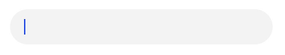
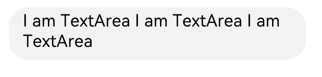
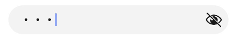
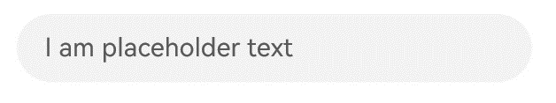
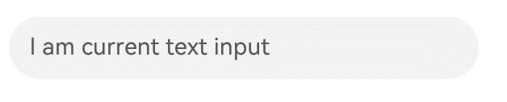
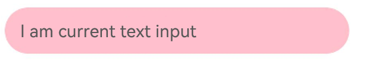

# Text Input (TextInput/TextArea)


The **TextInput** and **TextArea** components are input components typically used to accept input from the user, such as comments, chat messages, and table content. They can be used in combination with other components to meet more diversified purposes, for example, login and registration. For details, see [TextInput](../reference/apis-arkui/arkui-ts/ts-basic-components-textinput.md) and [TextArea](../reference/apis-arkui/arkui-ts/ts-basic-components-textarea.md).


## Creating a Text Box

The **TextInput** component provides single-line text input, while the **TextArea** component provides multi-line text input. To create these components, use the following APIs:

```ts
TextInput(value?:{placeholder?: ResourceStr, text?: ResourceStr, controller?: TextInputController})
```

```ts
TextArea(value?:{placeholder?: ResourceStr, text?: ResourceStr, controller?: TextAreaController})
```

- Single-line text box

  ```ts
  TextInput()
  ```

  


- Multi-line text box

  ```ts
  TextArea()
  ```

  

  The **TextArea** component automatically wraps text so that each line does not have more than the width of the component.


  ```ts
  TextArea({ text: "I am TextArea I am TextArea I am TextArea" }).width(300)
  ```

  


## Setting the Input Box Type

The **TextInput** component comes in nine types. You can specify its type by setting the **type** parameter to any of the following: **Normal**, **Password**, **Email**, **Number**, **PhoneNumber**, **USER_NAME**, **NEW_PASSWORD**, **NUMBER_PASSWORD**,<!--Del--> **SCREEN_LOCK_PASSWORD**,<!--DelEnd--> and **NUMBER_DECIMAL**.  


- Normal type (default type)

  ```ts
  TextInput()
    .type(InputType.Normal)
  ```

  

- Password type

  ```ts
  TextInput()
    .type(InputType.Password)
  ```

  


## Setting Styles

- Set the placeholder text displayed when there is no input.


  ```ts
  TextInput({ placeholder: 'I am placeholder text' })
  ```

  


- Set the current text input.

  ```ts
  TextInput({ placeholder: 'I am placeholder text', text: 'I am current text input' })
  ```

  

- Use **backgroundColor** to set the background color of the text box.

  ```ts
  TextInput({ placeholder: 'I am placeholder text', text: 'I am current text input' })
    .backgroundColor(Color.Pink)
  ```

  

  More styles can be implemented by leveraging the [universal attributes](../reference/apis-arkui/arkui-ts/ts-universal-attributes-size.md).


## Adding Events

You can add the **onChange** event for the text box to obtain its content changes. You can also add the universal events to implement user interactions.

```ts
TextInput()
  .onChange((value: string) => {
    console.info(value);
  })
  .onFocus(() => {
    console.info('Get Focus');
  })
```

## Example Scenario

In this example, the text box is used to submit forms on the user login or registration page.

```ts
@Entry
@Component
struct TextInputSample {
  build() {
    Column() {
      TextInput({ placeholder: 'input your username' }).margin({ top: 20 })
        .onSubmit((EnterKeyType) => {
          console.info(EnterKeyType + 'Enter key type');
        })
      TextInput({ placeholder: 'input your password' }).type(InputType.Password).margin({ top: 20 })
        .onSubmit((EnterKeyType) => {
          console.info(EnterKeyType + 'Enter key type');
        })
      Button('Sign in').width(150).margin({ top: 20 })
    }.padding(20)
  }
}
```


## Keyboard Avoidance

After the keyboard is raised, scrollable container components will only activate the keyboard avoidance feature when switching between landscape and portrait modes. To enable keyboard avoidance for non-scrollable container components, nest them within a scrollable container component, such as [Scroll](../reference/apis-arkui/arkui-ts/ts-container-scroll.md), [List](../reference/apis-arkui/arkui-ts/ts-container-list.md), or [Grid](../reference/apis-arkui/arkui-ts/ts-container-grid.md).

```ts
// xxx.ets
@Entry
@Component
struct Index {
  placeHolderArr: string[] = ['1', '2', '3', '4', '5', '6', '7'];

  build() {
    Scroll() {
      Column() {
        ForEach(this.placeHolderArr, (placeholder: string) => {
          TextInput({ placeholder: 'TextInput ' + placeholder })
            .margin(30)
        })
      }
    }
    .height('100%')
    .width('100%')
  }
}
```


## Caret Avoidance

The **OFFSET** and **RESIZE** modes of [keyBoardAvoidMode](../reference/apis-arkui/js-apis-arkui-UIContext.md#keyboardavoidmode11) do not allow for secondary avoidance actions after the keyboard has been lifted. To support additional caret avoidance actions, you can use the **OFFSET_WITH_CARET** and **RESIZE_CARET** options.<br>
**RESIZE_WITH_CARET** is recommended for scrollable containers, and **OFFSET_WITH_CARET** is recommended for non-scrollable containers.

```ts
// EntryAbility.ets
import { KeyboardAvoidMode } from '@kit.ArkUI';

// Used in UIAbility
onWindowStageCreate(windowStage: window.WindowStage) {
  // The main window is created. Set a main page for this ability.
  hilog.info(0x0000, 'testTag', '%{public}s', 'Ability onWindowStageCreate');

  windowStage.loadContent('pages/Index', (err, data) => {
    let keyboardAvoidMode = windowStage.getMainWindowSync().getUIContext().getKeyboardAvoidMode();
  windowStage.getMainWindowSync().getUIContext().setKeyboardAvoidMode(KeyboardAvoidMode.OFFSET_WITH_CARET);
    if (err.code) {
      hilog.error(0x0000, 'testTag', 'Failed to load the content. Cause: %{public}s', JSON.stringify(err) ?? '');
      return;
    }
    hilog.info(0x0000, 'testTag', 'Succeeded in loading the content. Data: %{public}s', JSON.stringify(data) ?? '');
  });
}
```

```ts
// xxx.ets
@Entry
@Component
struct Index {
  @State caretPosition: number = 600;
  areaController: TextAreaController = new TextAreaController();
  text = "Most of us compare ourselves with anyone we think is happier — a relative, someone we know a lot, or someone we hardly know. As a result, what we do remember is anything that makes others happy, anything that makes ourselves unhappy, totally forgetting that there is something happy in our own life.\
  So the best way to destroy happiness is to look at something and focus on even the smallest flaw. It is the smallest flaw that would make us complain. And it is the complaint that leads to us becoming unhappy.\
  If one chooses to be happy, he will be blessed; if he chooses to be unhappy, he will be cursed. Happiness is just what you think will make you happy.Most of us compare ourselves with anyone we think is happier — a relative, someone we know a lot, or someone we hardly know. As a result, what we do remember is anything that makes others happy, anything that makes ourselves unhappy, totally forgetting that there is something happy in our own life.\
  So the best way to destroy happiness is to look at something and focus on even the smallest flaw. It is the smallest flaw that would make us complain. And it is the complaint that leads to us becoming unhappy.\
  If one chooses to be happy, he will be blessed; if he chooses to be unhappy, he will be cursed. Happiness is just what you think will make you happy.Most of us compare ourselves with anyone we think is happier — a relative, someone we know a lot, or someone we hardly know. As a result, what we do remember is anything that makes others happy, anything that makes ourselves unhappy, totally forgetting that there is something happy in our own life.\
  So the best way to destroy happiness is to look at something and focus on even the smallest flaw. It is the smallest flaw that would make us complain. And it is the complaint that leads to us becoming unhappy.\
  If one chooses to be happy, he will be blessed; if he chooses to be unhappy, he will be cursed. Happiness is just what you think will make you happy.Most of us compare ourselves with anyone we think is happier — a relative, someone we know a lot, or someone we hardly know. As a result, what we do remember is anything that makes others happy, anything that makes ourselves unhappy, totally forgetting that there is something happy in our own life.\
  So the best way to destroy happiness is to look at something and focus on even the smallest flaw. It is the smallest flaw that would make us complain. And it is the complaint that leads to us becoming unhappy.\
  If one chooses to be happy, he will be blessed; if he chooses to be unhappy, he will be cursed. Happiness is just what you think will make you happy.Most of us compare ourselves with anyone we think is happier — a relative, someone we know a lot, or someone we hardly know. As a result, what we do remember is anything that makes others happy, anything that makes ourselves unhappy, totally forgetting that there is something happy in our own life.\
  ";

  build() {
    Scroll() {
      Column() {
        Row() {
          Button('CaretPostiion++: ' + this.caretPosition).onClick(() => {
            this.caretPosition += 1;
          }).fontSize(10)
          Button('CaretPostiion--: ' + this.caretPosition).onClick(() => {
            this.caretPosition -= 1;
          }).fontSize(10)
          Button('SetCaretPostion: ').onClick(() => {
            this.areaController.caretPosition(this.caretPosition);
          }).fontSize(10)
        }

        TextArea({ text: this.text, controller: this.areaController })
          .width('100%')
          .fontSize('20fp')
      }
    }.width('100%').height('100%')
  }
}
```


