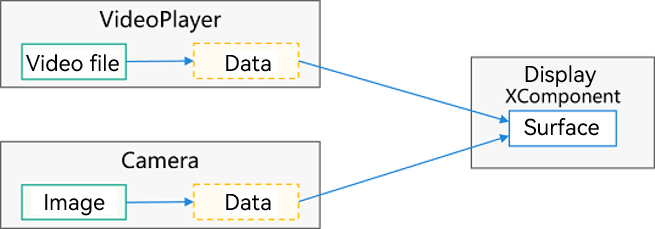

# XComponent


As a drawing component, the \<[XComponent](../reference/arkui-ts/ts-basic-components-xcomponent.md)> is usually used to meet relatively complex drawing customization requirements, for example, display of a camera preview stream and drawing of a game image.


You can specify the **type** parameter to implement different features. Two options are mainly available for this parameter: **surface** and **component**.


With the **\<XComponent>** of the **surface** type, you can pass data to the surface independently owned by it to render the image.


With the **\<XComponent>** of the **component** type, you can dynamically load the displayed content.


## surface Type

When the **\<XComponent>** is set to the **surface** type, you can write EGL/OpenGL ES and media data and display it on the **\<XComponent>**.

You can also have the **\<XComponent>** laid out and rendered together with other components.

The **\<XComponent>** has an independent surface, which provides a native window for you to create the EGL/OpenGL ES environment on the native (C/C++) side and use the standard OpenGL ES for development.

In addition, media-related applications (such as videos and cameras) can write data to the surface provided by the **\<XComponent>** to present the corresponding image.


## Using EGL/OpenGL ES for Rendering


### Key Points of Native Code Development

OpenHarmony applications use native APIs to implement interactions between JS and C/C++ code. This is also the case with the **\<XComponent>**. For details, see [Using N-APIs in Application Projects](../napi/napi-guidelines.md).

The type of the file for processing the JS logic on the native side is .so.

- Each module has a .so file.

- The .so file is named in the format of lib{moduleName}.so.


In the scenario where the **\<XComponent>** is used for standard OpenGL ES development, the content of the **CMAKELists.txt** file is as follows:


```
cmake_minimum_required(VERSION 3.4.1)
project(XComponent) # Project name

set(NATIVERENDER_ROOT_PATH ${CMAKE_CURRENT_SOURCE_DIR})
# Path for searching for header files
include_directories(${NATIVERENDER_ROOT_PATH}
                    ${NATIVERENDER_ROOT_PATH}/include
                    )

# Compile the target .so file. SHARED indicates the dynamic library.
add_library(nativerender SHARED
            xxx.cpp
            )

# Search for related libraries (including OpenGL ES libraries and NDK APIs provided by the <XComponent>).
find_library( EGL-lib
              EGL )

find_library( GLES-lib
              GLESv3 )

find_library( libace-lib
              ace_ndk.z )

# Dependencies required for compiling .so files
target_link_libraries(nativerender PUBLIC ${EGL-lib} ${GLES-lib} ${libace-lib} libace_napi.z.so libc++.a)
```


### Registering the N-API Module


```c++
static napi_value Init(napi_env env, napi_value exports)
{
	// Define the API exposed on the module.
    napi_property_descriptor desc[] ={
        DECLARE_NAPI_FUNCTION("changeColor", PluginRender::NapiChangeColor),
    };
    // You can mount the native method (PluginRender::NapiChangeColor) to exports through this API. exports is bound to a JS object at the JS layer through the JS engine.
    NAPI_CALL(env, napi_define_properties(env, exports, sizeof(desc) / sizeof(desc[0]), desc));
    return exports;
}

static napi_module nativerenderModule = {
    .nm_version = 1,
    .nm_flags = 0,
    .nm_filename = nullptr,
    .nm_register_func = Init, // Specify the callback for when the corresponding module is loaded.
    .nm_modname = "nativerender", // Specify the module name. For <XComponent>-related development, the name must be the same as the value of libraryname in the <XComponent> on ArkTS.
    .nm_priv = ((void*)0),
    .reserved = { 0 },
};

extern "C" __attribute__((constructor)) void RegisterModule(void)
{
    // Register the SO module.
    napi_module_register(&nativerenderModule);c
}
```


### Parsing the NativeXComponent Instance

**NativeXComponent** provides an instance at the native layer for the **\<XComponent>**, which can be used as a bridge for binding with the **\<XComponent>** at the JS layer. The NDK APIs provided by the **\<XComponent>** depend on this instance. For details about the NDK APIs, see [Native XComponent](../reference/native-apis/_o_h___native_x_component.md).


The **NativeXComponent** instance can be obtained by parsing the callback (that is, the **Init** function in [NAPI module registration](#registering-the-n-api-module)) when the module is loaded.


```c++
{
    // ...
    napi_status status;
    napi_value exportInstance = nullptr;
    OH_NativeXComponent *nativeXComponent = nullptr;
    // Parse the attribute of the wrapped NativeXComponent pointer.
    status = napi_get_named_property(env, exports, OH_NATIVE_XCOMPONENT_OBJ, &exportInstance);
    if (status != napi_ok) {
        return false;
    }
    // Use the napi_unwrap API to parse the NativeXComponent instance pointer.
    status = napi_unwrap(env, exportInstance, reinterpret_cast<void**>(&nativeXComponent));
    // ...
}
```


### Registering XComponent Callback

Based on the NativeXComponent pointer obtained by [parsing the NativeXComponent instance](#parsing-the-nativexcomponent-instance), perform callback registration through the **OH_NativeXComponent_RegisterCallback** API.


```c++
{
    ...
    OH_NativeXComponent *nativeXComponent = nullptr;
    // Parse the NativeXComponent instance.

    OH_NativeXComponent_Callback callback;
    callback->OnSurfaceCreated = OnSurfaceCreatedCB; // Invoked when a surface is successfully created. You can obtain the handle to the native window from this event.
    callback->OnSurfaceChanged = OnSurfaceChangedCB; // Invoked when the surface changes. You can obtain the native window handle and XComponent change information from this event.
    callback->OnSurfaceDestroyed = OnSurfaceDestroyedCB; // Invoked when the surface is destroyed. You can release resources in this event.
    callback->DispatchTouchEvent = DispatchTouchEventCB; // Invoked when a touch event occurs. You can obtain the touch event information from this event.

    OH_NativeXComponent_RegisterCallback(nativeXComponent, callback);
    ...
}
```


### Creating the EGL/OpenGL ES Environment

In the registered **OnSurfaceCreated** callback, you can obtain the handle to the native window (which is essentially the surface independently owned by the **\<XComponent>**). Therefore, you can create the EGL/OpenGL ES environment for your application to start the development of the rendering logic.


```c++
EGLCore* eglCore_; // EGLCore is a class that encapsulates OpenGL-related APIs.
uint64_t width_;
uint64_t height_;
void OnSurfaceCreatedCB(OH_NativeXComponent* component, void* window)
{
    int32_t ret = OH_NativeXComponent_GetXComponentSize(component, window, &width_, &height_);
    if (ret === OH_NATIVEXCOMPONENT_RESULT_SUCCESS) {
        eglCore_->GLContextInit(window, width_, height_); // Initialize the OpenGL environment.
    }
}
```


### ArkTS Syntax

You can use the **\<XComponent>** to develop EGL/OpenGL ES rendering by using the following code on the ArkTS side:


```ts
XComponent({ id: 'xcomponentId1', type: 'surface', libraryname: 'nativerender' })
  .onLoad((context) => {})
  .onDestroy(() => {})
```

- **id**: corresponds to an **\<XComponent>** and must be unique. Generally, you can use the **OH_NativeXComponent_GetXComponentId** API on the native side to obtain the corresponding ID and bind the corresponding **\<XComponent>**.

- **libraryname**: name of the loaded module, which must be the same as the value of **nm_modname** used when the Napi module is registered on the native side.

  > **NOTE**
  >
  > An application loads modules to implement cross-language invoking in either of the following modes:
  > 
  > 1. Use the **import** mode of the NAPI.
  >
  > ```ts
  > import nativerender from "libnativerender.so"
  > ```
  >
  > 2. Use the **\<XComponent>**.
  >
  >    While this mode also uses the NAPI mechanism as the **import** mode, it enables you to use the NDK APIs of the **\<XComponent>**, by having the **NativeXComponent** instance of the **\<XComponent>** exposed to the native layer of the application when the dynamic library is loaded.

- **onLoad** event
  - Trigger time: when the surface of the **\<XComponent>** is prepared.
  - **context** parameter: where the native API exposed on the module is mounted. Its usage is similar to the usage of the **context2** instance obtained after the module is directly loaded using **import context2 from "libnativerender.so"**.
  - Time sequence: When the **onLoad** event is subject to the surface. The following figure shows the time sequence of the **onLoad** event and the **OnSurfaceCreated** event on the native side.

     

- **onDestroy** event

  Trigger time: when the **\<XComponent>** is destroyed, in the same manner as that when an ArkUI component is destroyed. The following figure shows the time sequence of the **onDestroy** event and the **OnSurfaceDestroyed** event on the native side.

  


### Writing Media Data

The surface held by the **\<XComponent>** complies with the producer-consumer model.

In OpenHarmony, components that comply with the producer design, such as the camera and video player, can write data to the surface held by the **\<XComponent>** and display the data through the **\<XComponent>**.



You can bind the **\<XComponent>** to the **XComponentController** to obtain the surface ID (**surfaceId**, which uniquely identifies a surface) and send it to the corresponding component API.


```ts
@State surfaceId:string = "";
mXComponentController: XComponentController = new XComponentController();
XComponent({ id: '', type: 'surface', controller: this.mXComponentController })
  .onLoad(() => {
    this.surfaceId = this.mXComponentController.getXComponentSurfaceId()
  })
```

For details about component APIs, see [AVPlayer](../reference/apis/js-apis-media.md#avplayer9) and [Camera](../reference/apis/js-apis-camera.md).


### component Type

When the **\<XComponent>** is set to the **component** type, you can execute non-UI logic to dynamically load the displayed content.


>**NOTE**
>
> When **type** is set to **component**, the **\<XComponent>** functions as a container, where child components are laid out vertically.
>
> - Vertical alignment: [FlexAlign](../reference/arkui-ts/ts-appendix-enums.md#flexalign).Start
>
> - Horizontal alignment: [FlexAlign](../reference/arkui-ts/ts-appendix-enums.md#flexalign).Center
>
> The component does not respond to any events.
>
> Layout changes and event responses can be set by mounting child components.
>
> The non-UI logic written internally needs to be encapsulated in one or more functions.


### Example Scenario


```ts
@Builder
function addText(label: string): void {
  Text(label)
    .fontSize(40)
}

@Entry
@Component
struct Index {
  @State message: string = 'Hello XComponent'
  @State messageCommon: string = 'Hello World'
  build() {
    Row() {
      Column() {
        XComponent({ id: 'xcomponentId-container', type: 'component' }) {
          addText(this.message)
          Divider()
            .margin(4)
            .strokeWidth(2)
            .color('#F1F3F5')
            .width("80%")
          Column() {
            Text(this.messageCommon)
              .fontSize(30)
          }
        }
      }
      .width('100%')
    }
    .height('100%')
  }
}
```


