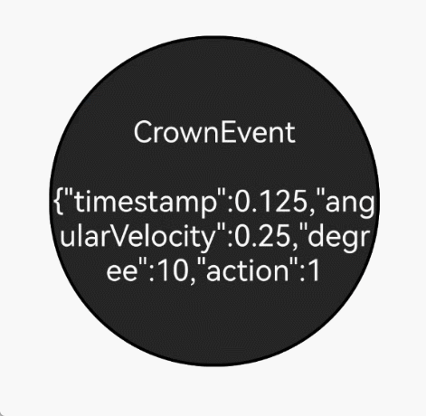

# Handling Crown Events

<!--Kit: ArkUI-->
<!--Subsystem: ArkUI-->
<!--Owner: @yihao-lin-->
<!--Designer: @piggyguy-->
<!--Tester: @songyanhong-->
<!--Adviser: @Brilliantry_Rui-->
<!-- md-trans-meta sourceCommit=018bd9fb91a05a75131b70a855b059f14ee7f0a9 translatedAt=2026-07-29T12:46:04.213Z pushedAt=2026-07-30T03:33:39.853Z -->

The crown event, supported since API version 18, is triggered by the rotation of the watch crown and reports changes in the rotation angle based on the hardware sampling frequency.

Crown event distribution depends on the component focus within an app. Only the component that has focus can receive this event. Therefore, the component receiving this event must properly manage its focus state and listen for focus state changes through the [onFocus](../reference/apis-arkui/arkui-ts/ts-universal-focus-event.md#onfocus) and [onBlur](../reference/apis-arkui/arkui-ts/ts-universal-focus-event.md#onblur) APIs. When a component that is receiving crown events loses focus, subsequent crown events are no longer sent to that component.

Some components already support interaction with the watch crown. For example, rotating the crown scrolls the scrollbar.

Currently, the following components support crown events by default: [Slider](../reference/apis-arkui/arkui-ts/ts-basic-components-slider.md), [DatePicker](../reference/apis-arkui/arkui-ts/ts-basic-components-datepicker.md), [TextPicker](../reference/apis-arkui/arkui-ts/ts-basic-components-textpicker.md), [TimePicker](../reference/apis-arkui/arkui-ts/ts-basic-components-timepicker.md), [Scroll](../reference/apis-arkui/arkui-ts/ts-container-scroll.md), [List](../reference/apis-arkui/arkui-ts/ts-container-list.md), [Grid](../reference/apis-arkui/arkui-ts/ts-container-grid.md), [WaterFlow](../reference/apis-arkui/arkui-ts/ts-container-waterflow.md), [ArcList](../reference/apis-arkui/arkui-ts/ts-container-arclist.md), [Refresh](../reference/apis-arkui/arkui-ts/ts-container-refresh.md), and [Swiper](../reference/apis-arkui/arkui-ts/ts-container-swiper.md).

Applications can also use the [onDigitalCrown](../reference/apis-arkui/arkui-ts/ts-universal-events-crown.md#ondigitalcrown) API to detect crown events.

The **event** parameter provides the following crown event information: timestamp, rotation angular velocity, rotation angle, and [crown action](../reference/apis-arkui/arkui-ts/ts-appendix-enums.md#crownaction18).

>  **NOTE**
>
>  - Currently, only wearables support crown events.
>
>  - A component's capability to receive crown events depends on its focus status. If a component loses focus after receiving BEGIN, it cannot receive subsequent **UPDATE** and **END** events.

To enable a component to obtain information such as the rotation angle, use the **onDigitalCrown** API for receiving the crown event. The following example uses the **Text** component to illustrate how to develop a crown event and the precautions to take during development.

1. Ensure the component gains focus.

    Ensure that the component receiving the event gains focus. This can be achieved by using methods such as [focusable](../reference/apis-arkui/arkui-ts/ts-universal-attributes-focus.md#focusable), [defaultFocus](../reference/apis-arkui/arkui-ts/ts-universal-attributes-focus.md#defaultfocus9), and [focusOnTouch](../reference/apis-arkui/arkui-ts/ts-universal-attributes-focus.md#focusontouch9). For more detailed information about focus control, see the [focus control](../reference/apis-arkui/arkui-ts/ts-universal-attributes-focus.md) document.

    <!-- @[text](https://gitcode.com/openharmony/applications_app_samples/blob/master/code/DocsSample/ArkUISample/CrownEventsProject/entry/src/main/ets/pages/Index.ets) -->

    ``` TypeScript
    Text(this.message)
      .fontSize(20)
      .fontColor(Color.White)
      .backgroundColor("#262626")
      .textAlign(TextAlign.Center)
      .focusable(true)
      .focusOnTouch(true)
      .defaultFocus(true)
    ```

2. Register the crown event callback.

    To receive a crown event, you need to register a crown event callback. When a crown event is triggered, the callback function is executed.

    <!-- @[onDigitalCrown](https://gitcode.com/openharmony/applications_app_samples/blob/master/code/DocsSample/ArkUISample/CrownEventsProject/entry/src/main/ets/pages/Index.ets) -->

    ``` TypeScript
    .onDigitalCrown((event: CrownEvent) => {
    // ···
    })
    ```

3. Understand event fields.

    The crown event provides the timestamp, rotation angular velocity, rotation angle, and crown action. To prevent the event from bubbling up, use [stopPropagation](../reference/apis-arkui/arkui-ts/ts-universal-events-crown.md#crownevent).

    <!-- @[stopPropagation](https://gitcode.com/openharmony/applications_app_samples/blob/master/code/DocsSample/ArkUISample/CrownEventsProject/entry/src/main/ets/pages/Index.ets) -->

    ``` TypeScript
    event.stopPropagation();
    this.message = "CrownEvent\n\n" + JSON.stringify(event);
    hilog.debug(0x0000, 'Tag',
      "action:%{public}d, angularVelocity:%{public}f, degree:%{public}f, timestamp:%{public}f",
      event.action, event.angularVelocity, event.degree, event.timestamp);
    ```

**Complete Example**

 <!-- [crown_event](https://gitcode.com/openharmony/applications_app_samples/blob/master/code/DocsSample/ArkUISample/CrownEventsProject/entry/src/main/ets/pages/Index.ets) -->

 ``` TypeScript
 // xxx.ets
 @Entry
 @Component
 struct Index {
   @State message: string = 'onDigitalCrown';
 
   build() {
     Column() {
       Row() {
         Stack() {
           Text(this.message)
             .fontSize(20)
             .fontColor(Color.White)
             .backgroundColor("#262626")
             .textAlign(TextAlign.Center)
             .focusable(true)
             .focusOnTouch(true)
             .defaultFocus(true)
             .borderWidth(2)
             .width(223)
             .height(223)
             .borderRadius(110)
             .onDigitalCrown((event: CrownEvent) => {
               event.stopPropagation();
               this.message = "CrownEvent\n\n" + JSON.stringify(event);
               hilog.debug(0x0000, 'Tag',
                 "action:%{public}d, angularVelocity:%{public}f, degree:%{public}f, timestamp:%{public}f",
                 event.action, event.angularVelocity, event.degree, event.timestamp);
             })
         }.width("100%").height("100%")
       }.width("100%").height("100%")
     }
   }
 }
 ```

