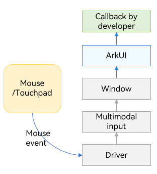
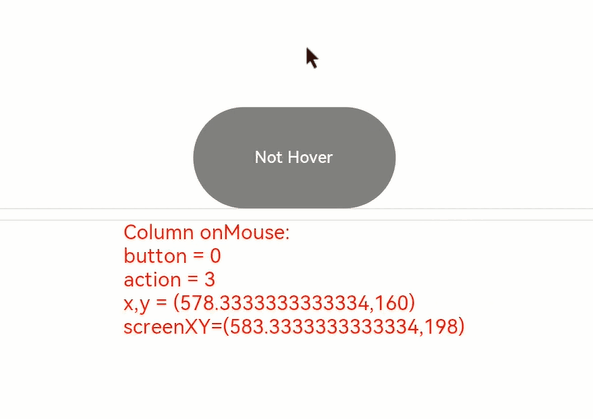
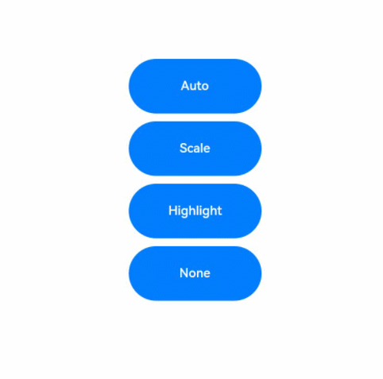
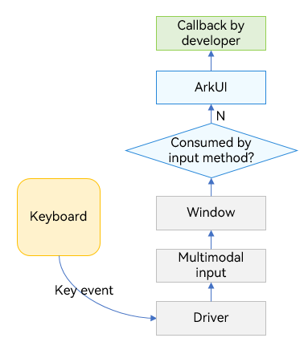
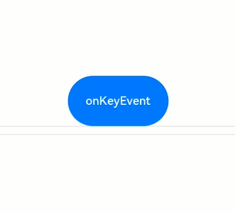

# Keyboard and Mouse Event


Keyboard and mouse events refer to the input events of the peripheral keyboard and mouse.


## Mouse Event

The supported mouse events include the events triggered by the peripheral mouse and touchpad.

Mouse events can trigger the following callbacks.

| Name                                      | Description                                      |
| ---------------------------------------- | ---------------------------------------- |
| onHover(event: (isHover: boolean) =&gt; void) | Triggered when the mouse pointer enters or leaves the component.<br>**isHover**: whether the mouse pointer hovers over the component. The value **true** means that the mouse pointer enters the component, and the value **false** means that the mouse pointer leaves the component.|
| onMouse(event: (event?: MouseEvent) =&gt; void) | Triggered when the component is clicked by a mouse button or the mouse pointer moves on the component. The **event** parameter indicates the timestamp, mouse button, action, coordinates of the clicked point on the entire screen, and coordinates of the clicked point relative to the component when the event is triggered.|

When the component is bound to the **onHover** callback, you can use the [hoverEffect](../reference/apis-arkui/arkui-ts/ts-universal-attributes-hover-effect.md#hovereffect) attribute to set the hover effect of the component in hover state.


  **Figure 1** Mouse event data flow 





When ArkUI receives the mouse event, it checks whether the mouse event concerns pressing, lifting, or moving of the left mouse button, and then responds accordingly.


- Yes: The mouse event is first converted into a touch event in the same position, and a collision test, gesture judgment, and callback response of the touch event are performed. The collision test and callback response of the mouse event are then performed.

- No: Only the collision test and callback response of the mouse event are performed.


>**NOTE**
>
>All touch events and gesture events that can be responded to by a single finger may be triggered and responded to by using the left mouse button. For example, to implement page redirection invoked by clicking a button with support for finger touches and left-clicks, you just need to bind one click event (**onClick**). If you want to implement different effects for the finger touch and the left-click, you can use the **source** parameter in the **onClick** callback to determine whether the current event is triggered by a finger or a mouse.


### onHover


```ts
onHover(event: (isHover: boolean) => void)
```


Triggered when the mouse pointer enters or leaves the component. The **isHover** parameter indicates whether the mouse pointer hovers over the component. This event does not support custom bubbling settings. By default, event bubbling occurs between parent and child components.


If this API is bound to a component, it is triggered when the mouse pointer enters the component from outside and the value of **isHover** is **true**, or when the mouse pointer leaves the component and the value of **isHover** is **false**.


>**NOTE**
>
>Event bubbling is an event propagation in the document object model (DOM) when an event is first handled by an element and then bubbles up to its parent element.


```ts
// xxx.ets
@Entry
@Component
struct MouseExample {
  @State hoverText: string = 'Not Hover';
  @State Color: Color = Color.Gray;

  build() {
    Column() {
      Button(this.hoverText)
        .width(200).height(100)
        .backgroundColor(this.Color)
        .onHover((isHover?: boolean) => { // Use the onHover API to listen for whether the mouse cursor is hovered over the button.
          if (isHover) {
            this.hoverText = 'Hovered!';
            this.Color = Color.Green;
          }
          else {
            this.hoverText = 'Not Hover';
            this.Color = Color.Gray;
          }
        })
    }.width('100%').height('100%').justifyContent(FlexAlign.Center)
  }
}
```


In this example, a **Button** component is created, with the initial background color of gray and the content of **Not Hover**. The component is bound to the **onHover** callback. In the callback, **this.isHovered** is set to the callback parameter **isHover**.


When the mouse pointer moves from outside the button to inside the button, the callback is invoked, the value of **isHover** changes to **true**, the value of **isHovered** changes to **true**, the background color of the component changes to **Color.Green**, and the content changes to **Hovered!**.


When the mouse pointer moves from inside the button to outside the button, the callback is invoked, the value of **isHover** changes to **false**, and the component restores to its initial style.


### onMouse


```ts
onMouse(event: (event?: MouseEvent) => void)
```


Triggered when a mouse event occurs. It is triggered each time a mouse pointer action (**MouseAction**) is detected in the component. The parameter is a [MouseEvent](../reference/apis-arkui/arkui-ts/ts-universal-mouse-key.md#mouseevent) object, which indicates the mouse event that triggers the callback. This event supports custom bubbling settings. By default, event bubbling occurs between parent and child components. It is commonly used for customized mouse behavior logic processing.


You can use the **MouseEvent** object in the callback to obtain information about the triggered event, including the coordinates (**displayX**, **displayY**, **windowX**, **windowY**, **x**, and **y**), button ([MouseButton](../reference/apis-arkui/arkui-ts/ts-appendix-enums.md#mousebutton8)), action ([MouseAction](../reference/apis-arkui/arkui-ts/ts-appendix-enums.md#mouseaction8)), timestamp (**timestamp**), display area of the object that triggers the event ([EventTarget](../reference/apis-arkui/arkui-ts/ts-universal-events-click.md#eventtarget8)), and event source ([SourceType](../reference/apis-arkui/arkui-ts/ts-gesture-settings.md#sourcetype)). The **stopPropagation** callback of **MouseEvent** is used to set whether the current event blocks bubbling.


>**NOTE**
>
>**MouseButton** indicates the physical mouse button being pressed or released that triggers the mouse event. The values are **Left**, **Right**, **Middle**, **Back**, **Forward**, and **None**. **None** indicates that no button is pressed or released, which means that the event is triggered by the mouse pointer moving on the component.


```ts
// xxx.ets
@Entry
@Component
struct MouseExample {
  @State buttonText: string = '';
  @State columnText: string = '';
  @State hoverText: string = 'Not Hover';
  @State Color: Color = Color.Gray;

  build() {
    Column() {
      Button(this.hoverText)
        .width(200)
        .height(100)
        .backgroundColor(this.Color)
        .onHover((isHover?: boolean) => {
          if (isHover) {
            this.hoverText = 'Hovered!';
            this.Color = Color.Green;
          }
          else {
            this.hoverText = 'Not Hover';
            this.Color = Color.Gray;
          }
        })
        .onMouse((event?: MouseEvent) => { // Set the onMouse callback for the button.
          if (event) {
            this.buttonText = 'Button onMouse:\n' + '' +
              'button = ' + event.button + '\n' +
              'action = ' + event.action + '\n' +
              'x,y = (' + event.x + ',' + event.y + ')' + '\n' +
              'windowXY=(' + event.windowX + ',' + event.windowY + ')';
          }
        })
      Divider()
      Text(this.buttonText).fontColor(Color.Green)
      Divider()
      Text(this.columnText).fontColor(Color.Red)
    }
    .width('100%')
    .height('100%')
    .justifyContent(FlexAlign.Center)
    .borderWidth(2)
    .borderColor(Color.Red)
    .onMouse((event?: MouseEvent) => { // Set the onMouse callback for the column.
      if (event) {
        this.columnText = 'Column onMouse:\n' + '' +
          'button = ' + event.button + '\n' +
          'action = ' + event.action + '\n' +
          'x,y = (' + event.x + ',' + event.y + ')' + '\n' +
          'windowXY=(' + event.windowX + ',' + event.windowY + ')';
      }
    })
  }
}
```


Bind the **onMouse** API to the button based on the **onHover** example. In the callback, the values of the callback parameters, such as **button** and **action**, are displayed. The same settings are performed on the outer **Column** container. The entire process can be divided into the following two actions:


1. Moving the mouse pointer: When the mouse pointer is moved from outside the button to inside the button, only the **onMouse** callback of the **Column** is triggered. When the mouse pointer is moved to the button, as the **onMouse** event bubbles up by default, both the **onMouse** callbacks of the **Column** and **Button** components are invoked. In this process, the mouse pointer moves, but no mouse button is clicked. Therefore, in the displayed information, the value of **button** is 0 (enumerated value of **MouseButton.None**) and the value of **action** is **3** (enumerated value of **MouseAction.Move**).

2. Clicking the mouse button: After the mouse pointer enters the **Button** component, the **Button** component is clicked twice, namely, left-click and right-click.
   Left-clicked: button = 1 (enumerated value of **MouseButton.Left**); action = 1 (enumerated value of **MouseAction.Press**); action = 2 (enumerated value of **MouseAction.Release**).

   Right-click: button = 2 (enumerated value of **MouseButton.Right**); action = 1 (enumerated value of **MouseAction.Press**); action = 2 (enumerated value of **MouseAction.Release**)





To prevent the mouse event from bubbling, call the **stopPropagation()** API.


```ts
class ish{
  isHovered:boolean = false
  set(val:boolean){
    this.isHovered = val;
  }
}
class butf{
  buttonText:string = ''
  set(val:string){
    this.buttonText = val
  }
}
@Entry
@Component
struct MouseExample {
  @State isHovered:ish = new ish()
  build(){
    Column(){
      Button(this.isHovered ? 'Hovered!' : 'Not Hover')
        .width(200)
        .height(100)
        .backgroundColor(this.isHovered ? Color.Green : Color.Gray)
        .onHover((isHover?: boolean) => {
          if(isHover) {
            let ishset = new ish()
            ishset.set(isHover)
          }
        })
        .onMouse((event?: MouseEvent) => {
          if (event) {
            if (event.stopPropagation) {
              event.stopPropagation(); // Prevent the onMouse event from bubbling.
            }
            let butset = new butf()
            butset.set('Button onMouse:\n' + '' +
              'button = ' + event.button + '\n' +
              'action = ' + event.action + '\n' +
              'x,y = (' + event.x + ',' + event.y + ')' + '\n' +
              'windowXY=(' + event.windowX + ',' + event.windowY + ')');
          }
        })
    }
  }
}
```


To prevent the mouse event of the child component (**Button**) from bubbling up to its parent component (**Column**), use the **event** parameter in the **onMouse** callback of **Button** to call the **stopPropagation** API.


```ts
event.stopPropagation()
```


With bubbling prevented, the mouse event on the **Button** component will trigger the **onMouse** callback of the **Button** component, but not the **onMouse** callback of the **Column** component.


### hoverEffect


```ts
hoverEffect(value: HoverEffect)
```


Sets the hover effect of the component in hover state. The parameter value type is **HoverEffect**. The **Auto**, **Scale**, and **Highlight** effects are preset and do not support customization.


  **Table 1** HoverEffect

| Value| Description                                    |
| -------------- | ---------------------------------------- |
| Auto           | Default hover effect, which varies by component.                    |
| Scale          | Scale effect. When the mouse pointer is placed over the component, the component is scaled up from 100% to 105%. When the mouse pointer is moved away, the component is scaled down from 105% to 100%.|
| Highlight      | Background fade-in and fade-out effect. When the mouse pointer is placed over the component, a white layer with 5% opacity is applied to the background color of the component, resulting in a dimmed background. When the mouse pointer is moved away, the background color of the component is restored to the original style.|
| None           | No effect.                                 |


```ts
// xxx.ets
@Entry
@Component
struct HoverExample {
  build() {
    Column({ space: 10 }) {
      Button('Auto')
        .width(170).height(70)
      Button('Scale')
        .width(170).height(70)
        .hoverEffect(HoverEffect.Scale)
      Button('Highlight')
        .width(170).height(70)
        .hoverEffect(HoverEffect.Highlight)
      Button('None')
        .width(170).height(70)
        .hoverEffect(HoverEffect.None)
    }.width('100%').height('100%').justifyContent(FlexAlign.Center)
  }
}
```





The default hover effect for the button is the **Highlight** effect. Therefore, the effects of **Auto** and **Highlight** are the same. The **Highlight** effect darkens the background color, **Scale** causes the component to scale, and **None** disables the hover effect.


## Key Event

### Key Event Data Flow




After being triggered by a device such as a peripheral keyboard, a key event has its data processed and converted by the driver and multimodal input modules, and then is sent to the currently focused window. The window dispatches the received event, following the sequence below. The dispatch stops once the event is consumed.

1. The window first dispatches the event to the ArkUI framework for invoking the **onKeyPreIme** callback bound to the component in focus as well as the page keyboard shortcuts.
2. If the ArkUI framework does not consume the event, the window dispatches the event to the input method for key input.
3. If the input method does not consume the event, the window dispatches the event to the ArkUI framework again for responding to the system default key event (for example, focus navigation) and for invoking the **onKeyEvent** callback bound to the component in focus.

When a text box has focus and the input method is enabled, most key events are consumed by the input method. For example, a letter key is used by the input method to enter a letter in the text box, and an arrow key is used by the input method to switch to the desired candidate word. Yet, if a keyboard shortcut is bound to the text box, the shortcut responds to the event first, and the event will not be consumed by the input method.

After the key event is sent to the ArkUI framework, it first identifies the complete focus chain, and then sends the key event from one node to the next, following the leaf-to-root path.

The key event process for the **Web** component differs from the aforementioned process. The **Web** component does not match keyboard shortcuts when **onKeyPreIme** returns **false**. The unconsumed key event will be re-dispatched back to ArkUI through **ReDispatch** during the third key press dispatch. It is within this **ReDispatch** that operations such as matching keyboard shortcuts are performed again.

### onKeyEvent & onKeyPreIme


```ts
onKeyEvent(event: (event: KeyEvent) => void): T
onKeyPreIme(event: Callback<KeyEvent, boolean>): T
```


The difference between the preceding two methods lies only in the triggering time. For details, see [Key Event Data Flow](#key-event-data-flow). The return value of **onKeyPreIme** determines whether the key event will be dispatched for the page keyboard shortcut, input method, and **onKeyEvent**.


The methods are triggered when the bound component has focus and a key event occurs on the component. The callback parameter [KeyEvent](../reference/apis-arkui/arkui-ts/ts-universal-events-key.md#keyevent) can be used to obtain the information about the key event, including [KeyType](../reference/apis-arkui/arkui-ts/ts-appendix-enums.md#keytype), [keyCode](../reference/apis-input-kit/js-apis-keycode.md#keycode), **keyText**, [KeySource](../reference/apis-arkui/arkui-ts/ts-appendix-enums.md#keysource), **deviceId**, **metaKey**, **timestamp**, and **stopPropagation**.


```ts
// xxx.ets
@Entry
@Component
struct KeyEventExample {
  @State buttonText: string = '';
  @State buttonType: string = '';
  @State columnText: string = '';
  @State columnType: string = '';

  build() {
    Column() {
      Button('onKeyEvent')
        .defaultFocus(true)
        .width(140).height(70)
        .onKeyEvent((event?: KeyEvent) => { // Set the onKeyEvent event for the button.
          if(event){
            if (event.type === KeyType.Down) {
              this.buttonType = 'Down';
            }
            if (event.type === KeyType.Up) {
              this.buttonType = 'Up';
            }
            this.buttonText = 'Button: \n' +
            'KeyType:' + this.buttonType + '\n' +
            'KeyCode:' + event.keyCode + '\n' +
            'KeyText:' + event.keyText;
          }
        })

      Divider()
      Text(this.buttonText).fontColor(Color.Green)

      Divider()
      Text(this.columnText).fontColor(Color.Red)
    }.width('100%').height('100%').justifyContent(FlexAlign.Center)
    .onKeyEvent((event?: KeyEvent) => { // Set the onKeyEvent event for the parent container Column.
      if(event){
        if (event.type === KeyType.Down) {
          this.columnType = 'Down';
        }
        if (event.type === KeyType.Up) {
          this.columnType = 'Up';
        }
        this.columnText = 'Column: \n' +
        'KeyType:' + this.buttonType + '\n' +
        'KeyCode:' + event.keyCode + '\n' +
        'KeyText:' + event.keyText;
      }
    })
  }
}
```


In the preceding example, **onKeyEvent** is bound to the **Button** component and its parent container **Column**. After the application opens and loads a page, the first focusable non-container component in the component tree automatically obtains focus. Set the **Button** component as the default focus of the current page. Because the **Button** component is a child node of the **Column** component, the **Column** component also obtains focus. For details about the focus obtaining mechanism, see [Focus Event](arkts-common-events-focus-event.md).





After the application is opened, press the following keys in sequence: Space, Enter, Left Ctrl, Left Shift, Letter A, and Letter Z.


1. Because the **onKeyEvent** event bubbles by default, the **onKeyEvent** callbacks of both **Button** and **Column** are invoked.

2. Each key has two callbacks, which correspond to **KeyType.Down** and **KeyType.Up** respectively, indicating that the key is pressed and then lifted.


To prevent the key event of the **Button** component from bubbling up to its parent container **Column**, add the **event.stopPropagation()** API to the **onKeyEvent** callback of **Button**.


```ts
@Entry
@Component
struct KeyEventExample {
  @State buttonText: string = '';
  @State buttonType: string = '';
  @State columnText: string = '';
  @State columnType: string = '';

  build() {
    Column() {
      Button('onKeyEvent')
        .defaultFocus(true)
        .width(140).height(70)
        .onKeyEvent((event?: KeyEvent) => {
          // Use stopPropagation to prevent the key event from bubbling up.
          if(event){
            if(event.stopPropagation){
              event.stopPropagation();
            }
            if (event.type === KeyType.Down) {
              this.buttonType = 'Down';
            }
            if (event.type === KeyType.Up) {
              this.buttonType = 'Up';
            }
            this.buttonText = 'Button: \n' +
              'KeyType:' + this.buttonType + '\n' +
              'KeyCode:' + event.keyCode + '\n' +
              'KeyText:' + event.keyText;
          }
        })

      Divider()
      Text(this.buttonText).fontColor(Color.Green)

      Divider()
      Text(this.columnText).fontColor(Color.Red)
    }.width('100%').height('100%').justifyContent(FlexAlign.Center)
    .onKeyEvent((event?: KeyEvent) => { // Set the onKeyEvent event for the parent container Column.
      if(event){
        if (event.type === KeyType.Down) {
          this.columnType = 'Down';
        }
        if (event.type === KeyType.Up) {
          this.columnType = 'Up';
        }
        this.columnText = 'Column: \n' +
          'KeyType:' + this.buttonType + '\n' +
          'KeyCode:' + event.keyCode + '\n' +
          'KeyText:' + event.keyText;
      }
    })
  }
}
```


Use **OnKeyPreIme** to block the left arrow key input in the text box.
```ts
import { KeyCode } from '@kit.InputKit';

@Entry
@Component
struct PreImeEventExample {
  @State buttonText: string = '';
  @State buttonType: string = '';
  @State columnText: string = '';
  @State columnType: string = '';

  build() {
    Column() {
      Search({
        placeholder: "Search..."
      })
        .width("80%")
        .height("40vp")
        .border({ radius:"20vp" })
        .onKeyPreIme((event:KeyEvent) => {
          if (event.keyCode == KeyCode.KEYCODE_DPAD_LEFT) {
            return true;
          }
          return false;
        })
    }
  }
}
```
