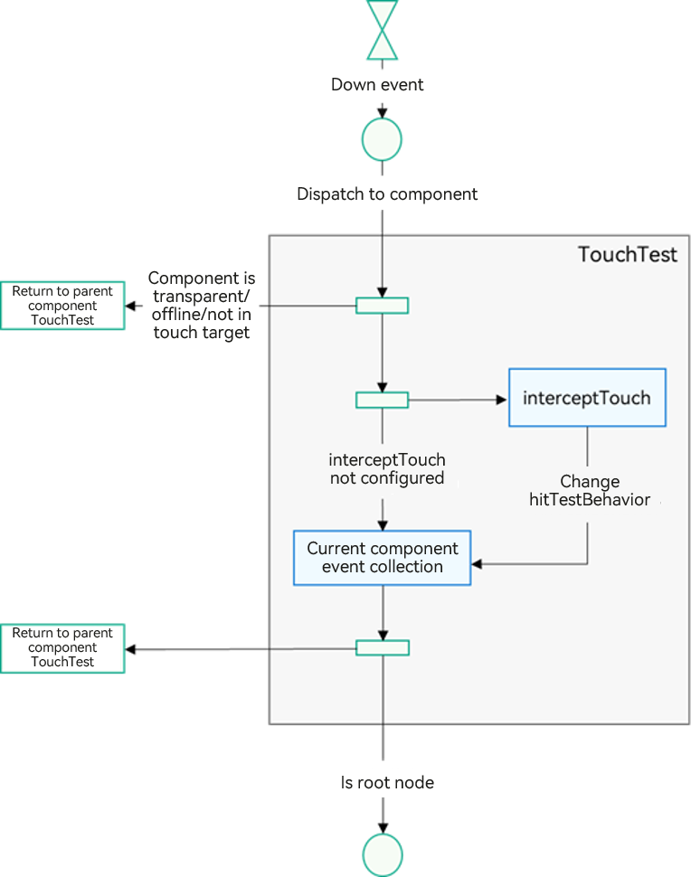
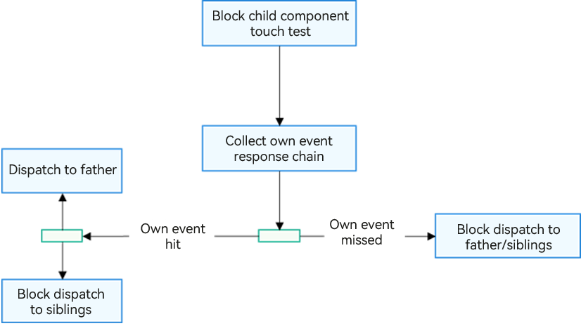
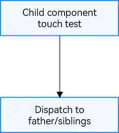
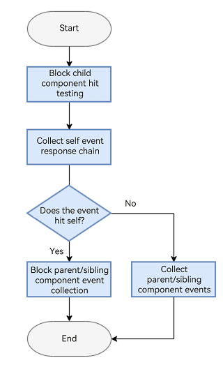
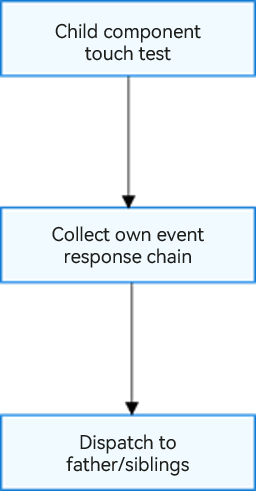

# Event Distribution

## Overview

Event distribution in ArkUI refers to the process where ArkUI receives pointer events generated by user interactions and dispatches these events to the respective components through a hit test, forming an event chain.

As an input from a touch test, a pointer event can be categorized into touch-type pointer events and mouse-type pointer events based on the user's interaction method.

- Touch-type pointer events: These are pointer events generated by touch actions, with input sources including a finger, a stylus, a mouse device, and a touchpad. They can trigger touch events, tap events, drag events, and gesture events.

- Mouse-type pointer events: These are pointer events generated by mouse operations, with input sources including a mouse device, a touchpad, and a joystick. They can trigger touch events, click events, drag events, gesture events, and mouse events.

Regardless of whether it is a touch-type pointer event or a mouse-type pointer event, the final event triggered is determined by the hit test and dispatched to the component. The hit test dictates the generation of the ArkUI event response chain, the distribution of pointer events, and the triggering of component bound events.

## Hit Test

Hit testing occurs when ArkUI detects a touch-type pointer event or the start event of a mouse-type pointer event (for example, an event generated when a finger or a mouse cursor is pressed). Based on the coordinates of the received event, the process involves testing the response area of a component and gathering the event response chain.

You can influence the touch testing process by setting the following attributes:

- **hitTestBehavior**: controls hit testing.

- **interceptTouch**: allows for custom interception of pointer events.

- **responseRegion**: sets the touch targets for components.

- **enabled**: enables or disables interactivity of components.

- Security components

- Other attribute settings: such as opacity and component availability

### Basic Process of Hit Test

  

The basic process of hit testing is as follows: Upon receiving the start event, the system traverses the component tree from top to bottom and from right to left, collects gestures and events bound to each component, and then integrates this information level by level up to the parent component, constructing a complete event response chain.

As shown in the figure, when the start event is dispatched to the component, the component collects gestures and events bound to it, and then passes the collection result to the parent component until the root node is reached. If a component is transparent, has been removed from the component tree, or the event coordinates are outside the component's touch target, the collection process is not triggered, and the feedback received by the parent component is empty. In addition, all components collect gestures and events and send the results to the parent component.

### Hit Test Control

When [hit test control](../reference/apis-arkui/arkui-ts/ts-universal-attributes-hit-test-behavior.md) is bound to a component, it may affect the hit test of sibling nodes and parent and child nodes. The impact of the child component on the hit test of the parent component depends on the status of the last child component that is not blocked in the hit test.

You can configure hit test control to block the hit test of the component itself or other components.

- **HitTestMode.Default**: This mode is used by default when the **hitTestBehavior** attribute is not specified. In this mode, if the component itself is hit, it will block the touch testing of sibling components, but will not block the touch testing of child components.

  

- **HitTestMode.None**: In this mode, the component neither receives events nor interferes with the touch testing of its sibling components or child components.

  

- **HitTestMode.Block**: This mode blocks the touch testing of child components. If the component itself is hit during a touch test, it will also block the touch testing of sibling components and parent components.

  

- **HitTestMode.Transparent**: This mode allows the component to participate in touch testing itself, without blocking the touch testing of sibling components or parent components.

  

### Custom Event Interception

When a user performs a press action, the callback for [custom event interception](../reference/apis-arkui/arkui-ts/ts-universal-attributes-on-touch-intercept.md) bound to the component is triggered. You can dynamically adjust the **hitTestBehavior** attribute of the component based on the application status to affect the hit test process.

### Enable/Disable Control

[Disabled](../reference/apis-arkui/arkui-ts/ts-universal-attributes-enable.md) components, including their children, do not initiate the hit test process; instead, they pass the events back to the parent to continue the hit test.

### Touch Target Settings

[Touch target settings](../reference/apis-arkui/arkui-ts/ts-universal-attributes-touch-target.md) are another impact factor in the hit test. According to the [basic process of hit test](#basic-process-of-hit-test), the gestures and events bound to a component are collected and enter the event response chain only when the coordinates of an event hit the touch target of the component. As such, you can adjust the touch target of the component to control the hit test process. If the touch target is set to **0**, or defined as an untouchable area, the event is directly sent back to the parent node for subsequent hit tests.

### Security Components

ArkUI provides security components, such as [PasteButton](../security/AccessToken/pastebutton.md) and [SaveButton](../security/AccessToken/savebutton.md).

If a component has a higher [z-order](../reference/apis-arkui/arkui-ts/ts-universal-attributes-z-order.md) than a security component and covers it, the security component's touch events are sent directly to the parent node for further touch testing.

## Event Response Chain Collection

The event response chain is the outcome of the hit test. In ArkUI, the event response chain is collected based on the right subtree priority, which follows a post-order traversal process according to the layout hierarchy of components. The pseudocode implementation is as follows:

```
foreach(item=>(node.rbegin(),node.rend(){
    item.TouchTest()
}
node.collectEvent()
```

In the example of response chain collection below, with all **hitTestBehavior** attributes set to **Default** in the component tree, if a user touches component 5, the response chain that is ultimately collected, in order, is 5, 3, 1.

This is because component 3 has **hitTestBehavior** set to **Default**, which, upon capturing the event, blocks the collection from its sibling nodes, thereby preventing the collection of component 1's left subtree.

  
