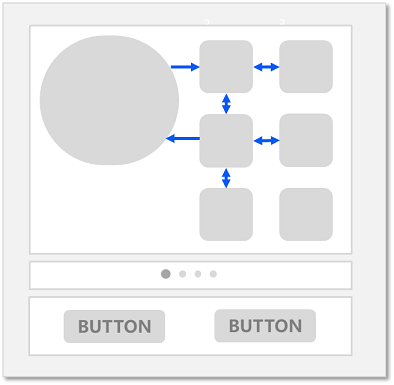
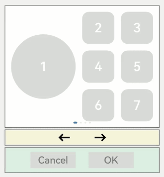
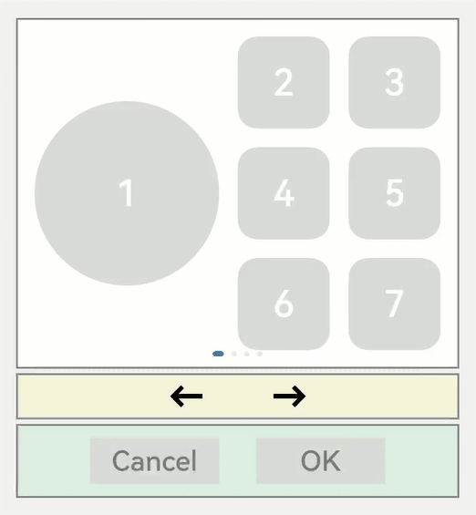
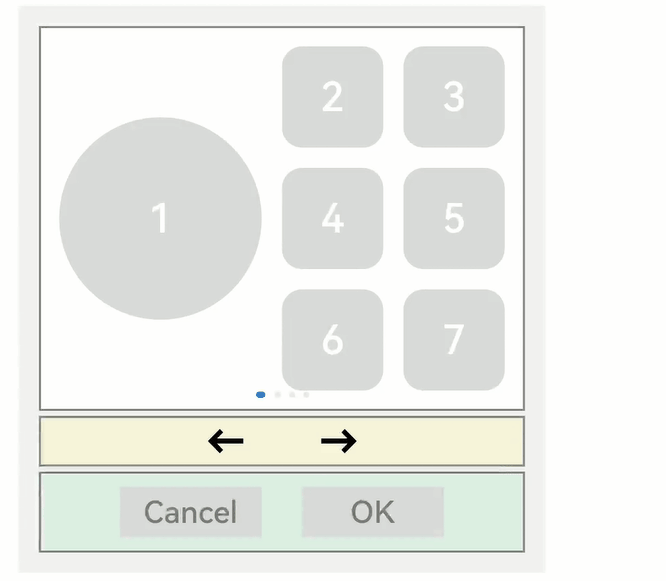
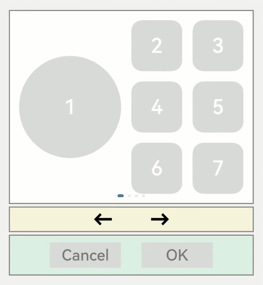
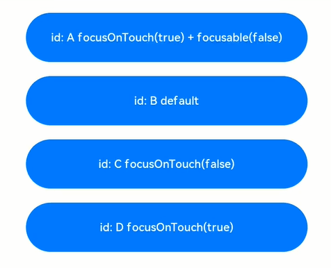
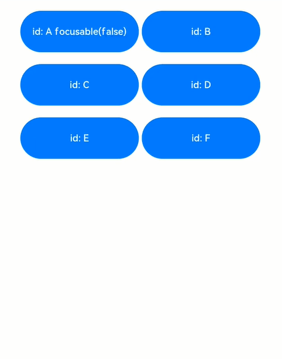

# Focus Event


## Basic Concepts

- Focus

  Focus points to a unique interactive element in the current window. When a user indirectly interacts with an application by using a non-directional input device such as a keyboard, a television remote control, or a vehicle-mounted joystick/knob, focus-based interaction is an important input means.

- Default focus

  After an application opens or switches to a page, the first focusable component (if any) in the component tree of the page is the default focus. You can [customize the default focus](#setting-default-focus) as needed.

- Focused

  A focused component is one that has focus. Only one end-point component in the application can receive focus at one time, and all the component's ancestor components along the focus chain are focused. If you want a component to be focused, ensure that the component and all its ancestor components are focusable (the [focusable](#setting-whether-a-component-is-focusable) attribute is set to **true**).

- Not focused

  A component is not focused when it loses focus. In this case, all its ancestor components and the components not on the same focus chain as the focused component are not focused.

- Focus navigation

  Focus navigation refers to a process in which the focus is transferred in the current application. It causes the original focused component to lose focus and a previously not focused component to receive focus. Focus navigation in applications can be classified into the following types by behavior:

  - Active navigation: A component is assigned focus due to subjective actions by developers or users, such as pressing the Tab or arrow keys on the external keyboard, using the [requestFocus](#focuscontrolrequestfocus) API, or clicking the component when the [focusOnTouch](#focusontouch) attribute is set to **true**.
  - Passive navigation: A component is assigned focus due to logical operations by the system. This focus navigation mode cannot be set by developers. For example, the system may assign focus to a component when the **if-else** statement is used to delete the focused component or set the focused component (or its parent component) to be unfocusable or when the page is switched.

- Focused state

  The focused state refers to the style of the focused component. It is similar among different components and is not visible by default. The focused state is visible only when the Tab or arrow keys on the external keyboard are pressed to move focus. The Tab key or arrow key that triggers the focused state for the first time does not trigger focus navigation. When the application receives a touch event (including a finger press event on the screen and a press event of a left mouse button), the focused state style is automatically hidden. The focused state style is defined by the backend component and cannot be modified by developers.


## Rules of Focus Navigation

Focus navigation follows the set rules regardless of whether it is active or passive focus navigation. By default, these rules are defined by the focus system and subject to the container where focus is located.

- Linear navigation: used in components where child components are arranged linearly, such as the **\<Flex>**, **\<Row>**, **\<Column>**, and **\<List>** components. The focus navigation direction is the same as the direction of the arrow keys.

    **Figure 1** Linear navigation 

      

  For example, in the **\<Row>** container, you can use the left and right arrow keys (←/→) to move focus between two adjacent focusable components.

- Cross navigation: used when the up (↑), down (↓), left (←), and right (→) arrow keys are pressed to move focus. The following figure shows a **\<Grid>** container where cross focus navigation is frequently seen.

    **Figure 2** Cross focus navigation in the \<Grid> component 

      

  >**NOTE**
  > - With the previous focus navigation rules, the functions of the Tab/Shift+Tab keys are the same as those of the arrow keys. Pressing the Tab key is equivalent to pressing the right arrow key and then, if the focus cannot be moved, the down arrow key. Pressing the Shift+Tab key is equivalent to pressing the left arrow key and then, if the focus cannot be moved, the up arrow key.
  >
  > - The key that triggers focus navigation is the press event (Down event).
  >
  > - After a component is deleted or set to be unfocusable, the linear navigation rule is followed. The focus automatically moves to the sibling component in front of the deleted or unfocusable component. If that component cannot receive focus, the focus is then moved to the sibling component on the rear.

- tabIndex-based navigation: Focus navigation with the Tab/Shift+Tab keys becomes sequential when the [tabIndex](../reference/arkui-ts/ts-universal-attributes-focus.md) attribute is set for the components.

- Area-based focus: You can define the order of sequential focus navigation and the default focused component, by setting the **tabIndex** attribute for a container component and the [groupDefaultFocus](#groupdefaultfocus) attribute.

- Rule for focusing on a container component: When a container component (for which **groupDefaultFocus** is not set) receives focus for the first time, the positions of its child components are calculated to identify the child component closest to the center of the container. The focus moves to this identified child component. If the container is not focused for the first time, the focus automatically moves to the child component that is focused last time in the container.

- Focus interaction: When a component is focused, the inherent click task of the component or the **onClick** callback task bound is automatically mounted to the space or carriage return key. When the key is pressed, the task is executed, just as in the case of a finger or mouse click.


>**NOTE**
>
>The focus involved in this topic refers to component focus. In real-world applications, the focus can also be window focus, which points to the currently focused window. When a window loses focus, all focused components in the window lose focus.


## Listening for Focus Changes


```ts
onFocus(event: () => void)
```


Triggered when the bound component obtains focus.


```ts
onBlur(event:() => void)
```


Triggered when the bound component loses focus.


The **onFocus** and **onBlur** APIs are usually used in pairs to listen for the focus changes of the component.


The following sample code shows how to use these APIs:


```ts
// xxx.ets
@Entry
@Component
struct FocusEventExample {
  @State oneButtonColor: Color = Color.Gray;
  @State twoButtonColor: Color = Color.Gray;
  @State threeButtonColor: Color = Color.Gray;

  build() {
    Column({ space: 20 }) {
      // You can use the up and down arrow keys on an external keyboard to move the focus between the three buttons. When a button gains focus, its color changes. When it loses focus, its color changes back.
      Button('First Button')
        .width(260)
        .height(70)
        .backgroundColor(this.oneButtonColor)
        .fontColor(Color.Black)
          // Listen for the focus obtaining event of the first component and change its color when it obtains focus.
        .onFocus(() => {
          this.oneButtonColor = Color.Green;
        })
          // Listen for the focus loss event of the first component and change its color when it loses focus.
        .onBlur(() => {
          this.oneButtonColor = Color.Gray;
        })

      Button('Second Button')
        .width(260)
        .height(70)
        .backgroundColor(this.twoButtonColor)
        .fontColor(Color.Black)
          // Listen for the focus obtaining event of the second component and change its color when it obtains focus.
        .onFocus(() => {
          this.twoButtonColor = Color.Green;
        })
          // Listen for the focus loss event of the second component and change its color when it loses focus.
        .onBlur(() => {
          this.twoButtonColor = Color.Grey;
        })

      Button('Third Button')
        .width(260)
        .height(70)
        .backgroundColor(this.threeButtonColor)
        .fontColor(Color.Black)
          // Listen for the focus obtaining event of the third component and change its color when it obtains focus.
        .onFocus(() => {
          this.threeButtonColor = Color.Green;
        })
          // Listen for the focus loss event of the third component and change its color when it loses focus.
        .onBlur(() => {
          this.threeButtonColor = Color.Gray ;
        })
    }.width('100%').margin({ top: 20 })
  }
}
```


The preceding example includes four steps:


1. When the application is opened, the **First Button** component obtains the focus by default, its **onFocus** callback is triggered, and its background color turns green.

2. When the Tab key (or the down arrow key) is pressed, **First Button** is in focused state, that is, there is a blue closed box outside the component. If no focus navigation is triggered, the focus remains on **First Button**.

3. When the Tab key (or the down arrow key) is pressed, the **Second Button** component is focused, its **onFocus** callback is triggered, and its background color turns green. **First Button** loses focus, its **onBlur** callback is triggered, and its background color turns gray.

4. When the Tab key (or the down arrow key) is pressed, the **Third Button** component is focused, its **onFocus** callback is triggered, and its background color turns green. **Second Button** loses focus, its **onBlur** callback is triggered, and its background color turns gray.


## Setting Whether a Component Is focusable

Use the **focusable** API to set whether a component is focusable.


```ts
focusable(value: boolean)
```

Components can be classified into the following types based on their focusability:

- Components that are focusable by default: These components are usually interactive components, such as **\<Button>**, **\<Checkbox>**, and **\<TextInput>**.

- Components that can be focused but are unfocusable by default: Typical examples are **\<Text>** and **\<Image>**. To enable them to be focusable, use the **focusable(true)** attribute.

- Components that cannot be focused: These components usually do not allow for interactions, such as **\<Blank>** and **\<Circle>**, and cannot be focused even if they use the **focusable** attribute.


>**NOTE**
> - If **focusable** is set to **false**, the component is unfocusable. The universal attribute [enabled](../reference/arkui-ts/ts-universal-attributes-enable.md) can also be used to make the component unfocusable.
>
> - When a component is in the focused state, if its **focusable** or **enabled** attribute is set to **false**, the component automatically loses focus. Then, the focus moves to other components based on the [Rules of Focus Navigation](#rules-of-focus-navigation).

  **Table 1** Focusability of basic components

| Basic Component                                    | Focusable| Default Value of focusable| Rules of Focus Navigation    |
| ---------------------------------------- | ------- | ------------ | -------- |
| [AlphabetIndexer](../reference/arkui-ts/ts-container-alphabet-indexer.md) | Yes      | true         | Linear navigation    |
| [Blank](../reference/arkui-ts/ts-basic-components-blank.md) | No      | false        | /        |
| [Button](../reference/arkui-ts/ts-basic-components-button.md) | Yes      | true         | /        |
| [Checkbox](../reference/arkui-ts/ts-basic-components-checkbox.md) | Yes      | true         | /        |
| [CheckboxGroup](../reference/arkui-ts/ts-basic-components-checkboxgroup.md) | Yes      | true         | /        |
| [DataPanel](../reference/arkui-ts/ts-basic-components-datapanel.md) | No      | false        | /        |
| [DatePicker](../reference/arkui-ts/ts-basic-components-datepicker.md) | Yes      | true         | Linear navigation    |
| [Divider](../reference/arkui-ts/ts-basic-components-divider.md) | No      | false        | /        |
| [Formcomponent](../reference/arkui-ts/ts-basic-components-formcomponent.md) | No      | false        | /        |
| [Gauge](../reference/arkui-ts/ts-basic-components-gauge.md) | No      | false        | /        |
| [Image](../reference/arkui-ts/ts-basic-components-image.md) | Yes      | false        | /        |
| [ImageAnimator](../reference/arkui-ts/ts-basic-components-imageanimator.md) | Yes      | false        | /        |
| [LoadingProgress](../reference/arkui-ts/ts-basic-components-loadingprogress.md) | No      | false        | /        |
| [Marquee](../reference/arkui-ts/ts-basic-components-marquee.md) | No      | false        | /        |
| [Menu](../reference/arkui-ts/ts-basic-components-menu.md) | Yes      | true         | Linear navigation    |
| [MenuItem](../reference/arkui-ts/ts-basic-components-menuitem.md) | Yes      | true         | /        |
| [MenuItemGroup](../reference/arkui-ts/ts-basic-components-menuitemgroup.md) | Yes      | true         | Linear navigation    |
| [Navigation](../reference/arkui-ts/ts-basic-components-navigation.md) | No      | false        | Customized   |
| [NavRouter](../reference/arkui-ts/ts-basic-components-navrouter.md) | No      | false        | Follows the child container   |
| [NavDestination](../reference/arkui-ts/ts-basic-components-navdestination.md) | No      | false        | Linear navigation    |
| [PatternLock](../reference/arkui-ts/ts-basic-components-patternlock.md) | No      | false        | /        |
| [PluginComponent](../reference/arkui-ts/ts-basic-components-plugincomponent.md) | No      | false        | /        |
| [Progress](../reference/arkui-ts/ts-basic-components-progress.md) | No      | false        | /        |
| [QRCode](../reference/arkui-ts/ts-basic-components-qrcode.md) | No      | false        | /        |
| [Radio](../reference/arkui-ts/ts-basic-components-radio.md) | Yes      | true         | /        |
| [Rating](../reference/arkui-ts/ts-basic-components-rating.md) | Yes      | true         | /        |
| [RemoteWindow](../reference/arkui-ts/ts-basic-components-remotewindow.md) | No      | false        | /        |
| [RichText](../reference/arkui-ts/ts-basic-components-richtext.md) | No      | false        | /        |
| [ScrollBar](../reference/arkui-ts/ts-basic-components-scrollbar.md) | No      | false        | /        |
| [Search](../reference/arkui-ts/ts-basic-components-search.md) | Yes      | true         | /        |
| [Select](../reference/arkui-ts/ts-basic-components-select.md) | Yes      | true         | Linear navigation    |
| [Slider](../reference/arkui-ts/ts-basic-components-slider.md) | Yes      | true         | /        |
| [Span](../reference/arkui-ts/ts-basic-components-span.md) | No      | false        | /        |
| [Stepper](../reference/arkui-ts/ts-basic-components-stepper.md) | Yes      | true         | /        |
| [StepperItem](../reference/arkui-ts/ts-basic-components-stepperitem.md) | Yes      | true         | /        |
| [Text](../reference/arkui-ts/ts-basic-components-text.md) | Yes      | false        | /        |
| [TextArea](../reference/arkui-ts/ts-basic-components-textarea.md) | Yes      | true         | /        |
| [TextClock](../reference/arkui-ts/ts-basic-components-textclock.md) | No      | false        | /        |
| [TextInput](../reference/arkui-ts/ts-basic-components-textinput.md) | Yes      | true         | /        |
| [TextPicker](../reference/arkui-ts/ts-basic-components-textpicker.md) | Yes      | true         | Linear navigation    |
| [TextTimer](../reference/arkui-ts/ts-basic-components-texttimer.md) | No      | false        | /        |
| [TimePicker](../reference/arkui-ts/ts-basic-components-timepicker.md) | Yes      | true         | Linear navigation    |
| [Toggle](../reference/arkui-ts/ts-basic-components-toggle.md) | Yes      | true         | /        |
| [Web](../reference/arkui-ts/ts-basic-components-web.md) | Yes      | true         | Customized|
| [XComponent](../reference/arkui-ts/ts-basic-components-xcomponent.md) | No      | false        | /        |

  **Table 2** Focusability of container components

| Container Component                                    | Focusable| Default Value of focusable| Rules of Focus Navigation    |
| ---------------------------------------- | ----- | ------------ | -------- |
| [AbilityComponent](../reference/arkui-ts/ts-container-ability-component.md) | No    | false        | /        |
| [Badge](../reference/arkui-ts/ts-container-badge.md) | No    | false        | /        |
| [Column](../reference/arkui-ts/ts-container-column.md) | Yes    | true         | Linear navigation    |
| [ColumnSplit](../reference/arkui-ts/ts-container-columnsplit.md) | Yes    | true         | /        |
| [Counter](../reference/arkui-ts/ts-container-counter.md) | Yes    | true         | Linear navigation    |
| [Flex](../reference/arkui-ts/ts-container-flex.md) | Yes    | true         | Linear navigation    |
| [GridCol](../reference/arkui-ts/ts-container-gridcol.md) | Yes    | true         | Customized |
| [GridRow](../reference/arkui-ts/ts-container-gridrow.md) | Yes    | true         | Customized |
| [Grid](../reference/arkui-ts/ts-container-grid.md) | Yes    | true         | Customized |
| [GridItem](../reference/arkui-ts/ts-container-griditem.md) | Yes    | true         | Follows the child component   |
| [List](../reference/arkui-ts/ts-container-list.md) | Yes    | true         | Linear navigation    |
| [ListItem](../reference/arkui-ts/ts-container-listitem.md) | Yes    | true         | Follows the child component   |
| [ListItemGroup](../reference/arkui-ts/ts-container-listitemgroup.md) | Yes    | true         | Follows the **\<List>** component|
| [Navigator](../reference/arkui-ts/ts-container-navigator.md) | No    | true         | Customized |
| [Panel](../reference/arkui-ts/ts-container-panel.md) | No    | true         | Follows the child component   |
| [Refresh](../reference/arkui-ts/ts-container-refresh.md) | No    | false        | /        |
| [RelativeContainer](../reference/arkui-ts/ts-container-relativecontainer.md) | No    | true         | Customized |
| [Row](../reference/arkui-ts/ts-container-row.md) | Yes    | true         | Linear navigation    |
| [RowSplit](../reference/arkui-ts/ts-container-rowsplit.md) | Yes    | true         | /        |
| [Scroll](../reference/arkui-ts/ts-container-scroll.md) | Yes    | true         | Linear navigation    |
| [SideBarContainer](../reference/arkui-ts/ts-container-sidebarcontainer.md) | Yes    | true         | Linear navigation    |
| [Stack](../reference/arkui-ts/ts-container-stack.md) | Yes    | true         | Linear navigation    |
| [Swiper](../reference/arkui-ts/ts-container-swiper.md) | Yes    | true         | Customized |
| [Tabs](../reference/arkui-ts/ts-container-tabs.md) | Yes    | true         | Customized |
| [TabContent](../reference/arkui-ts/ts-container-tabcontent.md) | Yes    | true         | Follows the child component   |

  **Table 3** Focusability of media components

| Media Component                                    | Focusable| Default Value of focusable| Rules of Focus Navigation|
| ---------------------------------------- | ----- | ------------ | ---- |
| [Video](../reference/arkui-ts/ts-media-components-video.md) | Yes    | true         | /    |

  **Table 4** Focusability of canvas components

| Canvas Component                                    | Focusable| Default Value of focusable| Rules of Focus Navigation|
| ---------------------------------------- | ----- | ------------ | ---- |
| [Canvas](../reference/arkui-ts/ts-components-canvas-canvas.md) | No    | false        | /    |


The following example shows how to use the **focusable** API:


```ts
// xxx.ets
@Entry
@Component
struct FocusableExample {
  @State textFocusable: boolean = true;
  @State color1: Color = Color.Yellow;
  @State color2: Color = Color.Yellow;

  build() {
    Column({ space: 5 }) {
      Text('Default Text')    // The focusable attribute is not set for the first <Text> component. By default, the component is unfocusable.
        .borderColor(this.color1)
        .borderWidth(2)
        .width(300)
        .height(70)
        .onFocus(() => {
          this.color1 = Color.Blue;
        })
        .onBlur(() => {
          this.color1 = Color.Yellow;
        })
      Divider()

      Text('focusable: ' + this.textFocusable)    // The focusable attribute is set for the second <Text> component. The initial value is true.
        .borderColor(this.color2)
        .borderWidth(2)
        .width(300)
        .height(70)
        .focusable(this.textFocusable)
        .onFocus(() => {
          this.color2 = Color.Blue;
        })
        .onBlur(() => {
          this.color2 = Color.Yellow;
        })

      Divider()

      Row() {
        Button('Button1')
          .width(140).height(70)
        Button('Button2')
          .width(160).height(70)
      }

      Divider()
      Button('Button3')
        .width(300).height(70)

      Divider()
    }.width('100%').justifyContent(FlexAlign.Center)
    .onKeyEvent((e) => {    // Bind onKeyEvent. When the <Column> component is focused, pressing F can reverse the focusable attribute of the second <Text> component.
      if (e.keyCode === 2022 && e.type === KeyType.Down) {
        this.textFocusable = !this.textFocusable;
      }
    })
  }
}
```


Operation result:


The preceding example includes two parts: default focus and active navigation.


**Default focus:**


- According to the definition of the default focus, after the application is opened, the first focusable element is focused by default.

- As the **focusable** attribute is not set for the first **\<Text>** component, it cannot be focused.

- The **focusable** attribute of the second **\<Text>** component is explicitly set to **true**. In this case, the default focus is placed on the component.


**Active navigation:**


Pressing **F** on the keyboard triggers **onKeyEvent**, which sets **focusable** to **false** and makes the **\<Text>** component unfocusable. In this case, the focus automatically shifts. According to the description in passive focus, the system automatically searches for the immediate focusable component above the **\<Text>** component, which is an unfocusable **\<Text>** component. Therefore, the system searches for the next focusable component, finds and moves the focus to the **\<Row>** container, and calculates the positions of **Button1** and **Button2** based on the [rule for focusing on a container component](#rules-of-focus-navigation). Because **Button2** is larger than **Button1**, the focus automatically moves to **Button2**.


## Setting Default Focus


```ts
defaultFocus(value: boolean)
```

When the page is constructed for the first time, the focus system searches for all components on the current page, finds the first component bound to **defaultFocus(true)**, and sets the component as the default focus. If no component is bound to **defaultFocus(true)**, the first focusable component is set as the default focus.

Below is an application layout.



The following is the sample code for implementing the application layout, and **defaultFocus** is not set in the sample code:


```ts
// xxx.ets
import promptAction from '@ohos.promptAction';

class MyDataSource implements IDataSource {
  private list: number[] = [];
  private listener: DataChangeListener;

  constructor(list: number[]) {
    this.list = list;
  }

  totalCount(): number {
    return this.list.length;
  }

  getData(index: number): any {
    return this.list[index];
  }

  registerDataChangeListener(listener: DataChangeListener): void {
    this.listener = listener;
  }

  unregisterDataChangeListener() {
  }
}

@Entry
@Component
struct SwiperExample {
  private swiperController: SwiperController = new SwiperController()
  private data: MyDataSource = new MyDataSource([])

  aboutToAppear(): void {
    let list = []
    for (let i = 1; i <= 4; i++) {
      list.push(i.toString());
    }
    this.data = new MyDataSource(list);
  }

  build() {
    Column({ space: 5 }) {
      Swiper(this.swiperController) {
        LazyForEach(this.data, (item: string) => {
          Row({ space: 20 }) {
            Column() {
              Button('1').width(200).height(200)
                .fontSize(40)
                .backgroundColor('#dadbd9')
            }

            Column({ space: 20 }) {
              Row({ space: 20 }) {
                Button('2')
                  .width(100)
                  .height(100)
                  .fontSize(40)
                  .type(ButtonType.Normal)
                  .borderRadius(20)
                  .backgroundColor('#dadbd9')
                Button('3')
                  .width(100)
                  .height(100)
                  .fontSize(40)
                  .type(ButtonType.Normal)
                  .borderRadius(20)
                  .backgroundColor('#dadbd9')
              }

              Row({ space: 20 }) {
                Button('4')
                  .width(100)
                  .height(100)
                  .fontSize(40)
                  .type(ButtonType.Normal)
                  .borderRadius(20)
                  .backgroundColor('#dadbd9')
                Button('5')
                  .width(100)
                  .height(100)
                  .fontSize(40)
                  .type(ButtonType.Normal)
                  .borderRadius(20)
                  .backgroundColor('#dadbd9')
              }

              Row({ space: 20 }) {
                Button('6')
                  .width(100)
                  .height(100)
                  .fontSize(40)
                  .type(ButtonType.Normal)
                  .borderRadius(20)
                  .backgroundColor('#dadbd9')
                Button('7')
                  .width(100)
                  .height(100)
                  .fontSize(40)
                  .type(ButtonType.Normal)
                  .borderRadius(20)
                  .backgroundColor('#dadbd9')
              }
            }
          }
          .width(480)
          .height(380)
          .justifyContent(FlexAlign.Center)
          .borderWidth(2)
          .borderColor(Color.Gray)
          .backgroundColor(Color.White)
        }, item => item)
      }
      .cachedCount(2)
      .index(0)
      .interval(4000)
      .indicator(true)
      .loop(true)
      .duration(1000)
      .itemSpace(0)
      .curve(Curve.Linear)
      .onChange((index: number) => {
        console.info(index.toString());
      })
      .margin({ left: 20, top: 20, right: 20 })

      Row({ space: 40 }) {
        Button('←')
          .fontSize(40)
          .fontWeight(FontWeight.Bold)
          .fontColor(Color.Black)
          .backgroundColor(Color.Transparent)
          .onClick(() => {
            this.swiperController.showPrevious();
          })
        Button('→')
          .fontSize(40)
          .fontWeight(FontWeight.Bold)
          .fontColor(Color.Black)
          .backgroundColor(Color.Transparent)
          .onClick(() => {
            this.swiperController.showNext();
          })
      }
      .width(480)
      .height(50)
      .justifyContent(FlexAlign.Center)
      .borderWidth(2)
      .borderColor(Color.Gray)
      .backgroundColor('#f7f6dc')

      Row({ space: 40 }) {
        Button('Cancel')
          .fontSize(30)
          .fontColor('#787878')
          .type(ButtonType.Normal)
          .width(140)
          .height(50)
          .backgroundColor('#dadbd9')
        
        Button('OK')
          .fontSize(30)
          .fontColor('#787878')
          .type(ButtonType.Normal)
          .width(140)
          .height(50)
          .backgroundColor('#dadbd9')
          .onClick(() => {
            promptAction.showToast({ message: 'Button OK on clicked' });
          })
      }
      .width(480)
      .height(80)
      .justifyContent(FlexAlign.Center)
      .borderWidth(2)
      .borderColor(Color.Gray)
      .backgroundColor('#dff2e4')
      .margin({ left: 20, bottom: 20, right: 20 })
    }.backgroundColor('#f2f2f2')
    .margin({ left: 50, top: 50, right: 20 })
  }
}
```


As **defaultFocus** is not set in the application, the first focusable component obtains the focus by default. Pressing the Tab key or arrow keys can set the focused component to enter the focused state.





Assume that you want to perform the **onClick** callback of the **OK** button without switching the focus when opening the application. In this case, you can bind **defaultFocus(true)** to the button, make it the default focus on the page.


```ts
Button('OK')
  .defaultFocus(true)    // Bind defaultFocus to the OK button.
  .fontSize(30)
  .fontColor('#787878')
  .type(ButtonType.Normal)
  .width(140).height(50).backgroundColor('#dadbd9')
  .onClick(() => {
    promptAction.showToast({ message: 'Button OK on clicked' });
  })
```





When the application is opened, pressing the Tab key switches the **OK** button to the focused state, indicating that the default focus is changed to the button. After the space key is pressed, the **onClick **event of the **OK** button is triggered.


## Setting the Order for Sequential Tab Navigation


```ts
tabIndex(index: number)
```

Use **tabIndex** to set the order for sequential Tab navigation. The default value is **0**. In Tab navigation, where Tab/Shift+Tab is used (the arrow keys do not affect the navigation), the focus system automatically obtains all components whose **tabIndex** is greater than 0 and moves focus in ascending or descending order.


With the example provided in [Setting Default Focus](#setting-default-focus), the default order for sequential focus navigation is as follows:





The default order for sequential Tab navigation is from the first focusable component to the last focusable component, and the process goes through Button1 -> Button4 -> Button5 -> Button7 -> Left arrow -> Right arrow -> ButtonOK. This focus navigation queue is relatively complete and traverses most of the components. However, the disadvantage is that the path from the first to the last is long.


If you want to quickly go from the first to the last without sacrificing too much traversal integrity, you can use the **tabIndex** attribute.


For example, take the white area, the yellow area, and the green area each as a unit. To implement the focus navigation queue of Button1 -> Left arrow -> Button-OK, you only need to add **tabIndex(1)**, **tabIndex(2)**, and **tabIndex(3)** to the Button1, left arrow, and ButtonOK components in sequence. The **tabIndex** attribute indicates how a component participates in sequential Tab navigation. A component with a larger value gains focus later than one with a smaller value.


```ts
  Button('1').width(200).height(200)
    .fontSize(40)
    .backgroundColor('#dadbd9')
    .tabIndex(1)    // Set Button1 as the first tabIndex node.
```


```ts
  Button('←')
    .fontSize(40)
    .fontWeight(FontWeight.Bold)
    .fontColor(Color.Black)
    .backgroundColor(Color.Transparent)
    .onClick(() => {
      this.swiperController.showPrevious();
    })
    .tabIndex(2)    // Set Button-left arrow as the second tabIndex node.
```


```ts
Button('OK')
  .fontSize(30)
  .fontColor('#787878')
  .type(ButtonType.Normal)
  .width(140).height(50).backgroundColor('#dadbd9')
  .onClick(() => {
    promptAction.showToast({ message: 'Button OK on clicked' });
  })
  .tabIndex(3)    // Set Button-OK as the third tabIndex node.
```


>**NOTE**
> - When the focus is on a tabIndex (greater than 0) node, after Tab/Shift+Tab is pressed, the focus system preferentially searches for the rear/front node in the tabIndex (greater than 0) queue. If the rear/front node exists, the focus system moves the focus to that node. If the node does not exist, the default focus logic is used to move the focus backward or forward.
>
> - When the focus is on the tabIndex (equal to 0) node, the focus system uses the default focus navigation logic. During the navigation, the tabIndex (greater than 0) and tabIndex (less than 0) nodes are skipped.
>
> - When the focus is on a tabIndex (less than 0) node, pressing Tab/Shift+Tab does not move the focus.


### groupDefaultFocus


```ts
groupDefaultFocus(value: boolean)
```

Using **tabIndex** to [set the order for sequential Tab navigation](#setting-the-order-for-sequential-tab-navigation) has the following issues:

While a component is set as a tabIndex node (white-Button1, yellow-left arrow, and green-ButtonOK) in each area (white, yellow, and green), focus moves quicly only within these components in Tab navigation.

The solution is to set **tabIndex** for the container of each area. However, when a container receives focus for the first time, the focused child component is the first focusable component by default, not the desired component (Button1, left arrow, and ButtonOK).

To address this issue, the **groupDefaultFocus** attribute is introduced, whose value type is boolean and default value is **false**.

This attribute must be used together with **tabIndex**. Use **tabIndex** to bind the focus sequence to the areas (containers), and then bind **groupDefaultFocus(true)** to Button1, left arrow, and ButtonOK. In this way, when the target area (container) is focused for the first time, its child components bound to **groupDefaultFocus(true)** get the focus at the same time.


```ts
// xxx.ets
import promptAction from '@ohos.promptAction';

class MyDataSource implements IDataSource {
  private list: number[] = [];
  private listener: DataChangeListener;

  constructor(list: number[]) {
    this.list = list;
  }

  totalCount(): number {
    return this.list.length;
  }

  getData(index: number): any {
    return this.list[index];
  }

  registerDataChangeListener(listener: DataChangeListener): void {
    this.listener = listener;
  }

  unregisterDataChangeListener() {
  }
}

@Entry
@Component
struct SwiperExample {
  private swiperController: SwiperController = new SwiperController()
  private data: MyDataSource = new MyDataSource([])

  aboutToAppear(): void {
    let list = []
    for (let i = 1; i <= 4; i++) {
      list.push(i.toString());
    }
    this.data = new MyDataSource(list);
  }

  build() {
    Column({ space: 5 }) {
      Swiper(this.swiperController) {
        LazyForEach(this.data, (item: string) => {
          Row({ space: 20 }) {    // Set the <Row> component as the first tabIndex node.
            Column() {
              Button('1').width(200).height(200)
                .fontSize(40)
                .backgroundColor('#dadbd9')
                .groupDefaultFocus(true)    // Set Button-1 as the default focus of the first tabIndex node.
            }

            Column({ space: 20 }) {
              Row({ space: 20 }) {
                Button('2')
                  .width(100)
                  .height(100)
                  .fontSize(40)
                  .type(ButtonType.Normal)
                  .borderRadius(20)
                  .backgroundColor('#dadbd9')
                Button('3')
                  .width(100)
                  .height(100)
                  .fontSize(40)
                  .type(ButtonType.Normal)
                  .borderRadius(20)
                  .backgroundColor('#dadbd9')
              }

              Row({ space: 20 }) {
                Button('4')
                  .width(100)
                  .height(100)
                  .fontSize(40)
                  .type(ButtonType.Normal)
                  .borderRadius(20)
                  .backgroundColor('#dadbd9')
                Button('5')
                  .width(100)
                  .height(100)
                  .fontSize(40)
                  .type(ButtonType.Normal)
                  .borderRadius(20)
                  .backgroundColor('#dadbd9')
              }

              Row({ space: 20 }) {
                Button('6')
                  .width(100)
                  .height(100)
                  .fontSize(40)
                  .type(ButtonType.Normal)
                  .borderRadius(20)
                  .backgroundColor('#dadbd9')
                Button('7')
                  .width(100)
                  .height(100)
                  .fontSize(40)
                  .type(ButtonType.Normal)
                  .borderRadius(20)
                  .backgroundColor('#dadbd9')
              }
            }
          }
          .width(480)
          .height(380)
          .justifyContent(FlexAlign.Center)
          .borderWidth(2)
          .borderColor(Color.Gray)
          .backgroundColor(Color.White)
          .tabIndex(1)
        }, item => item)
      }
      .cachedCount(2)
      .index(0)
      .interval(4000)
      .indicator(true)
      .loop(true)
      .duration(1000)
      .itemSpace(0)
      .curve(Curve.Linear)
      .onChange((index: number) => {
        console.info(index.toString());
      })
      .margin({ left: 20, top: 20, right: 20 })

      Row({ space: 40 }) {    // Set the <Row> component as the second tabIndex node.
        Button('←')
          .fontSize(40)
          .fontWeight(FontWeight.Bold)
          .fontColor(Color.Black)
          .backgroundColor(Color.Transparent)
          .onClick(() => {
            this.swiperController.showPrevious();
          })
          .groupDefaultFocus(true)    // Set the Button-left arrow as the default focus of the second tabIndex node.
        Button('→')
          .fontSize(40)
          .fontWeight(FontWeight.Bold)
          .fontColor(Color.Black)
          .backgroundColor(Color.Transparent)
          .onClick(() => {
            this.swiperController.showNext();
          })
      }
      .width(480)
      .height(50)
      .justifyContent(FlexAlign.Center)
      .borderWidth(2)
      .borderColor(Color.Gray)
      .backgroundColor('#f7f6dc')
      .tabIndex(2)

      Row({ space: 40 }) {    // Set the <Row> component as the third tabIndex node.
        Button('Cancel')
          .fontSize(30)
          .fontColor('#787878')
          .type(ButtonType.Normal)
          .width(140)
          .height(50)
          .backgroundColor('#dadbd9')

        Button('OK')
          .fontSize(30)
          .fontColor('#787878')
          .type(ButtonType.Normal)
          .width(140)
          .height(50)
          .backgroundColor('#dadbd9')
          .defaultFocus(true)
          .onClick(() => {
            promptAction.showToast({ message: 'Button OK on clicked' });
          })
          .groupDefaultFocus(true)    // Set Button-OK as the default focus of the third tabIndex node.
      }
      .width(480)
      .height(80)
      .justifyContent(FlexAlign.Center)
      .borderWidth(2)
      .borderColor(Color.Gray)
      .backgroundColor('#dff2e4')
      .margin({ left: 20, bottom: 20, right: 20 })
      .tabIndex(3)
    }.backgroundColor('#f2f2f2')
    .margin({ left: 50, top: 50, right: 20 })
  }
}
```


### focusOnTouch


```ts
focusOnTouch(value: boolean)
```

Sets whether a component is focusable on touch (touching or left-clicking). The parameter value type is boolean and the default value is **false**. The default value is **true** for input components: TextInput, TextArea, Search, and Web.

By binding **focusOnTouch(true)** to a component whose default value is **false**, such as **\<Button>**, you enable the component to become focused on touch.

When **focusOnTouch(true)** is bound to a container and the container area is clicked, the first focusable component of the container is immediately focused.

The sample code is as follows:


```ts
// requestFocus.ets
import promptAction from '@ohos.promptAction';

@Entry
@Component
struct RequestFocusExample {
  @State idList: string[] = ['A', 'B', 'C', 'D', 'E', 'F', 'N']

  build() {
    Column({ space:20 }){
      Button("id: " + this.idList[0] + " focusOnTouch(true) + focusable(false)")
        .width(400).height(70).fontColor(Color.White).focusOnTouch(true)
        .focusable(false)
      Button("id: " + this.idList[1] + " default")
        .width(400).height(70).fontColor(Color.White)
      Button("id: " + this.idList[2] + " focusOnTouch(false)")
        .width(400).height(70).fontColor(Color.White).focusOnTouch(false)
      Button("id: " + this.idList[3] + " focusOnTouch(true)")
        .width(400).height(70).fontColor(Color.White).focusOnTouch(true)
    }.width('100%').margin({ top:20 })
  }
}
```





Interpretation:


Because **focusOnTouch(true)** and **focusable(false)** are both set for Button-A, the component is unfocusable and cannot be focused on touch.


No related attributes are set for Button-B, and therefore it cannot be focused on touch.


**focusOnTouch(false)** is set for Button-C, and therefore it cannot be focused on touch, just as Button-B.


**focusOnTouch(true)** is set for Button-D, and therefore it is focused on touch.


>**NOTE**
>
>Due to the feature of the focused state, the focused state is cleared immediately after the screen receives a touch event. Therefore, each time a component is clicked, you need to press the Tab key again to display the focused state again. In this way, you can know the component where the focus is located.


### focusControl.requestFocus


```ts
focusControl.requestFocus(id: string)
```

Requests the focus to move to the specified component. This API can be used in global method statements. The parameter **id** indicates the target component to focus, which is the string bound to the component using the universal attribute **id**.


The usage method is as follows: Invoke the API in any execution statement and specify the ID of the target component as the input parameter. When the program executes the statement, it immediately requests focus for the specified target component.


Sample code:


```ts
// requestFocus.ets
import promptAction from '@ohos.promptAction';

@Entry
@Component
struct RequestFocusExample {
  @State idList: string[] = ['A', 'B', 'C', 'D', 'E', 'F', 'N']
  @State requestId: number = 0

  build() {
    Column({ space:20 }){
      Row({space: 5}) {
        Button("id: " + this.idList[0] + " focusable(false)")
          .width(200).height(70).fontColor(Color.White)
          .id(this.idList[0])
          .focusable(false)
        Button("id: " + this.idList[1])
          .width(200).height(70).fontColor(Color.White)
          .id(this.idList[1])
      }
      Row({space: 5}) {
        Button("id: " + this.idList[2])
          .width(200).height(70).fontColor(Color.White)
          .id(this.idList[2])
        Button("id: " + this.idList[3])
          .width(200).height(70).fontColor(Color.White)
          .id(this.idList[3])
      }
      Row({space: 5}) {
        Button("id: " + this.idList[4])
          .width(200).height(70).fontColor(Color.White)
          .id(this.idList[4])
        Button("id: " + this.idList[5])
          .width(200).height(70).fontColor(Color.White)
          .id(this.idList[5])
      }
    }.width('100%').margin({ top:20 })
    .onKeyEvent((e) => {
      if (e.keyCode >= 2017 && e.keyCode <= 2022) {
        this.requestId = e.keyCode - 2017;
      } else if (e.keyCode === 2030) {
        this.requestId = 6;
      } else {
        return;
      }
      if (e.type !== KeyType.Down) {
        return;
      }
      let res = focusControl.requestFocus(this.idList[this.requestId]);
      if (res) {
        promptAction.showToast({message: 'Request success'});
      } else {
        promptAction.showToast({message: 'Request failed'});
      }
    })
  }
}
```





Interpretation: There are six **\<Button>** components on the page. **Focusable(false)** is set for Button-A, indicating that Button-A cannot be focused. In **onKeyEvent** of the external container, key events are listened. When A to F keys are pressed, the focus is requested for Buttons A to F. If you press N, the focus is requested the component whose ID does not exist on the current page.


1. Press the Tab key. Because the first component Button-A cannot be focused, the second component Button-B is focused by default, and Button-B is displayed in the focused state.

2. Press A on the keyboard to request the focus for Button-A. The message "Request failed" is displayed, indicating that the focus cannot be obtained. The focus position remains unchanged.

3. Press B on the keyboard to request the focus for Button-B. The message "Request success" is displayed, indicating that the focus is on Button-B. The focus position remains unchanged.

4. Press C on the keyboard to request the focus for Button-C. The message "Request success" is displayed, indicating that the focus is on Button-C. The focus position changes from Button-B to Button-C.

5. Press D on the keyboard to request the focus for Button-D. The message "Request success" is displayed, indicating that the focus is on Button-D. The focus position changes from Button-C to Button-D.

6. Press E on the keyboard to request the focus for Button-E. The message "Request success" is displayed, indicating that the focus is on Button-E. The focus position changes from Button-D to Button-E.

7. Press F on the keyboard to request the focus for Button-F. The message "Request success" is displayed, indicating that the focus is on Button-F. The focus position changes from Button-E to Button-F.

8. Press N on the keyboard to request the focus for an unknown component. The message "Request failed" is displayed, indicating that the focus cannot be obtained and the focus position remains unchanged.
