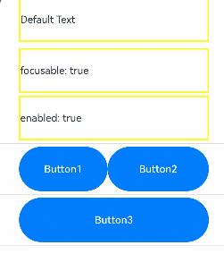
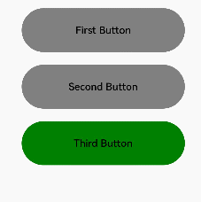
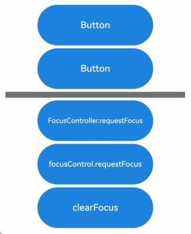

# Focus Event

## Basic Concepts and Specifications

### Basic Concepts

**Focus, Focus Chain, and Focus Traversal**

- Focus: refers to the single interactive element on the current application screen. When users interact indirectly with the application using non-pointing input devices such as keyboards, TV remote controls, or in-car joysticks/knobs, navigation and interaction based on focus are crucial means of input.
- Focus chain: refers to the sequence of nodes from the root to a focused component in the application's component tree, where all nodes are considered focused.
- Focus traversal: refers to the behavior of focus shifting between components in an application. This process is transparent to the user but can be monitored through **onFocus** and **onBlur** events. For details on how focus traversal is managed, see [Focus Traversal Guidelines](#focus-traversal-guidelines)


**Focus State**

Refers to the style indicating the currently focused component.

- Display rules: The focus state is not displayed by default; it only appears when the application is active. A component with the focus state is definitely focused, but not all focused components show the state, depending on the activation status. Most components come with default focus state styles; you customize these styles when needed. Once customized, the component will no longer display the default focus state style. In a focus chain, if multiple components have the focus state, the system shows the focus state for only one, prioritizing the child component's focus state over others.
- Entering the activated state: Pressing the **Tab** key on an external keyboard or using the **activate(true)** API of **FocusController** activates focus, allowing subsequent use of the **Tab** key or arrow keys for focus traversal. The initial **Tab** press that activates focus does not cause focus to move.
- Exiting the activated state: Focus activation ends when the application receives either the **activate(true)** API call from **FocusController** or any form of click event, such as touch screen presses or mouse clicks.


**Hierarchical Pages**

Hierarchical pages are specialized container components, such as **Page**, **Dialog**, **SheetPage**, **ModalPage**, **Menu**, **Popup**, **NavBar**, and **NavDestination**, within a focus framework. These components typically have the following key features:

- Visual layering: They appear on top of other content, creating a distinct visual hierarchy.
- Focus capture: They automatically take focus when first displayed.
- Focus limitation: When focus is within these components, users cannot use keyboard keys to move focus outside to other elements. In other words, focus movement is confined within the component.

An application always has at least one hierarchical page in focus. When this hierarchical page is closed or no longer visible, the focus shifts to another, ensuring smooth user interaction.

> **NOTE**
>
> The **Popup** component does not capture focus if it has **focusable** set to **false**.
>
> The **NavBar** and **NavDestination** components do not restrict focus movement and share the focus scope of their immediate parent hierarchical page.

**Root Container**

In hierarchical pages, the root container is where the default focus resides when the page is first shown.

You can change the default focus using the **defaultFocus** attribute.

Pressing **Tab** with focus on the root container activates focus and passes it to child components. Focus proceeds to the last focused child or the first child if no previous focus exists, until it reaches the leaf node.


### Focus Traversal Guidelines

Focus traversal can be divided into active and passive based on how it is triggered.

**Active Focus Traversal**


Active focus traversal refers to focus movement initiated by deliberate actions, such as keyboard shortcuts (**Tab**, **Shift+Tab**, arrow keys) and programmatic focus control through **requestFocus**, **clearFocus**, and **focusOnTouch**.


- Keyboard traversal
1. Prerequisite: The application is in the focus activated state.
2. Scope: limited to the currently focused hierarchical page, as detailed in the "Focus limitation" section under "Hierarchical Pages."
3. Key types:
**Tab** key: follows a Z-shaped logic to traverse all leaf nodes within the scope, looping back to the first after the last.
**Shift+Tab**: reverses the direction of the **Tab** key.
Arrow keys (up, down, left, and right): moves focus in a cross-shaped pattern, with container-specific algorithms determining the next focus in a single-layer container. If the algorithm determines the next focus should be on a container component, the system uses a center-point distance priority algorithm to further identify the target child node within the container.
4. Traversal algorithm: Each focusable container has a unique algorithm defining how focus moves.
5. Priority: Child components take precedence in handling keyboard events over parents.

- requestFocus
Moves focus to a specific component, which is allowed across hierarchical pages but not across windows or different ArkUI instances.
For details, see [Active Focus Acquisition/Loss](#active-focus-acquisitionloss).

- clearFocus
Clears the focus within the current hierarchical page, with the focus reverting to the root container. For details, see [clearFocus](../reference/apis-arkui/arkui-ts/ts-universal-attributes-focus.md#clearfocus12).

- focusOnTouch
Enables a component to gain focus on touch. It is ineffective on non-focusable components. For container components, focus goes to the last focused child or the first focusable child upon touch. For details, see [focusOnTouch](../reference/apis-arkui/arkui-ts/ts-universal-attributes-focus.md#focusontouch9).


**Passive Focus Traversal**

Passive focus traversal occurs when the focus automatically shifts due to system actions or other operations without developer intervention, reflecting the default behavior of the focus system.


Mechanisms that trigger passive focus traversal include:

- Component removal: If a focused component is removed, the system tries to shift focus to the next available sibling, following a back-to-front order. If no siblings are focusable, focus is released to the parent component.
- Attribute change: Changing a component's **focusable** or **enabled** to **false**, or **visibility** to invisible causes the system to automatically move focus to another focusable component, using the same method as for component removal.
- Hierarchical page transition: During switching between hierarchical pages, the current page's focus is automatically released, and the new page may automatically gain focus according to preset logic.
- **Web** component initialization: The **Web** component may immediately gain focus upon creation if designed to do so (for example, certain dialog boxes or text boxes), which is part of the component's behavior and not governed by the focus framework specifications.


### Focus Traversal Algorithms

In the focus management system, every focusable container is assigned a specific algorithm that dictates how focus moves from the current to the next focusable child component when **Tab**, **Shift+Tab**, or arrow keys are used.

The algorithm used by a container is based on its UX design and is implemented by the component itself. The focus framework supports three focus traversal algorithms: linear, projection, and custom.


**Linear Focus Traversal Algorithm**


The linear focus traversal algorithm is the default algorithm, focusing on the order of child nodes in the node tree, commonly used in single-direction layouts such as **Row**, **Column**, and **Flex** containers. Its operation rules are as follows:


- Order dependency: The focus order is based solely on the mounting sequence of child nodes in the node tree, independent of their visual layout.
- **Tab** key traversal: The **Tab** key moves focus through nodes in their mounting sequence.
- Arrow key traversal: Arrow keys perpendicular to the container's layout direction are ignored. For example, a horizontal **Row** container does not accept focus requests from up and down keys.
- Boundary handling: The container rejects focus requests in the opposite direction from the current focus edge. For example, if the focus is on the first child of a horizontal **Row** container, it won't process leftward focus requests.


**Projection Focus Traversal Algorithm**

The projection focus traversal algorithm determines the next focus based on the overlap area and center-point distance of the projection of the current focused component in the direction of focus movement. It is particularly suitable for containers with varying child sizes, such as the **Flex** component with the **wrap** attribute. Its operation rules are as follows:


- Arrow keys: Focus goes to the child with the largest overlap area and the shortest center-point distance to the projection of the current focus. If multiple children qualify, the first in the node tree is chosen. If no components overlap with the projection, the focus request is unprocessable.
- **Tab** key: It mimics a rightward shift to find the next focus; if none is available, it simulates moving the current focus down its height, and then checks leftward. The child farthest in the direction with overlapping projection wins.
- **Shift+Tab** key: It mimics a leftward shift to find the next focus; if none is available, it simulates moving the current focus up its height, and then checks rightward. The child farthest in the direction with overlapping projection wins.


**Custom Focus Traversal Algorithm**

The custom focus traversal algorithm is defined by the component itself, allowing for specific focus traversal behaviors as determined by the component's design specifications.

## onFocus/onBlur Events

```ts
onFocus(event: () => void)
```


Triggered when the bound component obtains focus.

```ts
onBlur(event:() => void)
```

Triggered when the bound component loses focus.

The **onFocus** and **onBlur** APIs are usually used in pairs to listen for the focus changes of the component.

```ts
// xxx.ets
@Entry
@Component
struct FocusEventExample {
  @State oneButtonColor: Color = Color.Gray;
  @State twoButtonColor: Color = Color.Gray;
  @State threeButtonColor: Color = Color.Gray;

  build() {
    Column({ space: 20 }) {
      // You can use the up and down arrow keys on an external keyboard to move the focus between the three buttons. When a button gains focus, its color changes. When it loses focus, its color changes back.
      Button('First Button')
        .width(260)
        .height(70)
        .backgroundColor(this.oneButtonColor)
        .fontColor(Color.Black)
          // Listen for the focus obtaining event of the first component and change its color when it obtains focus.
        .onFocus(() => {
          this.oneButtonColor = Color.Green;
        })
          // Listen for the focus loss event of the first component and change its color when it loses focus.
        .onBlur(() => {
          this.oneButtonColor = Color.Gray;
        })

      Button('Second Button')
        .width(260)
        .height(70)
        .backgroundColor(this.twoButtonColor)
        .fontColor(Color.Black)
          // Listen for the focus obtaining event of the second component and change its color when it obtains focus.
        .onFocus(() => {
          this.twoButtonColor = Color.Green;
        })
          // Listen for the focus loss event of the second component and change its color when it loses focus.
        .onBlur(() => {
          this.twoButtonColor = Color.Grey;
        })

      Button('Third Button')
        .width(260)
        .height(70)
        .backgroundColor(this.threeButtonColor)
        .fontColor(Color.Black)
          // Listen for the focus obtaining event of the third component and change its color when it obtains focus.
        .onFocus(() => {
          this.threeButtonColor = Color.Green;
        })
          // Listen for the focus loss event of the third component and change its color when it loses focus.
        .onBlur(() => {
          this.threeButtonColor = Color.Gray ;
        })
    }.width('100%').margin({ top: 20 })
  }
}
```


The preceding example includes three steps:

- When the application is opened, pressing the **Tab** key activates focus traversal, **First Button** displays a focus state style – a blue bounding box around the component – and its **onFocus** callback is triggered, changing the background color to green.
- When the **Tab** key is pressed again, **Second Button** gains focus, triggering its **onFocus** callbacktriggered, and its background color turns green, while **First Button** loses focus, triggering its **onBlur** callback, and its background color reverts to gray.
- A subsequent **Tab** key press causes **Third Button** to gain focus, triggering its **onFocus** callback, and its background color turns green. Concurrently, **Second Button** loses focus, triggering its **onBlur** callback, and its background color reverts to gray.

## Setting Whether a Component Is Focusable

```ts
focusable(value: boolean)
```

Sets whether the component is focusable.

Components can be classified into the following types based on their focusability:

- Default focusable components: These components are usually interactive components, such as **Button**, **Checkbox**, and **TextInput**.

- Focusable but default unfocusable components: Typical examples are **Text** and **Image**. To enable them to be focusable, use the **focusable(true)** attribute. When these components do not have the **focusable** attribute set, setting an **onClick** event or a single-tap gesture implicitly makes them focusable. However, when these components have the **focusable** attribute set to **false**, they remain unfocusable even if you bind the aforementioned event or gesture to them.

- Non-focusable components: Components that do not allow for interactions, such as **Blank** and **Circle**, cannot be made focusable, even with the **focusable** attribute applied.


```ts
enabled(value: boolean)
```

Sets the component's interactivity. If [enabled](../reference/apis-arkui/arkui-ts/ts-universal-attributes-enable.md#enabled) is set to **false**, the component becomes non-interactive and cannot gain focus.


```ts
visibility(value: Visibility)
```

Sets the component's visibility. If [visibility](../reference/apis-arkui/arkui-ts/ts-universal-attributes-visibility.md#visibility) set to **Visibility.None** or **Visibility.Hidden**, the component becomes invisible and cannot gain focus.


```ts
focusOnTouch(value: boolean)
```

Sets whether the component is focusable on touch.


>**NOTE**
>
>- When a component that is currently focused has its **focusable** or **enabled** attribute set to **false**, it automatically loses focus. The focus then shifts to another component according to the [Focus Traversal Guidelines](#focus-traversal-guidelines).


```ts
// xxx.ets
@Entry
@Component
struct FocusableExample {
  @State textFocusable: boolean = true;
  @State textEnabled: boolean = true;
  @State color1: Color = Color.Yellow;
  @State color2: Color = Color.Yellow;
  @State color3: Color = Color.Yellow;

  build() {
    Column({ space: 5 }) {
      Text('Default Text')    // The first Text component does not have the focusable attribute set, and is not focusable by default.
        .borderColor(this.color1)
        .borderWidth(2)
        .width(300)
        .height(70)
        .onFocus(() => {
          this.color1 = Color.Blue;
        })
        .onBlur(() => {
          this.color1 = Color.Yellow;
        })
      Divider()

      Text('focusable: ' + this.textFocusable)    // The second Text component initially has focusable set to true and focusOnTouch true.
        .borderColor(this.color2)
        .borderWidth(2)
        .width(300)
        .height(70)
        .focusable(this.textFocusable)
        .focusOnTouch(true)
        .onFocus(() => {
          this.color2 = Color.Blue;
        })
        .onBlur(() => {
          this.color2 = Color.Yellow;
        })

      Text('enabled: ' + this.textEnabled)    // The third Text component has focusable set to true, enabled initially true.
        .borderColor(this.color3)
        .borderWidth(2)
        .width(300)
        .height(70)
        .focusable(true)
        .enabled(this.textEnabled)
        .focusOnTouch(true)
        .onFocus(() => {
          this.color3 = Color.Blue;
        })
        .onBlur(() => {
          this.color3 = Color.Yellow;
        })

      Divider()

      Row() {
        Button('Button1')
          .width(140).height(70)
        Button('Button2')
          .width(160).height(70)
      }

      Divider()
      Button('Button3')
        .width(300).height(70)

      Divider()
    }.width('100%').justifyContent(FlexAlign.Center)
    .onKeyEvent((e) => {
      // Bind onKeyEvent. When this Column component has focus, pressing F will toggle the focusable state of the second Text component.
      if (e.keyCode === 2022 && e.type === KeyType.Down) {
        this.textFocusable = !this.textFocusable;
      }
      // Bind onKeyEvent. When this Column component has focus, pressing G will toggle the enabled state of the third Text component.
      if (e.keyCode === 2023 && e.type === KeyType.Down) {
        this.textEnabled = !this.textEnabled;
      }
    })
  }
}
```


Operation result:




The preceding example includes three steps:


- As the first **Text** component does not have **focusable(true)** set, it is unfocusable.
- The second **Text** component is set with **focusOnTouch(true)**, allowing it to gain focus on touch. Pressing the **Tab** key triggers focus traversal, but the focus remains on the second component. When the **F** key is pressed, the **onKeyEvent** callback toggles **focusable** to **false**, making the second **Text** component unfocusable, and the focus shifts to the next available focusable component, which is the third **Text** component.
- Pressing the **G** key triggers the **onKeyEvent** callback, which sets **enabled** to **false**, making the third **Text** component unfocusable. The focus then automatically moves to the **Row** container, where the default configuration causes the focus to shift to **Button1**.

## Default Focus

### Default Focus on a Page

```ts
defaultFocus(value: boolean)
```

Specifies whether to set the component as the default focus of the page.


```ts
// xxx.ets
@Entry
@Component
struct morenjiaodian {
  @State oneButtonColor: Color = Color.Gray;
  @State twoButtonColor: Color = Color.Gray;
  @State threeButtonColor: Color = Color.Gray;

  build() {
    Column({ space: 20 }) {
      // You can use the up and down arrow keys on an external keyboard to move the focus between the three buttons. When a button gains focus, its color changes. When it loses focus, its color changes back.
      Button('First Button')
        .width(260)
        .height(70)
        .backgroundColor(this.oneButtonColor)
        .fontColor(Color.Black)
          // Listen for the focus obtaining event of the first component and change its color when it obtains focus.
        .onFocus(() => {
          this.oneButtonColor = Color.Green;
        })
          // Listen for the focus loss event of the first component and change its color when it loses focus.
        .onBlur(() => {
          this.oneButtonColor = Color.Gray;
        })

      Button('Second Button')
        .width(260)
        .height(70)
        .backgroundColor(this.twoButtonColor)
        .fontColor(Color.Black)
          // Listen for the focus obtaining event of the second component and change its color when it obtains focus.
        .onFocus(() => {
          this.twoButtonColor = Color.Green;
        })
          // Listen for the focus loss event of the second component and change its color when it loses focus.
        .onBlur(() => {
          this.twoButtonColor = Color.Grey;
        })

      Button('Third Button')
        .width(260)
        .height(70)
        .backgroundColor(this.threeButtonColor)
        .fontColor(Color.Black)
          // Set the default focus.
        .defaultFocus(true)
          // Listen for the focus obtaining event of the third component and change its color when it obtains focus.
        .onFocus(() => {
          this.threeButtonColor = Color.Green;
        })
          // Listen for the focus loss event of the third component and change its color when it loses focus.
        .onBlur(() => {
          this.threeButtonColor = Color.Gray ;
        })
    }.width('100%').margin({ top: 20 })
  }
}
```



The preceding example includes two steps:

- The **defaultFocus(true)** is set on the third **Button** component, which means it gains focus by default when the page is loaded, displaying in green.
- Pressing the **Tab** key triggers focus traversal, and since the third **Button** component is in focus, a focus frame appears around it.

### Default Focus for Containers

The default focus within a container is affected by [focus priority](#focus-group-and-focus-priority).

**Differences Between defaultFocus and FocusPriority**

[defaultFocus](../reference/apis-arkui/arkui-ts/ts-universal-attributes-focus.md#defaultfocus9) specifies the initial focus when the page loads. [FocusPriority](../reference/apis-arkui/arkui-ts/ts-universal-attributes-focus.md#focuspriority12) defines the order in which child components gain focus within a container. Behavior is undefined when both attributes are set in some scenarios. For example, a page's initial display cannot simultaneously meet the focus requirements of a component with **defaultFocus **and a high-priority component.

Example

```ts
@Entry
@Component
struct Index {
  build() {
    Row() {
      Button('Button1')
        .defaultFocus(true)
      Button('Button2')
        .focusScopePriority('RowScope', FocusPriority.PREVIOUS)
    }.focusScopeId('RowScope')
  }
}
```

### Focus Chain for Pages/Containers

**Overall Focus and Non-Overall Focus**

- Overall focus: The entire page or container gains focus first, then the focus shifts to its child components. Examples include page transitions, route switches within **Navigation** components, focus group traversal, and when a container component proactively calls **requestFocusById**.

- Non-overall focus: A specific component gains focus, pulling its parent components into focus. Examples include a **TextInput** component proactively obtaining focus or using the **Tab** key for traversal in non-focus group.

**Formation of the Focus Chain in Overall Focus**

1. Initial page focus:

- The leaf node of the focus chain is the node with **defaultFocus** set.

- If no **defaultFocus** is configured, the focus remains on the page's root container.

2. Subsequent page focus: Focus is gained by the node that last held focus.

3. Focus chain with priority configuration:

- If a container has a component with a focus priority higher than **PREVIOUS**, the component with the highest priority gains focus.

- If no component with a priority higher than **PREVIOUS** exists, the last focused node regains focus, such as when a window refocuses after being out of focus.


## Focus Style


```ts
focusBox(style: FocusBoxStyle)
```

Sets the system focus box style for the component.

```ts
import { ColorMetrics, LengthMetrics } from '@kit.ArkUI'

@Entry
@Component
struct RequestFocusExample {
  build() {
    Column({ space: 30 }) {
      Button("small black focus box")
        .focusBox({
          margin: new LengthMetrics(0),
          strokeColor: ColorMetrics.rgba(0, 0, 0),
        })
      Button("large red focus box")
        .focusBox({
          margin: LengthMetrics.px(20),
          strokeColor: ColorMetrics.rgba(255, 0, 0),
          strokeWidth: LengthMetrics.px(10)
        })
    }
    .alignItems(HorizontalAlign.Center)
    .width('100%')
  }
}
```


The preceding example includes two steps:

- After the page opens, pressing the Tab key initiates focus traversal. The first **Button** gains focus, displaying a small, black focus box that is closely fitted to the edge.
- Pressing the Tab key again shifts focus to the second **Button**, which features a large, red focus box with a thicker stroke and a more significant margin from the edge.

## Active Focus Acquisition/Loss

- Using **FocusController** APIs

  You are advised to use **requestFocus** from **FocusController** for actively acquiring focus. It provides the following benefits:
  - Takes effect in the current frame, preventing interference from subsequent component tree changes.
  - Provides exception handling, aiding in troubleshooting focus acquisition issues.
  - Prevents errors in multi-instance scenarios by avoiding incorrect instance retrieval.

  You must first obtain an instance using the [getFocusController()](../reference/apis-arkui/js-apis-arkui-UIContext.md#getfocuscontroller12) API in **UIContext** and then use this instance to call the corresponding methods.

  ```ts
  requestFocus(key: string): void
  ```
  Transfers focus to a component node by the component ID, which is effective immediately.

  ```ts
  clearFocus(): void
  ```
  Clears the focus and forcibly moves the focus to the root container node of the page, causing other nodes in the focus chain to lose focus.

- Using **focusControl** APIs
  ```ts
  requestFocus(value: string): boolean
  ```

  Moves focus to a specified component, with the change taking effect in the next frame.


```ts
// focusTest.ets
@Entry
@Component
struct RequestExample {
  @State btColor: string = '#ff2787d9'
  @State btColor2: string = '#ff2787d9'

  build() {
    Column({ space: 20 }) {
      Column({ space: 5 }) {
        Button('Button')
          .width(200)
          .height(70)
          .fontColor(Color.White)
          .focusOnTouch(true)
          .backgroundColor(this.btColor)
          .onFocus(() => {
            this.btColor = '#ffd5d5d5'
          })
          .onBlur(() => {
            this.btColor = '#ff2787d9'
          })
          .id("testButton")

        Button('Button')
          .width(200)
          .height(70)
          .fontColor(Color.White)
          .focusOnTouch(true)
          .backgroundColor(this.btColor2)
          .onFocus(() => {
            this.btColor2 = '#ffd5d5d5'
          })
          .onBlur(() => {
            this.btColor2 = '#ff2787d9'
          })
          .id("testButton2")

        Divider()
          .vertical(false)
          .width("80%")
          .backgroundColor('#ff707070')
          .height(10)

        Button('FocusController.requestFocus')
          .width(200).height(70).fontColor(Color.White)
          .onClick(() => {
            this.getUIContext().getFocusController().requestFocus("testButton")
          })
          .backgroundColor('#ff2787d9')

        Button("focusControl.requestFocus")
          .width(200).height(70).fontColor(Color.White)
          .onClick(() => {
            focusControl.requestFocus("testButton2")
          })
          .backgroundColor('#ff2787d9')

        Button("clearFocus")
          .width(200).height(70).fontColor(Color.White)
          .onClick(() => {
            this.getUIContext().getFocusController().clearFocus()
          })
          .backgroundColor('#ff2787d9')
      }
    }
    .width('100%')
    .height('100%')
  }
}
```



The preceding example includes three steps:

- When the **FocusController.requestFocus** button is clicked, the first button gains focus.
- When the **focusControl.requestFocus** button is clicked, the second button gains focus.
- When the **clearFocus** button is clicked, the second button loses focus.

## Focus Group and Focus Priority

```ts
focusScopePriority(scopeId: string, priority?: FocusPriority)
```

Sets the focus priority of this component in a specified container. It must be used together with **focusScopeId**.


```ts
focusScopeId(id: string, isGroup?: boolean)
```

Assigns an ID to this container component and specifies whether the container is a focus group. Focus groups should not be mixed with **tabIndex** usage.

```ts
// focusTest.ets
@Entry
@Component
struct FocusableExample {
  @State inputValue: string = ''

  build() {
    Scroll() {
      Row({ space: 20 }) {
        Column({ space: 20 }) {  // Labeled as Column1.
          Column({ space: 5 }) {
            Button('Group1')
              .width(165)
              .height(40)
              .fontColor(Color.White)
            Row({ space: 5 }) {
              Button()
                .width(80)
                .height(40)
                .fontColor(Color.White)
              Button()
                .width(80)
                .height(40)
                .fontColor(Color.White)
            }
            Row({ space: 5 }) {
              Button()
                .width(80)
                .height(40)
                .fontColor(Color.White)
              Button()
                .width(80)
                .height(40)
                .fontColor(Color.White)
            }
          }.borderWidth(2).borderColor(Color.Red).borderStyle(BorderStyle.Dashed)
          Column({ space: 5 }) {
            Button('Group2')
              .width(165)
              .height(40)
              .fontColor(Color.White)
            Row({ space: 5 }) {
              Button()
                .width(80)
                .height(40)
                .fontColor(Color.White)
              Button()
                .width(80)
                .height(40)
                .fontColor(Color.White)
                .focusScopePriority('ColumnScope1', FocusPriority.PRIOR) // Focuses when Column1 first gains focus.
            }
            Row({ space: 5 }) {
              Button()
                .width(80)
                .height(40)
                .fontColor(Color.White)
              Button()
                .width(80)
                .height(40)
                .fontColor(Color.White)
            }
          }.borderWidth(2).borderColor(Color.Green).borderStyle(BorderStyle.Dashed)
        }
        .focusScopeId('ColumnScope1')
        Column({ space: 5 }) {  // Labeled as Column2.
          TextInput({placeholder: 'input', text: this.inputValue})
            .onChange((value: string) => {
              this.inputValue = value
            })
            .width(156)
          Button('Group3')
            .width(165)
            .height(40)
            .fontColor(Color.White)
          Row({ space: 5 }) {
            Button()
              .width(80)
              .height(40)
              .fontColor(Color.White)
            Button()
              .width(80)
              .height(40)
              .fontColor(Color.White)
          }
          Button()
            .width(165)
            .height(40)
            .fontColor(Color.White)
            .focusScopePriority('ColumnScope2', FocusPriority.PREVIOUS)  // Focuses when Column2 first gains focus.
          Row({ space: 5 }) {
            Button()
              .width(80)
              .height(40)
              .fontColor(Color.White)
            Button()
              .width(80)
              .height(40)
              .fontColor(Color.White)
          }
          Button()
            .width(165)
            .height(40)
            .fontColor(Color.White)
          Row({ space: 5 }) {
            Button()
              .width(80)
              .height(40)
              .fontColor(Color.White)
            Button()
              .width(80)
              .height(40)
              .fontColor(Color.White)
          }
        }.borderWidth(2).borderColor(Color.Orange).borderStyle(BorderStyle.Dashed)
        .focusScopeId('ColumnScope2', true) // Column2 is a focus group.
      }.alignItems(VerticalAlign.Top)
    }
  }
}
```


The preceding example includes two steps:

- The input box is set with a focus group, which means that when the **Tab** key is pressed, the focus quickly moves out from the input, and when arrow keys are used, the focus stays within the input.
- The **Column** component in the upper left corner does not have a focus group set. Therefore, focus can only be traversed one by one with the **Tab** key.

## Focus and Key Events

When a component is in focus and has either an **onClick** or **TapGesture** event defined, pressing the **Enter** key or spacebar triggers the associated event callback.

>  **NOTE**
>
>  1. If the **onClick** or **TapGesture** event is triggered by pressing the **Enter** key or spacebar, the event does not bubble up by default. This means that the parent component's corresponding [key event](../reference/apis-arkui/arkui-ts/ts-universal-events-key.md) is not triggered synchronously.
>  2. The key event (**onKeyEvent**) bubbles up by default, which means that it will also trigger the parent component's key event callback.
>  3. If the component has both an **onClick** event and an **onKeyEvent**, pressing the **Enter** key or spacebar trigger both events.
>  4. The component's response to the **onClick** event is independent of whether the focus is activated or not.

```
@Entry
@Component
struct FocusOnclickExample {
  @State count: number = 0
  @State name: string = 'Button'

  build() {
    Column() {
      Button(this.name)
        .fontSize(30)
        .onClick(() => {
          this.count++
          if (this.count <= 0) {
            this.name = "count is negative number"
          } else if (this.count % 2 === 0) {
            this.name = "count is even number"
          } else {
            this.name = "count is odd number"
          }
        }).height(60)
    }.height('100%').width('100%').justifyContent(FlexAlign.Center)
  }
}
```


## Component Focusability


  **Table 1** Focusability of basic components

| Basic Component                                    | Focusable| Default Value of focusable|
| ---------------------------------------- | ------- | ------------ |
| [AlphabetIndexer](../reference/apis-arkui/arkui-ts/ts-container-alphabet-indexer.md) | Yes      | true         |
| [Blank](../reference/apis-arkui/arkui-ts/ts-basic-components-blank.md) | No      | false        |
| [Button](../reference/apis-arkui/arkui-ts/ts-basic-components-button.md) | Yes      | true         |
| [CalendarPicker](../reference/apis-arkui/arkui-ts/ts-basic-components-calendarpicker.md) | Yes      | true         |
| [Checkbox](../reference/apis-arkui/arkui-ts/ts-basic-components-checkbox.md) | Yes      | true         |
| [CheckboxGroup](../reference/apis-arkui/arkui-ts/ts-basic-components-checkboxgroup.md) | Yes      | true         |
| [ContainerSpan](../reference/apis-arkui/arkui-ts/ts-basic-components-containerspan.md) | No      | false         |
| [DataPanel](../reference/apis-arkui/arkui-ts/ts-basic-components-datapanel.md) | Yes      | false        |
| [DatePicker](../reference/apis-arkui/arkui-ts/ts-basic-components-datepicker.md) | Yes      | true         |
| [Divider](../reference/apis-arkui/arkui-ts/ts-basic-components-divider.md) | Yes      | false        |
| [Gauge](../reference/apis-arkui/arkui-ts/ts-basic-components-gauge.md) | Yes      | false        |
| [Image](../reference/apis-arkui/arkui-ts/ts-basic-components-image.md) | Yes      | false        |
| [ImageAnimator](../reference/apis-arkui/arkui-ts/ts-basic-components-imageanimator.md) | No      | false        |
| [ImageSpan](../reference/apis-arkui/arkui-ts/ts-basic-components-imagespan.md)                 | No      | false        |
| [LoadingProgress](../reference/apis-arkui/arkui-ts/ts-basic-components-loadingprogress.md) | Yes      | true        |
| [Marquee](../reference/apis-arkui/arkui-ts/ts-basic-components-marquee.md) | No      | false        |
| [Menu](../reference/apis-arkui/arkui-ts/ts-basic-components-menu.md) | Yes      | true         |
| [MenuItem](../reference/apis-arkui/arkui-ts/ts-basic-components-menuitem.md) | Yes      | true         |
| [MenuItemGroup](../reference/apis-arkui/arkui-ts/ts-basic-components-menuitemgroup.md) | No      | false         |
| [Navigation](../reference/apis-arkui/arkui-ts/ts-basic-components-navigation.md) | Yes      | true       |
| [NavRouter](../reference/apis-arkui/arkui-ts/ts-basic-components-navrouter.md) | No      | false        |
| [NavDestination](../reference/apis-arkui/arkui-ts/ts-basic-components-navdestination.md) | Yes      | true        |
| [PatternLock](../reference/apis-arkui/arkui-ts/ts-basic-components-patternlock.md) | Yes      | true        |
| [Progress](../reference/apis-arkui/arkui-ts/ts-basic-components-progress.md) | Yes      | true        |
| [QRCode](../reference/apis-arkui/arkui-ts/ts-basic-components-qrcode.md) | Yes      | true        |
| [Radio](../reference/apis-arkui/arkui-ts/ts-basic-components-radio.md) | Yes      | true         |
| [Rating](../reference/apis-arkui/arkui-ts/ts-basic-components-rating.md) | Yes      | true         |
| [RichEditor](../reference/apis-arkui/arkui-ts/ts-basic-components-richeditor.md) | Yes      | true         |
| [RichText](../reference/apis-arkui/arkui-ts/ts-basic-components-richtext.md) | No      | false        |
| [ScrollBar](../reference/apis-arkui/arkui-ts/ts-basic-components-scrollbar.md) | No      | false        |
| [Search](../reference/apis-arkui/arkui-ts/ts-basic-components-search.md) | Yes      | true         |
| [Select](../reference/apis-arkui/arkui-ts/ts-basic-components-select.md) | Yes      | true         |
| [Slider](../reference/apis-arkui/arkui-ts/ts-basic-components-slider.md) | Yes      | true         |
| [Span](../reference/apis-arkui/arkui-ts/ts-basic-components-span.md) | No      | false        |
| [Stepper](../reference/apis-arkui/arkui-ts/ts-basic-components-stepper.md) | Yes      | true         |
| [StepperItem](../reference/apis-arkui/arkui-ts/ts-basic-components-stepperitem.md) | Yes      | true         |
| [SymbolSpan](../reference/apis-arkui/arkui-ts/ts-basic-components-symbolSpan.md) | No      | false         |
| [SymbolGlyph](../reference/apis-arkui/arkui-ts/ts-basic-components-symbolGlyph.md) | No      | false         |
| [Text](../reference/apis-arkui/arkui-ts/ts-basic-components-text.md) | Yes      | false        |
| [TextArea](../reference/apis-arkui/arkui-ts/ts-basic-components-textarea.md) | No      | false         |
| [TextClock](../reference/apis-arkui/arkui-ts/ts-basic-components-textclock.md) | No      | false        |
| [TextInput](../reference/apis-arkui/arkui-ts/ts-basic-components-textinput.md) | Yes      | true         |
| [TextPicker](../reference/apis-arkui/arkui-ts/ts-basic-components-textpicker.md) | Yes      | true         |
| [TextTimer](../reference/apis-arkui/arkui-ts/ts-basic-components-texttimer.md) | No      | false        |
| [TimePicker](../reference/apis-arkui/arkui-ts/ts-basic-components-timepicker.md) | No      | false         |
| [Toggle](../reference/apis-arkui/arkui-ts/ts-basic-components-toggle.md) | Yes      | true         |
| [XComponent](../reference/apis-arkui/arkui-ts/ts-basic-components-xcomponent.md) | Yes      | false        |

  **Table 2** Focusability of container components

| Container Component                                    | Focusable| Default Value of focusable|
| ---------------------------------------- | ----- | ------------ |
| [Badge](../reference/apis-arkui/arkui-ts/ts-container-badge.md) | No    | false        |
| [Column](../reference/apis-arkui/arkui-ts/ts-container-column.md) | Yes    | true         |
| [ColumnSplit](../reference/apis-arkui/arkui-ts/ts-container-columnsplit.md) | Yes    | true         |
| [Counter](../reference/apis-arkui/arkui-ts/ts-container-counter.md) | Yes    | false         |
| [EmbeddedComponent](../reference/apis-arkui/arkui-ts/ts-container-embedded-component.md)    | No    | false         |
| [Flex](../reference/apis-arkui/arkui-ts/ts-container-flex.md) | Yes    | true         |
| [FlowItem](../reference/apis-arkui/arkui-ts/ts-container-flowitem.md)             | Yes    | true         |
| [FolderStack](../reference/apis-arkui/arkui-ts/ts-container-folderstack.md)             | Yes    | true         |
| [FormLink](../reference/apis-arkui/arkui-ts/ts-container-formlink.md)               | No    | false         |
| [GridCol](../reference/apis-arkui/arkui-ts/ts-container-gridcol.md) | Yes    | true         |
| [GridRow](../reference/apis-arkui/arkui-ts/ts-container-gridrow.md) | Yes    | true         |
| [Grid](../reference/apis-arkui/arkui-ts/ts-container-grid.md) | Yes    | true         |
| [GridItem](../reference/apis-arkui/arkui-ts/ts-container-griditem.md) | Yes    | true         |
| [Hyperlink](../reference/apis-arkui/arkui-ts/ts-container-hyperlink.md)         | Yes    | true         |
| [List](../reference/apis-arkui/arkui-ts/ts-container-list.md) | Yes    | true         |
| [ListItem](../reference/apis-arkui/arkui-ts/ts-container-listitem.md) | Yes    | true         |
| [ListItemGroup](../reference/apis-arkui/arkui-ts/ts-container-listitemgroup.md) | Yes    | true         |
| [Navigator](../reference/apis-arkui/arkui-ts/ts-container-navigator.md) | Yes    | true         |
| [Refresh](../reference/apis-arkui/arkui-ts/ts-container-refresh.md) | Yes    | true        |
| [RelativeContainer](../reference/apis-arkui/arkui-ts/ts-container-relativecontainer.md) | No    | false         |
| [Row](../reference/apis-arkui/arkui-ts/ts-container-row.md) | Yes   | true         |
| [RowSplit](../reference/apis-arkui/arkui-ts/ts-container-rowsplit.md) | Yes    | true         |
| [Scroll](../reference/apis-arkui/arkui-ts/ts-container-scroll.md) | Yes    | true         |
| [SideBarContainer](../reference/apis-arkui/arkui-ts/ts-container-sidebarcontainer.md) | Yes    | true         |
| [Stack](../reference/apis-arkui/arkui-ts/ts-container-stack.md) | Yes    | true         |
| [Swiper](../reference/apis-arkui/arkui-ts/ts-container-swiper.md) | Yes    | true         |
| [Tabs](../reference/apis-arkui/arkui-ts/ts-container-tabs.md) | Yes    | true         |
| [TabContent](../reference/apis-arkui/arkui-ts/ts-container-tabcontent.md) | Yes    | true         |
| [WaterFlow](../reference/apis-arkui/arkui-ts/ts-container-waterflow.md)         | No    | false         |
| [WithTheme](../reference/apis-arkui/arkui-ts/ts-container-with-theme.md)         | Yes    | true         |

  **Table 3** Focusability of media components

| Media Component                                    | Focusable| Default Value of focusable|
| ---------------------------------------- | ----- | ------------ |
| [Video](../reference/apis-arkui/arkui-ts/ts-media-components-video.md) | Yes    | true         |
