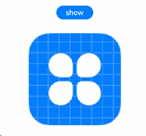

# Touchscreen Event


Touchscreen events are events triggered when a finger or stylus is placed on, moved along, or lifted from a component. They can be classified as [click event](#click-event), [drag event](arkts-common-events-drag-event.md), or [touch event](#touch-event).


**Figure 1** Touchscreen event principles


## Click Event

A click event is triggered when a complete press and lift action is performed by using a finger or a stylus. When a click event occurs, the following callback is triggered:


```ts
onClick(event: (event?: ClickEvent) => void)
```


The **event** parameter provides the coordinates of the click relative to the window or component as well as the event source where the click occurs, for example, a button, a click on which shows or hides an image.

```ts
@Entry
@Component
struct IfElseTransition {
  @State flag: boolean = true;
  @State btnMsg: string = 'show';

  build() {
    Column() {
      Button(this.btnMsg).width(80).height(30).margin(30)
        .onClick(() => {
          if (this.flag) {
            this.btnMsg = 'hide';
          } else {
            this.btnMsg = 'show';
          }
          // Click the button to show or hide the image.
          this.flag = !this.flag;
        })
      if (this.flag) {
        Image($r('app.media.icon')).width(200).height(200)
      }
    }.height('100%').width('100%')
  }
}
```
**Figure 2** Showing or hiding an image through the click event of a button





## Touch Event

A touch event is triggered when a finger or stylus is placed on, moved along, or lifted from a component.


```ts
onTouch(event: (event?: TouchEvent) => void)
```

- If **event.type** is **TouchType.Down**, the finger or stylus is placed on the component.

- If **event.type** is **TouchType.Up**, the finger or stylus is lifted from the component.

- If **event.type** is **TouchType.Move**, the finger or stylus is moved along the component.

- If **event.type** is **TouchType.Cancel**, the current finger operation is interrupted and canceled.

The touch event supports single and multi-touch interactions. Information about the touch event can be obtained using the **event** parameter, such as the location of the finger that triggers the event, unique identifier of the finger, finger information changed, and the input device source.


```ts
// xxx.ets
@Entry
@Component
struct TouchExample {
  @State text: string = '';
  @State eventType: string = '';

  build() {
    Column() {
      Button('Touch').height(40).width(100)
        .onTouch((event?: TouchEvent) => {
          if(event){
            if (event.type === TouchType.Down) {
              this.eventType = 'Down';
            }
            if (event.type === TouchType.Up) {
              this.eventType = 'Up';
            }
            if (event.type === TouchType.Move) {
              this.eventType = 'Move';
            }
            this.text = 'TouchType:' + this.eventType + '\nDistance between touch point and touch element:\nx: '
            + event.touches[0].x + '\n' + 'y: ' + event.touches[0].y + '\nComponent globalPos:('
            + event.target.area.globalPosition.x + ',' + event.target.area.globalPosition.y + ')\nwidth:'
            + event.target.area.width + '\nheight:' + event.target.area.height
          }
        })
      Button('Touch').height(50).width(200).margin(20)
        .onTouch((event?: TouchEvent) => {
          if(event){
            if (event.type === TouchType.Down) {
              this.eventType = 'Down';
            }
            if (event.type === TouchType.Up) {
              this.eventType = 'Up';
            }
            if (event.type === TouchType.Move) {
              this.eventType = 'Move';
            }
            this.text = 'TouchType:' + this.eventType + '\nDistance between touch point and touch element:\nx: '
            + event.touches[0].x + '\n' + 'y: ' + event.touches[0].y + '\nComponent globalPos:('
            + event.target.area.globalPosition.x + ',' + event.target.area.globalPosition.y + ')\nwidth:'
            + event.target.area.width + '\nheight:' + event.target.area.height
          }
        })
      Text(this.text)
    }.width('100%').padding(30)
  }
}
```


