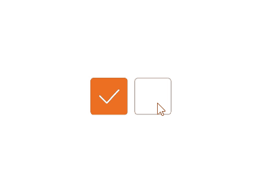
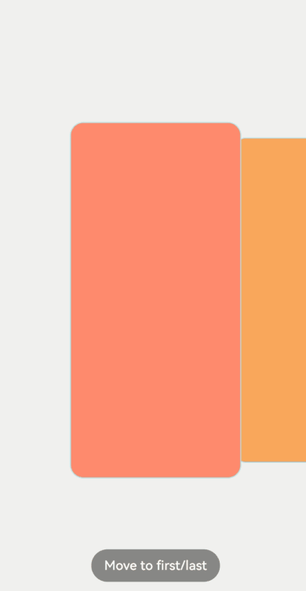

# Component Animation


In addition to universal attribute animation and transition animation APIs, ArkUI provides default animation effects for certain components, for example, the swipe effect for the [\<List>](../reference/arkui-ts/ts-container-list.md) component and the click effect of the [\<Button>](../reference/arkui-ts/ts-basic-components-button.md#button) component. Based on these default animation effects, you can apply custom animations to the child components through the attribute animation and transition animation APIs.


## Using Default Component Animation

The default animation of a component exhibits the following features:

- Indicate the current state of the component. For example, after the user clicks a **\<Button>** component, the component turns gray, indicating that it is selected.

- Make UI interactions more intuitive and pleasurable.

- Reduce development workload, as the APIs are readily available.

For more effects, see [Component Overview](../reference/arkui-ts/ts-components-summary.md).

Below is the sample code and effect:


```ts
@Entry
@Component
struct ComponentDemo {
  build() {
    Row() {
      Checkbox({ name: 'checkbox1', group: 'checkboxGroup' })
        .select(true)
        .selectedColor(0xed6f21)
        .size({ width: 50, height: 50 })

      Checkbox({ name: 'checkbox2', group: 'checkboxGroup' })
        .select(false)
        .selectedColor(0x39a2db)
        .size({ width: 50, height: 50 })
    }
    .width('100%')
    .height('100%')
    .justifyContent(FlexAlign.Center)
  }
}
```




## Customizing Component Animation

Some components allow for animation customization for their child components through the [attribute animation](arkts-attribute-animation-overview.md) and [transition animation](arkts-transition-overview.md) APIs. For example, in the [\<Scroll>](../reference/arkui-ts/ts-container-scroll.md) component, you can customize the animation effect for when scrolling through its child components.

- For a scroll or click gesture, you can implement various effects by changing affine attributes of the child component.

- To customize the animation for a scroll , you can add a listener to listen for scroll distance in the **onScroll** callback and calculate the affine attribute of each component. You can also define gestures, monitor positions through the gestures, and manually call **ScrollTo** to change the scrolled-to position.

- Fine-tune the final scrolled-to position in the **onScrollStop** callback or gesture end callback.

Below is the sample code and effect for customizing the scroll effect of the child components of the **\<Scroll>** component:


```ts
import curves from '@ohos.curves';
import window from '@ohos.window';
import display from '@ohos.display';
import mediaquery from '@ohos.mediaquery';
import UIAbility from '@ohos.app.ability.UIAbility';

export default class GlobalContext extends AppStorage{
  static mainWin: window.Window|undefined = undefined;
  static mainWindowSize:window.Size|undefined = undefined;
}
/**
 * Encapsulates the WindowManager class.
 */
export class WindowManager {
  private static instance: WindowManager|null = null;
  private displayInfo: display.Display|null = null;
  private orientationListener = mediaquery.matchMediaSync('(orientation: landscape)');

  constructor() {
    this.orientationListener.on('change', (mediaQueryResult: mediaquery.MediaQueryResult) => { this.onPortrait(mediaQueryResult) })
    this.loadDisplayInfo()
  }

  /**
   * Sets the main window.
   * @param win Indicates the current application window.
   */
  setMainWin(win: window.Window) {
    if (win == null) {
      return
    }
    GlobalContext.mainWin = win;
    win.on("windowSizeChange", (data: window.Size) => {
      if (GlobalContext.mainWindowSize == undefined || GlobalContext.mainWindowSize == null) {
        GlobalContext.mainWindowSize = data;
      } else {
        if (GlobalContext.mainWindowSize.width == data.width && GlobalContext.mainWindowSize.height == data.height) {
          return
        }
        GlobalContext.mainWindowSize = data;
      }

      let winWidth = this.getMainWindowWidth();
      AppStorage.SetOrCreate<number>('mainWinWidth', winWidth)
      let winHeight = this.getMainWindowHeight();
      AppStorage.SetOrCreate<number>('mainWinHeight', winHeight)
      let context:UIAbility = new UIAbility()
      context.context.eventHub.emit("windowSizeChange", winWidth, winHeight)
    })
  }

  static getInstance(): WindowManager {
    if (WindowManager.instance == null) {
      WindowManager.instance = new WindowManager();
    }
    return WindowManager.instance
  }

  private onPortrait(mediaQueryResult: mediaquery.MediaQueryResult) {
    if (mediaQueryResult.matches == AppStorage.Get<boolean>('isLandscape')) {
      return
    }
    AppStorage.SetOrCreate<boolean>('isLandscape', mediaQueryResult.matches)
    this.loadDisplayInfo()
  }

  /**
   * Changes the screen orientation.
   * @param ori Indicates the orientation.
   */
  changeOrientation(ori: window.Orientation) {
    if (GlobalContext.mainWin != null) {
      GlobalContext.mainWin.setPreferredOrientation(ori)
    }
  }

  private loadDisplayInfo() {
    this.displayInfo = display.getDefaultDisplaySync()
    AppStorage.SetOrCreate<number>('displayWidth', this.getDisplayWidth())
    AppStorage.SetOrCreate<number>('displayHeight', this.getDisplayHeight())
  }

  /**
   * Obtains the width of the main window, in vp.
   */
  getMainWindowWidth(): number {
    return GlobalContext.mainWindowSize != null ? px2vp(GlobalContext.mainWindowSize.width) : 0
  }

  /**
   * Obtains the height of the main window, in vp.
   */
  getMainWindowHeight(): number {
    return GlobalContext.mainWindowSize != null ? px2vp(GlobalContext.mainWindowSize.height) : 0
  }

  /**
   * Obtains the screen width, in vp.
   */
  getDisplayWidth(): number {
    return this.displayInfo != null ? px2vp(this.displayInfo.width) : 0
  }

  /**
   * Obtains the screen height, in vp.
   */
  getDisplayHeight(): number {
    return this.displayInfo != null ? px2vp(this.displayInfo.height) : 0
  }

  /**
   * Releases resources.
   */
  release() {
    if (this.orientationListener) {
      this.orientationListener.off('change', (mediaQueryResult: mediaquery.MediaQueryResult) => { this.onPortrait(mediaQueryResult)})
    }
    if (GlobalContext.mainWin != null) {
      GlobalContext.mainWin.off('windowSizeChange')
    }
    WindowManager.instance = null;
  }
}

/**
 * Encapsulates the TaskData class.
 */
export class TaskData {
  bgColor: Color | string | Resource = Color.White;
  index: number = 0;
  taskInfo: string = 'music';

  constructor(bgColor: Color | string | Resource, index: number, taskInfo: string) {
    this.bgColor = bgColor;
    this.index = index;
    this.taskInfo = taskInfo;
  }
}

export const taskDataArr: Array<TaskData> =
  [
    new TaskData(0xFA8072, 0, 'music'),
    new TaskData(0xF4A460, 1, 'mall'),
    new TaskData(0xFFFACD, 2, 'photos'),
    new TaskData(0x98FB98, 3, 'setting'),
    new TaskData(0x7FFFD4, 4, 'call'),
    new TaskData(0x87CEFA, 5, 'music'),
    new TaskData(0x7B68EE, 6, 'mall'),
    new TaskData(0x909399, 7, 'photos'),
    new TaskData(0x888888, 8, 'setting'),
    new TaskData(0xFFC0CB, 9, 'call'),
    new TaskData(0xFFC0CB, 10, 'music'),
    new TaskData(0x888888, 11, 'mall'),
    new TaskData(0x909399, 12, 'photos'),
    new TaskData(0x7B68EE, 13, 'setting'),
    new TaskData(0x87CEFA, 14, 'call'),
    new TaskData(0x7FFFD4, 15, 'music'),
    new TaskData(0x98FB98, 16, 'mall'),
    new TaskData(0xFFFACD, 17, 'photos'),
    new TaskData(0xF4A460, 18, 'setting'),
    new TaskData(0xFA8072, 19, 'call'),
  ];

@Entry
@Component
export struct TaskSwitchMainPage {
  displayWidth: number = WindowManager.getInstance().getDisplayWidth();
  scroller: Scroller = new Scroller();
  cardSpace: number = 0; // Widget spacing
  cardWidth: number = this.displayWidth / 2 - this.cardSpace / 2; // Widget width
  cardHeight: number = 400; // Widget height
  cardPosition: Array<number> = []; // Initial position of the widget
  clickIndex: boolean = false;
  @State taskViewOffsetX: number = 0;
  @State cardOffset: number = this.displayWidth / 4;
  lastCardOffset: number = this.cardOffset;
  startTime: number|undefined=undefined

  // Initial position of each widget
  aboutToAppear() {
    for (let i = 0; i < taskDataArr.length; i++) {
      this.cardPosition[i] = i * (this.cardWidth + this.cardSpace);
    }
  }

  // Position of each widget
  getProgress(index: number): number {
    let progress = (this.cardOffset + this.cardPosition[index] - this.taskViewOffsetX + this.cardWidth / 2) / this.displayWidth;
    return progress
  }

  build() {
    Stack({ alignContent: Alignment.Bottom }) {
      // Background
      Column()
        .width('100%')
        .height('100%')
        .backgroundColor(0xF0F0F0)

      // <Scroll> component
      Scroll(this.scroller) {
        Row({ space: this.cardSpace }) {
          ForEach(taskDataArr, (item:TaskData, index:number|undefined) => {
            if(index){
              Column()
                .width(this.cardWidth)
                .height(this.cardHeight)
                .backgroundColor(item.bgColor)
                .borderStyle(BorderStyle.Solid)
                .borderWidth(1)
                .borderColor(0xAFEEEE)
                .borderRadius(15)
                  // Calculate the affine attributes of child components.
                .scale((this.getProgress(index) >= 0.4 && this.getProgress(index) <= 0.6) ?
                  {
                    x: 1.1 - Math.abs(0.5 - this.getProgress(index)),
                    y: 1.1 - Math.abs(0.5 - this.getProgress(index))
                  } :
                  { x: 1, y: 1 })
                .animation({ curve: Curve.Smooth })
                  // Apply a pan animation.
                .translate({ x: this.cardOffset })
                .animation({ curve: curves.springMotion() })
                .zIndex((this.getProgress(index) >= 0.4 && this.getProgress(index) <= 0.6) ? 2 : 1)
            }
          }, (item:TaskData) => item.toString())
        }
        .width((this.cardWidth + this.cardSpace) * (taskDataArr.length + 1))
        .height('100%')
      }
      .gesture(
        GestureGroup(GestureMode.Parallel,
          PanGesture({ direction: PanDirection.Horizontal, distance: 5 })
            .onActionStart((event: GestureEvent|undefined) => {
              if(event){
                this.startTime = event.timestamp;
              }
            })
            .onActionUpdate((event: GestureEvent|undefined) => {
              if(event){
                this.cardOffset = this.lastCardOffset + event.offsetX;
              }
            })
            .onActionEnd((event: GestureEvent|undefined) => {
              if(event){
                let time = 0
                if(this.startTime){
                  time = event.timestamp - this.startTime;
                }
                let speed = event.offsetX / (time / 1000000000);
                let moveX = Math.pow(speed, 2) / 7000 * (speed > 0 ? 1 : -1);

                this.cardOffset += moveX;
                // When panning left to a position beyond the rightmost position
                let cardOffsetMax = -(taskDataArr.length - 1) * (this.displayWidth / 2);
                if (this.cardOffset < cardOffsetMax) {
                  this.cardOffset = cardOffsetMax;
                }
                // When panning right to a position beyond the rightmost position
                if (this.cardOffset > this.displayWidth / 4) {
                  this.cardOffset = this.displayWidth / 4;
                }

                // Processing when the pan distance is less than the minimum distance
                let remainMargin = this.cardOffset % (this.displayWidth / 2);
                if (remainMargin < 0) {
                  remainMargin = this.cardOffset % (this.displayWidth / 2) + this.displayWidth / 2;
                }
                if (remainMargin <= this.displayWidth / 4) {
                  this.cardOffset += this.displayWidth / 4 - remainMargin;
                } else {
                  this.cardOffset -= this.displayWidth / 4 - (this.displayWidth / 2 - remainMargin);
                }

                // Record the pan offset.
                this.lastCardOffset = this.cardOffset;
              }
            })
        ), GestureMask.IgnoreInternal)
      .scrollable(ScrollDirection.Horizontal)
      .scrollBar(BarState.Off)

      // Move to the beginning and end positions.
      Button('Move to first/last')
        .backgroundColor(0x888888)
        .margin({ bottom: 30 })
        .onClick(() => {
          this.clickIndex = !this.clickIndex;

          if (this.clickIndex) {
            this.cardOffset = this.displayWidth / 4;
          } else {
            this.cardOffset = this.displayWidth / 4 - (taskDataArr.length - 1) * this.displayWidth / 2;
          }
          this.lastCardOffset = this.cardOffset;
        })
    }
    .width('100%')
    .height('100%')
  }
}
```


