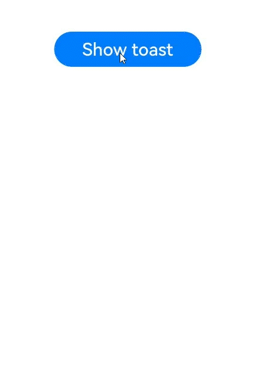
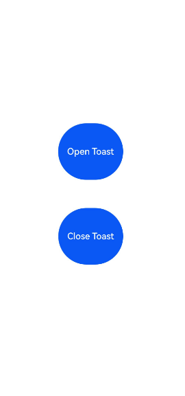

# Using Toasts (Toast)

<!--Kit: ArkUI-->
<!--Subsystem: ArkUI-->
<!--Owner: @liyi0309-->
<!--Designer: @liyi0309-->
<!--Tester: @lxl007-->
<!--Adviser: @Brilliantry_Rui-->
<!-- md-trans-meta sourceCommit=d331d662789003e8c3f7c6d67ef1c2e9a890c1fd translatedAt=2026-07-30T11:30:13.970Z pushedAt=2026-07-30T12:01:20.937Z -->

A toast is a temporary window that provides brief feedback or status information to users. It typically appears at the bottom or top of the screen for a short duration before automatically disappearing. The main purpose of a toast is to provide concise and non-intrusive information, avoiding disruption to the user's current workflow.

You can use the [getPromptAction](../reference/apis-arkui/arkts-apis-uicontext-uicontext.md#getpromptaction) API in [UIContext](../reference/apis-arkui/arkts-apis-uicontext-uicontext.md) to obtain the [PromptAction](../reference/apis-arkui/arkts-apis-uicontext-promptaction.md) object associated with the current UI context, and then use the object to call [showToast](../reference/apis-arkui/arkts-apis-uicontext-promptaction.md#showtoast) to create and display a toast.

> **NOTE**
>
> For security reasons, toasts can only be displayed within the current UI instance. When the application exits, toasts will not remain visible as separate elements on the home screen.

## How to Use

 - Use toasts judiciously and avoid excessive user notifications.

    Employ toasts for scenarios such as confirming user action results (success/failure) or notifying users about application status changes.

 - Manage text density. Because toasts are displayed for a limited time, avoid using long text.

   Ensure that the text is clear and readable, with font size and color consistent with the application's theme. In addition, toasts should not contain any interactive elements, such as buttons or links.

 - Avoid displaying overlapping or frequent toasts.

   As lightweight feedback mechanisms, toasts should not obscure other screen elements or cover important content. Continuous popups without any interval can significantly disrupt the user experience. Avoid replacing one toast with another in quick succession. Ensure toast displays do not exceed 3 seconds to prevent disruption of user interactions.

 - Follow the default toast positioning guidelines.

   By default, toasts appear from the bottom of the screen with a safe margin from the bottom edge. As an in-application notification mechanism, retain this default system behavior to avoid overlapping with other popup components. In specific scenarios, consider adjusting content layout to prevent such conflicts.

 - Adhere to the maximum font scale for toasts.

   The maximum font size multiplier for toasts is 2x.

## Comparison of Toast Modes

Toasts provide two display modes: DEFAULT (displayed in the application) and TOP\_MOST (displayed above the application).

Before displaying a TOP_MOST toast, a full-screen subwindow is created (the size of the subwindow on mobile devices is the same as the main window). The layout position of the toast is then calculated within this subwindow, and it is displayed accordingly. The differences between the DEFAULT and TOP_MOST modes are described as follows.

|Item|DEFAULT|TOP_MOST|
| --- | --- | --- |
| Subwindow creation| No| Yes|
| Layer order| The toast is displayed within the main window, with the same layer level as the main window, generally low.| The toast is displayed in a subwindow, generally higher than the main window, higher than other dialog box components, but lower than the soft keyboard and permission request dialog box.|
| Soft keyboard avoidance| The toast always moves up the soft keyboard when it is displayed.| The toast avoids the keyboard only if the toast is blocked, and after avoidance, the distance between the bottom of the toast and the soft keyboard is 80 vp.|
| UIExtension layout| The toast is aligned with UIExtension as the main window, with alignment consistent with UIExtension.| The toast is aligned with the host window as the main window, with alignment consistent with the host window.|

<!-- @[toast_showDefaultAndTop](https://gitcode.com/openharmony/applications_app_samples/blob/master/code/DocsSample/ArkUISample/DialogProject/entry/src/main/ets/pages/Toast/DefaultAndTopToast.ets) --> 

``` TypeScript
import { promptAction } from '@kit.ArkUI';
import { BusinessError } from '@kit.BasicServicesKit';
import { hilog } from '@kit.PerformanceAnalysisKit';

const TAG: string = '[Sample_dialogproject]';
const DOMAIN: number = 0xFF00;

@Entry
@Component
export struct DefaultAndTopToastExample {
  build() {
    // ...
      Column({ space: 10 }) {
        TextInput()
        Button('Toast of the DEFAULT type')
        .fontSize(20)
        .fontWeight(FontWeight.Bold)
        .onClick(() => {
          try {
            this.getUIContext().getPromptAction().showToast({
              message: 'ok, I am DEFAULT toast',
              duration: 2000,
              showMode: promptAction.ToastShowMode.DEFAULT,
              bottom: 80
            });
          } catch (error) {
            let message = (error as BusinessError).message;
            let code = (error as BusinessError).code;
            hilog.error(DOMAIN, TAG, '%{public}s', `showToast args error code is ${code}, message is ${message}`);
          }
        })

        Button('Toast of the TOPMOST type')
        .fontSize(20)
        .fontWeight(FontWeight.Bold)
        .onClick(() => {
          try {
            this.getUIContext().getPromptAction().showToast({
              message: 'ok, I am TOP_MOST toast',
              duration: 2000,
              showMode: promptAction.ToastShowMode.TOP_MOST,
              bottom: 85
            });
          }  catch (error) {
            let message = (error as BusinessError).message;
            let code = (error as BusinessError).code;
            hilog.error(DOMAIN, TAG, '%{public}s', `showToast args error code is ${code}, message is ${message}`);
          }
        })
      }
      // ...
  }
}
```


## Creating a Toast

This mode is suitable for scenarios where the toast automatically disappears within a short period of time.

<!-- @[toast_create](https://gitcode.com/openharmony/applications_app_samples/blob/master/code/DocsSample/ArkUISample/DialogProject/entry/src/main/ets/pages/Toast/CreateToast.ets) --> 

``` TypeScript
import { PromptAction } from '@kit.ArkUI';
import { BusinessError } from '@kit.BasicServicesKit';
import { hilog } from '@kit.PerformanceAnalysisKit';

const TAG: string = '[Sample_dialogproject]';
const DOMAIN: number = 0xFF00;

@Entry
@Component
export struct CreateToastExample {
  private uiContext: UIContext = this.getUIContext();
  private promptAction: PromptAction = this.uiContext.getPromptAction();
  build() {
    // ...
      Column() {
        Button('Show toast').fontSize(20)
          .onClick(() => {
            try {
              this.promptAction.showToast({
                message: 'Hello World',
                duration: 2000
              });
            } catch (error) {
              let message = (error as BusinessError).message;
              let code = (error as BusinessError).code;
              hilog.error(DOMAIN, TAG, '%{public}s', `showToast args error code is ${code}, message is ${message}`);
            }
          })
      }.height('100%').width('100%').justifyContent(FlexAlign.Center)
      // ...
  }
}
```



## Displaying and Closing a Toast

This mode is suitable for scenarios where the dialog box has a longer retention period and the user can close it manually.

<!-- @[toast_openClose](https://gitcode.com/openharmony/applications_app_samples/blob/master/code/DocsSample/ArkUISample/DialogProject/entry/src/main/ets/pages/Toast/OpenCloseToast.ets) --> 

``` TypeScript
import { PromptAction } from '@kit.ArkUI';
import { BusinessError } from '@kit.BasicServicesKit';
import { hilog } from '@kit.PerformanceAnalysisKit';

const TAG: string = '[Sample_dialogproject]';
const DOMAIN: number = 0xFF00;

@Entry
@Component
export struct OpenCloseToastExample {
  @State toastId: number = 0;
  private uiContext: UIContext = this.getUIContext();
  private promptAction: PromptAction = this.uiContext.getPromptAction();

  build() {
    // ...
      Column() {
        Button('Open Toast')
          .height(100)
          .type(ButtonType.Capsule)
          .onClick(() => {
            try {
              this.promptAction.openToast({
                message: 'Toast Message',
                duration: 10000,
              }).then((toastId: number) => {
                this.toastId = toastId;
              });
            } catch (error) {
              let message = (error as BusinessError).message;
              let code = (error as BusinessError).code;
              hilog.error(DOMAIN, TAG, '%{public}s', `OpenToast error code is ${code}, message is ${message}`);
            }
          })
        Blank().height(50);
        Button('Close Toast')
          .height(100)
          .type(ButtonType.Capsule)
          .onClick(() => {
            try {
              this.promptAction.closeToast(this.toastId);
            } catch (error) {
              let message = (error as BusinessError).message;
              let code = (error as BusinessError).code;
              hilog.error(DOMAIN, TAG, '%{public}s', `CloseToast error code is ${code}, message is ${message}`);
            }
          })
      }.height('100%').width('100%').justifyContent(FlexAlign.Center)
      // ...
  }
}
```

