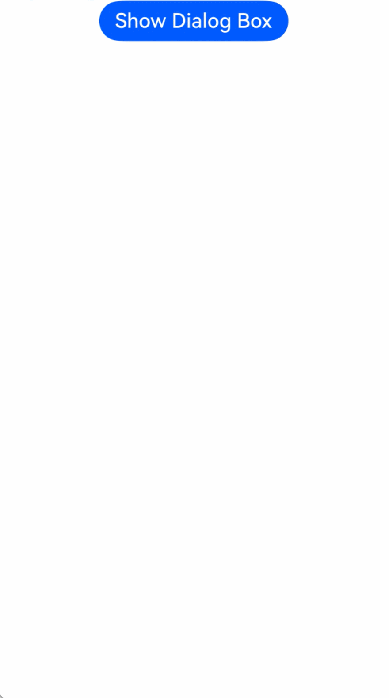

# Dialog Box Layer Management
In ArkUI, dialog boxes are directly mounted to the root node in ascending order of their levels. Under the root node, a dialog box on the right is displayed on top of a dialog box on the left. The newly created dialog box is inserted into the corresponding position based on its level. Dialog boxes with the same level are mounted in the order they were created.

Since API version 18, you can set the [levelOrder](../reference/apis-arkui/js-apis-promptAction.md#basedialogoptions11) parameter to manage the display sequence of dialog boxes. This lets you control which dialog box appears on top of others.

## Constraints

Using **levelOrder** to manage the display sequence of dialog boxes is only supported for dialog boxes created using the following APIs: [openCustomDialog](arkts-uicontext-custom-dialog.md), [CustomDialog](arkts-common-components-custom-dialog.md), [AlertDialog](arkts-fixes-style-dialog.md#alert-dialog-box-alertdialog), [ActionSheet](arkts-fixes-style-dialog.md#action-sheet-actionsheet), and [showDialog](arkts-fixes-style-dialog.md#common-dialog-box-showdialog).

> **NOTE**
> 
> Dialog box layer management does not support subwindow scenarios. If **showInSubWindow** is set to **true**, the **levelOrder** parameter has no effect, and the display sequence of dialog boxes cannot be dynamically updated.

## Creating Dialog Boxes at Different Levels

> **NOTE**
> 
> For details about the variables, see [Sample Code](#sample-code).

1. Initialize a dialog box content area with a **Text** component.

```ts
@Builder normalCustomDialog(index: number) {
  Column() {
    Text("I am normal dialog box " + index).fontSize(26)
  }.height(400).padding(5).justifyContent(FlexAlign.SpaceBetween)
}
```

2. Initialize another dialog box content area with a button to open a common dialog box: In the click event, call the [getPromptAction](../reference/apis-arkui/js-apis-arkui-UIContext.md#getpromptaction) API in [UIContext](../reference/apis-arkui/js-apis-arkui-UIContext.md#uicontext) to obtain a [PromptAction](../reference/apis-arkui/js-apis-arkui-UIContext.md#promptaction) object. Then, use this object to call the [openCustomDialog](../reference/apis-arkui/js-apis-arkui-UIContext.md#opencustomdialog12) API and set the [levelOrder](../reference/apis-arkui/js-apis-promptAction.md#basedialogoptions11) parameter to **0** to create a normal-level dialog box.

```ts
@Builder topCustomDialog() {
  Column() {
    Text("I am a top-level dialog box").fontSize(26)
    Row({ space: 50 }) {
      Button('Open Normal Dialog Box')
        .onClick(() => {
          this.getUIContext().getPromptAction().openCustomDialog({
            builder: () => {
              this.normalCustomDialog(this.dialogIndex)
            },
            levelOrder: LevelOrder.clamp(0),
          })
            .catch((err: BusinessError) => {
              console.error("openCustomDialog error: " + err.code + " " + err.message)
            })
          this.dialogIndex++
        })
    }
  }.height(200).padding(5).justifyContent(FlexAlign.SpaceBetween)
}
```

3. Create a top-level dialog box: In the click event, call the [getPromptAction](../reference/apis-arkui/js-apis-arkui-UIContext.md#getpromptaction) API in [getPromptAction](../reference/apis-arkui/js-apis-arkui-UIContext.md#getpromptaction) to obtain a [PromptAction](../reference/apis-arkui/js-apis-arkui-UIContext.md#promptaction) object. Then, use this object to call the [openCustomDialog](../reference/apis-arkui/js-apis-arkui-UIContext.md#opencustomdialog12) API and set the [levelOrder](../reference/apis-arkui/js-apis-promptAction.md#basedialogoptions11) parameter to **100000** to create a top-level dialog box.

```ts
this.getUIContext().getPromptAction().openCustomDialog({
  builder: () => {
    this.topCustomDialog()
  },
  levelOrder: LevelOrder.clamp(100000)
}).catch((err: BusinessError) => {
  console.error("openCustomDialog error: " + err.code + " " + err.message)
})
```

## Sample Code
```ts
import { LevelOrder } from '@kit.ArkUI';
import { BusinessError } from '@kit.BasicServicesKit';

@Entry
@Component
struct Index {
  @StorageLink('dialogIndex') dialogIndex: number = 0

  @Builder normalCustomDialog(index: number) {
    Column() {
      Text("I am normal dialog box " + index).fontSize(26)
    }.height(400).padding(5).justifyContent(FlexAlign.SpaceBetween)
  }

  @Builder topCustomDialog() {
    Column() {
      Text("I am a top-level dialog box").fontSize(26)
      Row({ space: 50 }) {
        Button('Open Normal Dialog Box')
          .onClick(() => {
            this.getUIContext().getPromptAction().openCustomDialog({
              builder: () => {
                this.normalCustomDialog(this.dialogIndex)
              },
              levelOrder: LevelOrder.clamp(0),
            })
              .catch((err: BusinessError) => {
                console.error("openCustomDialog error: " + err.code + " " + err.message)
              })
            this.dialogIndex++
          })
      }
    }.height(200).padding(5).justifyContent(FlexAlign.SpaceBetween)
  }

  build() {
    Row() {
      Column({ space: 5 }) {
        Button('Show Dialog Box')
          .fontSize(20)
          .onClick(() => {
            this.getUIContext().getPromptAction().openCustomDialog({
              builder: () => {
                this.topCustomDialog()
              },
              levelOrder: LevelOrder.clamp(100000)
            }).catch((err: BusinessError) => {
              console.error("openCustomDialog error: " + err.code + " " + err.message)
            })
          })
      }.width('100%')
    }
  }
}
```

