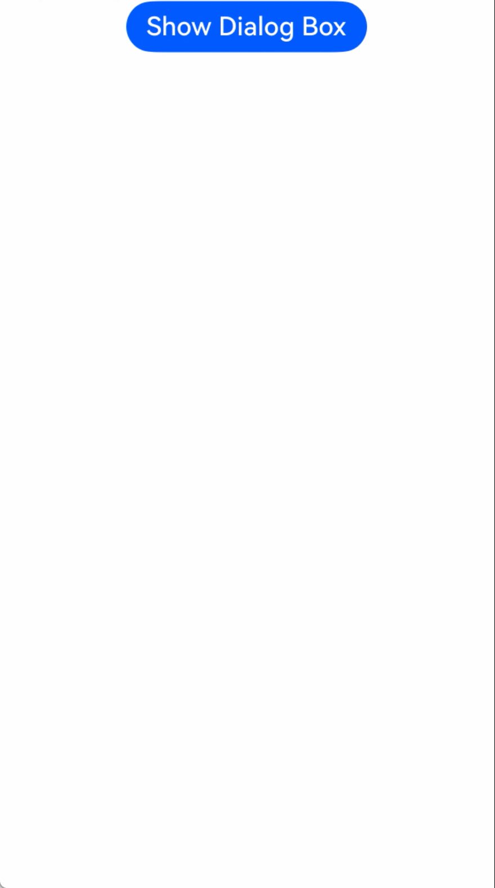

# Dialog Box Layer Management

<!--Kit: ArkUI-->
<!--Subsystem: ArkUI-->
<!--Owner: @houguobiao-->
<!--Designer: @houguobiao-->
<!--Tester: @lxl007-->
<!--Adviser: @Brilliantry_Rui-->
<!-- md-trans-meta sourceCommit=c8954d33bacbdec6df88d8586db7cc9b9d8a799e translatedAt=2026-07-30T11:31:55.919Z pushedAt=2026-07-31T01:45:00.432Z -->

By default, ArkUI dialog box nodes are directly mounted on the root node in ascending order of their levels. Under the root node, dialog box nodes with higher levels are displayed above those with lower levels. A newly created dialog box node is inserted at the position corresponding to its level, and dialog box nodes at the same level are mounted in the order of creation.

Since API version 18, you can set the [levelOrder](../reference/apis-arkui/js-apis-promptAction.md#basedialogoptions11) parameter to manage the display sequence of dialog boxes. This lets you control which dialog box appears on top of others.

## Constraints

Currently, [openCustomDialog](arkts-uicontext-custom-dialog.md), [CustomDialog](arkts-common-components-custom-dialog.md), [AlertDialog](arkts-fixes-style-dialog.md#alert-dialog-box-alertdialog), [ActionSheet](arkts-fixes-style-dialog.md#action-sheet-actionsheet), and [showDialog](arkts-fixes-style-dialog.md#common-dialog-box-showdialog) support managing dialog box levels through the `levelOrder` parameter.

> **NOTE**
> 
> Dialog box layer management does not support subwindow scenarios. If **showInSubWindow** is set to **true**, the **levelOrder** parameter has no effect, and the display sequence of dialog boxes cannot be dynamically updated.

## Creating Dialog Boxes at Different Levels

> **NOTE**
> 
> For details about the variables, see [Sample Code](#sample-code).

1. Initialize a dialog box content area with a **Text** component.

    <!-- @[normal_custom_dialog](https://gitcode.com/openharmony/applications_app_samples/blob/master/code/DocsSample/ArkUISample/DialogProject/entry/src/main/ets/pages/customdialog/dialogboxlayermanagement/DialogBoxLayer.ets) -->

    ``` TypeScript
    @Builder
    normalCustomDialog(index: number) {
      Column() {
        // Configure the resource whose name is 'open_normal_dialog' and value is a non-empty string in the resources\base\element\string.json file.
        Text(this.getUIContext().getHostContext()?.resourceManager.getStringByNameSync('open_normal_dialog') as string +
          index).fontSize(30)
      }.height(400).padding(5).justifyContent(FlexAlign.SpaceBetween)
    }
    ```

2. Initialize another dialog box content area with a button to open a common dialog box: In the click event, call the [getPromptAction](../reference/apis-arkui/arkts-apis-uicontext-uicontext.md#getpromptaction) API in [UIContext](../reference/apis-arkui/arkts-apis-uicontext-uicontext.md) to obtain a [PromptAction](../reference/apis-arkui/arkts-apis-uicontext-promptaction.md) object. Then, use this object to call the [openCustomDialog](../reference/apis-arkui/arkts-apis-uicontext-promptaction.md#opencustomdialog12-1) API and set the [levelOrder](../reference/apis-arkui/js-apis-promptAction.md#basedialogoptions11) parameter to **0** to create a normal-level dialog box.

    <!-- @[top_custom_dialog](https://gitcode.com/openharmony/applications_app_samples/blob/master/code/DocsSample/ArkUISample/DialogProject/entry/src/main/ets/pages/customdialog/dialogboxlayermanagement/DialogBoxLayer.ets) -->

    ``` TypeScript
    @Builder
    topCustomDialog() {
      Column() {
        // Replace $r('app.string.top_dialog') with the actual resource file. In this example, the value in the resource file is "I am a top-level dialog box."
        Text($r('app.string.top_dialog')).fontSize(30)
        Row({ space: 50 }) {
          // Replace $r('app.string.open_dialog') with the actual resource file. In this example, the value in the resource file is "Open Normal Dialog Box."
          Button($r('app.string.open_dialog'))
            .onClick(() => {
              this.getUIContext().getPromptAction().openCustomDialog({
                builder: () => {
                  this.normalCustomDialog(this.dialogIndex);
                },
                levelOrder: LevelOrder.clamp(0),
              })
                .catch((err: BusinessError) => {
                  hilog.error(DOMAIN, 'dialogBoxLayer', 'openCustomDialog error: ' + err.code + ' ' + err.message);
                });
              this.dialogIndex++;
            })
        }
      }.height(200).padding(5).justifyContent(FlexAlign.SpaceBetween)
    }
    ```

3. Create a top-level dialog box: In the click event, call the [getPromptAction](../reference/apis-arkui/arkts-apis-uicontext-uicontext.md#getpromptaction) API in [UIContext](../reference/apis-arkui/arkts-apis-uicontext-uicontext.md) to obtain a [PromptAction](../reference/apis-arkui/arkts-apis-uicontext-promptaction.md) object. Then, use this object to call the [openCustomDialog](../reference/apis-arkui/arkts-apis-uicontext-promptaction.md#opencustomdialog12-1) API and set the [levelOrder](../reference/apis-arkui/js-apis-promptAction.md#basedialogoptions11) parameter to **100000** to create a top-level dialog box.

    <!-- @[open_top_custom_dialog](https://gitcode.com/openharmony/applications_app_samples/blob/master/code/DocsSample/ArkUISample/DialogProject/entry/src/main/ets/pages/customdialog/dialogboxlayermanagement/DialogBoxLayer.ets) -->

    ``` TypeScript
    this.getUIContext().getPromptAction().openCustomDialog({
      builder: () => {
        this.topCustomDialog();
      },
      levelOrder: LevelOrder.clamp(100000)
    }).catch((err: BusinessError) => {
      hilog.error(DOMAIN, 'dialogBoxLayer', 'openCustomDialog error: ' + err.code + ' ' + err.message);
    });
    ```

## Sample Code

 <!-- @[dialog_box](https://gitcode.com/openharmony/applications_app_samples/blob/master/code/DocsSample/ArkUISample/DialogProject/entry/src/main/ets/pages/customdialog/dialogboxlayermanagement/DialogBoxLayer.ets) -->

 ``` TypeScript
 import { LevelOrder } from '@kit.ArkUI';
 import { BusinessError } from '@kit.BasicServicesKit';
 import { hilog } from '@kit.PerformanceAnalysisKit';
 
 const INDEX: number = 0;
 const DOMAIN = 0x0000;
 
 @Entry
 @Component
 export struct DialogBoxLayer {
   @StorageLink('dialogIndex') dialogIndex: number = INDEX;
 
   @Builder
   normalCustomDialog(index: number) {
     Column() {
       // Configure the resource whose name is 'open_normal_dialog' and value is a non-empty string in the resources\base\element\string.json file.
       Text(this.getUIContext().getHostContext()?.resourceManager.getStringByNameSync('open_normal_dialog') as string +
         index).fontSize(30)
     }.height(400).padding(5).justifyContent(FlexAlign.SpaceBetween)
   }
 
 
   @Builder
   topCustomDialog() {
     Column() {
       // Replace $r('app.string.top_dialog') with the actual resource file. In this example, the value in the resource file is "I am a top-level dialog box."
       Text($r('app.string.top_dialog')).fontSize(30)
       Row({ space: 50 }) {
         // Replace $r('app.string.open_dialog') with the actual resource file. In this example, the value in the resource file is "Open Normal Dialog Box."
         Button($r('app.string.open_dialog'))
           .onClick(() => {
             this.getUIContext().getPromptAction().openCustomDialog({
               builder: () => {
                 this.normalCustomDialog(this.dialogIndex);
               },
               levelOrder: LevelOrder.clamp(0),
             })
               .catch((err: BusinessError) => {
                 hilog.error(DOMAIN, 'dialogBoxLayer', 'openCustomDialog error: ' + err.code + ' ' + err.message);
               });
             this.dialogIndex++;
           })
       }
     }.height(200).padding(5).justifyContent(FlexAlign.SpaceBetween)
   }
 
 
   build() {
     NavDestination() {
       Row() {
         Column({ space: 5 }) {
           // Replace $r('app.string.click_dialog') with the actual resource file. In this example, the value in the resource file is "Show Dialog Box."
           Button($r('app.string.click_dialog'))
             .fontSize(20)
             .onClick(() => {
               this.getUIContext().getPromptAction().openCustomDialog({
                 builder: () => {
                   this.topCustomDialog();
                 },
                 levelOrder: LevelOrder.clamp(100000)
               }).catch((err: BusinessError) => {
                 hilog.error(DOMAIN, 'dialogBoxLayer', 'openCustomDialog error: ' + err.code + ' ' + err.message);
               });
             })
         }.width('100%')
       }
     }
   }
 }
 ```

