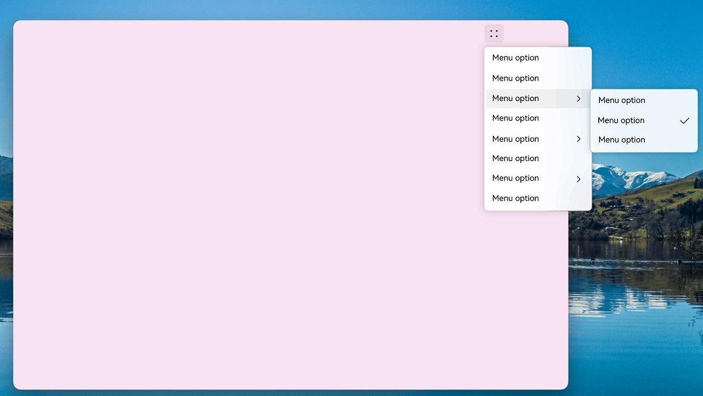

# Popup Window Overview
A popup window is a UI element that automatically appears when an application is launched or when a user performs a specific action. It is designed to present important information or actions that require the user's attention within a short timeframe.

## Types of Popup Windows

Popup windows can be categorized based on the level of user interaction required. There are two main types: modal and non-modal popup windows. The key difference between them lies in whether the user must interact with the popup window.

* **Modal popup window**: This type of popup window is a strong interaction element. It interrupts the user's current task and requires a response before the user can proceed with other actions. It is typically used when important information needs to be conveyed to the user.
* **Non-modal popup window**: This is a weaker form of interaction and does not interfere with the user's current tasks. The user is not required to respond to the popup window, which usually has a time limit and disappears automatically after a set period. This type is generally used when users need to perform additional actions while being notified of certain information.

> **NOTE**
>
> A modal popup window can be converted to a non-modal one through specific attributes. For example, setting [isModal](../reference//apis-arkui/arkui-ts/ts-methods-alert-dialog-box.md#alertdialogparam) to **false** for **AlertDialog** will change it from modal to non-modal. For more details on other popup windows, see the respective API references.

## When to Use

Choose the appropriate component based on your specific requirements.

Popup Window Name| Use Case|
| --- | --- |
| [Dialog](arkts-base-dialog-overview.md)| Use this popup window when you need to display information or actions that require the user's attention, such as when exiting the application for the second time.|
| [Menu (Menu/openMenu)](arkts-menu-overview.md)  | Opt for this popup window when you need to bind an action to a specific component, such as displaying operation options when an icon is long-pressed.|
| [Popup (Popup/openPopup)](arkts-popup-overview.md)  | Use this popup window to display a hint for a specific component, for example, a tooltip when a question mark is clicked.|
| [Modal page (bindContentCover/bindSheet)](arkts-modal-overview.md) | Choose this popup window when a new page needs to overlay the old one without making the old page disappear, such as viewing a large image by clicking a thumbnail.|
|  [Toast](arkts-create-toast.md) | Use this popup window to provide simple feedback on the user's current action in a small window, like displaying a message that a file has been saved successfully.|
|  [Overlay (OverlayManager)](arkts-create-overlaymanager.md) | Use this popup window when you need to customize the content, behavior, and style, and want to display a floating layer on top of the page, such as a music or voice playback floating bubble.|

## Specifications Constraints

* When multiple popup window components are displayed in sequence, the layer of the later displayed component is higher than that of the earlier one, and they exit in the reverse order of their display.
* On mobile devices, a popup window in subwindow mode cannot exceed the main window. On a 2-in-1 device, a modal popup window may need to be displayed beyond the main window. In this case, you can set **showInSubWindow** to **true** to achieve this effect. The following figure shows the effect.

  
