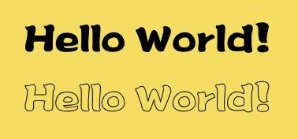
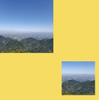
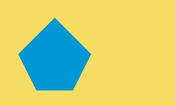

# Drawing Custom Shapes on Canvas (Canvas)

<!--Kit: ArkUI-->
<!--Subsystem: ArkUI-->
<!--Owner: @camlostshi-->
<!--Designer: @fenglinbailu-->
<!--Tester: @liuli0427-->
<!--Adviser: @Brilliantry_Rui-->
<!-- md-trans-meta sourceCommit=c8954d33bacbdec6df88d8586db7cc9b9d8a799e translatedAt=2026-07-30T11:34:18.189Z pushedAt=2026-07-30T12:25:46.013Z -->

[Canvas](../reference/apis-arkui/arkui-ts/ts-components-canvas-canvas.md) provides a canvas component for custom drawing. You can use the [CanvasRenderingContext2D](../reference/apis-arkui/arkui-ts/ts-canvasrenderingcontext2d.md) object and the [OffscreenCanvasRenderingContext2D](../reference/apis-arkui/arkui-ts/ts-offscreencanvasrenderingcontext2d.md) object to draw on the Canvas component. Drawing objects can be basic shapes, text, images, and more.

## Drawing Custom Shapes on the Canvas Component

You can draw custom shapes on the canvas in the following three ways:

- Use the [CanvasRenderingContext2D](../reference/apis-arkui/arkui-ts/ts-canvasrenderingcontext2d.md) object to draw on the Canvas component.

<!-- @[canvasRenderingContext2D_start](https://gitcode.com/openharmony/applications_app_samples/blob/master/code/DocsSample/ArkUISample/CustomCanvas/entry/src/main/ets/pages/canvas/CanvasRenderingContext2D.ets) -->

``` TypeScript
@Entry
@Component
struct CanvasExample1 {
  // Configure the parameters of the CanvasRenderingContext2D object, including whether to enable anti-aliasing. true indicates that anti-aliasing is enabled.
  private settings: RenderingContextSettings = new RenderingContextSettings(true);
  // Create a CanvasRenderingContext2D object for drawing by calling the CanvasRenderingContext2D object on the canvas.
  private context: CanvasRenderingContext2D = new CanvasRenderingContext2D(this.settings);

  build() {
    Flex({ direction: FlexDirection.Column, alignItems: ItemAlign.Center, justifyContent: FlexAlign.Center }) {
      // Call the CanvasRenderingContext2D object in the canvas.
      Canvas(this.context)
        .width('100%')
        .height('100%')
        .backgroundColor('#F5DC62')
        .onReady(() => {
          // Draw content here.
          this.context.strokeRect(50, 50, 200, 150);
        })
    }
    .width('100%')
    .height('100%')
  }
}
```

  

- Offscreen drawing refers to drawing the content to be rendered into a buffer first, then converting it into an image and drawing it onto the Canvas at once, which speeds up the drawing process. The process is as follows:

  1. Use the [transferToImageBitmap](../reference/apis-arkui/arkui-ts/ts-offscreencanvasrenderingcontext2d.md#transfertoimagebitmap) method to create an [ImageBitmap](../reference/apis-arkui/arkui-ts/ts-components-canvas-imagebitmap.md) object from the most recently rendered image on the offscreen canvas.

  2. Use the [transferFromImageBitmap](../reference/apis-arkui/arkui-ts/ts-components-canvas-common-method.md#transferfromimagebitmap) method of the [CanvasRenderingContext2D](../reference/apis-arkui/arkui-ts/ts-canvasrenderingcontext2d.md) object to display the given ImageBitmap object.

    For details, see the [OffscreenCanvasRenderingContext2D](../reference/apis-arkui/arkui-ts/ts-offscreencanvasrenderingcontext2d.md) object.

<!-- @[offScreenDrawing_start](https://gitcode.com/openharmony/applications_app_samples/blob/master/code/DocsSample/ArkUISample/CustomCanvas/entry/src/main/ets/pages/canvas/OffScreenDrawing.ets) -->

``` TypeScript
@Entry
@Component
struct CanvasExample2 {
  // Configures parameters for CanvasRenderingContext2D and OffscreenCanvasRenderingContext2D objects, including whether to enable anti-aliasing. true indicates that anti-aliasing is enabled.
  private settings: RenderingContextSettings = new RenderingContextSettings(true);
  private context: CanvasRenderingContext2D = new CanvasRenderingContext2D(this.settings);
  // Creates an OffscreenCanvas object, where width is the width of the offscreen canvas and height is the height of the offscreen canvas. Drawing is performed by calling the OffscreenCanvasRenderingContext2D object on the canvas.
  private offCanvas: OffscreenCanvas = new OffscreenCanvas(600, 600);

  build() {
    Flex({ direction: FlexDirection.Column, alignItems: ItemAlign.Center, justifyContent: FlexAlign.Center }) {
      Canvas(this.context)
        .width('100%')
        .height('100%')
        .backgroundColor('#F5DC62')
        .onReady(() => {
          let offContext = this.offCanvas.getContext('2d', this.settings);
          // You can draw content here.
          offContext.strokeRect(50, 50, 200, 150);
          // Display the image rendered by offscreen drawing on the normal canvas.
          let image = this.offCanvas.transferToImageBitmap();
          this.context.transferFromImageBitmap(image);
        })
    }
    .width('100%')
    .height('100%')
  }
}
```

  

  > **NOTE**
  >
  >In the Canvas component, the same APIs are used for drawing on the Canvas component through the CanvasRenderingContext2D object and the OffscreenCanvasRenderingContext2D object. In addition, unless otherwise specified, all API parameters are in vp.

- When loading a Lottie animation on Canvas, download Lottie as follows:

<!-- @[lottie_start](https://gitcode.com/openharmony/applications_app_samples/blob/master/code/DocsSample/ArkUISample/CustomCanvas/entry/src/main/ets/pages/canvas/OffScreenDrawing.ets) -->

``` TypeScript
import lottie from '@ohos/lottie'
```

  For details about the APIs, see [lottie](https://gitcode.com/CPF-ApplicationTPC/lottieArkTS).

## Initializing the Canvas Component

`onReady(event: () => void)` is the event callback triggered when the Canvas component initialization is complete. After this event is called, you can obtain the exact [width](../reference/apis-arkui/arkui-ts/ts-canvasrenderingcontext2d.md#attributes) and [height](../reference/apis-arkui/arkui-ts/ts-canvasrenderingcontext2d.md#attributes) of the Canvas component, and then use the CanvasRenderingContext2D and OffscreenCanvasRenderingContext2D objects to call relevant APIs for drawing.

<!-- @[initCanvasComponent_start](https://gitcode.com/openharmony/applications_app_samples/blob/master/code/DocsSample/ArkUISample/CustomCanvas/entry/src/main/ets/pages/canvas/InitCanvasComponent.ets) -->

``` TypeScript
Canvas(this.context)
  .width('100%')
  .height('100%')
  .backgroundColor('#F5DC62')
  .onReady(() => {
    this.context.fillStyle = '#0097D4';
    this.context.fillRect(50, 50, 100, 100);
  })
```


## Canvas Component Drawing Methods

After the event callback [onReady()](../reference/apis-arkui/arkui-ts/ts-components-canvas-canvas.md#onready) of the Canvas component is invoked, you can directly use the Canvas component for drawing. Alternatively, you can define a [Path2D](../reference/apis-arkui/arkui-ts/ts-components-canvas-path2d.md) object independently of the Canvas component and the onReady() lifecycle to construct the desired path, and then use the Canvas component for drawing after onReady() is invoked.

- Directly call related APIs through a CanvasRenderingContext2D object for drawing.

<!-- @[contextCallApi_start](https://gitcode.com/openharmony/applications_app_samples/blob/master/code/DocsSample/ArkUISample/CustomCanvas/entry/src/main/ets/pages/canvas/CanvasComponentDrawingMethod.ets) -->

``` TypeScript
Canvas(this.context)
  .width('100%')
  .height('100%')
  .backgroundColor('#F5DC62')
  .onReady(() => {
    this.context.beginPath();
    this.context.moveTo(50, 50);
    this.context.lineTo(280, 160);
    this.context.stroke();
  })
```

  

- First define a Path2D object independently to construct the desired path, and then draw by calling the [stroke](../reference/apis-arkui/arkui-ts/ts-components-canvas-common-method.md#stroke-1) or [fill](../reference/apis-arkui/arkui-ts/ts-components-canvas-common-method.md#fill-1) API of the CanvasRenderingContext2D or OffscreenCanvasRenderingContext2D object. For details, see [Path2D](../reference/apis-arkui/arkui-ts/ts-components-canvas-path2d.md).

<!-- @[definePath2d_start](https://gitcode.com/openharmony/applications_app_samples/blob/master/code/DocsSample/ArkUISample/CustomCanvas/entry/src/main/ets/pages/canvas/CanvasComponentDrawingMethod.ets) -->

``` TypeScript
Canvas(this.context2)
  .width('100%')
  .height('100%')
  .backgroundColor('#F5DC62')
  .onReady(() => {
    let region = new Path2D();
    region.arc(100, 75, 50, 0, 6.28);
    this.context2.stroke(region);
  })
```

  

## Common Canvas Component Methods

The OffscreenCanvasRenderingContext2D and CanvasRenderingContext2D objects provide a large number of attributes and methods for drawing text, shapes, processing pixels, and more, serving as the core of the Canvas component. Commonly used APIs include [fill](../reference/apis-arkui/arkui-ts/ts-components-canvas-common-method.md#fill) (fills a closed path), [clip](../reference/apis-arkui/arkui-ts/ts-components-canvas-common-method.md#clip) (sets the current path as a clipping path), [stroke](../reference/apis-arkui/arkui-ts/ts-components-canvas-common-method.md#stroke) (performs a border drawing operation), and so on. They also provide attributes such as [fillStyle](../reference/apis-arkui/arkui-ts/ts-components-canvas-common-property.md#fillstyle) (specifies the fill style for drawing), [globalAlpha](../reference/apis-arkui/arkui-ts/ts-components-canvas-common-property.md#globalalpha) (sets the transparency), and [strokeStyle](../reference/apis-arkui/arkui-ts/ts-components-canvas-common-property.md#strokestyle) (sets the stroke style) to modify the style of drawn content. The following sections briefly introduce common methods for using the Canvas component:

- Drawing basic shapes.

  You can draw basic shapes using APIs such as [arc](../reference/apis-arkui/arkui-ts/ts-components-canvas-common-method.md#arc) (draws an arc path), [ellipse](../reference/apis-arkui/arkui-ts/ts-components-canvas-common-method.md#ellipse) (draws an ellipse), and [rect](../reference/apis-arkui/arkui-ts/ts-components-canvas-common-method.md#rect) (creates a rectangular path).

  <!-- @[CanvasComponentBasicShapes_start](https://gitcode.com/openharmony/applications_app_samples/blob/master/code/DocsSample/ArkUISample/CustomCanvas/entry/src/main/ets/pages/canvas/CanvasComponentBasicShapes.ets) -->

``` TypeScript
Canvas(this.context)
  .width('100%')
  .height('100%')
  .backgroundColor('#F5DC62')
  .onReady(() => {
    // Draw a rectangle.
    this.context.beginPath();
    this.context.rect(100, 50, 100, 100);
    this.context.stroke();
    // Draw a circle.
    this.context.beginPath();
    this.context.arc(150, 250, 50, 0, 6.28);
    this.context.stroke();
    // Draw an ellipse.
    this.context.beginPath();
    this.context.ellipse(150, 450, 50, 100, Math.PI * 0.25, Math.PI * 0, Math.PI * 2);
    this.context.stroke();
  })
```

  

- Draw text.

  You can draw text using APIs such as [fillText](../reference/apis-arkui/arkui-ts/ts-components-canvas-common-method.md#filltext) (text fill) and [strokeText](../reference/apis-arkui/arkui-ts/ts-components-canvas-common-method.md#stroketext) (text stroke). In the example, the font is set to a 50px bold "sans-serif" font, and then the fillText method is called to draw the text "Hello World!" at (50, 100). The strokeStyle is set to red, lineWidth to 2, and font to a 50px bold "sans-serif" font, and then the strokeText method is called to draw the outline of the text "Hello World!" at (50, 150).

<!-- @[canvasComponentText_start](https://gitcode.com/openharmony/applications_app_samples/blob/master/code/DocsSample/ArkUISample/CustomCanvas/entry/src/main/ets/pages/canvas/CanvasComponentText.ets) -->

``` TypeScript
Canvas(this.context)
  .width('100%')
  .height('100%')
  .backgroundColor('#F5DC62')
  .onReady(() => {
    // Text fill.
    this.context.font = '50px bolder sans-serif';
    this.context.fillText('Hello World!', 50, 100);
    // Text stroke.
    this.context.strokeStyle = '#ff0000';
    this.context.lineWidth = 2;
    this.context.font = '50px bolder sans-serif';
    this.context.strokeText('Hello World!', 50, 150);
  })
```

  

- Draw a text border.

  You can use [measureText](../reference/apis-arkui/arkui-ts/ts-components-canvas-common-method.md#measuretext) to calculate the width and height of the text to be drawn, and then use the measured dimensions as the border size. In the example, set textBaseline to `'top'` and font to `30px "monospace"`. Call measureText to obtain the text width and height, then call fillText to draw "Hello World" at (20, 100), and call strokeRect at the same position with the measured dimensions to draw a border of the corresponding size. Next, set font to `60px bold "sans-serif"`, call measureText again to obtain the text width and height, then call fillText to draw "Hello World" at (20, 150), and call strokeRect at the same position with the measured dimensions to draw a border of the corresponding size.

<!-- @[canvasComponentTextBorder_start](https://gitcode.com/openharmony/applications_app_samples/blob/master/code/DocsSample/ArkUISample/CustomCanvas/entry/src/main/ets/pages/canvas/CanvasComponentTextBorder.ets) -->

``` TypeScript
// xxx.ets
@Entry
@Component
struct CanvasComponentTextBorder {
  drawText: string = 'Hello World'
  private settings: RenderingContextSettings = new RenderingContextSettings(true);
  private context: CanvasRenderingContext2D = new CanvasRenderingContext2D(this.settings);

  build() {
    Flex({ direction: FlexDirection.Column, alignItems: ItemAlign.Center, justifyContent: FlexAlign.Center }) {
      Canvas(this.context)
        .width('100%')
        .height('100%')
        .backgroundColor('#F5DC62')
        .onReady(() => {
          // The horizontal alignment of the text is 'top'.
          this.context.textBaseline = 'top';
          // The font size is 30px and the font family is monospace.
          this.context.font = '30px monospace';
          let textWidth = this.context.measureText(this.drawText).width;
          let textHeight = this.context.measureText(this.drawText).height;
          this.context.fillText(this.drawText, 20, 100);
          this.context.strokeRect(20, 100, textWidth, textHeight);
          // The font weight is bold, the font size is 60px, and the font family is sans-serif.
          this.context.font = 'bold 60px sans-serif';
          textWidth = this.context.measureText(this.drawText).width;
          textHeight = this.context.measureText(this.drawText).height;
          this.context.fillText(this.drawText, 20, 150);
          this.context.strokeRect(20, 150, textWidth, textHeight);
        })
    }
    .width('100%')
    .height('100%')
  }
}
```

  

- Draw text using a custom font.

Starting from API version 20, you can obtain an instance of the app global font manager through [getGlobalInstance](../reference/apis-arkgraphics2d/js-apis-graphics-text.md#getglobalinstance), then use the [loadFontSync](../reference/apis-arkgraphics2d/js-apis-graphics-text.md#loadfontsync) API to load a custom font from a specified path, set the font style for text drawing through the [font](../reference/apis-arkui/arkui-ts/ts-components-canvas-common-property.md#font) API (which sets the font style in text drawing), and then draw text using APIs such as [fillText](../reference/apis-arkui/arkui-ts/ts-components-canvas-common-method.md#filltext) (draws filled text) and [strokeText](../reference/apis-arkui/arkui-ts/ts-components-canvas-common-method.md#stroketext) (draws stroked text).

<!-- @[canvasComponentCustomFontsDrawText_start](https://gitcode.com/openharmony/applications_app_samples/blob/master/code/DocsSample/ArkUISample/CustomCanvas/entry/src/main/ets/pages/canvas/CanvasComponentCustomFontsDrawText.ets) -->

``` TypeScript
import { text } from '@kit.ArkGraphics2D';

@Entry
@Component
struct CustomFont {
  private settings: RenderingContextSettings = new RenderingContextSettings(true);
  private context: CanvasRenderingContext2D = new CanvasRenderingContext2D(this.settings);

  build() {
    Flex({ direction: FlexDirection.Column, alignItems: ItemAlign.Center, justifyContent: FlexAlign.Center }) {
      Canvas(this.context)
        .width('100%')
        .height('100%')
        .backgroundColor('#F5DC62')
        .onReady(() => {
          let fontCollection = text.FontCollection.getGlobalInstance();
          // Load the custom font file customFont.ttf from the rawfile directory.
          fontCollection.loadFontSync('customFont', $rawfile('customFont.ttf'));
          this.context.font = '30vp customFont';
          this.context.fillText('Hello World!', 20, 50);
          this.context.strokeText('Hello World!', 20, 100);
        })
    }
    .width('100%')
    .height('100%')
  }
}
```



- Draw images and process image pixel information.

You can draw images using APIs such as [drawImage](../reference/apis-arkui/arkui-ts/ts-components-canvas-common-method.md#drawimage) (draws an image) and [putImageData](../reference/apis-arkui/arkui-ts/ts-components-canvas-common-method.md#putimagedata) (fills a new rectangular area with [ImageData](../reference/apis-arkui/arkui-ts/ts-components-canvas-imagedata.md) data), and process image pixel information using APIs such as [createImageData](../reference/apis-arkui/arkui-ts/ts-components-canvas-common-method.md#createimagedata) (creates a new ImageData object), [getPixelMap](../reference/apis-arkui/arkui-ts/ts-components-canvas-common-method.md#getpixelmap) (creates a [PixelMap](../reference/apis-image-kit/arkts-apis-image-PixelMap.md) object from the pixels in a specified area of the current canvas), and [getImageData](../reference/apis-arkui/arkui-ts/ts-components-canvas-common-method.md#getimagedata) (creates an ImageData object from the pixels in a specified area of the current canvas).

<!-- @[CanvasComponentDrawingPictureAndImagePixel_start](https://gitcode.com/openharmony/applications_app_samples/blob/master/code/DocsSample/ArkUISample/CustomCanvas/entry/src/main/ets/pages/canvas/CanvasComponentDrawingPictureAndImagePixel.ets) -->

``` TypeScript
@Entry
@Component
struct CanvasComponentDrawingPictureAndImagePixel {
  private settings: RenderingContextSettings = new RenderingContextSettings(true);
  private context: CanvasRenderingContext2D = new CanvasRenderingContext2D(this.settings);
  private offCanvas: OffscreenCanvas = new OffscreenCanvas(600, 600);
  // Replace "/common/images/image.png" with the image resource file you need.
  private img: ImageBitmap = new ImageBitmap('/common/images/image.png');

  build() {
    Flex({ direction: FlexDirection.Column, alignItems: ItemAlign.Center, justifyContent: FlexAlign.Center }) {
      Canvas(this.context)
        .width('100%')
        .height('100%')
        .backgroundColor('#F5DC62')
        .onReady(() => {
          let offContext = this.offCanvas.getContext('2d', this.settings);
          // Use the drawImage API to draw the image in the area starting at (0, 0) with a width and height of 130.
          offContext.drawImage(this.img, 0, 0, 130, 130);
          // Use the getImageData API to obtain the drawn content within the area starting at (50, 50) with a width and height of 130 in the Canvas component region.
          let imageData = offContext.getImageData(50, 50, 130, 130);
          // Use the putImageData API to draw the obtained ImageData in the area starting at (150, 150).
          offContext.putImageData(imageData, 150, 150);
          // Draw the offscreen content onto the Canvas component.
          let image = this.offCanvas.transferToImageBitmap();
          this.context.transferFromImageBitmap(image);
        })
    }
    .width('100%')
    .height('100%')
  }
}
```

  

- Other methods.

  Canvas also provides other types of methods. Methods related to gradients ([CanvasGradient](../reference/apis-arkui/arkui-ts/ts-components-canvas-canvasgradient.md) objects): [createLinearGradient](../reference/apis-arkui/arkui-ts/ts-components-canvas-common-method.md#createlineargradient) (creates a linear gradient), [createRadialGradient](../reference/apis-arkui/arkui-ts/ts-components-canvas-common-method.md#createradialgradient) (creates a radial gradient), and more.

<!-- @[canvasComponentOtherMethods_start](https://gitcode.com/openharmony/applications_app_samples/blob/master/code/DocsSample/ArkUISample/CustomCanvas/entry/src/main/ets/pages/canvas/CanvasComponentOtherMethods.ets) -->

``` TypeScript
Canvas(this.context)
  .width('100%')
  .height('100%')
  .backgroundColor('#F5DC62')
  .onReady(() => {
    // Create a CanvasGradient object with a radial gradient color.
    let grad = this.context.createRadialGradient(200, 200, 50, 200, 200, 200);
    // Set gradient stop values for the CanvasGradient object, including offset and color.
    grad.addColorStop(0.0, '#E87361');
    grad.addColorStop(0.5, '#FFFFF0');
    grad.addColorStop(1.0, '#BDDB69');
    // Fill the rectangle with the CanvasGradient object.
    this.context.fillStyle = grad;
    this.context.fillRect(0, 0, 400, 400);
  })
```

  

## Driving Canvas Refresh with State Variables

You can use state variables to drive Canvas refresh. Monitor the changing data through [@Watch](state-management/arkts-watch.md) and bind it to a custom `draw()` method. When the data is refreshed, the method bound by @Watch executes the drawing logic, causing the Canvas to refresh.

<!-- @[canvasContentUpdate_start](https://gitcode.com/openharmony/applications_app_samples/blob/master/code/DocsSample/ArkUISample/CustomCanvas/entry/src/main/ets/pages/canvas/CanvasContentUpdate.ets) -->

``` TypeScript
@Entry
@Component
struct CanvasContentUpdate {
  private settings: RenderingContextSettings = new RenderingContextSettings(true);
  private context: CanvasRenderingContext2D = new CanvasRenderingContext2D(this.settings);
  @State @Watch('draw') content: string = 'Hello World';

  draw() {
    this.context.clearRect(0, 0, 400, 200); // Clear the Canvas content.
    this.context.fillText(this.content, 50, 100); // Redraw.
  }

  build() {
    Column() {
      Canvas(this.context)
        .width('100%')
        .height('25%')
        .backgroundColor('rgb(39, 135, 217)')
        .onReady(() => {
          this.context.font = '65px sans-serif';
          this.context.fillText(this.content, 50, 100);
        })
      TextInput({
        text:$$this.content // When the content in the text input box is modified, the state variable update drives the Canvas refresh.
      })
        .fontSize(35)
    }
    .width('100%')
    .height('100%')
  }
}
```


## Preventing Drawing When the Canvas Component Is Invisible

You can use the following two methods to monitor Canvas component visibility and avoid unnecessary drawing when it is invisible.

- Starting from API version 13, use the [setOnVisibleAreaApproximateChange](../reference/apis-arkui/arkui-ts/ts-uicommonevent.md#setonvisibleareaapproximatechange) API to monitor Canvas component visibility.

  ```ts
  import { ColorMetrics } from '@kit.ArkUI';

  @Entry
  @Component
  struct Page {
    private canvasContext: CanvasRenderingContext2D = new CanvasRenderingContext2D()
    private timerId: number = -1;

    drawRandomCircle(): void {
      let center: [number, number] = [Math.random() * 200 + 50, Math.random() * 200 + 50]
      let radius: number = Math.random() * 20 + 10
      let color: ColorMetrics =
        ColorMetrics.rgba(Math.floor(Math.random() * 255), Math.floor(Math.random() * 255),
          Math.floor(Math.random() * 255))

      // Clear the previous content and canvas state.
      this.canvasContext.reset()

      // Start drawing.
      this.canvasContext.fillStyle = color.color
      let path: Path2D = new Path2D()
      path.ellipse(center[0], center[1], radius, radius, 0, 0, Math.PI * 2)
      this.canvasContext.fill(path)
    }

    build() {
      Flex({ direction: FlexDirection.Column, alignItems: ItemAlign.Center, justifyContent: FlexAlign.Center }) {
        Canvas(this.canvasContext)
          .width(300)
          .height(300)
          .onReady(() => {
            let frameNode = this.canvasContext.canvas;
            frameNode.commonEvent.setOnVisibleAreaApproximateChange({ ratios: [0.0] },
              (isVisible: boolean, currentRatio: number) => {
              // Canvas is invisible.
              if (!isVisible && currentRatio <= 0) {
                clearInterval(this.timerId)
                this.timerId = -2
              }
              // Canvas is visible.
              if (isVisible) {
                if (this.timerId == -2) {
                  this.timerId = setInterval(() => {
                    this.drawRandomCircle()
                  }, 500)
                }
              }
            })
          })
        Button("draw sth")
          .onClick(() => {
            if (this.timerId < 0) {
              this.timerId = setInterval(() => {
                this.drawRandomCircle()
              }, 500)
            }
          })
      }
      .width('100%')
      .height('100%')
    }
  }
  ```


- Starting from API version 17, use the [onVisibleAreaApproximateChange](../reference/apis-arkui/arkui-ts/ts-universal-component-visible-area-change-event.md#onvisibleareaapproximatechange17) API to listen for Canvas component visibility changes.

  ```ts
  import { ColorMetrics } from '@kit.ArkUI';

  @Entry
  @Component
  struct Page {
    private canvasContext: CanvasRenderingContext2D = new CanvasRenderingContext2D()
    private timerId: number = -1;

    drawRandomCircle(): void {
      let center: [number, number] = [Math.random() * 200 + 50, Math.random() * 200 + 50]
      let radius: number = Math.random() * 20 + 10
      let color: ColorMetrics =
        ColorMetrics.rgba(Math.floor(Math.random() * 255), Math.floor(Math.random() * 255),
          Math.floor(Math.random() * 255))

      // Clear the previous content and canvas state.
      this.canvasContext.reset()

      // Start drawing.
      this.canvasContext.fillStyle = color.color
      let path: Path2D = new Path2D()
      path.ellipse(center[0], center[1], radius, radius, 0, 0, Math.PI * 2)
      this.canvasContext.fill(path)
    }

    build() {
      Flex({ direction: FlexDirection.Column, alignItems: ItemAlign.Center, justifyContent: FlexAlign.Center }) {
        Canvas(this.canvasContext)
          .width(300)
          .height(300)
          .onVisibleAreaApproximateChange({ ratios: [0.0] },
              (isVisible: boolean, currentRatio: number) => {
                // Canvas is invisible.
                if (!isVisible && currentRatio <= 0) {
                  clearInterval(this.timerId)
                  this.timerId = -2
                }
                // Canvas is visible.
                if (isVisible) {
                  if (this.timerId == -2) {
                    this.timerId = setInterval(() => {
                      this.drawRandomCircle()
                    }, 500)
                  }
                }
              })
        Button("draw sth")
          .onClick(() => {
            if (this.timerId < 0) {
              this.timerId = setInterval(() => {
                this.drawRandomCircle()
              }, 500)
            }
          })
      }
      .width('100%')
      .height('100%')
    }
  }
  ```

  

## Example

- Draw regular basic shapes.

<!-- @[drawingRegularBaseShape_start](https://gitcode.com/openharmony/applications_app_samples/blob/master/code/DocsSample/ArkUISample/CustomCanvas/entry/src/main/ets/pages/canvas/DrawingRegularBaseShape.ets) -->

``` TypeScript
@Entry
@Component
struct ClearRect {
  private settings: RenderingContextSettings = new RenderingContextSettings(true);
  private context: CanvasRenderingContext2D = new CanvasRenderingContext2D(this.settings);

  build() {
    Flex({ direction: FlexDirection.Column, alignItems: ItemAlign.Center, justifyContent: FlexAlign.Center }) {
      Canvas(this.context)
        .width('100%')
        .height('100%')
        .backgroundColor('#F5DC62')
        .onReady(() => {
          // Set the fill style and fill color to blue.
          this.context.fillStyle = '#0097D4';
          // Draw a 200×200 rectangle with (50, 50) as the top-left vertex.
          this.context.fillRect(50, 50, 200, 200);
          // Clear a 150×100 area with (70, 70) as the top-left vertex.
          this.context.clearRect(70, 70, 150, 100);
        })
    }
    .width('100%')
    .height('100%')
  }
}
```

  

- Draw irregular shapes.

<!-- @[drawIrregularFigures_start](https://gitcode.com/openharmony/applications_app_samples/blob/master/code/DocsSample/ArkUISample/CustomCanvas/entry/src/main/ets/pages/canvas/DrawIrregularFigures.ets) -->

``` TypeScript
@Entry
@Component
struct Path2d {
  private settings: RenderingContextSettings = new RenderingContextSettings(true);
  private context: CanvasRenderingContext2D = new CanvasRenderingContext2D(this.settings);

  build() {
    Row() {
      Column() {
        Canvas(this.context)
          .width('100%')
          .height('100%')
          .backgroundColor('#F5DC62')
          .onReady(() => {
            // Construct a pentagon using the Path2D interface.
            let path = new Path2D();
            path.moveTo(150, 50);
            path.lineTo(50, 150);
            path.lineTo(100, 250);
            path.lineTo(200, 250);
            path.lineTo(250, 150);
            path.closePath();
            // Set the fill color to blue.
            this.context.fillStyle = '#0097D4';
            // Fill the pentagon described by Path2D on the Canvas component.
            this.context.fill(path);
          })
      }
      .width('100%')
    }
    .height('100%')
  }
}
```



- Draw a draggable cursor.

You can use the [beginPath](../reference/apis-arkui/arkui-ts/ts-components-canvas-common-method.md#beginpath), [moveTo](../reference/apis-arkui/arkui-ts/ts-components-canvas-common-method.md#moveto), [lineTo](../reference/apis-arkui/arkui-ts/ts-components-canvas-common-method.md#lineto), and [arc](../reference/apis-arkui/arkui-ts/ts-components-canvas-common-method.md#arc) methods to set the cursor position, and the [stroke](../reference/apis-arkui/arkui-ts/ts-components-canvas-common-method.md#stroke) and [fill](../reference/apis-arkui/arkui-ts/ts-components-canvas-common-method.md#fill) methods to draw the cursor. The press state and position changes are monitored through @Watch and bound to a custom drawCursor() method. When the cursor is dragged, the method bound by @Watch executes the drawing logic to calculate and update the cursor color and position.

<!-- @[cursor_moving_canvas](https://gitcode.com/openharmony/applications_app_samples/blob/master/code/DocsSample/ArkUISample/CustomCanvas/entry/src/main/ets/pages/canvas/DrawDraggableCursor.ets) -->

``` TypeScript
@Entry
@Component
struct CursorMoving {
  // Monitor whether the cursor is pressed, and refresh the cursor color.
  @State @Watch('drawCursor') isTouchDown: boolean = false;
  // Monitor position changes and refresh the page.
  @State @Watch('drawCursor') cursorPosition: RectPosition = {
    x: 0,
    y: 0,
    width: 0,
    height: 0,
  };
  private settings: RenderingContextSettings = new RenderingContextSettings(true);
  private canvasContext: CanvasRenderingContext2D = new CanvasRenderingContext2D(this.settings);
  private sw: number = 360; // Fixed Canvas width.
  private sh: number = 270; // Fixed Canvas height.
  private cursorWH: number = 50; // Cursor area width and height
  private dashedLineW: number = 7; // Cursor width and height
  private arcRadius: number = 6; // Cursor center circle radius
  private isReadyMove: boolean = false;
  private touchPosition: Position = {
    x: 0,
    y: 0,
  };
  private cursorCenterPosition: Position = {
    x: 0,
    y: 0,
  };

  build() {
    Column() {
      // Draw the cursor.
      Canvas(this.canvasContext)
        .width(this.sw)
        .height(this.sh)
        .backgroundColor('#D5D5D5')
        .onReady(() => {
          this.cursorPosition.x = (this.sw - this.cursorWH) / 2;
          this.cursorPosition.y = (this.sh - this.cursorWH) / 2;
          this.cursorPosition.width = this.cursorWH;
          this.cursorPosition.height = this.cursorWH;
          this.cursorCenterPosition = {
            x: this.cursorPosition.x + this.cursorPosition.width / 2,
            y: this.cursorPosition.y + this.cursorPosition.height / 2
          };
          this.drawCursor();
        })
        .onTouch(event => {
          if (event.type === TouchType.Down) {
            this.isReadyMove = this.isTouchCursorArea(event.touches[0]);
            if (this.isReadyMove) {
              this.isTouchDown = true;
            }

            this.touchPosition = {
              x: event.touches[0].displayX,
              y: event.touches[0].displayY
            };
          } else if (event.type === TouchType.Move) {
            if (this.isReadyMove) {
              let moveX = event.changedTouches[0].displayX - this.touchPosition.x;
              let moveY = event.changedTouches[0].displayY - this.touchPosition.y;
              this.touchPosition = {
                x: event.changedTouches[0].displayX,
                y: event.changedTouches[0].displayY
              };
              this.cursorPosition.x += moveX;
              this.cursorPosition.y += moveY;

              this.cursorCenterPosition = {
                x: this.cursorPosition.x + this.cursorPosition.width / 2,
                y: this.cursorPosition.y + this.cursorPosition.height / 2
              };
              // Limit the cursor area center point position.
              if (this.cursorCenterPosition.x < 0) {
                this.cursorPosition.x = -this.cursorPosition.width / 2;
              }
              if (this.cursorCenterPosition.y < 0) {
                this.cursorPosition.y = -this.cursorPosition.height / 2;
              }
              if (this.cursorCenterPosition.x > this.sw) {
                this.cursorPosition.x = this.sw - this.cursorPosition.width / 2;
              }
              if (this.cursorCenterPosition.y > this.sh) {
                this.cursorPosition.y = this.sh - this.cursorPosition.height / 2;
              }
            }
          } else {
            this.isTouchDown = false;
          }
        });
    }
    .height('100%')
    .width('100%')
    .justifyContent(FlexAlign.Center)
  }

  // Draw the crop frame.
  drawCursor() {
    // Calculate the four points of the diamond.
    let positionL: Position = { x: this.cursorPosition.x, y: this.cursorPosition.y + this.cursorPosition.height / 2 };
    let positionT: Position = { x: this.cursorPosition.x + this.cursorPosition.width / 2, y: this.cursorPosition.y };
    let positionR: Position = {
      x: this.cursorPosition.x + this.cursorPosition.width,
      y: this.cursorPosition.y + this.cursorPosition.height / 2
    };
    let positionB: Position = {
      x: this.cursorPosition.x + this.cursorPosition.width / 2,
      y: this.cursorPosition.y + this.cursorPosition.height
    };
    let lineWidth = 2;
    this.canvasContext.clearRect(0, 0, this.sw, this.sh);
    this.canvasContext.lineWidth = lineWidth;
    this.canvasContext.strokeStyle = this.isTouchDown ? '#ff1a5cae' : '#ffffffff';

    // Draw the four corners.
    this.canvasContext.beginPath();
    this.canvasContext.moveTo(positionL.x + this.dashedLineW, positionL.y - this.dashedLineW);
    this.canvasContext.lineTo(positionL.x, positionL.y);
    this.canvasContext.lineTo(positionL.x + this.dashedLineW, positionL.y + this.dashedLineW);

    this.canvasContext.moveTo(positionT.x - this.dashedLineW, positionT.y + this.dashedLineW);
    this.canvasContext.lineTo(positionT.x, positionT.y);
    this.canvasContext.lineTo(positionT.x + this.dashedLineW, positionT.y + this.dashedLineW);

    this.canvasContext.moveTo(positionR.x - this.dashedLineW, positionR.y - this.dashedLineW);
    this.canvasContext.lineTo(positionR.x, positionR.y);
    this.canvasContext.lineTo(positionR.x - this.dashedLineW, positionR.y + this.dashedLineW);

    this.canvasContext.moveTo(positionB.x - this.dashedLineW, positionB.y - this.dashedLineW);
    this.canvasContext.lineTo(positionB.x, positionB.y);
    this.canvasContext.lineTo(positionB.x + this.dashedLineW, positionB.y - this.dashedLineW);

    this.canvasContext.stroke();

    // Draw the center circle.
    this.canvasContext.beginPath();
    this.canvasContext.strokeStyle = this.isTouchDown ? '#ff1a5cae' : '#ff9ba59b';
    this.canvasContext.fillStyle = this.isTouchDown ? '#ff1a5cae' : '#ff9ba59b';
    this.canvasContext.arc(this.cursorPosition.x + this.cursorPosition.width / 2,
      this.cursorPosition.y + this.cursorPosition.width / 2, this.arcRadius, 0, 2 * Math.PI);
    this.canvasContext.fill();
    this.canvasContext.stroke();

    // Draw the four lines.
    this.canvasContext.beginPath();
    this.canvasContext.lineWidth = 0.7;
    this.canvasContext.moveTo(positionL.x, positionL.y);
    this.canvasContext.lineTo(0, positionL.y);

    this.canvasContext.moveTo(positionT.x, positionT.y);
    this.canvasContext.lineTo(positionT.x, 0);

    this.canvasContext.moveTo(positionR.x, positionR.y);
    this.canvasContext.lineTo(this.sw, positionR.y);

    this.canvasContext.moveTo(positionB.x, positionB.y);
    this.canvasContext.lineTo(positionB.x, this.sh);

    this.canvasContext.stroke();
  }

  // Check whether the touch position is within the diamond shape.
  isTouchCursorArea(touch: TouchObject) {
    let tempLength = Math.sqrt((touch.x - this.cursorCenterPosition.x) * (touch.x - this.cursorCenterPosition.x) +
      (touch.y - this.cursorCenterPosition.y) * (touch.y - this.cursorCenterPosition.y));
    if (tempLength < (this.cursorWH / 2 / 1.414)) {
      return true;
    }
    return false;
  }
}

export interface RectPosition {
  x: number;
  y: number;
  height: number;
  width: number;
};

export interface Position {
  x: number;
  y: number;
};
```

  

## Samples

The following samples demonstrate how to draw custom shapes on a canvas:

- [ArkTS Component Collection (ArkTS) (Full SDK) (API10)](https://gitcode.com/openharmony/applications_app_samples/tree/master/code/UI/ArkTsComponentCollection/ComponentCollection)

- [Distributed Gomoku (ArkTS) (Full SDK) (API9)](https://gitcode.com/openharmony/applications_app_samples/tree/master/code/Solutions/Game/DistributedDataGobang)

- [ArkTS Clock (ArkTS) (API 9)](https://gitcode.com/openharmony/applications_app_samples/tree/master/code/Solutions/Tools/ArkTSClock)

- [Lottie Animation](https://gitcode.com/openharmony/applications_app_samples/tree/master/code/Solutions/Game/Lottie)

- [Custom Lottery Wheel (ArkTS) (API 9)](https://gitcode.com/openharmony/codelabs/tree/master/ETSUI/CanvasComponent)

<!--RP1--><!--RP1End-->

<!--no_check-->