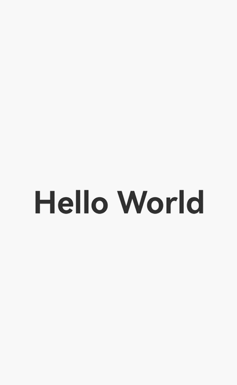

# Page-Level Dialog Box
By default, ArkUI dialog boxes are displayed at the global level, meaning the dialog box node is a subnode of the root node of the page and appears above all route and navigation pages in the application. If a dialog box is not explicitly closed using the **close** API during a route redirection, it will remain visible on the next page.

Since API version 15, you can use a page-level dialog box that disappears with the previous routing page during page switching and reappears when the user returns to the previous page.

> **NOTE**
> 
> The page-level capability only takes effect when the dialog box is in non-subwindow mode, that is, the **showInSubWindow** parameter is set to **false** or is not set.
>
> Page-level dialog boxes are typically used in conjunction with navigation and routing capabilities. For more details, see [Component Navigation and Page Routing Overview](arkts-navigation-introduction.md).
>
> Before using a page-level dialog box, familiarize yourself with the basic dialog box usage in [Dialog Box Overview](arkts-base-dialog-overview.md).


## Setting Page-Level Dialog Box Parameters

> **NOTE**
> 
> For details about the variables, see [Example](#example).

To enable the page-level capability for a dialog box, set [levelMode](../reference/apis-arkui/js-apis-promptAction.md#levelmode15) in the dialog box's **options** parameter to **LevelMode.EMBEDDED**.

When the dialog box is displayed, the current page is automatically obtained, and the dialog box node is mounted to this page. As a result, the dialog box appears above all navigation pages under the current page.

```ts
promptAction.openCustomDialog({
  builder: () => {
    this.customDialogComponent()
  },
  levelMode: LevelMode.EMBEDDED, // Enable the page-level dialog box.
})
```

## Displaying a Dialog Box on a Specified Page

To display a dialog box on a specific page, use the **levelUniqueId** parameter, which is the node ID on the target page. When this parameter is set, the system automatically queries the navigation page corresponding to the node ID and mounts the dialog box to that page.

In the following example, a **Text** node is used as a reference node on a specific page. The [getFrameNodeById](../reference/apis-arkui/js-apis-arkui-UIContext.md#getframenodebyid12) API obtains the node, and the [getUniqueId](../reference/apis-arkui/js-apis-arkui-frameNode.md#getuniqueid12) API obtains the internal ID of the node, which is then passed as the value of **levelUniqueId**.

```ts
Text(this.message).id("test_text")
  .onClick(() => {
    const node: FrameNode | null = this.getUIContext().getFrameNodeById("test_text") || null;
    promptAction.openCustomDialog({
      builder: () => {
        this.customDialogComponent()
      },
      levelMode: LevelMode.EMBEDDED, // Enable the page-level dialog box.
      levelUniqueId: node?.getUniqueId(), // Set the ID of any node on the target page.
    })
  })
```

## Customizing the Page-Level Dialog Box Mask Style

If a mask is configured for a dialog box, its scope is adjusted based on the page level. By default, the mask covers the display area (page or navigation page) where the dialog box's parent node is located, but it does not cover the status bar or navigation bar. To extend the mask to cover the status bar and navigation bar, set [immersiveMode](../reference/apis-arkui/js-apis-promptAction.md#immersivemode15) to **ImmersiveMode.EXTEND**.

```ts
Text(this.message).id("test_text")
  .onClick(() => {
    const node: FrameNode | null = this.getUIContext().getFrameNodeById("test_text") || null;
    promptAction.openCustomDialog({
      builder: () => {
        this.customDialogComponent()
      },
      levelMode: LevelMode.EMBEDDED, // Enable the page-level dialog box.
      levelUniqueId: node?.getUniqueId(), // Set the ID of any node on the target page.
      immersiveMode: ImmersiveMode.EXTEND, // Extend the mask to cover the status bar and navigation bar.
    })
  })
```

## Interaction Logic

The interaction logic for some dialog boxes on the page still follows the following interaction policies:

1. Handling of the swipe gesture: When the user swipes back to the previous page, if a dialog box is displayed, it will be closed first, and the gesture will end. To return to the previous page, the user needs to perform the gesture gesture again.

2. By default, clicking the dialog box mask closes the dialog box. Clicking outside the mask does not close the dialog box.

## Example
```ts
// Index.ets
import { promptAction, LevelMode, ImmersiveMode, router } from '@kit.ArkUI'

let customDialogId: number = 0

@Builder
function customDialogBuilder() {
  Column() {
    Text('Custom dialog Message').fontSize(20).height(100)
    Row() {
      Button("Next").onClick(() => {
        // Perform route redirection within the dialog box.
        router.pushUrl({url: 'pages/Next'})
      })
      Blank().width(50)
      Button("Close").onClick(() => {
        promptAction.closeCustomDialog(customDialogId)
      })
    }
  }.padding(20)
}

@Entry
@Component
struct Index {
  @State message: string = 'Hello World'

  @Builder
  customDialogComponent() {
    customDialogBuilder()
  }

  build() {
    Row() {
      Column() {
        Text(this.message).id("test_text")
          .fontSize(50)
          .fontWeight(FontWeight.Bold)
          .onClick(() => {
            const node: FrameNode | null = this.getUIContext().getFrameNodeById("test_text") || null;
            promptAction.openCustomDialog({
              builder: () => {
                this.customDialogComponent()
              },
              levelMode: LevelMode.EMBEDDED, // Enable the page-level dialog box.
              levelUniqueId: node?.getUniqueId(), // Set the ID of any node on the target page.
              immersiveMode: ImmersiveMode.EXTEND, // Extend the mask to cover the status bar and navigation bar.
            }).then((dialogId: number) => {
              customDialogId = dialogId
            })
          })
      }
      .width('100%')
    }
    .height('100%')
  }
}
```
```ts
// Next.ets
import { router } from '@kit.ArkUI'

@Entry
@Component
struct Next {
  @State message: string = 'Back'

  build() {
    Row() {
      Column() {
        Button(this.message)
          .fontSize(20)
          .fontWeight(FontWeight.Bold)
          .onClick(() => {
            router.back()
          })
      }
      .width('100%')
    }
    .height('100%')
  }
}
```

