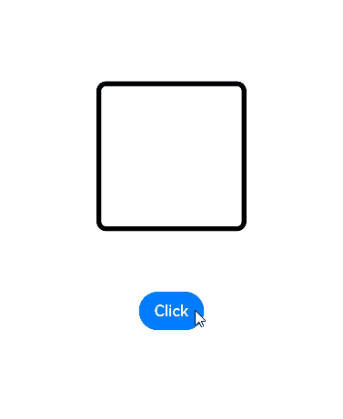

# Enter/Exit Transition


You can use [transition](../reference/apis-arkui/arkui-ts/ts-transition-animation-component.md), a basic component transition API, to animate the process in which a component enters or exits the view. You can even use it with [TransitionEffect](../reference/apis-arkui/arkui-ts/ts-transition-animation-component.md#transitioneffect10) to up your animation game.


  **Table 1** Transition effect APIs

| API| Description| Animation|
| -------- | -------- | -------- |
| IDENTITY | Disables the transition effect.| None.|
| OPACITY | Applies the default opacity transition effect.| The component enters by changing the opacity from 0 to 1 and exits by changing the opacity from 1 to 0.|
| SLIDE | Applies a sliding transition effect.| The component enters by sliding in from the left edge of the window and exits by sliding out from the right edge of the window.|
| translate | Applies a translation transition effect.| The component enters by moving from the position set by the **translate** API to the default position (value **0**), and exits by moving from the default position (value **0**) to the position set by the **translate** API.|
| rotate | Applies a rotation transition effect.| The component enters by rotating from the position set by the **rotate** API to the default position (value **0**), and exits by rotating from the default position (value **0**) to the position set by the **rotate** API.|
| opacity | Applies an opacity transition effect.| The component enters by changing the opacity from the set value to **1** (default value) and exits by changing the opacity from **1** to the set value.|
| move | Applies a transition effect by specifying which edge the component slides in and out of through [TransitionEdge](../reference/apis-arkui/arkui-ts/ts-transition-animation-component.md#transitionedge10).| The component enters by sliding in from the edge specified by **TransitionEdge** and exits by sliding out of the same edge.|
| asymmetric | Applies an asymmetric transition effect.<br>- **appear**: enter transition effect.<br>- **disappear**: exit transition effect.| The component enters by applying the transition effect specified by **appear** and exits by applying the transition effect specified by **disappear**.|
| combine | Combines with other transition effects.| The component enters and exits by combing with other transition effects.|
| animation | Defines the animation settings for the transition effect.<br>- If animation settings are not specified here, the animation settings of **animateTo** will be used.<br>- Animation settings cannot be configured through the **animation** API of the component.<br>- The **onFinish** callback of the **animation** parameter in **TransitionEffect** does not take effect.| The API call sequence is from top to bottom. This means that the **animation** settings of **TransitionEffect** at the upper level also take effect on **TransitionEffect** at the lower level .|


1. Create a **TransitionEffect** object.
  
   ```ts
   // The component enters by applying all enter transition effects and exits by applying all exit transition effects.
   // Define the animation settings for each transition effect.
   private effect: object =
     TransitionEffect.OPACITY // Apply an opacity transition effect. As the animation API is not called here, the animation settings of animateTo are used.
       // Apply a scaling transition effect and specify springMotion (0.6, 1.2) as the curve.
       .combine(TransitionEffect.scale({ x: 0, y: 0 }).animation({ curve: curves.springMotion(0.6, 1.2) }))
       // Apply a rotation transition effect, whose animation settings follow TransitionEffect above, that is, springMotion (0.6, 1.2).
       .combine(TransitionEffect.rotate({ angle: 90 }))
       // Apply a translation transition effect, whose animation settings follow TransitionEffect above, that is, springMotion (0.6, 1.2).
       .combine(TransitionEffect.translate({ x: 150, y: 150 })
       // Apply a move transition effect and specify springMotion as the curve.
       .combine(TransitionEffect.move(TransitionEdge.END)).animation({curve: curves.springMotion()}))
       // Apply an asymmetric transition effect. As the animation API is not called here, the animation settings follow TransitionEffect above, that is, springMotion.
       .combine(TransitionEffect.asymmetric(TransitionEffect.scale({ x: 0, y: 0 }), TransitionEffect.rotate({ angle: 90 })));
   ```

2. Set the transition effects to the component by calling [transition](../reference/apis-arkui/arkui-ts/ts-transition-animation-component.md).
  
   ```ts
   Text('test')
     .transition(this.effect)
   ```

3. Add or delete the component to trigger transition.
  
   ```ts
   @State isPresent: boolean = true;
   ...
   if (this.isPresent) {
     Text('test')
       .transition(this.effect)
   }
   ...
   // Control the addition or deletion of the component.
   // Method 1: Place the control variable in the animateTo closure. In this case, the transition effect for which the animation API is not call will follow the animation settings of animateTo.
   animateTo({ curve: curves.springMotion() }, () => {
     this.isPresent = false;
   })
   
   // Method 2: Directly delete or add the component. In this case, the transition effects follow the animation settings specified by animation.
   this.isPresent = false;
   ```


 Below is the complete sample code and effect. In the example, the transition is triggered by deleting or adding a component. It can also be triggered by changing the variables in the **animateTo** closure.

```ts
import { curves } from '@kit.ArkUI';

@Entry
@Component
struct TransitionEffectDemo {
  @State isPresent: boolean = false;

  // Step 1: Create a TransitionEffect object.
  private effect: TransitionEffect =
    // Apply the default opacity transition effect and specify springMotion (0.6, 0.8) as the curve.
  TransitionEffect.OPACITY.animation({ curve: curves.springMotion(0.6, 0.8) })
    // Combine with a scale transition effect, whose animation settings follow TransitionEffect above, that is, springMotion(0.6, 0.8).
    .combine(TransitionEffect.scale({ x: 0, y: 0 }))
      // Apply a rotation transition effect, whose animation settings follow TransitionEffect above, that is, springMotion(0.6, 0.8).
    .combine(TransitionEffect.rotate({ angle: 90 }))
      // Apply a translation transition effect, whose animation settings are specified by animation, which is springMotion().
    .combine(TransitionEffect.translate({ y: 150 }).animation({ curve: curves.springMotion() }))
      // Apply a movement transition effect, whose animation settings follow TransitionEffect above, that is, springMotion().
    .combine(TransitionEffect.move(TransitionEdge.END))

  build() {
    Stack() {
      if (this.isPresent) {
        Column() {
          Text('ArkUI')
            .fontWeight(FontWeight.Bold)
            .fontSize(20)
            .fontColor(Color.White)
        }
        .justifyContent(FlexAlign.Center)
        .width(150)
        .height(150)
        .borderRadius(10)
        .backgroundColor(0xf56c6c)
        // Step 2: Set the transition effects to the component through the transition API.
        .transition(this.effect)
      }

      // Border
      Column()
        .width(155)
        .height(155)
        .border({
          width: 5,
          radius: 10,
          color: Color.Black
        })

      // Step 3: Add or delete the component to trigger transition.
      Button('Click')
        .margin({ top: 320 })
        .onClick(() => {
          this.isPresent = !this.isPresent;
        })
    }
    .width('100%')
    .height('60%')
  }
}
```





When adding transition effects to multiple components, you can configure different **delay** values in animation parameters of these effects so that the components exit one by one.

```ts
const ITEM_COUNTS = 9;
const ITEM_COLOR = '#ED6F21';
const INTERVAL = 30;
const DURATION = 300;

@Entry
@Component
struct Index1 {
  @State isGridShow: boolean = false;

  private dataArray: number[] = new Array(ITEM_COUNTS);

  aboutToAppear(): void {
    for (let i = 0; i < ITEM_COUNTS; i++) {
      this.dataArray[i] = i;
    }
  }

  build() {
    Stack() {
      if (this.isGridShow) {
        Grid() {
          ForEach(this.dataArray, (item: number, index: number) => {
            GridItem() {
              Stack() {
                Text((item + 1).toString())
              }
              .size({ width: 50, height: 50 })
              .backgroundColor(ITEM_COLOR)
              .transition(TransitionEffect.OPACITY
                .combine(TransitionEffect.scale({ x: 0.5, y: 0.5 }))
                // Add delay to the transition of each grid cell so that the grid cells exit one by one.
                .animation({ duration: DURATION, curve: Curve.Friction, delay: INTERVAL * index }))
              .borderRadius(10)
            }
            // When the grid cells exit, the exit transition effect does not take effect if the transition effect is not added to the parent component.
            // Here the parent component of the grid cells is configured to always display with a 0.99 opacity when the cells exit. In this way, the transition effect of grid cells is not affected.
            .transition(TransitionEffect.opacity(0.99))
          }, (item: number) => item.toString())
        }
        .columnsTemplate('1fr 1fr 1fr')
        .rowsGap(15)
        .columnsGap(15)
        .size({ width: 180, height: 180 })
        // When the grid cells exit, the exit transition effect does not take effect if the transition effect is not added to the parent component.
        // Here the parent component of the grid cells is configured to always display with a 0.99 opacity when the cells exit. In this way, the transition effect of grid cells is not affected.
        .transition(TransitionEffect.opacity(0.99))
      }
    }
    .size({ width: '100%', height: '100%' })
    .onClick(() => {
      animateTo({
        duration: DURATION + INTERVAL * (ITEM_COUNTS - 1),
        curve: Curve.Friction
      }, () => {
        this.isGridShow = !this.isGridShow;
      })
    })
  }
}
```


