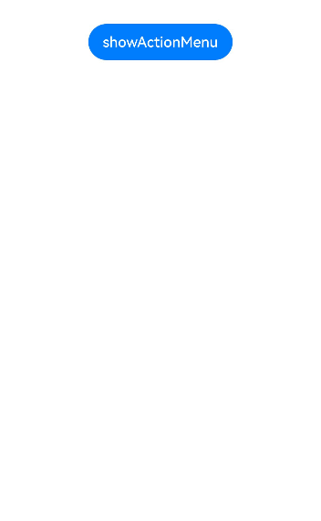
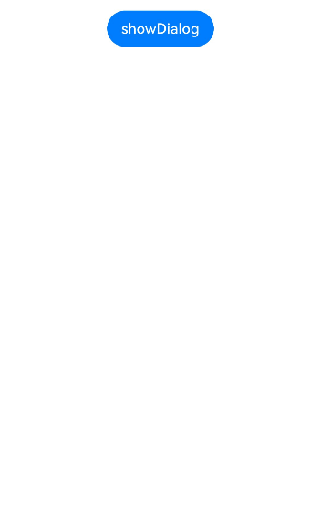
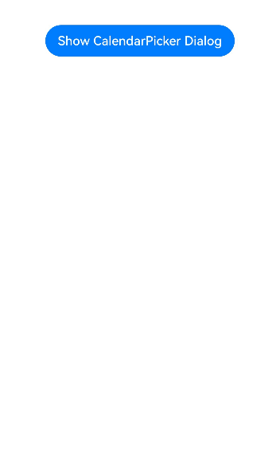
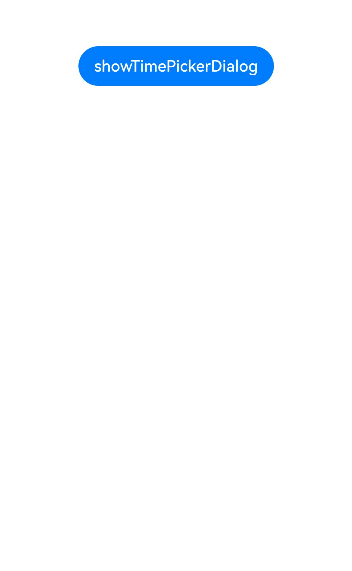
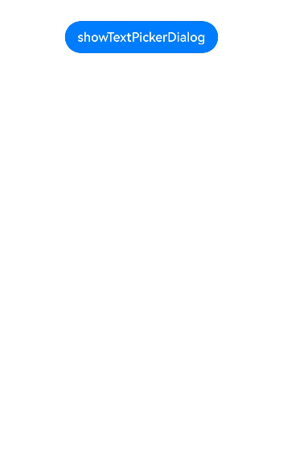

# Fixed Style Dialog Box

The fixed-style dialog box uses a fixed layout format, so that you do not need to care about specific display layout details, and only need to enter text content that needs to be displayed, thereby simplifying a use process and improving convenience.

## Constraints

- The dialog box APIs are dependent on the UI execution context and should not be used in an unclear UI context. For details, see [UIContext](../reference/apis-arkui/js-apis-arkui-UIContext.md#uicontext).

- You can call **UIContext** or **getUIContext** to use the APIs described in this document, except **CalendarPickerDialog**, on non-UI pages or in some asynchronous callbacks. Operation not supported.

- For **showActionMenu** and **showDialog** APIs, you must first call [getPromptAction()](../reference/apis-arkui/js-apis-arkui-UIContext.md#getpromptaction) in **UIContext** to obtain the **PromptAction** object, and then use the object to call the corresponding API.

- For **ActionSheet**, **AlertDialog**, and **PickerDialog** APIs, except **CalendarPickerDialog**, you must first call [getUIContext()](../reference/apis-arkui/js-apis-window.md#getuicontext10) in **ohos.window** to obtain the **UIContext** instance, and then use the instance to call the corresponding API. Alternatively, you can obtain a **UIContext** instance through the built-in method [getUIContext()](../reference/apis-arkui/arkui-ts/ts-custom-component-api.md#getuicontext) of the custom component.

The dialog boxes created using **showActionMenu**, **showDialog**, **ActionSheet**, or **AlertDialog** can be changed to a non-modal dialog box by setting its **isModal** attribute to **false**.

## Action Menu (showActionMenu)

The action menu is implemented by obtaining the **PromptAction** object from the [showActionMenu](../reference/apis-arkui/js-apis-arkui-UIContext.md#showactionmenu11) method in **UIContext** and then calling the [showActionMenu](../reference/apis-arkui/js-apis-arkui-UIContext.md#showactionmenu11) API through this object. It can be used in callbacks or in classes you define.

After an action menu is created and displayed, the index of the selected button in the **buttons** array will be returned asynchronously as the response result.

```ts
import { PromptAction } from '@kit.ArkUI';

let uiContext = this.getUIContext();
let promptAction: PromptAction = uiContext.getPromptAction();
try {
  promptAction.showActionMenu({
    title: 'showActionMenu Title Info',
    buttons: [
      {
        text: 'item1',
        color: '#666666'
      },
      {
        text: 'item2',
        color: '#000000'
      },
    ]
  })
    .then(data => {
      console.info('showActionMenu success, click button: ' + data.index);
    })
    .catch((err: Error) => {
      console.error('showActionMenu error: ' + err);
    })
} catch (error) {
}
```



## Common Dialog Box (showDialog)

The common dialog box is implemented by obtaining the **PromptAction** object from the **getPromptAction** method in **UIContext** and then calling the [showDialog](../reference/apis-arkui/js-apis-arkui-UIContext.md#showdialog) API through this object. It can be used in callbacks or in classes you define.

After a common dialog box is created and displayed, the index of the selected button in the **buttons** array will be returned asynchronously as the response result.

```ts
// xxx.ets
import { PromptAction } from '@kit.ArkUI';

let uiContext = this.getUIContext();
let promptAction: PromptAction = uiContext.getPromptAction();
try {
  promptAction.showDialog({
    title: 'showDialog Title Info',
    message: 'Message Info',
    buttons: [
      {
        text: 'button1',
        color: '#000000'
      },
      {
        text: 'button2',
        color: '#000000'
      }
    ]
  }, (err, data) => {
    if (err) {
      console.error('showDialog err: ' + err);
      return;
    }
    console.info('showDialog success callback, click button: ' + data.index);
  });
} catch (error) {
}
```



## Picker Dialog Box (PickerDialog)

The picker dialog box is typically used to display specific information or options when a user performs certain actions, such as touching a button.

### Lifecycle

The picker dialog box offers lifecycle functions to notify users about the dialog box's lifecycle events.
For details about the sequence in which the lifecycle events are triggered, see the API reference for each component.

| Name           |Type| Description                      |
| ----------------- | ------ | ---------------------------- |
| onDidAppear    | () => void  | Event callback when the dialog box appears. |
| onDidDisappear |() => void  | Event callback when the dialog box disappears. |
| onWillAppear    | () => void | Event callback when the dialog box is about to appear.|
| onWillDisappear | () => void | Event callback when the dialog box is about to disappear.|

### Calendar Picker Dialog Box (CalendarPickerDialog)

The calendar picker dialog box provides a calendar view that includes year, month, and weekday information, implemented through the [CalendarPickerDialog](../reference/apis-arkui/arkui-ts/ts-methods-calendarpicker-dialog.md) API. You can call the **show** API to define and display the calendar picker dialog box.

You can also define custom button styles by configuring **acceptButtonStyle** and **cancelButtonStyle**.

```ts
// xxx.ets
@Entry
@Component
struct CalendarPickerDialogExample {
  private selectedDate: Date = new Date('2024-04-23')

  build() {
    Column() {
      Button("Show CalendarPicker Dialog")
        .margin(20)
        .onClick(() => {
          console.info("CalendarDialog.show")
          CalendarPickerDialog.show({
            selected: this.selectedDate,
            acceptButtonStyle: {
              fontColor: '#2787d9',
              fontSize: '16fp',
              backgroundColor: '#f7f7f7',
              borderRadius: 10
            },
            cancelButtonStyle: {
              fontColor: Color.Red,
              fontSize: '16fp',
              backgroundColor: '#f7f7f7',
              borderRadius: 10
            },
            onAccept: (date: Date)=>{
              // Display the last selected date when the dialog box is shown again.
              this.selectedDate = date
            }
          })
        })
    }.width('100%')
  }
}
```



### Date Picker Dialog Box (DatePickerDialog)

The date picker dialog box allows users to select a date from the given range, presenting the date information clearly.

You use the [showDatePickerDialog](../reference/apis-arkui/js-apis-arkui-UIContext.md#showdatepickerdialog) API in **UIContext** to implement a date picker dialog box.

When **lunarSwitch** and **showTime** are set to **true** for the dialog box, it displays a switch for toggling the lunar calendar and time. When the check box is selected, the lunar calendar is shown. When the confirm button is touched, the dialog box returns the currently selected date through **onDateAccept**. To display the last confirmed date when the dialog box is shown again, reassign the value to **selectTime** in the callback.

```ts
@Entry
@Component
struct DatePickerDialogExample {
  @State selectTime: Date = new Date('2023-12-25T08:30:00');

  build() {
    Column() {
      Button('showDatePickerDialog')
        .margin(30)
        .onClick(() => {
          this.getUIContext().showDatePickerDialog({
            start: new Date("2000-1-1"),
            end: new Date("2100-12-31"),
            selected: this.selectTime,
            lunarSwitch: true,
            showTime: true,
            onDateAccept: (value: Date) => {
              this.selectTime = value
              console.info("DatePickerDialog:onAccept()" + JSON.stringify(value))
            },
          })
        })
    }.width('100%').margin({ top: 5 })
  }
}

```


In this example, **disappearTextStyle**, **textStyle**, **selectedTextStyle**, **acceptButtonStyle**, and **cancelButtonStyle** are configured to customize the text and button style.

```ts
@Entry
@Component
struct DatePickerDialogExample {
  @State selectTime: Date = new Date('2023-12-25T08:30:00');

  build() {
    Column() {
      Button('showDatePickerDialog')
        .margin(30)
        .onClick(() => {
          this.getUIContext().showDatePickerDialog({
            start: new Date("2000-1-1"),
            end: new Date("2100-12-31"),
            selected: this.selectTime,
            textStyle: { color: '#2787d9', font: { size: '14fp', weight: FontWeight.Normal } },
            selectedTextStyle: { color: '#004aaf', font: { size: '18fp', weight: FontWeight.Regular } },
            acceptButtonStyle: {
              fontColor: '#2787d9',
              fontSize: '16fp',
              backgroundColor: '#f7f7f7',
              borderRadius: 10
            },
            cancelButtonStyle: {
              fontColor: Color.Red,
              fontSize: '16fp',
              backgroundColor: '#f7f7f7',
              borderRadius: 10
            }
          })
        })
    }.width('100%').margin({ top: 5 })
  }
}
```


### Time Picker Dialog Box (TimePickerDialog)

The time picker dialog box allows users to select a time from the 24-hour range, presenting the time information clearly.

You use the [showTimePickerDialog](../reference/apis-arkui/js-apis-arkui-UIContext.md#showtimepickerdialog) API in **UIContext** to implement a time picker dialog box.

In this example, **disappearTextStyle**, **textStyle**, **selectedTextStyle**, **acceptButtonStyle**, and **cancelButtonStyle** are configured to customize the text and button style.

```ts
// xxx.ets

@Entry
@Component
struct TimePickerDialogExample {
  @State selectTime: Date = new Date('2023-12-25T08:30:00');

  build() {
    Column() {
      Button('showTimePickerDialog')
        .margin(30)
        .onClick(() => {
          this.getUIContext().showTimePickerDialog({
            selected: this.selectTime,
            textStyle: { color: '#2787d9', font: { size: '14fp', weight: FontWeight.Normal } },
            selectedTextStyle: { color: '#004aaf', font: { size: '18fp', weight: FontWeight.Regular } },
            acceptButtonStyle: {
              fontColor: '#2787d9',
              fontSize: '16fp',
              backgroundColor: '#f7f7f7',
              borderRadius: 10
            },
            cancelButtonStyle: {
              fontColor: Color.Red,
              fontSize: '16fp',
              backgroundColor: '#f7f7f7',
              borderRadius: 10
            }
          })
        })
    }.width('100%').margin({ top: 5 })
  }
}

```



### Text Picker Dialog Box (TextPickerDialog)

The text picker dialog box allows users to select text from the given range, presenting the text information clearly.

You use the [showTextPickerDialog](../reference/apis-arkui/js-apis-arkui-UIContext.md#showtextpickerdialog) API in **UIContext** to implement a date picker dialog box.

This example demonstrates how to implement a three-column text picker dialog box by setting the **range** parameter type to TextCascadePickerRangeContent[]. When the confirm button is touched, the dialog box returns the currently selected text and index value through the **onAccept** callback. To display the last confirmed text when the dialog box is shown again, reassign the value to **select** in the callback.

```ts
@Entry
@Component
struct TextPickerDialogExample {
  private fruits: TextCascadePickerRangeContent[] = [
    {
      text: 'Liaoning Province',
      children: [{ text: 'Shenyang', children: [{ text: 'Shenhe District' }, { text: 'Heping District' }, { text: 'Hunnan District' }] },
        { text: 'Dalian', children: [{ text: 'Zhongshan District' }, { text: 'Jinzhou District' }, { text: 'Changhai County' }] }]
    },
    {
      text: 'Jilin Province',
      children: [{ text: 'Changchun', children: [{ text: 'Nanguan District' }, { text: 'Kuancheng District' }, { text: 'Chaoyang District' }] },
        { text: 'Siping', children: [{ text: 'Tiexi District' }, { text: 'Tiedong District' }, { text: 'Lishu County' }] }]
    },
    {
      text: 'Heilongjiang Province',
      children: [{ text: 'Harbin', children: [{ text: 'Daoli District' }, { text: 'Daowai District' }, { text: 'Nangang District' }] },
      { text: 'Mudanjiang', children: [{ text: `Dong'an District` }, { text: `Xi'an District` }, { text: 'Aimin District' }] }]
    }
  ]
  private select : number  = 0;
  build() {
    Column() {
      Button('showTextPickerDialog')
        .margin(30)
        .onClick(() => {
          this.getUIContext().showTextPickerDialog({
            range: this.fruits,
            selected: this.select,
            onAccept: (value: TextPickerResult) => {
              this.select = value.index as number
            }
          })
        })
    }.width('100%').margin({ top: 5 })
  }
}
```



## Action Sheet (ActionSheet)

The action sheet is ideal for presenting multiple action options, especially when the UI only needs to display a list of actions without additional content.

You use the [showActionSheet](../reference/apis-arkui/js-apis-arkui-UIContext.md#showactionsheet) API in UIContext to implement an action sheet.

This example shows how to configure the style and animation effects of the action sheet by setting APIs like **width**, **height**, and **transition**.

```ts
@Entry
@Component
struct showActionSheetExample {
  build() {
    Column() {
      Button('showActionSheet')
        .margin(30)
        .onClick(() => {
          this.getUIContext().showActionSheet({
            title: 'ActionSheet title',
            message: 'Message',
            autoCancel: false,
            width: 300,
            height: 300,
            cornerRadius: 20,
            borderWidth: 1,
            borderStyle: BorderStyle.Solid,
            borderColor: Color.Blue,
            backgroundColor: Color.White,
            transition: TransitionEffect.asymmetric(TransitionEffect.OPACITY
              .animation({ duration: 3000, curve: Curve.Sharp })
              .combine(TransitionEffect.scale({ x: 1.5, y: 1.5 }).animation({ duration: 3000, curve: Curve.Sharp })),
              TransitionEffect.OPACITY.animation({ duration: 100, curve: Curve.Smooth })
                .combine(TransitionEffect.scale({ x: 0.5, y: 0.5 }).animation({ duration: 100, curve: Curve.Smooth }))),
            confirm: {
              value: 'OK',
              action: () => {
                console.info('Get Alert Dialog handled')
              }
            },
            alignment: DialogAlignment.Center,
            sheets: [
              {
                title: 'Apples',
                action: () => {
                }
              },
              {
                title: 'Bananas',
                action: () => {
                }
              },
              {
                title: 'Pears',
                action: () => {
                  console.log('Pears')
                }
              }
            ]
          })
        })
    }.width('100%').margin({ top: 5 })
  }
}
```


## Alert Dialog Box (AlertDialog)

The alert dialog box is used when you need to ask a question or get permission from the user.

* The alert dialog box interrupts the current task. Therefore, only use it to provide necessary information and useful operations.
* Avoid using alert dialog boxes to provide information only; users do not like to be interrupted by information-rich but non-operable alerts.

You use the [showAlertDialog](../reference/apis-arkui/js-apis-arkui-UIContext.md#showalertdialog) API in UIContext to implement an alert dialog box.

This example shows how to configure the style and animation effects of an alert dialog with multiple buttons by setting APIs like **width**, **height**, and **transition**.

```ts
@Entry
@Component
struct showAlertDialogExample {
  build() {
    Column() {
      Button('showAlertDialog')
        .margin(30)
        .onClick(() => {
          this.getUIContext().showAlertDialog(
            {
              title: 'Title',
              message: 'Text',
              autoCancel: true,
              alignment: DialogAlignment.Center,
              offset: { dx: 0, dy: -20 },
              gridCount: 3,
              transition: TransitionEffect.asymmetric(TransitionEffect.OPACITY
                .animation({ duration: 3000, curve: Curve.Sharp })
                .combine(TransitionEffect.scale({ x: 1.5, y: 1.5 }).animation({ duration: 3000, curve: Curve.Sharp })),
                TransitionEffect.OPACITY.animation({ duration: 100, curve: Curve.Smooth })
                  .combine(TransitionEffect.scale({ x: 0.5, y: 0.5 })
                    .animation({ duration: 100, curve: Curve.Smooth }))),
              buttons: [{
                value: 'Cancel',
                action: () => {
                  console.info('Callback when the first button is clicked')
                }
              },
                {
                  enabled: true,
                  defaultFocus: true,
                  style: DialogButtonStyle.HIGHLIGHT,
                  value: 'OK',
                  action: () => {
                    console.info('Callback when the second button is clicked')
                  }
                }],
            }
          )
        })
    }.width('100%').margin({ top: 5 })
  }
}
```


