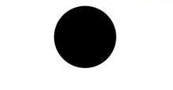
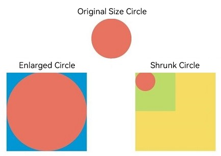
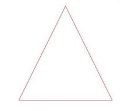
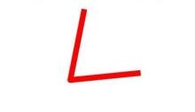
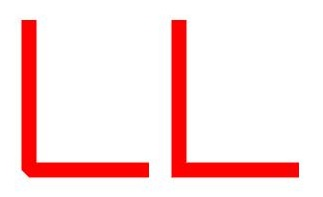
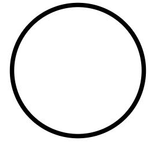
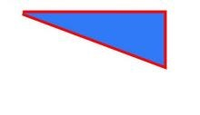
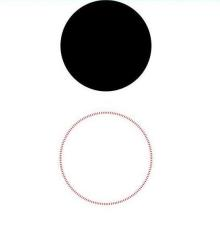

# Drawing Geometric Shapes (Shape)


The drawing components are used to draw graphs on the page. The **Shape** component is the parent component of the drawing components. The attributes of **Shape** are universal attributes supported by all the drawing components. For details, see [Shape](../reference/apis-arkui/arkui-ts/ts-drawing-components-shape.md).


## Creating a Drawing Component

A drawing component can be created in either of the following ways:

- Create a drawing component with **Shape** as their parent to implement the effect similar to SVG. The API used is as follows:

  ```ts
  Shape(value?: PixelMap)
  ```

  In the API, the **value** parameter sets the drawing target. You can draw a graph in the specified **PixelMap** object. If the **value** parameter is not set, the graph is drawn in the current drawing target.

  ```ts
  Shape() {
    Rect().width(300).height(50)
  }
  ```


- Create an independent drawing component to draw a specific shape. Seven shapes are supported: [Circle](../reference/apis-arkui/arkui-ts/ts-drawing-components-circle.md), [Ellipse](../reference/apis-arkui/arkui-ts/ts-drawing-components-ellipse.md), [Line](../reference/apis-arkui/arkui-ts/ts-drawing-components-line.md), [Polyline](../reference/apis-arkui/arkui-ts/ts-drawing-components-polyline.md), [Polygon](../reference/apis-arkui/arkui-ts/ts-drawing-components-polygon.md), [Path](../reference/apis-arkui/arkui-ts/ts-drawing-components-path.md), and [Rect](../reference/apis-arkui/arkui-ts/ts-drawing-components-rect.md). The following uses the **Circle** API as an example:

  ```ts
  Circle(value?: { width?: string | number, height?: string | number })
  ```

    This API draws a circle on a page. The **width** parameter indicates the width of the circle, and the **height** parameter indicates the height of the circle. The diameter of the circle is determined by the minimum width and height.

  ```ts
  Circle({ width: 150, height: 150 })
  ```

  


## Viewport


```ts
viewPort(value: { x?: number | string, y?: number | string, width?: number | string, height?: number | string })
```

Creates a viewport, which is a rectangle in the user space that maps to the view boundary established for the associated SVG element. Among the four optional parameters, **x** and **y** represent the coordinates of the upper left corner of the viewport, and **width** and **height** represent the size of the viewport.

The following examples describe how to use the viewport:

- Zoom in or zoom out a graph through the shape viewport.

  ```ts
  class tmp{
    x:number = 0
    y:number = 0
    width:number = 75
    height:number = 75
  }
  let viep:tmp = new tmp()

  class tmp1{
    x:number = 0
    y:number = 0
    width:number = 300
    height:number = 300
  }
  let viep1:tmp1 = new tmp1()

  // Draw a circle whose width and height are both 75.
  Text('Original Size Circle')
  Circle({width: 75, height: 75}).fill('#E87361')

  Row({space:10}) {
    Column() {
      // Create a shape component whose width and height are both 150, the background color is yellow, and a viewport whose width and height are both 75. Fill the viewport with a blue rectangle and draw a circle with a diameter of 75 in the viewport.
      // The drawing is complete. The viewport is zoomed in twice based on the width and height of the component.
      Text('Enlarged Circle')
      Shape() {
        Rect().width('100%').height('100%').fill('#0097D4')
        Circle({width: 75, height: 75}).fill('#E87361')
      }
      .viewPort(viep)
      .width(150)
      .height(150)
      .backgroundColor('#F5DC62')
    }
    Column() {
      // Create a shape component whose width and height are both 150, the background color is yellow, and a viewport whose width and height are both 300. Fill the viewport with a green rectangle and draw a circle with a diameter of 75 in the viewport.
      // After the drawing is complete, the viewport is zoomed out by twice based on the width and height of the component.
      Text('Shrunk Circle')
      Shape() {
        Rect().width('100%').height('100%').fill('#BDDB69')
        Circle({width: 75, height: 75}).fill('#E87361')
      }
      .viewPort(viep1)
      .width(150)
      .height(150)
      .backgroundColor('#F5DC62')
    }
  }
  ```

  

- Create a shape component whose width and height are both 300, with a yellow background and a viewport whose width and height are both 300. Fill the viewport with a blue rectangle and draw a circle with a radius of 75 in the viewport.

  ```ts
  class tmp{
    x:number = 0
    y:number = 0
    width:number = 300
    height:number = 300
  }
  let viep:tmp = new tmp()

  Shape() {
    Rect().width("100%").height("100%").fill("#0097D4")
    Circle({ width: 150, height: 150 }).fill("#E87361")
  }
    .viewPort(viep)
    .width(300)
    .height(300)
    .backgroundColor("#F5DC62")
  ```

   .jpg)

- Create a shape component whose width and height are both 300, with a yellow background and a viewport whose width and height are both 300. Fill the viewport with a blue rectangle, draw a circle with a radius of 75 in the viewport, and move the viewport 150 to the right and below respectively.

  ```ts
  class tmp{
    x:number = -150
    y:number = -150
    width:number = 300
    height:number = 300
  }
  let viep:tmp = new tmp()

  Shape() {
    Rect().width("100%").height("100%").fill("#0097D4")
    Circle({ width: 150, height: 150 }).fill("#E87361")
  }
    .viewPort(viep)
    .width(300)
    .height(300)
    .backgroundColor("#F5DC62")
  ```

   .jpg)


## Setting Styles

The drawing component allows you to change the component style through various attributes.

- You can use **fill** to set the color of the filling area of the component.

  ```ts
  Path()
    .width(100)
    .height(100)
    .commands('M150 0 L300 300 L0 300 Z')
    .fill("#E87361")
    .strokeWidth(0)
  ```

  .jpg)

- You can use **stroke** to set the stroke color of a component.

  ```ts
  Path()
    .width(100)
    .height(100)
    .fillOpacity(0)
    .commands('M150 0 L300 300 L0 300 Z')
    .stroke(Color.Red)
  ```

  

- You can use **strokeOpacity** to set the stroke opacity.

  ```ts
  Path()
    .width(100)
    .height(100)
    .fillOpacity(0)
    .commands('M150 0 L300 300 L0 300 Z')
    .stroke(Color.Red)
    .strokeWidth(10)
    .strokeOpacity(0.2)
  ```

  

- You can use **strokeLineJoin** to set the join style of the stroke. Options include **Bevel**, **Miter**, and **Round**.

  ```ts
  Polyline()
    .width(100)
    .height(100)
    .fillOpacity(0)
    .stroke(Color.Red)
    .strokeWidth(8)
    .points([[20, 0], [0, 100], [100, 90]])
     // Set the join style of the stroke to Round.
    .strokeLineJoin(LineJoinStyle.Round)
  ```

  

- **strokeMiterLimit** places a limit on the ratio of the miter length to the value of **strokeWidth** used to draw a miter join.
  The miter length indicates the distance from the outer tip to the inner corner of the miter. This attribute must be set to a value greater than or equal to 1 and takes effect when **strokeLineJoin** is set to **LineJoinStyle.Miter**.

  ```ts
  Polyline()
    .width(100)
    .height(100)
    .fillOpacity(0)
    .stroke(Color.Red)
    .strokeWidth(10)
    .points([[20, 0], [20, 100], [100, 100]])
    // Set the join style of the stroke to Miter.
    .strokeLineJoin(LineJoinStyle.Miter)
    // Set the limit on the ratio of the miter length to the value of strokeWidth used to draw a miter join.
    .strokeMiterLimit(1/Math.sin(45))
  Polyline()
    .width(100)
    .height(100)
    .fillOpacity(0)
    .stroke(Color.Red)
    .strokeWidth(10)
    .points([[20, 0], [20, 100], [100, 100]])
    .strokeLineJoin(LineJoinStyle.Miter)
    .strokeMiterLimit(1.42)
  ```

  

- Use the **antiAlias** attribute to set whether to enable anti-aliasing. The default value is true, indicating that anti-aliasing is enabled.

  ```ts
  // Enable anti-aliasing.
  Circle()
    .width(150)
    .height(200)
    .fillOpacity(0)
    .strokeWidth(5)
    .stroke(Color.Black)
  ```

  

  ```ts
  // Disable anti-aliasing.
  Circle()
    .width(150)
    .height(200)
    .fillOpacity(0)
    .strokeWidth(5)
    .stroke(Color.Black)
    .antiAlias(false)
  ```

  


## Example Scenario

### Drawing a Closed Path

  Draw a closed path at (-80, -5). The fill color is 0x317AF7, the stroke width is 3, the stroke color is red, and the stroke join style is miter (default value).

  ```ts
  @Entry
  @Component
  struct ShapeExample {
    build() {
      Column({ space: 10 }) {
        Shape() {
          Path().width(200).height(60).commands('M0 0 L400 0 L400 150 Z')
        }
        .viewPort({ x: -80, y: -5, width: 500, height: 300 })
        .fill(0x317AF7)
        .stroke(Color.Red)
        .strokeWidth(3)
        .strokeLineJoin(LineJoinStyle.Miter)
        .strokeMiterLimit(5)
      }.width('100%').margin({ top: 15 })
    }
  }
  ```

  

### Drawing a Circle and Ring

  Draw a circle with a diameter of 150 mm and a ring with a diameter of 150 mm and a red dotted line (use the shorter side as the diameter if the width and height are different).

  ```ts
  @Entry
  @Component
  struct CircleExample {
    build() {
      Column({ space: 10 }) {
        // Draw a circle whose diameter is 150.
        Circle({ width: 150, height: 150 })
        // Draw a ring with a diameter of 150 mm and a red dotted line.
        Circle()
          .width(150)
          .height(200)
          .fillOpacity(0)
          .strokeWidth(3)
          .stroke(Color.Red)
          .strokeDashArray([1, 2])
      }.width('100%')
    }
  }
  ```

  
