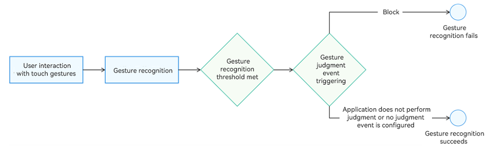
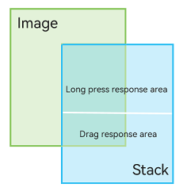
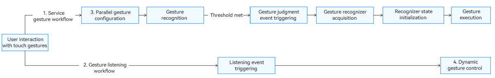

# Gesture Judgment

Gesture judgment is primarily used to ensure that gestures are executed as needed, effectively resolving gesture conflict issues. Typical use cases include nested scrolling and optimizing the interaction experience by filtering the range of components that respond to gestures. Gesture judgment is mainly implemented through two methods: [gesture triggering control](#gesture-triggering-control) and [gesture response control](#gesture-response-control).

## Gesture Triggering Control

Gesture triggering control refers to the process where, under conditions where the gesture recognition threshold is met, the application can independently determine whether to proceed with the gesture, causing the gesture operation to fail if necessary.

**Figure 1** Flowchart of gesture triggering control



The following APIs are involved in gesture triggering control.

| API| Description|
| ------- | -------------- |
|[onGestureJudgeBegin](../reference/apis-arkui/arkui-ts/ts-gesture-customize-judge.md#ongesturejudgebegin)|Triggered when the gesture meets the recognition threshold to allow the application to decide whether to intercept the gesture. It is a universal event.|
|[onGestureRecognizerJudgeBegin](../reference/apis-arkui/arkui-ts/ts-gesture-blocking-enhancement.md#ongesturerecognizerjudgebegin)|Triggered to implement gesture judgment, obtain gesture recognizers, and set their enabled state. It is an extension of **onGestureJudgeBegin** and can serve as its substitute.<br>When obtaining gesture recognizers, this API obtains all gesture recognizers in the response chain of the current interaction, as well as the recognizer about to be triggered successfully, allowing the enabled state of the gesture to be set.|

In the following example, the **Image** and **Stack** components are located in the same area. Long-pressing the upper half of the **Stack** component triggers the long-press gesture bound to the **Stack** component, while long-pressing the lower half of the **Stack** component triggers the drag operation of the **Image** component.

**Figure 2** Example



1. Configure drag settings for the **Image** component.

   ```ts
   Image($r('sys.media.ohos_app_icon'))
     .draggable(true)
     .onDragStart(()=>{
       promptAction.showToast({ message: ""Drag the lower blue area. The Image component responds." });
     })
     .width('200vp').height('200vp')
   ```

2. Set up gestures for the **Stack** component.

   ```ts
   Stack() {}
     .width('200vp')
     .height('200vp')
     .hitTestBehavior(HitTestMode.Transparent)
     .gesture(GestureGroup(GestureMode.Parallel,
       LongPressGesture()
         .onAction((event: GestureEvent) => {
           promptAction.showToast({ message: "Long-press the upper red area. The red area responds." });
         })
         .tag("longpress")
     ))
   ```

3. Set up gesture judgment for the **Stack** component.

   ```ts
   .onGestureJudgeBegin((gestureInfo: GestureInfo, event: BaseGestureEvent) => {
     // If it is a long press gesture, determine whether the touch position is in the upper half area.
     if (gestureInfo.type == GestureControl.GestureType.LONG_PRESS_GESTURE) {
       if (event.fingerList.length > 0 && event.fingerList[0].localY < 100) {
         return GestureJudgeResult.CONTINUE;
       } else {
         return GestureJudgeResult.REJECT;
       }
     }
     return GestureJudgeResult.CONTINUE;
   })
   ```

4. Below is the complete code example.

   ```ts
   import { PromptAction } from '@kit.ArkUI';
   
   @Entry
   @Component
   struct Index {
     scroller: Scroller = new Scroller();
     promptAction: PromptAction = this.getUIContext().getPromptAction();
   
     build() {
       Scroll(this.scroller) {
         Column({ space: 8 }) {
           Text("There are two layers of components, the upper layer component bound to a long press gesture, and the lower layer component bound to a drag. The lower half of the upper layer component is bound to gesture judgment, making this area respond to the drag gesture of the lower layer.").width('100%').fontSize(20).fontColor('0xffdd00')
           Stack({ alignContent: Alignment.Center }) {
             Column() {
               // Simulate the upper and lower half areas.
               Stack().width('200vp').height('100vp').backgroundColor(Color.Red)
               Stack().width('200vp').height('100vp').backgroundColor(Color.Blue)
             }.width('200vp').height('200vp')
             // The lower half of the Stack component is the image area bound to the drag gesture.
             Image($r('sys.media.ohos_app_icon'))
               .draggable(true)
               .onDragStart(()=>{
                 this.promptAction.showToast({ message: "Drag the lower blue area. The Image component responds." });
               })
               .width('200vp').height('200vp')
             // The upper half of the Stack component is the floating area bound to the long press gesture.
             Stack() {
             }
             .width('200vp')
             .height('200vp')
             .hitTestBehavior(HitTestMode.Transparent)
             .gesture(GestureGroup(GestureMode.Parallel,
               LongPressGesture()
                 .onAction((event: GestureEvent) => {
                   this.promptAction.showToast({ message: "Long-press the upper red area. The red area responds." });
                 })
                 .tag("longpress")
             ))
             .onGestureJudgeBegin((gestureInfo: GestureInfo, event: BaseGestureEvent) => {
               // If it is a long press gesture, determine whether the touch position is in the upper half area.
               if (gestureInfo.type == GestureControl.GestureType.LONG_PRESS_GESTURE) {
                 if (event.fingerList.length > 0 && event.fingerList[0].localY < 100) {
                   return GestureJudgeResult.CONTINUE;
                 } else {
                   return GestureJudgeResult.REJECT;
                 }
               }
               return GestureJudgeResult.CONTINUE;
             })
           }.width('100%')
         }.width('100%')
       }
     }
   }
   ```

## Gesture Response Control

Gesture response control allows you to manage whether a gesture callback should be executed, even after the gesture has been successfully recognized.

**Figure 3** Flowchart of gesture response control


Gesture response control is based on the successful recognition of a gesture. If the gesture is not recognized, it will not trigger a callback response.

1. Service gesture workflow: This refers to gestures that directly cause changes in the UI, such as **PanGesture** for scrolling pages or **TapGesture** for clicks.

2. Gesture listening workflow: This involves dynamically controlling the start and stop of gesture recognizers based on the current service state. For example, during nested scrolling, the listener can determine whether the component has reached the edge. This can be achieved using **PanGesture** with the [parallel gesture binding method](arkts-gesture-events-binding.md#parallelgesture-parallel-gesture-binding-method) or by using touch events.

3. Parallel gesture configuration: This step is optional. A typical use case is to set the scroll gesture of an outer component to be parallel with the scroll gesture of an inner component during nested scrolling.

4. Dynamic gesture control: This involves controlling whether gestures respond to user callbacks by using the **setEnable** API of gesture recognizers.

The following APIs are involved in gesture response control.

| API| Description|
| ------- | -------------- |
|[shouldBuiltInRecognizerParallelWith](../reference/apis-arkui/arkui-ts/ts-gesture-blocking-enhancement.md#shouldbuiltinrecognizerparallelwith)|Used to set the built-in gestures to be parallel with other gestures.|
|[onGestureRecognizerJudgeBegin](../reference/apis-arkui/arkui-ts/ts-gesture-blocking-enhancement.md#ongesturerecognizerjudgebegin)|Triggered to implement gesture judgment, obtain gesture recognizers, and initialize and their enabled state.|
|[parallelGesture](arkts-gesture-events-binding.md#parallelgesture-parallel-gesture-binding-method)|Allows custom gestures to be parallel with gestures of higher priority.|

The following example demonstrates a nested scrolling scenario with two **Scroll** components, using gesture control APIs to manage the nested scrolling linkage between the outer and inner components.

1. Use the **shouldBuiltInRecognizerParallelWith** API to set the **PanGesture** of the outer **Scroll** component to be parallel with the **PanGesture** of the inner **Scroll** component.

   ```ts
   .shouldBuiltInRecognizerParallelWith((current: GestureRecognizer, others: Array<GestureRecognizer>) => {
     for (let i = 0; i < others.length; i++) {
       let target = others[i].getEventTargetInfo();
       if (target.getId() == "inner" && others[i].isBuiltIn() && others[i].getType() == GestureControl.GestureType.PAN_GESTURE) { // Identify the recognizer to work in parallel.
         this.currentRecognizer = current; // Save the recognizer of the current component.
         this.childRecognizer = others[i]; // Save the recognizer to work in parallel.
         return others[i]; // Return the recognizer to work in parallel with the current one.
       }
     }
     return undefined;
   })
   ```

2. Use the **onGestureRecognizerJudgeBegin** API to obtain the pan gesture recognizer of the **Scroll** component and to set the enabled state of the inner and outer gesture recognizers based on the boundary conditions of the **Scroll** components.

   ```ts
   .onGestureRecognizerJudgeBegin((event: BaseGestureEvent, current: GestureRecognizer, others: Array<GestureRecognizer>) => { // When gesture recognition is about to be successful, set the recognizer's enabled state based on the current component state.       
     let target = current.getEventTargetInfo();
     if (target.getId() == "outer" && current.isBuiltIn() && current.getType() == GestureControl.GestureType.PAN_GESTURE) {
       for (let i = 0; i < others.length; i++) {
         let target = others[i].getEventTargetInfo() as ScrollableTargetInfo;
         if (target instanceof ScrollableTargetInfo && target.getId() == "inner") { // Identify the recognizer to work in parallel on the response chain.
           let panEvent = event as PanGestureEvent;
           this.childRecognizer.setEnabled(true);
           this.currentRecognizer.setEnabled(false);
           if (target.isEnd()) { // Dynamically control the recognizer's enabled state based on the current component state and direction of movement.
             if (panEvent && panEvent.offsetY < 0) {
               this.childRecognizer.setEnabled(false);
               this.currentRecognizer.setEnabled(true);
             }
           } else if (target.isBegin()) {
             if (panEvent.offsetY > 0) {
               this.childRecognizer.setEnabled(false);
               this.currentRecognizer.setEnabled(true);
             }
           }
         }
       }
     }
     return GestureJudgeResult.CONTINUE;
   })
   ```

3. Set up a gesture listener to listen for the state changes of the **Scroll** component, dynamically adjust the enabled state of the gesture recognizers, and controls whether gesture callbacks are triggered, allowing you to manage scrolling.

   ```ts
   .parallelGesture ( // Bind a PanGesture as a dynamic controller.
     PanGesture()
       .onActionUpdate((event: GestureEvent)=>{
         if (this.childRecognizer.getState() != GestureRecognizerState.SUCCESSFUL || this.currentRecognizer.getState() != GestureRecognizerState.SUCCESSFUL) { // If neither recognizer is in the SUCCESSFUL state, no control is applied.
           return;
         }
         let target = this.childRecognizer.getEventTargetInfo() as ScrollableTargetInfo;
         let currentTarget = this.currentRecognizer.getEventTargetInfo() as ScrollableTargetInfo;
         if (target instanceof ScrollableTargetInfo && currentTarget instanceof ScrollableTargetInfo) {
           this.childRecognizer.setEnabled(true);
           this.currentRecognizer.setEnabled(false);
           if (target.isEnd()) { // Adjust the enabled state of the gesture recognizers based on the current component state during movement.
             if ((event.offsetY - this.lastOffset) < 0) {
               this.childRecognizer.setEnabled(false);
               if (currentTarget.isEnd()) {
                 this.currentRecognizer.setEnabled(false);
               } else {
                 this.currentRecognizer.setEnabled(true);
               }
             }
           } else if (target.isBegin()) {
             if ((event.offsetY - this.lastOffset) > 0) {
               this.childRecognizer.setEnabled(false);
               if (currentTarget.isBegin()) {
                 this.currentRecognizer.setEnabled(false);
               } else {
                 this.currentRecognizer.setEnabled(true);
               }
             }
           }
         }
         this.lastOffset = event.offsetY
     })
   )
   ```

4. Below is the complete code example.

   ```ts
   // xxx.ets
   @Entry
   @Component
   struct FatherControlChild {
     scroller: Scroller = new Scroller();
     scroller2: Scroller = new Scroller();
     private arr: number[] = [0, 1, 2, 3, 4, 5, 6, 7, 8, 9];
     private childRecognizer: GestureRecognizer = new GestureRecognizer();
     private currentRecognizer: GestureRecognizer = new GestureRecognizer();
     private lastOffset: number = 0;
   
     build() {
       Stack({ alignContent: Alignment.TopStart }) {
         Scroll(this.scroller) { // Outer scroll container.
           Column() {
             Text("Scroll Area")
               .width('90%')
               .height(150)
               .backgroundColor(0xFFFFFF)
               .borderRadius(15)
               .fontSize(16)
               .textAlign(TextAlign.Center)
               .margin({ top: 10 })
             Scroll(this.scroller2) { // Inner scroll container.
               Column() {
                 Text("Scroll Area2")
                   .width('90%')
                   .height(150)
                   .backgroundColor(0xFFFFFF)
                   .borderRadius(15)
                   .fontSize(16)
                   .textAlign(TextAlign.Center)
                   .margin({ top: 10 })
                 Column() {
                   ForEach(this.arr, (item: number) => {
                     Text(item.toString())
                       .width('90%')
                       .height(150)
                       .backgroundColor(0xFFFFFF)
                       .borderRadius(15)
                       .fontSize(16)
                       .textAlign(TextAlign.Center)
                       .margin({ top: 10 })
                   }, (item: string) => item)
                 }.width('100%')
               }
             }
             .id("inner")
             .width('100%')
             .height(800)
           }.width('100%')
         }
         .id("outer")
         .height(600)
         .scrollable(ScrollDirection.Vertical) // The scrollbar scrolls in the vertical direction.
         .scrollBar(BarState.On) // The scrollbar is always displayed.
         .scrollBarColor(Color.Gray) // The scrollbar color is gray.
         .scrollBarWidth(10) // The scrollbar width is 10.
         .edgeEffect(EdgeEffect.None)
         .shouldBuiltInRecognizerParallelWith((current: GestureRecognizer, others: Array<GestureRecognizer>) => {
           for (let i = 0; i < others.length; i++) {
             let target = others[i].getEventTargetInfo();
             if (target.getId() == "inner" && others[i].isBuiltIn() && others[i].getType() == GestureControl.GestureType.PAN_GESTURE) { // Identify the recognizer to work in parallel.
               this.currentRecognizer = current; // Save the recognizer of the current component.
               this.childRecognizer = others[i]; // Save the recognizer to work in parallel.
               return others[i]; // Return the recognizer to work in parallel with the current one.
             }
           }
           return undefined;
         })
         .onGestureRecognizerJudgeBegin((event: BaseGestureEvent, current: GestureRecognizer, others: Array<GestureRecognizer>) => { // When gesture recognition is about to be successful, set the recognizer's enabled state based on the current component state.       
           let target = current.getEventTargetInfo();
           if (target.getId() == "outer" && current.isBuiltIn() && current.getType() == GestureControl.GestureType.PAN_GESTURE) {
             for (let i = 0; i < others.length; i++) {
               let target = others[i].getEventTargetInfo() as ScrollableTargetInfo;
               if (target instanceof ScrollableTargetInfo && target.getId() == "inner") { // Identify the recognizer to work in parallel on the response chain.
                 let panEvent = event as PanGestureEvent;
                 this.childRecognizer.setEnabled(true);
                 this.currentRecognizer.setEnabled(false);
                 if (target.isEnd()) { // Dynamically control the recognizer's enabled state based on the current component state and direction of movement.
                   if (panEvent && panEvent.offsetY < 0) {
                     this.childRecognizer.setEnabled(false);
                     this.currentRecognizer.setEnabled(true);
                   }
                 } else if (target.isBegin()) {
                   if (panEvent.offsetY > 0) {
                     this.childRecognizer.setEnabled(false);
                     this.currentRecognizer.setEnabled(true);
                   }
                 }
               }
             }
           }
           return GestureJudgeResult.CONTINUE;
         })
         .parallelGesture ( // Bind a PanGesture as a dynamic controller.
           PanGesture()
             .onActionUpdate((event: GestureEvent)=>{
               if (this.childRecognizer.getState() != GestureRecognizerState.SUCCESSFUL || this.currentRecognizer.getState() != GestureRecognizerState.SUCCESSFUL) { // If neither recognizer is in the SUCCESSFUL state, no control is applied.
                 return;
               }
               let target = this.childRecognizer.getEventTargetInfo() as ScrollableTargetInfo;
               let currentTarget = this.currentRecognizer.getEventTargetInfo() as ScrollableTargetInfo;
               if (target instanceof ScrollableTargetInfo && currentTarget instanceof ScrollableTargetInfo) {
                 this.childRecognizer.setEnabled(true);
                 this.currentRecognizer.setEnabled(false);
                 if (target.isEnd()) { // Adjust the enabled state of the gesture recognizers based on the current component state during movement.
                   if ((event.offsetY - this.lastOffset) < 0) {
                     this.childRecognizer.setEnabled(false);
                     if (currentTarget.isEnd()) {
                       this.currentRecognizer.setEnabled(false);
                     } else {
                       this.currentRecognizer.setEnabled(true);
                     }
                   }
                 } else if (target.isBegin()) {
                   if ((event.offsetY - this.lastOffset) > 0) {
                     this.childRecognizer.setEnabled(false)
                     if (currentTarget.isBegin()) {
                       this.currentRecognizer.setEnabled(false);
                     } else {
                       this.currentRecognizer.setEnabled(true);
                     }
                   }
                 }
               }
               this.lastOffset = event.offsetY;
             })
         )
       }.width('100%').height('100%').backgroundColor(0xDCDCDC)
     }
   }
   ```
