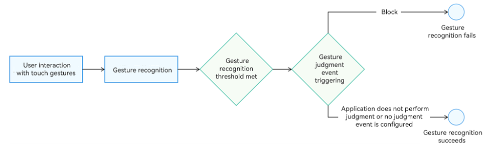
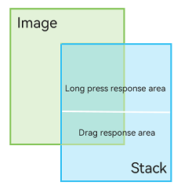
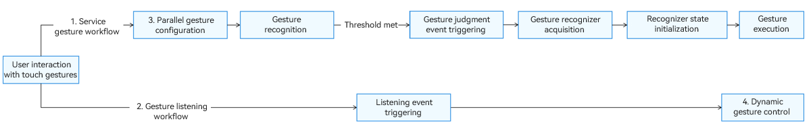
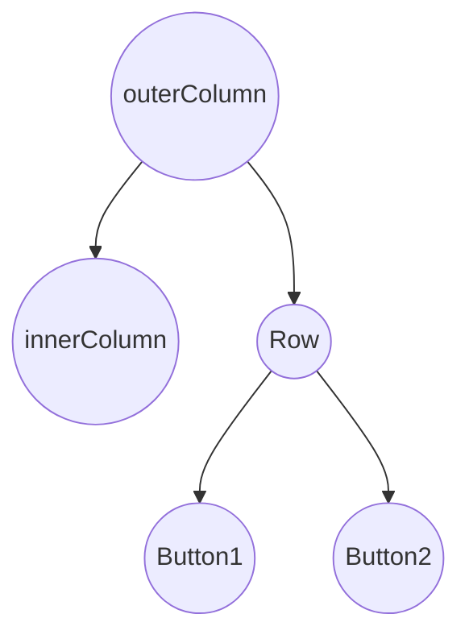

# Gesture Conflict Handling

<!--Kit: ArkUI-->
<!--Subsystem: ArkUI-->
<!--Owner: @yihao-lin-->
<!--Designer: @piggyguy-->
<!--Tester: @songyanhong-->
<!--Adviser: @Brilliantry_Rui-->
<!-- md-trans-meta sourceCommit=9b7116624d5eed08082261dee12697d1cac202a2 translatedAt=2026-08-01T00:27:12.584Z pushedAt=2026-08-01T02:46:25.328Z -->

Gesture conflicts occur when multiple gesture recognizers compete for recognition on the same component or overlapping areas, resulting in unexpected behavior. Common conflict scenarios include:

- Multiple gestures on the same component (for example, both tap and long-press gestures on a button)

- Gesture recognizers of the same type on parent and child components

- Conflicts between system default gestures and custom gestures (for example, conflict between the [Scroll](../reference/apis-arkui/arkui-ts/ts-container-scroll.md) gesture and the click gesture of a child component)

Gesture intervention can effectively resolve conflicts. In addition to controlling component response hot zones and hit testing modes, the following four methods are primarily used: [custom gesture judgment](#custom-gesture-judgment), [parallel gesture dynamic control](#parallel-gesture-dynamic-control), [gesture recognition prevention](#gesture-recognition-prevention), and [custom intervention in event and gesture collection results](#custom-intervention-in-event-and-gesture-collection-results).

## Custom Gesture Judgment

Custom gesture judgment enables applications to override system recognition decisions. When system thresholds are met, the application can determine whether to intercept the gesture (causing its recognition to fail) and prioritize other gestures instead.

**Figure 1** Custom gesture judgment process



Custom gesture judgment involves the following APIs.

| API | Description |
| ------- | -------------- |
|[onGestureJudgeBegin](../reference/apis-arkui/arkui-ts/ts-gesture-customize-judge.md#ongesturejudgebegin)|Used for gesture interception. This is a universal event. When a gesture meets the system trigger threshold, it calls back to the app to determine whether to intercept the gesture.|
|[onGestureRecognizerJudgeBegin](../reference/apis-arkui/arkui-ts/ts-gesture-blocking-enhancement.md#ongesturerecognizerjudgebegin)|Used for gesture interception, obtaining gesture recognizers, and setting the enabled/disabled state of gesture recognizers. It is an extension of the **onGestureJudgeBegin** API and can replace it.<br>When obtaining gesture recognizers, all gesture recognizers on the gesture response chain in a single interaction are retrieved, along with the gesture recognizer that is about to be triggered. You can then set the activation state of the gesture.|

In the following example, the **Image** and **Stack** components are located in the same area. Long-pressing the upper half of the **Stack** component triggers the long-press gesture bound to the **Stack** component, while long-pressing the lower half of the **Stack** component triggers the drag operation of the **Image** component.

**Figure 2** Example



1. Configure drag settings for the **Image** component.

   <!-- @[component_dragging](https://gitcode.com/openharmony/applications_app_samples/blob/master/code/DocsSample/ArkUISample/GestureConflict/entry/src/main/ets/Component/CustomGestures/CustomGestures.ets) -->

   ``` TypeScript
   // Replace $r('sys.media.ohos_app_icon') with the resource file you use.
   Image($r('sys.media.ohos_app_icon'))
     .draggable(true)
     .onDragStart(()=>{
       // ...
       // Replace $r('app.string.Allow_dragging_prompt') with the actual resource file. In this example, the value in the resource file is "Dragging the lower half of Stack triggers the Image response."
       promptAction.showToast({ message: $r('app.string.Allow_dragging_prompt') });
     })
     .width('200vp').height('200vp')
   ```

2. Set up gestures for the **Stack** component.

      <!-- @[set_gestures](https://gitcode.com/openharmony/applications_app_samples/blob/master/code/DocsSample/ArkUISample/GestureConflict/entry/src/main/ets/Component/CustomGestures/CustomGestures.ets) --> 

      ``` TypeScript
      Stack() {}
      .width('200vp')
      .height('200vp')
      .hitTestBehavior(HitTestMode.Transparent)
      .gesture(GestureGroup(GestureMode.Parallel,
        LongPressGesture()
          .onAction((event: GestureEvent) => {
            // ...
            /*
            Replace $r('app.string.Stop_dragging_prompt') with the actual resource file.
            The value in the resource file is "LongPressGesture: Long press the upper half gray area, and the gray area responds."
             */
            promptAction.showToast({ message: $r('app.string.Stop_dragging_prompt')  });
          })
          .tag('longPress')
      ))
      ```

3. Set up gesture judgment for the **Stack** component.

   <!-- @[set_interception](https://gitcode.com/openharmony/applications_app_samples/blob/master/code/DocsSample/ArkUISample/GestureConflict/entry/src/main/ets/Component/CustomGestures/CustomGestures.ets) -->

   ``` TypeScript
   .onGestureJudgeBegin((gestureInfo: GestureInfo, event: BaseGestureEvent) => {
     // If it is a long press gesture, determine whether the touch position is in the upper half area.
     if (gestureInfo.type == GestureControl.GestureType.LONG_PRESS_GESTURE) {
       if (event.fingerList.length > 0 && event.fingerList[0].localY < 100) {
         return GestureJudgeResult.CONTINUE;
       } else {
         return GestureJudgeResult.REJECT;
       }
     };
     return GestureJudgeResult.CONTINUE;
   })
   ```

4. Below is the complete code example.

   <!-- @[custom_gestures](https://gitcode.com/openharmony/applications_app_samples/blob/master/code/DocsSample/ArkUISample/GestureConflict/entry/src/main/ets/Component/CustomGestures/CustomGestureDetermination.ets) -->

   ``` TypeScript
   import { PromptAction } from '@kit.ArkUI';
   
   @Entry
   @Component
   struct Index {
     scroller: Scroller = new Scroller();
     promptAction: PromptAction = this.getUIContext().getPromptAction();
   
     build() {
       Scroll(this.scroller) {
         Column({ space: 8 }) {
           /*
           Replace $r('app.string.Drag_instructions') with the actual resource file. In this example, the value in the resource file is "Two-layer components: Upper-layer component is bound to a long press gesture,
           and the lower-layer component is bound to the drag gesture. Allow the drag gesture to work on the lower-half area of the upper-layer component via gesture interception."
            */
           Text($r('app.string.Drag_instructions')).width('100%').fontSize(20).fontColor('#ffdd00')
           Stack({ alignContent: Alignment.Center }) {
             Column() {
               // Simulate the upper and lower half areas.
               Stack().width('200vp').height('100vp').backgroundColor(Color.Gray)
               Stack().width('200vp').height('100vp').backgroundColor(Color.Blue)
             }.width('200vp').height('200vp')
   
             // The lower half of the Stack is the image area bound with a drag gesture.
             // Replace $r('sys.media.ohos_app_icon') with the resource file you use.
             Image($r('sys.media.ohos_app_icon'))
               .draggable(true)
               .onDragStart(() => {
                 // Replace $r('app.string.Allow_dragging_prompt') with the actual resource file. In this example, the value in the resource file is "Dragging the lower half of Stack triggers the Image response."
                 try {
                   this.promptAction.showToast({ message: $r('app.string.Allow_dragging_prompt') });
                 } catch (error) {
                   console.error('ShowToast failed!')
                 }
               })
               .width('200vp').height('200vp')
             // The upper half of the Stack component is the floating area bound to the long press gesture.
             Stack() {
             }
             .width('200vp')
             .height('200vp')
             .hitTestBehavior(HitTestMode.Transparent)
             .gesture(GestureGroup(GestureMode.Parallel,
               LongPressGesture()
                 .onAction(() => {
                   /*
                   Replace $r('app.string.Stop_dragging_prompt') with the actual resource file.
                   The value in the resource file is "LongPressGesture: Long press the upper gray area, and the gray area responds."
                    */
                   try {
                     this.promptAction.showToast({ message: $r('app.string.Stop_dragging_prompt') });
                   } catch (error) {
                     console.error('ShowToast failed!')
                   }
                 })
                 .tag('longPress')
             ))
             .onGestureJudgeBegin((gestureInfo: GestureInfo, event: BaseGestureEvent) => {
               // If it is a long press gesture, determine whether the touch position is in the upper half area.
               if (gestureInfo.type == GestureControl.GestureType.LONG_PRESS_GESTURE) {
                 if (event.fingerList.length > 0 && event.fingerList[0].localY < 100) {
                   return GestureJudgeResult.CONTINUE;
                 } else {
                   return GestureJudgeResult.REJECT;
                 }
               };
               return GestureJudgeResult.CONTINUE;
             })
           }.width('100%')
         }.width('100%')
       }
     }
   }
   ```


## Parallel Gesture Dynamic Control

Parallel gesture dynamic control allows you to manage whether a gesture callback should be executed, even after the gesture has been successfully recognized.

**Figure 3** Parallel gesture dynamic control process



Parallel gesture dynamic control is based on the successful recognition of a gesture. If the gesture is not recognized, no callback response will be triggered.

1. Business gesture workflow: Refers to business gestures that actually trigger UI changes, such as [PanGesture](../reference/apis-arkui/arkui-ts/ts-basic-gestures-pangesture.md) for scrolling a page and [TapGesture](../reference/apis-arkui/arkui-ts/ts-basic-gestures-tapgesture.md) for triggering a tap.

2. Gesture listening workflow: This involves dynamically controlling the start and stop of gesture recognizers based on the current service state. For example, during nested scrolling, the listener can determine whether the component has reached the edge. This can be achieved using **PanGesture** with the [parallel gesture binding method](arkts-gesture-events-binding.md#parallelgesture-parallel-gesture-binding-method) or by using touch events.

3. Parallel gesture configuration: This step is optional. A typical use case is to set the scroll gesture of an outer component to be parallel with the scroll gesture of an inner component during nested scrolling.

4. Dynamic gesture control: This involves controlling whether gestures respond to user callbacks by using the **setEnabled** API of gesture recognizers.

### Built-in Gesture Parallel Dynamic Control

Built-in gesture parallel dynamic control involves the following APIs.

| API | Description |
| ------- | -------------- |
|[shouldBuiltInRecognizerParallelWith](../reference/apis-arkui/arkui-ts/ts-gesture-blocking-enhancement.md#shouldbuiltinrecognizerparallelwith)|Used to set a system component's built-in gesture to be parallel with other gestures.|
|[onGestureRecognizerJudgeBegin](../reference/apis-arkui/arkui-ts/ts-gesture-blocking-enhancement.md#ongesturerecognizerjudgebegin)|Used for gesture interception, obtaining gesture recognizers, and initializing the enabled/disabled state of gesture recognizers.|
|[parallelGesture](arkts-gesture-events-binding.md#parallelgesture-parallel-gesture-binding-method)|Allows a developer-defined gesture to be parallel with a gesture of higher priority.|

The following example demonstrates a nested scrolling scenario with two [Scroll](../reference/apis-arkui/arkui-ts/ts-container-scroll.md) components, using gesture control APIs to manage the nested scrolling linkage between the outer and inner components.

1. Use the **shouldBuiltInRecognizerParallelWith** API to set the **PanGesture** of the outer **Scroll** component to be parallel with the **PanGesture** of the inner **Scroll** component.

   <!-- @[gesture_simultaneously](https://gitcode.com/openharmony/applications_app_samples/blob/master/code/DocsSample/ArkUISample/GestureConflict/entry/src/main/ets/Component/GestureAndMotionControl/GestureControl.ets) -->

   ``` TypeScript
   .shouldBuiltInRecognizerParallelWith((current: GestureRecognizer, others: Array<GestureRecognizer>) => {
     for (let i = 0; i < others.length; i++) {
       let target = others[i].getEventTargetInfo();
       if (target.getId() == 'inner' && others[i].isBuiltIn() && others[i].getType() == GestureControl.GestureType.PAN_GESTURE) { // Find the recognizer to form a parallel gesture.
         this.currentRecognizer = current; // Save the recognizer of the current component.
         this.childRecognizer = others[i]; // Save the recognizer to work in parallel.
         return others[i]; // Return the recognizer to work in parallel with the current one.
       };
     };
     return undefined;
   })
   ```

2. Use the **onGestureRecognizerJudgeBegin** API to obtain the pan gesture recognizer of the **Scroll** component and to set the enabled state of the inner and outer gesture recognizers based on the boundary conditions of the **Scroll** components.

   <!-- @[gesture_openingclosing](https://gitcode.com/openharmony/applications_app_samples/blob/master/code/DocsSample/ArkUISample/GestureConflict/entry/src/main/ets/Component/GestureAndMotionControl/GestureControl.ets) -->

   ``` TypeScript
   .onGestureRecognizerJudgeBegin((event: BaseGestureEvent, current: GestureRecognizer,
     others: Array<GestureRecognizer>) => { // When the implementation is about to succeed, set the recognizer enabling state based on the current component state.
     let target = current.getEventTargetInfo();
     if (target && target.getId() == 'outer' && current.isBuiltIn() && current.getType() == GestureControl.GestureType.PAN_GESTURE) {
       for (let i = 0; i < others.length; i++) {
         let target = others[i].getEventTargetInfo() as ScrollableTargetInfo;
         if (target instanceof ScrollableTargetInfo && target.getId() == 'inner') { // Identify the recognizer to work in parallel on the response chain.
           let panEvent = event as PanGestureEvent;
           this.childRecognizer.setEnabled(true);
           this.currentRecognizer.setEnabled(false);
           if (target.isEnd()) { // Dynamically control the recognizer's enabled state based on the current component state and direction of movement.
             if (panEvent && panEvent.offsetY < 0) {
               this.childRecognizer.setEnabled(false);
               this.currentRecognizer.setEnabled(true);
             };
           } else if (target.isBegin()) {
             if (panEvent.offsetY > 0) {
               this.childRecognizer.setEnabled(false);
               this.currentRecognizer.setEnabled(true);
             };
           };
         };
       };
     };
     return GestureJudgeResult.CONTINUE;
   })
   ```

3. Set up a gesture listener to listen for the state changes of the **Scroll** component, dynamically adjust the enabled state of the gesture recognizers, and control whether gesture callbacks are triggered, allowing you to manage scrolling.

   <!-- @[listening_gestures](https://gitcode.com/openharmony/applications_app_samples/blob/master/code/DocsSample/ArkUISample/GestureConflict/entry/src/main/ets/Component/GestureAndMotionControl/GestureControl.ets) -->

   ``` TypeScript
   .parallelGesture ( // Bind a PanGesture as a dynamic controller.
     PanGesture()
       .onActionUpdate((event: GestureEvent)=>{
         if (this.childRecognizer.getState() != GestureRecognizerState.SUCCESSFUL ||
           this.currentRecognizer.getState() != GestureRecognizerState.SUCCESSFUL) { // If the recognizer is not in the SUCCESSFUL state, no control is applied.
           return;
         };
         let target = this.childRecognizer.getEventTargetInfo() as ScrollableTargetInfo;
         let currentTarget = this.currentRecognizer.getEventTargetInfo() as ScrollableTargetInfo;
         if (target instanceof ScrollableTargetInfo && currentTarget instanceof ScrollableTargetInfo) {
           this.childRecognizer.setEnabled(true);
           this.currentRecognizer.setEnabled(false);
           if (target.isEnd()) { // Adjust the enabled state of the gesture recognizers based on the current component state during movement.
             if ((event.offsetY - this.lastOffset) < 0) {
               this.childRecognizer.setEnabled(false);
               if (currentTarget.isEnd()) {
                 this.currentRecognizer.setEnabled(false);
               } else {
                 this.currentRecognizer.setEnabled(true);
               };
             };
           } else if (target.isBegin()) {
             if ((event.offsetY - this.lastOffset) > 0) {
               this.childRecognizer.setEnabled(false);
               if (currentTarget.isBegin()) {
                 this.currentRecognizer.setEnabled(false);
               } else {
                 this.currentRecognizer.setEnabled(true);
               };
             };
           };
         };
         this.lastOffset = event.offsetY;
       })
   )
   ```

4. Below is the complete code example.

   <!-- @[gesture_motioncontrol](https://gitcode.com/openharmony/applications_app_samples/blob/master/code/DocsSample/ArkUISample/GestureConflict/entry/src/main/ets/Component/GestureAndMotionControl/GestureAndMotionControl.ets) -->

   ``` TypeScript
   // xxx.ets
   @Entry
   @Component
   struct FatherControlChild {
     scroller: Scroller = new Scroller();
     scroller2: Scroller = new Scroller();
     private arr: number[] = [0, 1, 2, 3, 4, 5, 6, 7, 8, 9];
     private childRecognizer: GestureRecognizer = new GestureRecognizer();
     private currentRecognizer: GestureRecognizer = new GestureRecognizer();
     private lastOffset: number = 0;
   
     build() {
       Stack({ alignContent: Alignment.TopStart }) {
         Scroll(this.scroller) { // Outer scroll container.
           Column() {
             Text('Scroll Area')
               .width('90%')
               .height(150)
               .backgroundColor(0xFFFFFF)
               .borderRadius(15)
               .fontSize(16)
               .textAlign(TextAlign.Center)
               .margin({ top: 10 })
             Scroll(this.scroller2) { // Inner scroll container.
               Column() {
                 Text('Scroll Area2')
                   .width('90%')
                   .height(150)
                   .backgroundColor(0xFFFFFF)
                   .borderRadius(15)
                   .fontSize(16)
                   .textAlign(TextAlign.Center)
                   .margin({ top: 10 })
                 Column() {
                   ForEach(this.arr, (item: number) => {
                     Text(item.toString())
                       .width('90%')
                       .height(150)
                       .backgroundColor(0xFFFFFF)
                       .borderRadius(15)
                       .fontSize(16)
                       .textAlign(TextAlign.Center)
                       .margin({ top: 10 })
                   }, (item: string) => item)
                 }.width('100%')
               }
             }
             .id('inner')
             .width('100%')
             .height(800)
           }.width('100%')
         }
         .id('outer')
         .height(600)
         .scrollable(ScrollDirection.Vertical) // The scrollbar scrolls in the vertical direction.
         .scrollBar(BarState.On) // The scrollbar is always displayed.
         .scrollBarColor(Color.Gray) // The scrollbar color is gray.
         .scrollBarWidth(10) // The scrollbar width is 10.
         .edgeEffect(EdgeEffect.None)
         .shouldBuiltInRecognizerParallelWith((current: GestureRecognizer, others: Array<GestureRecognizer>) => {
           for (let i = 0; i < others.length; i++) {
             let target = others[i].getEventTargetInfo();
             if (target.getId() == 'inner' && others[i].isBuiltIn() &&
               others[i].getType() == GestureControl.GestureType.PAN_GESTURE) { // Identify the recognizer that to be bound to parallelGesture.
               this.currentRecognizer = current; // Save the recognizer of the current component.
               this.childRecognizer = others[i]; // Save the recognizer to work in parallel.
               return others[i]; // Return the recognizer to work in parallel with the current one.
             }
           }
           return undefined;
         })
         .onGestureRecognizerJudgeBegin((event: BaseGestureEvent, current: GestureRecognizer,
           others: Array<GestureRecognizer>) => { // When the implementation is about to succeed, set the recognizer enabling state based on the current component state.
           let target = current.getEventTargetInfo();
           if (target && target.getId() == 'outer' && current.isBuiltIn() &&
             current.getType() == GestureControl.GestureType.PAN_GESTURE) {
             for (let i = 0; i < others.length; i++) {
               let target = others[i].getEventTargetInfo() as ScrollableTargetInfo;
               if (target instanceof ScrollableTargetInfo && target.getId() == 'inner') { // Identify the recognizer to work in parallel on the response chain.
                 let panEvent = event as PanGestureEvent;
                 this.childRecognizer.setEnabled(true);
                 this.currentRecognizer.setEnabled(false);
                 if (target.isEnd()) { // Dynamically control the recognizer's enabled state based on the current component state and direction of movement.
                   if (panEvent && panEvent.offsetY < 0) {
                     this.childRecognizer.setEnabled(false);
                     this.currentRecognizer.setEnabled(true);
                   }
                 } else if (target.isBegin()) {
                   if (panEvent.offsetY > 0) {
                     this.childRecognizer.setEnabled(false);
                     this.currentRecognizer.setEnabled(true);
                   }
                 }
               }
             }
           }
           return GestureJudgeResult.CONTINUE;
         })
         .parallelGesture ( // Bind a PanGesture as a dynamic controller.
           PanGesture()
             .onActionUpdate((event: GestureEvent) => {
               if (this.childRecognizer?.getState() != GestureRecognizerState.SUCCESSFUL ||
                 this.currentRecognizer?.getState() != GestureRecognizerState.SUCCESSFUL) { // If the recognizer is not in the SUCCESSFUL state, no control is applied.
                 return;
               }
               let target = this.childRecognizer.getEventTargetInfo() as ScrollableTargetInfo;
               let currentTarget = this.currentRecognizer.getEventTargetInfo() as ScrollableTargetInfo;
               if (target instanceof ScrollableTargetInfo && currentTarget instanceof ScrollableTargetInfo) {
                 this.childRecognizer.setEnabled(true);
                 this.currentRecognizer.setEnabled(false);
                 if (target.isEnd()) { // Adjust the enabled state of the gesture recognizers based on the current component state during movement.
                   if ((event.offsetY - this.lastOffset) < 0) {
                     this.childRecognizer.setEnabled(false);
                     if (currentTarget.isEnd()) {
                       this.currentRecognizer.setEnabled(false);
                     } else {
                       this.currentRecognizer.setEnabled(true);
                     };
                   };
                 } else if (target.isBegin()) {
                   if ((event.offsetY - this.lastOffset) > 0) {
                     this.childRecognizer.setEnabled(false)
                     if (currentTarget.isBegin()) {
                       this.currentRecognizer.setEnabled(false);
                     } else {
                       this.currentRecognizer.setEnabled(true);
                     };
                   };
                 };
               };
               this.lastOffset = event.offsetY;
             })
         )
       }.width('100%').height('100%').backgroundColor(0xDCDCDC)
     }
   }
   ```

### Non-Built-in Gesture Parallel Dynamic Control

Since API version 26.0.0, you can use the **shouldRecognizerParallelWith** API to set a non-built-in gesture to be parallel with other gestures.

Non-built-in gesture parallel dynamic control involves the following APIs.

| API | Description |
| ------- | -------------- |
|[shouldRecognizerParallelWith](../reference/apis-arkui/arkui-ts/ts-gesture-blocking-enhancement.md#shouldrecognizerparallelwith)|Used to set a component's non-built-in gesture to be parallel with other gestures.|
|[onGestureRecognizerJudgeBegin](../reference/apis-arkui/arkui-ts/ts-gesture-blocking-enhancement.md#ongesturerecognizerjudgebegin)|Used to obtain gesture recognizers and then intercept gestures by controlling the enabled/disabled state of the gesture recognizers.|

The following example demonstrates a nested scrolling scenario, using gesture control APIs to manage the nested scrolling linkage between the outer **Column** component and the inner **Scroll** component.

1. Use the **shouldRecognizerParallelWith** API to set the non-built-in **PanGesture** of the outer **Column** component to be parallel with the built-in **PanGesture** of the inner **Scroll** component.

   <!-- @[gesture_simultaneously](https://gitcode.com/openharmony/applications_app_samples/blob/master/code/DocsSample/ArkUISample/GestureConflict/entry/src/main/ets/Component/CustomGestureAndMotionControl/GestureControl.ets) -->

   ``` TypeScript
   .shouldRecognizerParallelWith((current: GestureRecognizer, others: Array<GestureRecognizer>) => {
     for (let i = 0; i < others.length; i++) {
       let target = others[i].getEventTargetInfo();
       if (target) {
         if (target.getId() == 'inner' && others[i].isBuiltIn() &&
           others[i].getType() == GestureControl.GestureType.PAN_GESTURE) { // Find the recognizer that will form the parallel gesture.
           this.currentRecognizer = current; // Save the current component's recognizer.
           this.childRecognizer = others[i]; // Save the recognizer that will form the parallel gesture.
           return others[i]; // Return the recognizer that will form the parallel gesture.
         }
       }
     }
     return undefined;
   })
   ```

2. Use the **onGestureRecognizerJudgeBegin** API to obtain the **PanGesture** gesture recognizers of the **Column** and **Scroll** components, and set the enabled/disabled state of the inner and outer gestures based on the boundary conditions of the inner and outer components.

   <!-- @[gesture_openingclosing](https://gitcode.com/openharmony/applications_app_samples/blob/master/code/DocsSample/ArkUISample/GestureConflict/entry/src/main/ets/Component/CustomGestureAndMotionControl/GestureControl.ets) -->

   ``` TypeScript
   .onGestureRecognizerJudgeBegin((event: BaseGestureEvent, current: GestureRecognizer,
     others: Array<GestureRecognizer>) => { // When the recognizer is about to succeed, set the recognizer enable state based on the current component state.
     let target = current.getEventTargetInfo();
     if (target && target.getId() == 'outer' &&
       current.getType() == GestureControl.GestureType.PAN_GESTURE) {
       for (let i = 0; i < others.length; i++) {
         let target = others[i].getEventTargetInfo();
         if (target instanceof ScrollableTargetInfo && target.getId() == 'inner') { // Find the corresponding parallel recognizer on the response chain.
           let panEvent = event as PanGestureEvent;
           if (target.isEnd()) { // Dynamically control the recognizer enable state based on the current component state and movement direction.
             if (panEvent && panEvent.offsetY < 0) {
               this.childRecognizer.setEnabled(false);
               this.currentRecognizer.setEnabled(true);
             } else {
               this.childRecognizer.setEnabled(true);
               this.currentRecognizer.setEnabled(false);
             }
           } else if (target.isBegin()) {
             if (panEvent.offsetY > 0) {
               this.childRecognizer.setEnabled(false);
               this.currentRecognizer.setEnabled(true);
             } else {
               this.childRecognizer.setEnabled(true);
               this.currentRecognizer.setEnabled(false);
             }
           } else {
             this.childRecognizer.setEnabled(true);
             this.currentRecognizer.setEnabled(false);
           }
         }
       }
     }
     return GestureJudgeResult.CONTINUE;
   })
   ```

3. Complete code example.

   <!-- @[gesture_motioncontrol](https://gitcode.com/openharmony/applications_app_samples/blob/master/code/DocsSample/ArkUISample/GestureConflict/entry/src/main/ets/Component/CustomGestureAndMotionControl/GestureControl.ets) -->

   ``` TypeScript
   @Entry
   @Component
   struct CustomGestureControlGroup {
     @State offsetY: number = 0
     scroller2: Scroller = new Scroller();
     private arr: number[] = [0, 1, 2, 3, 4, 5, 6, 7, 8, 9];
     private childRecognizer: GestureRecognizer = new GestureRecognizer();
     private currentRecognizer: GestureRecognizer = new GestureRecognizer();
     private lastOffset: number = 0;
   
     build() {
       Stack({ alignContent: Alignment.TopStart }) {
         Column() { // Outer scroll container
           Column() {
             Text('Scroll Area')
               .width('90%')
               .height(150)
               .backgroundColor(0xFFFFFF)
               .borderRadius(15)
               .fontSize(16)
               .textAlign(TextAlign.Center)
               .margin({ top: 10 })
             Scroll(this.scroller2) { // Inner scroll container
               Column() {
                 Text('Scroll Area2')
                   .width('90%')
                   .height(150)
                   .backgroundColor(0xFFFFFF)
                   .borderRadius(15)
                   .fontSize(16)
                   .textAlign(TextAlign.Center)
                   .margin({ top: 10 })
                 Column() {
                   ForEach(this.arr, (item: number) => {
                     Text(item.toString())
                       .width('90%')
                       .height(150)
                       .backgroundColor(0xFFFFFF)
                       .borderRadius(15)
                       .fontSize(16)
                       .textAlign(TextAlign.Center)
                       .margin({ top: 10 })
                   }, (item: string) => item)
                 }.width('100%')
               }
             }
             .id('inner')
             .width('100%')
             .height(800)
           }
           .width('100%')
           .offset({ y: -this.offsetY })
         }
         .id('outer')
         .height(600)
         .clip(true)
         .gesture(
           PanGesture()
             .onActionStart((event: GestureEvent) => {
               this.lastOffset = this.offsetY // Record the current scroll position when the gesture starts.
             })
             .onActionUpdate((event: GestureEvent) => {
               let moveY = event.offsetY; // Calculate the new position when the gesture moves.
               let targetOffset = this.lastOffset - moveY; // Target position = initial position - movement distance
               this.offsetY = Math.max(0, Math.min(360, targetOffset));
             })
         )
         .shouldRecognizerParallelWith((current: GestureRecognizer, others: Array<GestureRecognizer>) => {
           for (let i = 0; i < others.length; i++) {
             let target = others[i].getEventTargetInfo();
             if (target) {
               if (target.getId() == 'inner' && others[i].isBuiltIn() &&
                 others[i].getType() == GestureControl.GestureType.PAN_GESTURE) { // Find the recognizer that will form the parallel gesture.
                 this.currentRecognizer = current; // Save the current component's recognizer.
                 this.childRecognizer = others[i]; // Save the recognizer that will form the parallel gesture.
                 return others[i]; // Return the recognizer that will form the parallel gesture.
               }
             }
           }
           return undefined;
         })
         .onGestureRecognizerJudgeBegin((event: BaseGestureEvent, current: GestureRecognizer,
           others: Array<GestureRecognizer>) => { // When the recognizer is about to succeed, set the recognizer enable state based on the current component state.
           let target = current.getEventTargetInfo();
           if (target && target.getId() == 'outer' &&
             current.getType() == GestureControl.GestureType.PAN_GESTURE) {
             for (let i = 0; i < others.length; i++) {
               let target = others[i].getEventTargetInfo();
               if (target instanceof ScrollableTargetInfo && target.getId() == 'inner') { // Find the corresponding parallel recognizer on the response chain.
                 let panEvent = event as PanGestureEvent;
                 if (target.isEnd()) { // Dynamically control the recognizer enable state based on the current component state and movement direction.
                   if (panEvent && panEvent.offsetY < 0) {
                     this.childRecognizer.setEnabled(false);
                     this.currentRecognizer.setEnabled(true);
                   } else {
                     this.childRecognizer.setEnabled(true);
                     this.currentRecognizer.setEnabled(false);
                   }
                 } else if (target.isBegin()) {
                   if (panEvent.offsetY > 0) {
                     this.childRecognizer.setEnabled(false);
                     this.currentRecognizer.setEnabled(true);
                   } else {
                     this.childRecognizer.setEnabled(true);
                     this.currentRecognizer.setEnabled(false);
                   }
                 } else {
                   this.childRecognizer.setEnabled(true);
                   this.currentRecognizer.setEnabled(false);
                 }
               }
             }
           }
           return GestureJudgeResult.CONTINUE;
         })
       }.width('100%').height('100%').backgroundColor(0xDCDCDC)
     }
   }
   ```

## Gesture Recognition Prevention

Gesture recognition is based on the response chain results of [hit testing](./arkts-interaction-basic-principles.md#hit-testing). By controlling gesture recognizer participation states within the response chain during user press-down events, you can efficiently implement dynamic intervention in gesture processing.

Since API version 20, you can use the [onTouchTestDone](../reference/apis-arkui/arkui-ts/ts-gesture-blocking-enhancement.md#ontouchtestdone20) API to prevent gesture recognition. After hit testing is completed, the system returns all gesture recognizer objects through this API. Applications can filter recognizers by type, component ID, or associated component, and proactively disable specific recognizers by calling the [preventBegin](../reference/apis-arkui/arkui-ts/ts-gesture-common.md#preventbegin20) API.

Disabling by gesture type:

   <!-- @[disable_gesturetype](https://gitcode.com/openharmony/applications_app_samples/blob/master/code/DocsSample/ArkUISample/GestureConflict/entry/src/main/ets/Component/PreventGestureRecognition/PreventIdentification.ets) -->

   ``` TypeScript
   .onTouchTestDone((event, recognizers) => {
     for (let i = 0; i < recognizers.length; i++) {
       let recognizer = recognizers[i];
       // Disable all pan gestures based on type.
       if (recognizer.getType() == GestureControl.GestureType.PAN_GESTURE) {
         recognizer.preventBegin();
       };
     };
   })
   ```

Disabling by associated component:

Components must be pre-configured with a component ID through the universal attribute [id](../reference/apis-arkui/arkui-ts/ts-universal-attributes-component-id.md#id).

   <!-- @[component_disabled](https://gitcode.com/openharmony/applications_app_samples/blob/master/code/DocsSample/ArkUISample/GestureConflict/entry/src/main/ets/Component/PreventGestureRecognition/PreventIdentification.ets) -->

   ``` TypeScript
   .onTouchTestDone((event, recognizers) => {
     for (let i = 0; i < recognizers.length; i++) {
       let recognizer = recognizers[i];
       // Disable all gestures on the component with ID "myID."
       if (recognizer.getEventTargetInfo().getId() == 'myID') {
         recognizer.preventBegin();
       };
     };
   })
   ```

Disabling system built-in gestures:

   <!-- @[builtIn_gestureDisable](https://gitcode.com/openharmony/applications_app_samples/blob/master/code/DocsSample/ArkUISample/GestureConflict/entry/src/main/ets/Component/PreventGestureRecognition/PreventIdentification.ets) -->

   ``` TypeScript
   .onTouchTestDone((event, recognizers) => {
     for (let i = 0; i < recognizers.length; i++) {
       let recognizer = recognizers[i];
       // Disable all system built-in gestures.
       if (recognizer.isBuiltIn()) {
         recognizer.preventBegin();
       };
     };
   })
   ```

Combine the preceding conditions based on specific scenarios.

> **NOTE**
>
> The system executes **onTouchTestDone** callbacks on nodes from innermost to outermost.

In the NDK, the corresponding APIs for **onTouchTestDone** and **preventBegin** are **OH_ArkUI_SetTouchTestDoneCallback** and **OH_ArkUI_PreventGestureRecognizerBegin**, respectively. Their usage and functionality are consistent with the ArkTS APIs.

The following example illustrates a simplified video player UI interaction.

The parent container (**video_layer**) has multiple bound gestures:

- Tap: controls the playback (pause/play).

- Double-tap: switches between full-screen and non-full-screen modes.

- Long press: fast-forwards.

- Vertical swipe: adjusts brightness.

- Horizontal swipe: seeks playback.

The inner **Slider** component (**progress_layer**) does not have a long-press gesture bound to it. This causes the parent container's fast-forward gesture to be triggered when the user long-presses the **Slider** component, which is unexpected behavior.

Solution: Register an **onTouchTestDone** callback on the **Slider** component. Use this callback to disable gesture recognizers not belonging to the **Slider** component, thereby resolving the conflict.

The following shows the complete sample code:

<!-- @[gesture_recognition](https://gitcode.com/openharmony/applications_app_samples/blob/master/code/DocsSample/ArkUISample/GestureConflict/entry/src/main/ets/Component/PreventGestureRecognition/PreventGestureRecognition.ets) -->  

``` TypeScript
@Entry
@ComponentV2
struct Index {
  @Local progress: number = 496000; // Initial progress, in milliseconds.
  @Local total: number = 27490000; // Total duration, in milliseconds.
  @Local currentWidth: string = '100%';
  @Local currentHeight: string = '100%';
  @Local playbackProgress: string = '';
  private currentPosX: number = 0;
  private currentPosY: number = 0;
  private currentFullScreenState: boolean = true;
  private normalPlayTimer: number = -1;
  private isPlaying: boolean = true;
  private fastForwardTimer: number = -1;
  private context = this.getUIContext().getHostContext()

  aboutToAppear(): void {
    // Replace $r('app.string.Playback_progress') with the actual resource file. In this example, the value of the resource file is "Playback progress".
    try {
      this.playbackProgress = this.context!.resourceManager.getStringSync($r('app.string.Playback_progress').id);
    } catch (error) {
      console.error('Get play back progress failed!');
    }
    // Start a periodic timer to refresh the progress every second.
    this.startNormalPlayTimer();
  };

  startNormalPlayTimer(): void {
    if (this.normalPlayTimer != -1) {
      this.stopNormalPlayTimer()
    };
    this.normalPlayTimer = setInterval(() => {
      this.progress = this.progress + 1000
    }, 1000);
  };

  stopNormalPlayTimer(): void {
    if (this.normalPlayTimer == -1) {
      return;
    };
    clearInterval(this.normalPlayTimer);
    this.normalPlayTimer = -1;
  };

  startFastForwardTimer(): void {
    if (this.fastForwardTimer != -1) {
      this.stopFastForwardTimer();
    };
    this.fastForwardTimer = setInterval(() => {
      this.progress = this.progress + 100000;
    }, 100);
  };

  stopFastForwardTimer(): void {
    if (this.fastForwardTimer == -1) {
      return;
    };
    clearInterval(this.fastForwardTimer);
    this.fastForwardTimer = -1;
  };

  showMessage(message: string): void {
    try {
      this.getUIContext().getPromptAction().showToast({ message: message, alignment: Alignment.Center });
    } catch (error) {
      console.error('ShowToast failed!');
    }
  };

  resetPosInfo(): void {
    this.currentPosX = 0;
    this.currentPosY = 0;
  };

  toggleFullScreenState(): void {
    this.currentFullScreenState = !this.currentFullScreenState;
    if (this.currentFullScreenState) {
      this.currentWidth = '100%';
      this.currentHeight = '100%';
    } else {
      this.currentWidth = '100%';
      this.currentHeight = '50%';
    };
    // Replace $r('app.string.Play_full_screen') with the actual resource file. In this example, the value in the resource file is "Play in full-screen mode."
    // Replace $r('app.string.Exit_play_full_screen') with the actual resource file. In this example, the value in the resource file is "Exit full-screen mode."
    try {
      this.showMessage(this.currentFullScreenState
        ? this.context!.resourceManager.getStringSync($r('app.string.Play_full_screen').id)
        : this.context!.resourceManager.getStringSync($r('app.string.Exit_play_full_screen').id));
    } catch (error) {
      console.error('GetStringSync failed!');
    }
  };

  togglePlayAndPause(): void {
    this.isPlaying = !this.isPlaying;
    if (!this.isPlaying) {
      this.stopNormalPlayTimer();
    } else {
      // Restart the timer.
      this.startNormalPlayTimer();
    };
    // Replace $r('app.string.stop_playing') with the actual resource file. In this example, the value in the resource file is "Pause."
    // Replace $r('app.string.Continue_playing') with the actual resource file. In this example, the value in the resource file is "Play."
    try {
      this.showMessage(this.isPlaying
        ? this.context!.resourceManager.getStringSync($r('app.string.stop_playing').id)
        : this.context!.resourceManager.getStringSync($r('app.string.Continue_playing').id));
    } catch (error) {
      console.error('GetStringSync failed!');
    }
  };

  doFastForward(start: boolean): void {
    if (!start) { // Stop fast-forwarding and resume normal playback.
      this.stopFastForwardTimer();
      this.startNormalPlayTimer();
      // Replace $r('app.string.Cancel_FastForwarding') with the actual resource file. In this example, the value in the resource file is "Stop fast-forwarding."
      try {
        this.showMessage(
          this.context!.resourceManager.getStringSync($r('app.string.Cancel_FastForwarding').id));
      } catch (error) {
        console.error('GetStringSync failed!');
      }
      return;
    };

    this.stopNormalPlayTimer();
    this.startFastForwardTimer();
    // Replace $r('app.string.Start_FastForwarding') with the actual resource file. In this example, the value in the resource file is "Start fast-forwarding."
    try {
      this.showMessage(
        this.context!.resourceManager.getStringSync($r('app.string.Start_FastForwarding').id));
    } catch (error) {
      console.error('GetStringSync failed!');
    }
  };

  updateBrightness(start: boolean, event: BaseGestureEvent): void {
    let newY = event.fingerList[0].localY;
    if (start) {
      this.currentPosY = newY;
      //Replace $r('app.string.Start_adjusting_brightness') with the actual resource file. In this example, the value in the resource file is "Adjust brightness."
      try {
        this.showMessage(this.context!.resourceManager
          .getStringSync($r('app.string.Start_adjusting_brightness').id));
      } catch (error) {
        console.error('GetStringSync failed!');
      }
      return;
    };
    let offsetY = newY - this.currentPosY;
    if (Math.abs(offsetY) > 10) {
      // Replace $r('app.string.Reduce_brightness') with the actual resource file. In this example, the value in the resource file is "Decrease brightness."
      // Replace $r('app.string.Increase_brightness') with the actual resource file. In this example, the value in the resource file is "Increase brightness."
      try {
        this.showMessage((offsetY > 0)
          ? this.context!.resourceManager.getStringSync($r('app.string.Reduce_brightness').id)
          : this.context!.resourceManager.getStringSync($r('app.string.Increase_brightness').id))
      } catch (error) {
        console.error('GetStringSync failed!');
      }
      this.currentPosY = newY;
    };
  };

  updateProgress(start: boolean, event: BaseGestureEvent): void {
    let newX = event.fingerList[0].localX;
    if (start) {
      this.currentPosX = newX;
      // Replace $r('app.string.Adjust_schedule') with the actual resource file. In this example, the value of the resource file is "Seek playback."
      try {
        this.showMessage(this.context!.resourceManager
          .getStringSync($r('app.string.Adjust_schedule').id));
      } catch (error) {
        console.error('GetStringSync failed!');
      }
      return;
    };
    let offsetX = newX - this.currentPosX;
    this.progress = Math.floor(this.progress + offsetX * 10000);
    this.currentPosX = newX;
  };

  build() {
    Stack({ alignContent: Alignment.Center }) {
      Column() {
        Column() {
          Text(this.playbackProgress + this.progress)
        }
        .width('100%').height('90%')

        Flex({ alignItems: ItemAlign.Center, justifyContent: FlexAlign.SpaceBetween }) {
          Slider({
            value: this.progress,
            min: 0,
            max: this.total,
            style: SliderStyle.OutSet
          })
            .onChange((value: number, mode: SliderChangeMode) => {
              this.progress = value;
            })
            .id('progress_layer')
            .onTouchTestDone((event, allRecognizers: Array<GestureRecognizer>) => {
              for (let i = 0; i < allRecognizers.length; i++) {
                let recognizer = allRecognizers[i];
                let inspectorInfo = recognizer.getEventTargetInfo().getId();
                if (inspectorInfo !== 'progress_layer') {
                  // When the user interacts with the progress bar area, disable all gestures not belonging to progress_layer.
                  recognizer.preventBegin();
                };
              };
            })
            .margin({ left: 5 })
            .trackColor(Color.Blue)
            .blockColor(Color.Gray)
            .selectedColor(Color.White)
            .trackThickness(2)
            .flexShrink(1)
            .flexGrow(1)
        }
        .flexGrow(1)
        .flexShrink(1)
        .id('id_progress_view')
      }
    }
    .id('video_layer')
    .backgroundColor('#E0E0E0')
    .gesture(
      GestureGroup(GestureMode.Exclusive,
        PanGesture({ direction: PanDirection.Vertical, distance: 10 })
          .tag('pan_for_brightness_control')
          .onActionStart((event) => {
            this.updateBrightness(true, event);
          })
          .onActionUpdate((event) => {
            this.updateBrightness(false, event);
          }),
        PanGesture({ direction: PanDirection.Horizontal, distance: 10 })
          .tag('pan_for_play_progress_control')
          .onActionStart((event) => {
            this.updateProgress(true, event);
          })
          .onActionUpdate((event) => {
            this.updateProgress(false, event);
          }),

        LongPressGesture()
          .tag('long_press_for_fast_forward_control')
          .onAction(() => {
            this.doFastForward(true); // Start fast-forwarding.
          })
          .onActionEnd(() => {
            this.doFastForward(false); // Stop fast-forwarding.
          })
          .onActionCancel(() => {
            this.doFastForward(false);
          }),

        TapGesture({ count: 2 })
          .tag('double_tap_on_video')
          .onAction(() => {
            this.toggleFullScreenState();
          }),

        TapGesture()
          .tag('single_tap_on_video')
          .onAction(() => {
            this.togglePlayAndPause();
          })
      )
    )
    .width(this.currentWidth)
    .height(this.currentHeight)
  }
}
```


## Custom Intervention in Event and Gesture Collection Results

Since API version 26.0.0, when a gesture or touch event is initiated, the system collects the recognition results of bound gesture and touch recognizers. You can intervene in the collection results through the `onGestureCollectIntercept` callback, and dynamically control the collection behavior of recognition results by returning different intervention strategies, such as preventing touch events from being propagated to the parent component or discarding gestures on the current node.

Gesture collection intervention involves the following APIs.

| API | Description |
| ------- | -------------- |
| [onGestureCollectIntercept](../reference/apis-arkui/arkui-ts/ts-gesture-blocking-enhancement.md#ongesturecollectintercept) | Triggered after events and gestures on the current node and higher-priority nodes have been collected. The callback returns an intervention strategy to control the subsequent collection process. |
| [getUniqueId](../reference/apis-arkui/arkui-ts/ts-gesture-common.md#getuniqueid) | Called on the component information object obtained through the recognizer's [getEventTargetInfo()](../reference/apis-arkui/arkui-ts/ts-gesture-common.md#geteventtargetinfo12) method. Returns the unique numeric ID of the current component, which can be used for comparison with the unique IDs of other components. |
| [isHostBelongsTo](../reference/apis-arkui/arkui-ts/ts-gesture-common.md#ishostbelongsto) | Determines whether the node to which the current gesture or touch recognizer is bound is a descendant of a specified component. Pass in the unique ID of the component and receive a boolean value. This API can be called on both [GestureRecognizer](../reference/apis-arkui/arkui-ts/ts-gesture-common.md#gesturerecognizer12) and [TouchRecognizer](../reference/apis-arkui/arkui-ts/ts-gesture-common.md#touchrecognizer20). |

The following example demonstrates how to implement custom intervention in event and gesture collection results. The example builds the following component tree.


```mermaid
graph TD
    A((outerColumn))
    B((innerColumn))
    C((Row))
    D((Button1))
    E((Button2))

    A --> B
    A --> C
    C --> D
    C --> E
```

**Button1** has no tap event bound, while **Button2** has a tap event bound. When the user taps **Button2**, the `onGestureCollectIntercept` callback on **innerColumn** intervenes in the touch recognizer, preventing the touch event from being further propagated to **outerColumn**. When **Button1** is tapped, normal propagation is allowed.

1. Bind the `onGestureCollectIntercept` callback to the **innerColumn** component, and obtain the list of touch recognizers in the callback.

    <!-- @[gesture_collection](https://gitcode.com/openharmony/applications_app_samples/blob/master/code/DocsSample/ArkUISample/GestureConflict/entry/src/main/ets/Component/InterceptGestureCollection/InterceptGestureCollection.ets) -->

    ``` TypeScript
    .onGestureCollectIntercept((recognizers: Array<GestureRecognizer>,
      touchRecognizers?: Array<TouchRecognizer> | undefined) => {
      if (!touchRecognizers) {
        return GestureCollectIntervention.CONTINUE;
      }
      // Traverse all touch recognizers to obtain target component information.
      for (let i = 0; i < touchRecognizers.length; i++) {
        let touchRecognizer = touchRecognizers[i];
        let targetInfo = touchRecognizer.getEventTargetInfo();
        let uniqueId = targetInfo.getUniqueId();
        // Use isHostBelongsTo to determine whether the recognizer belongs to a descendant of innerColumn.
        if (touchRecognizer.isHostBelongsTo(uniqueId)) {
          console.info('Touch belongs to innerColumn subtree');
        }
        if (targetInfo.getId() == 'button2') {
          // Discard the collection of lower-priority nodes to prevent event passthrough to outerColumn.
          return GestureCollectIntervention.DISCARD_LOWER;
        }
      }
      return GestureCollectIntervention.CONTINUE;
    })
    ```

2. Complete code example.

    <!-- @[gesture_intercepting](https://gitcode.com/openharmony/applications_app_samples/blob/master/code/DocsSample/ArkUISample/GestureConflict/entry/src/main/ets/Component/InterceptGestureCollection/InterceptGestureCollection.ets) -->

    ``` TypeScript
    @Entry
    @Component
    struct InterceptGestureCollection {
      @State backgroundColorButton1: string = '#D5D5D5';
      @State backgroundColorButton2: string = '#D5D5D5';
      @State backgroundColorRow: string = '#FFFFFF';
      @State backgroundColorColumn: string = '#FFFFFF';
    
      build() {
        Column() {
          Column() {
            Row() {
              Button('button1')
                .width('30%')
                .height(40)
                .id('button1')
                .onTouch((e?: TouchEvent) => {
                  this.backgroundColorButton1 = '#E5E5E5';
                })
                .backgroundColor(this.backgroundColorButton1)
              Button('button2')
                .width('30%')
                .height(40)
                .id('button2')
                .onTouch((e?: TouchEvent) => {
                  this.backgroundColorButton2 = '#E5E5E5';
                })
                .onClick((e?: ClickEvent) => {
                  console.info('button2 is clicked')
                })
                .backgroundColor(this.backgroundColorButton2)
            }
            .id('row')
            .justifyContent(FlexAlign.Center)
            .width('90%')
            .height(200)
            .margin(25)
            .onTouch((e?: TouchEvent) => {
              this.backgroundColorRow = '#666666';
            })
            .backgroundColor(this.backgroundColorRow)
          }
          .id('innerColumn')
          .margin(25)
          .padding(20)
          .width('90%')
          .height(250)
          .borderWidth(2)
          .onGestureCollectIntercept((recognizers: Array<GestureRecognizer>,
            touchRecognizers?: Array<TouchRecognizer> | undefined) => {
            if (!touchRecognizers) {
              return GestureCollectIntervention.CONTINUE;
            }
            // Traverse all touch recognizers to obtain target component information.
            for (let i = 0; i < touchRecognizers.length; i++) {
              let touchRecognizer = touchRecognizers[i];
              let targetInfo = touchRecognizer.getEventTargetInfo();
              let uniqueId = targetInfo.getUniqueId();
              // Use isHostBelongsTo to determine whether the recognizer belongs to a descendant of innerColumn.
              if (touchRecognizer.isHostBelongsTo(uniqueId)) {
                console.info('Touch belongs to innerColumn subtree');
              }
              if (targetInfo.getId() == 'button2') {
                // Discard the collection of lower-priority nodes to prevent event passthrough to outerColumn.
                return GestureCollectIntervention.DISCARD_LOWER;
              }
            }
            return GestureCollectIntervention.CONTINUE;
          })
        }
        .id('outerColumn')
        .padding(15)
        .onTouch((e?: TouchEvent) => {
          this.backgroundColorColumn = '#E5E5E5';
        })
        .backgroundColor(this.backgroundColorColumn)
      }
    }
    ```

After the preceding processing, when **Button2** is tapped, `onGestureCollectIntercept` returns `DISCARD_LOWER`, and the touch event is not propagated to **outerColumn**. When **Button1** is tapped, `CONTINUE` is returned, the touch event is propagated normally, and **outerColumn** responds by changing color.

<!--no_check-->