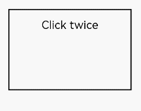
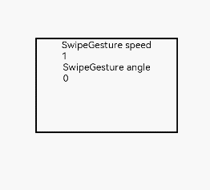

# Single Gesture


## Tap Gesture


```ts
TapGesture(value?:{count?:number, fingers?:number})
```


Triggers a tap gesture with one or more taps. This API has two optional parameters:


- **count**: number of consecutive taps required for gesture recognition. The default value is **1**. A value less than 1 evaluates to the default value **1**. If there are multiple taps, the timeout interval between a lift and the next tap is 300 ms.

- **fingers**: number of fingers required for gesture recognition. The value ranges from 1 to 10. The default value is **1**. If the number of fingers used is less than the specified one within 300 ms after the first finger is tapped, the gesture fails to be recognized.
    The following example binds a double-tap gesture (a tap gesture whose **count** value is **2**) to the **Text** component:

  ```ts
  // xxx.ets
  @Entry
  @Component
  struct Index {
    @State value: string = "";
    
    build() {
      Column() {
        Text('Click twice').fontSize(28)
          .gesture(
            // Bind a tap gesture whose count value is 2.
            TapGesture({ count: 2 })
              .onAction((event: GestureEvent|undefined) => {
              if(event){
                this.value = JSON.stringify(event.fingerList[0]);
              }
              }))
        Text(this.value)
      }
      .height(200)
      .width(250)
      .padding(20)
      .border({ width: 3 })
      .margin(30)
    }
  }
  ```

  


## Long Press Gesture


```ts
LongPressGesture(value?:{fingers?:number, repeat?:boolean, duration?:number})
```


Triggers a long press gesture. This API has three optional parameters:


- **fingers**: minimum number of fingers required for gesture recognition. The value ranges from 1 to 10. The default value is **1**.

- **repeat**: whether to continuously trigger the event callback. The default value is **false**.

- **duration**: minimum hold-down time, in ms. The default value is **500**.


The following exemplifies how to bind a long press gesture that can be repeatedly triggered to the **Text** component:


```ts
// xxx.ets
@Entry
@Component
struct Index {
  @State count: number = 0;

  build() {
    Column() {
      Text('LongPress OnAction:' + this.count).fontSize(28)
        .gesture(
          // Bind a long press gesture that can be triggered repeatedly.
          LongPressGesture({ repeat: true })
           .onAction((event: GestureEvent|undefined) => {
              if(event){
                if (event.repeat) {
                  this.count++;
                }
              }
            })
            .onActionEnd(() => {
              this.count = 0;
            })
        )
    }
    .height(200)
    .width(250)
    .padding(20)
    .border({ width: 3 })
    .margin(30)
  }
}
```


## Pan Gesture


```ts
PanGesture(value?:{ fingers?:number, direction?:PanDirection, distance?:number})
```


Triggers a pan gesture, which requires the minimum movement distance (5 vp by default) of a finger on the screen. This API has three optional parameters:


- **fingers**: minimum number of fingers required for gesture recognition. The value ranges from 1 to 10. The default value is **1**.

- **direction**: pan direction. The enumerated value supports the AND (&amp;) and OR (\|) operations. The default value is **Pandirection.All.**

- **distance**: minimum amount of finger movement required for gesture recognition, in vp. The default value is **5**.


The following exemplifies how to bind a pan gesture to the **Text** component. You can pan a component by modifying the layout and position information of the component in the **PanGesture** callback.


```ts
// xxx.ets
@Entry
@Component
struct Index {
  @State offsetX: number = 0;
  @State offsetY: number = 0;
  @State positionX: number = 0;
  @State positionY: number = 0;

  build() {
    Column() {
      Text('PanGesture Offset:\nX: ' + this.offsetX + '\n' + 'Y: ' + this.offsetY)
        .fontSize(28)
        .height(200)
        .width(300)
        .padding(20)
        .border({ width: 3 })
          // Bind the layout and position information to the component.
        .translate({ x: this.offsetX, y: this.offsetY, z: 0 })
        .gesture(
          // Bind a pan gesture to the component.
          PanGesture()
           .onActionStart((event: GestureEvent|undefined) => {
              console.info('Pan start');
            })
              // When the pan gesture is recognized, modify the layout and position information of the component based on the callback.
            .onActionUpdate((event: GestureEvent|undefined) => {
              if(event){
                this.offsetX = this.positionX + event.offsetX;
                this.offsetY = this.positionY + event.offsetY;
              }
            })
            .onActionEnd(() => {
              this.positionX = this.offsetX;
              this.positionY = this.offsetY;
            })
        )
    }
    .height(200)
    .width(250)
  }
}
```


>**NOTE**
>
>Most swipeable components, such as **List**, **Grid**, **Scroll**, and **Tab**, allow for swiping through the pan gesture. If you bind the pan gesture or [swipe gesture](#swipe-gesture) to a child of these components, competition for gesture recognition will result.
>
>If the pan gesture is bound to a child component, the component, instead of its parent, responds to the pan gestures recognized. If you want the parent component to respond, you need to modify the gesture binding method or transfer messages from the child component to the parent component, or modify the **distance** parameters in **PanGesture** for the components. If the swipe gesture is bound to a child component, to allow the parent component to respond to gestures, you need to modify the parameters of **PanGesture** and **SwipeGesture**, since the swipe gesture and pan gesture are recognized with different conditions.
>
>An inappropriate value can lead to slow response or lagging.


## Pinch Gesture


```ts
PinchGesture(value?:{fingers?:number, distance?:number})
```


Triggers a pinch gesture. This API has two optional parameters:


- **fingers**: minimum number of fingers required for gesture recognition. The value ranges from 2 to 5. The default value is **2**.

- **distance**: minimum distance between fingers required for gesture recognition, in vp. The default value is **5**.


The following exemplifies how to bind a three-finger pinch gesture to the **Column** component. You can obtain the scale factor from the callback of **PinchGesture** to scale the component.


```ts
// xxx.ets
@Entry
@Component
struct Index {
  @State scaleValue: number = 1;
  @State pinchValue: number = 1;
  @State pinchX: number = 0;
  @State pinchY: number = 0;

  build() {
    Column() {
      Column() {
        Text('PinchGesture scale:\n' + this.scaleValue)
        Text('PinchGesture center:\n(' + this.pinchX + ',' + this.pinchY + ')')
      }
      .height(200)
      .width(300)
      .border({ width: 3 })
      .margin({ top: 100 })
      // Bind the scale factor to the component so that it is scaled by changing the scale factor.
      .scale({ x: this.scaleValue, y: this.scaleValue, z: 1 })
      .gesture(
        // Bind a three-finger pinch gesture to the component.
        PinchGesture({ fingers: 3 })
          .onActionStart((event: GestureEvent|undefined) => {
            console.info('Pinch start');
          })
            // When the pinch gesture is triggered, the callback can be used to obtain the scale factor.
          .onActionUpdate((event: GestureEvent|undefined) => {
            if(event){
              this.scaleValue = this.pinchValue * event.scale;
              this.pinchX = event.pinchCenterX;
              this.pinchY = event.pinchCenterY;
            }
          })
          .onActionEnd(() => {
            this.pinchValue = this.scaleValue;
            console.info('Pinch end');
          })
      )
    }
  }
}
```


## Rotation Gesture


```ts
RotationGesture(value?:{fingers?:number, angle?:number})
```


Triggers a rotation gesture. This API has two optional parameters:


- **fingers**: minimum number of fingers required for gesture recognition. The value ranges from 2 to 5. The default value is **2**.

- **angle**: minimum angle of rotation required for gesture recognition, in deg. The default value is **1**.


The following exemplifies how to bind a rotation gesture to the **Text** component. You can obtain the rotation angle from the callback of **RotationGesture** and implement rotation on the component.


```ts
// xxx.ets
@Entry
@Component
struct Index {
  @State angle: number = 0;
  @State rotateValue: number = 0;

  build() {
    Column() {
      Text('RotationGesture angle:' + this.angle).fontSize(28)
        // Bind the rotation to the component so that it is rotated by changing the rotation angle.
        .rotate({ angle: this.angle })
        .gesture(
          RotationGesture()
           .onActionStart((event: GestureEvent|undefined) => {
              console.info('RotationGesture is onActionStart');
            })
              // When the rotation gesture takes effect, the rotation angle is obtained through the callback and the component is rotated accordingly.
            .onActionUpdate((event: GestureEvent|undefined) => {
              if(event){
                this.angle = this.rotateValue + event.angle;
              }
              console.info('RotationGesture is onActionEnd');
            })
              // When the fingers lift from the screen, the component is fixed at the angle where rotation ends.
            .onActionEnd(() => {
              this.rotateValue = this.angle;
              console.info('RotationGesture is onActionEnd');
            })
            .onActionCancel(() => {
              console.info('RotationGesture is onActionCancel');
            })
        )
        .height(200)
        .width(300)
        .padding(20)
        .border({ width: 3 })
        .margin(100)
    }
  }
}
```


## Swipe Gesture


```ts
SwipeGesture(value?:{fingers?:number, direction?:SwipeDirection, speed?:number})
```


Triggers a swipe gesture, which can be recognized when the swipe speed is 100 vp/s or higher. This API has three optional parameters:


- **fingers**: minimum number of fingers required for gesture recognition. The value ranges from 1 to 10. The default value is **1**.

- **direction**: swipe direction. The enumerated value supports the AND (&amp;) and OR (\|) operations. The default value is **SwipeDirection.All**.

- **speed**: minimum speed of the swipe gesture, in vp/s. The default value is **100**.


The following exemplifies how to bind a swipe gesture to the **Column** component to rotate the component:


```ts
// xxx.ets
@Entry
@Component
struct Index {
  @State rotateAngle: number = 0;
  @State speed: number = 1;

  build() {
    Column() {
      Column() {
        Text("SwipeGesture speed\n" + this.speed)
        Text("SwipeGesture angle\n" + this.rotateAngle)
      }
      .border({ width: 3 })
      .width(300)
      .height(200)
      .margin(100)
      // Bind rotation to the <Column> component and change the rotation angle through the swipe speed and angle.
      .rotate({ angle: this.rotateAngle })
      .gesture(
        // Bind to the component the swipe gesture that can be triggered only when the user swipes in the vertical direction.
        SwipeGesture({ direction: SwipeDirection.Vertical })
          // When the swipe gesture is triggered, the swipe speed and angle are obtained, which can be used to modify the layout parameters.
          .onAction((event: GestureEvent|undefined) => {
            if(event){
              this.speed = event.speed;
              this.rotateAngle = event.angle;
            }
          })
      )
    }
  }
}
```





>**NOTE**
>
>When the swipe gesture and pan gesture are simultaneously bound to a component in default or mutually exclusive mode, competition for gesture recognition occurs. Whichever gesture meets the trigger condition first is recognized. By default, a swipe gesture is recognized when the swipe speed reaches 100 vp/s, and a pan gesture is recognized when the amount of finger movement reaches 5 vp. To allow a specific gesture to be recognized before the other, you can modify the parameter settings in **SwipeGesture** and **PanGesture**.
