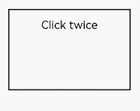
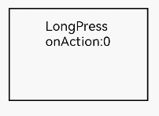
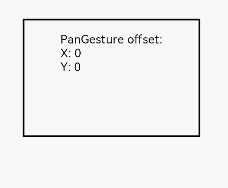
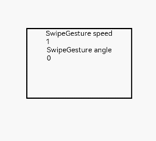

# Single Gesture

<!--Kit: ArkUI-->
<!--Subsystem: ArkUI-->
<!--Owner: @yihao-lin-->
<!--Designer: @piggyguy-->
<!--Tester: @songyanhong-->
<!--Adviser: @Brilliantry_Rui-->
<!-- md-trans-meta sourceCommit=9b7116624d5eed08082261dee12697d1cac202a2 translatedAt=2026-08-01T00:27:17.684Z pushedAt=2026-08-01T03:44:25.343Z -->

## Click Event (onClick)

A click is a common gesture that can be easily implemented using the [onClick](../reference/apis-arkui/arkui-ts/ts-universal-events-click.md#onclick) API. Although it is called an event, it is essentially a basic gesture type equivalent to **TapGesture** with **count** set to **1**, that is, a single-tap gesture.

**onClick** behaves like other gesture types and also participates in processes such as hit testing and response chain collection. You can [intervene in gesture processing](./arkts-interaction-development-guide-support-gesture.md#intervention-in-gesture-processing) to dynamically control how **onClick** responses are handled.

<!-- @[click_event](https://gitcode.com/openharmony/applications_app_samples/blob/master/code/DocsSample/ArkUISample/EventProject/entry/src/main/ets/pages/singlegesture/OnClickGesture.ets) --> 

``` TypeScript
@Entry
@Component
export struct OnClickGesture {
  private judgeCount: number = 0;

  increaseJudgeGuard(): void {
    this.judgeCount++;
  }

  build() {
    NavDestination() {
      Column() {
        Column() {
          Column()
            .width('60%')
            .height('50%')
            .backgroundColor(Color.Grey)
            .onClick(() => {
              // 1. A click event is registered on the child component. Under normal circumstances, tapping on the child component triggers its response first.
              console.info('Clicked on child');
              this.increaseJudgeGuard();
            })
            .onGestureJudgeBegin((gestureInfo: GestureInfo, event: BaseGestureEvent) => {
              // 3. When the number grows to a multiple of 5, the tap gesture on the child component is disabled, allowing the tap on the parent component to receive a response.
              if (this.judgeCount % 5 == 0 && gestureInfo.type == GestureControl.GestureType.CLICK) {
                return GestureJudgeResult.REJECT;
              } else {
                return GestureJudgeResult.CONTINUE;
              }
            })
        }
        .width('80%')
        .height('80%')
        .justifyContent(FlexAlign.Center)
        .backgroundColor(Color.Green)
        .gesture(
          // 2. A tap gesture is registered on the parent component. Under normal circumstances, when tapping on the child component area, the parent component's gesture has a lower priority than the child component's.
          TapGesture()
            .onAction(() => {
              console.info('Clicked on parent');
              this.increaseJudgeGuard();
            }))
      }
      .height('100%')
      .width('100%')
      .justifyContent(FlexAlign.Center)
    }
    .backgroundColor('#f1f2f3')
    // Replace $r('app.string.singlegesture_Index_Click_title') with the actual resource file. In this example, the value in the resource file is "onClick."
    .title($r('app.string.singlegesture_Index_Click_title'))
  }
}
```

In this example, the child component's click event is temporarily disabled every five taps, ensuring that the parent component's tap gesture is triggered first on those occasions.

## Tap Gesture (TapGesture)

```ts
TapGesture(value?: TapGestureParameters)
```

The tap gesture supports single-tap and multi-tap. For detailed parameter definitions, see [TapGesture](../reference/apis-arkui/arkui-ts/ts-basic-gestures-tapgesture.md).

<!-- @[catch_click_twice_event](https://gitcode.com/openharmony/applications_app_samples/blob/master/code/DocsSample/ArkUISample/EventProject/entry/src/main/ets/pages/singlegesture/TapGesture.ets) -->   

``` TypeScript
@Entry
@Component
export struct Tap {
  @State value: string = '';

  build() {
    NavDestination() {
      Column({ space: 12 }) {
        Column() {
          Text('Click twice').fontSize(28)
            .gesture(
              // Bind a tap gesture with count set to 2 (double-tap).
              TapGesture({ count: 2 })
                .onAction((event: GestureEvent|undefined) => {
                  if(event){
                    this.value = JSON.stringify(event.fingerList[0]);
                  }
                }))
          Text(this.value)
        }
        .height(300)
        .width(250)
        .padding(20)
        .border({ width: 3 })
        .margin(30)
      }
      .width('100%')
      .height('100%')
      .padding({ left: 12, right: 12 })
    }
    .backgroundColor('#f1f2f3')
    // Replace $r('app.string.singlegesture_TapGesture_title') with the actual resource file. In this example, the value in the resource file is "TapGesture."
    .title($r('app.string.singlegesture_TapGesture_title'))
  }
}
```

  

## Long Press Gesture (LongPressGesture)

```ts
LongPressGesture(value?:{fingers?:number, repeat?:boolean, duration?:number})
```

The long press gesture triggers a long press event. For detailed parameter definitions, see [LongPressGesture](../reference/apis-arkui/arkui-ts/ts-basic-gestures-longpressgesture.md).

The following exemplifies how to bind a long press gesture that can be repeatedly triggered to the **Text** component:

<!-- @[catch_long_press_event](https://gitcode.com/openharmony/applications_app_samples/blob/master/code/DocsSample/ArkUISample/EventProject/entry/src/main/ets/pages/singlegesture/LongPressGesture.ets) -->

``` TypeScript
@Entry
@Component
export struct LongPress {
  @State count: number = 0;

  build() {
    NavDestination() {
      Column({ space: 12 }) {
        Column() {
          Text('LongPress OnAction:' + this.count).fontSize(28)
            .gesture(
              // Bind a long press gesture that can be triggered repeatedly.
              LongPressGesture({ repeat: true })
                .onAction((event: GestureEvent | undefined) => {
                  if (event) {
                    if (event.repeat) {
                      this.count++;
                    }
                  }
                })
                .onActionEnd(() => {
                  this.count = 0;
                })
            )
        }
        .height(200)
        .width(250)
        .padding(20)
        .border({ width: 3 })
        .margin(30)
      }
      .width('100%')
      .height('100%')
      .padding({ left: 12, right: 12 })
    }
    .backgroundColor('#f1f2f3')
    // Replace $r('app.string.singlegesture_LongPressGesture_title') with the actual resource file. In this example, the value in the resource file is "LongPressGesture."
    .title($r('app.string.singlegesture_LongPressGesture_title'))
  }
}
```



## Pan Gesture (PanGesture)

```ts
PanGesture(value?: { fingers?: number; direction?: PanDirection; distance?: number } | PanGestureOptions)
```

A pan gesture triggers a pan gesture event. The gesture is recognized when the pan distance reaches the minimum pan distance (default: 5 vp). For detailed parameter definitions, see [PanGesture](../reference/apis-arkui/arkui-ts/ts-basic-gestures-pangesture.md).

The following example implements a simple volume control slider. The callback of the pan gesture processes volume increase or decrease logic for different input sources.

Five input modes are supported:

1. One-finger vertical swipe on the screen.

2. Mouse drag with the left button pressed.

3. Mouse wheel scrolling.

4. One-finger vertical swipe on the touchpad.

5. Two-finger vertical swipe on the touchpad.

<!-- @[sliding_gesture](https://gitcode.com/openharmony/applications_app_samples/blob/master/code/DocsSample/ArkUISample/EventProject/entry/src/main/ets/pages/singlegesture/PanCombinationGesture.ets) -->

``` TypeScript
@Entry
@Component
export struct VolumeControlDemo {
  @State currentVolume: number = 50;
  private readonly MAX_VOLUME: number = 100;
  private readonly MIN_VOLUME: number = 0;

  private handlePanUpdate(event: GestureEvent) {
    const volumeChange = -event.offsetY * 0.1;
    this.handleVolumeChange(volumeChange);
  }

  private handleWheelEvent(event: GestureEvent) {
    const volumeChange = event.offsetY * 0.1;
    this.handleVolumeChange(volumeChange);
  }

  private handleTouchPadScroll(event: GestureEvent) {
    const volumeChange = -event.offsetY * 0.02;
    this.handleVolumeChange(volumeChange);
  }

  private handleVolumeChange(delta: number) {
    this.currentVolume = Math.min(
      this.MAX_VOLUME,
      Math.max(this.MIN_VOLUME, this.currentVolume + delta)
    );
  }

  build() {
    NavDestination() {
      Column() {
        Row() {
          // Replace $r('app.string.video') with the actual resource file. In this example, the value in the resource file is "Volume."
          Text($r('app.string.video'))
          Text(`: ${this.currentVolume}`).fontSize(20)
        }.margin(10)
        Column()
          .width('100%')
          .height(250)
          .backgroundColor('#F5F5F5')
          .borderRadius(12)
          .gesture(
            PanGesture()
              .onActionStart(() => {
                console.info('Pan start');
              })
              .onActionUpdate((event: GestureEvent) => {
                if (event.source === SourceType.TouchScreen) {
                  console.info('finger move triggered PanGesture');
                  this.handlePanUpdate(event);
                }
                if (event.source === SourceType.Mouse && event.sourceTool === SourceTool.MOUSE) {
                  if (event.axisHorizontal === 0 && event.axisVertical === 0) {
                    console.info('mouse move with left button pressed triggered PanGesture');
                    this.handlePanUpdate(event);
                  } else { 
                    console.info('mouse wheel triggered PanGesture');
                    this.handleWheelEvent(event);
                  }
                }
                if (event.sourceTool === SourceTool.TOUCHPAD &&
                  (event.axisHorizontal !== 0 || event.axisVertical !== 0)) {
                  console.info('touchpad double finger move triggered PanGesture');
                  this.handleTouchPadScroll(event);
                }
              })
          )
      }
      .width('100%')
      .height('100%')
      .padding(20)
    }
    .backgroundColor('#f1f2f3')
    // Replace $r('app.string.singlegesture_Index_Pancom_title') with the actual resource file. In this example, the value in the resource file is "PanGesture."
    .title($r('app.string.singlegesture_Index_Pancom_title'))
  }
}
```



>**NOTE**
>
> - Most swipeable components, such as **List**, **Grid**, **Scroll**, and **Tab**, allow for swiping through the pan gesture. If you bind the [pan gesture](#pan-gesture-pangesture) or [swipe gesture](#swipe-gesture-swipegesture) to a child of these components, competition for gesture recognition will result.
>
> - If a pan gesture is bound to a child component, the child component will respond to the recognized pan gesture instead of the parent. To make the parent respond, you must either adjust the gesture binding approach, have the child forward the gesture event to the parent, or modify the **distance** parameter of the pan gesture on both parent and child to make the swiping more sensitive. If the swipe gesture is bound to a child component, to allow the parent component to respond to gestures, you must modify the parameters of **PanGesture** and **SwipeGesture**, since the swipe gesture and pan gesture are recognized under different conditions.
>
> - An inappropriate value can lead to slow response or lagging.

## Pinch Gesture (PinchGesture)

```ts
PinchGesture(value?: { fingers?: number; distance?: number })
```

The pinch gesture triggers a pinch gesture event. For detailed parameter definitions, see [PinchGesture](../reference/apis-arkui/arkui-ts/ts-basic-gestures-pinchgesture.md).

The following exemplifies how to bind a three-finger pinch gesture to the **Column** component. You can obtain the scale factor from the callback of **PinchGesture** to scale the component.

<!-- @[catch_pinch_gesture_event](https://gitcode.com/openharmony/applications_app_samples/blob/master/code/DocsSample/ArkUISample/EventProject/entry/src/main/ets/pages/singlegesture/PinchGesture.ets) -->

``` TypeScript
@Entry
@Component
export struct Pinch {
  @State scaleValue: number = 1;
  @State pinchValue: number = 1;
  @State pinchX: number = 0;
  @State pinchY: number = 0;

  build() {
    NavDestination() {
      Column({ space: 12 }) {
        Column() {
          Column() {
            Text('PinchGesture scale:\n' + this.scaleValue)
            Text('PinchGesture center:\n(' + this.pinchX + ',' + this.pinchY + ')')
          }
          .height(200)
          .width(300)
          .border({ width: 3 })
          .margin({ top: 100 })
          // Bind the scale factor to the component so that scaling updates when the factor changes.
          .scale({ x: this.scaleValue, y: this.scaleValue, z: 1 })
          .gesture(
            // Bind a three-finger pinch gesture to the component.
            PinchGesture({ fingers: 3 })
              .onActionStart((event: GestureEvent | undefined) => {
                console.info('Pinch start');
              // When the pinch gesture is triggered, obtain the scale factor from the callback and apply it to the component.
              .onActionUpdate((event: GestureEvent | undefined) => {
                if (event) {
                  this.scaleValue = this.pinchValue * event.scale;
                  this.pinchX = event.pinchCenterX;
                  this.pinchY = event.pinchCenterY;
                }
              })
              .onActionEnd(() => {
                this.pinchValue = this.scaleValue;
                console.info('Pinch end');
              })
          )
        }
      }
      .width('100%')
      .height('100%')
      .padding({ left: 12, right: 12 })
    }
    .backgroundColor('#f1f2f3')
    // Replace $r('app.string.singlegesture_PinchGesture_title') with the actual resource file. In this example, the value in the resource file is "PinchGesture."
    .title($r('app.string.singlegesture_PinchGesture_title'))
  }
}
```

<!--Del-->![pinch] (figures/pinch.gif)<!--DelEnd-->

## Rotation Gesture (RotationGesture)

```ts
RotationGesture(value?: { fingers?: number; angle?: number })
```

The rotation gesture triggers a rotation gesture event. For detailed parameter definitions, see [RotationGesture](../reference/apis-arkui/arkui-ts/ts-basic-gestures-rotationgesture.md).

The following exemplifies how to bind a rotation gesture to the **Text** component. You can obtain the rotation angle from the callback of **RotationGesture** and implement rotation on the component.

<!-- @[catch_rotation_gesture_event](https://gitcode.com/openharmony/applications_app_samples/blob/master/code/DocsSample/ArkUISample/EventProject/entry/src/main/ets/pages/singlegesture/RotationGesture.ets) --> 

``` TypeScript
@Entry
@Component
export struct Rotation {
  @State angle: number = 0;
  @State rotateValue: number = 0;

  build() {
    NavDestination() {
      Column({ space: 12 }) {
        Column() {
          Text('RotationGesture angle:' + this.angle).fontSize(28)
            // Bind the rotation angle to the component so that rotation updates when the angle changes.
            .rotate({ angle: this.angle })
            .gesture(
              RotationGesture()
                .onActionStart((event: GestureEvent|undefined) => {
                  console.info('RotationGesture is onActionStart');
                })
                  // When the rotation gesture is triggered, obtain the rotation angle and apply it to the component.
                .onActionUpdate((event: GestureEvent|undefined) => {
                  if(event){
                    this.angle = this.rotateValue + event.angle;
                  }
                  console.info('RotationGesture is onActionUpdate');
                })
                  // When fingers lift, fix the component at the final rotation angle.
                .onActionEnd(() => {
                  this.rotateValue = this.angle;
                  console.info('RotationGesture is onActionEnd');
                })
                .onActionCancel(() => {
                  console.info('RotationGesture is onActionCancel');
                })
            )
            .height(200)
            .width(300)
            .padding(20)
            .border({ width: 3 })
            .margin(100)
        }
      }
      .width('100%')
      .height('100%')
      .padding({ left: 12, right: 12 })
    }
    .backgroundColor('#f1f2f3')
    // Replace $r('app.string.singlegesture_RotationGesture_title') with the actual resource file. In this example, the value in the resource file is "RotationGesture."
    .title($r('app.string.singlegesture_RotationGesture_title'))
  }
}
```

<!--Del-->![rotation]  (figures/rotation-2.gif)<!--DelEnd-->

## Swipe Gesture (SwipeGesture)

```ts
SwipeGesture(value?: { fingers?: number; direction?: SwipeDirection; speed?: number })
```

A swipe gesture triggers a swipe event. The gesture is recognized when the swipe speed exceeds 100 vp/s. For detailed parameter definitions, see [SwipeGesture](../reference/apis-arkui/arkui-ts/ts-basic-gestures-swipegesture.md).

The following example shows how to bind a swipe gesture to a **Column** component to rotate the component:

<!-- @[catch_swipe_gesture_event](https://gitcode.com/openharmony/applications_app_samples/blob/master/code/DocsSample/ArkUISample/EventProject/entry/src/main/ets/pages/singlegesture/SwipeGesture.ets) --> 

``` TypeScript
@Entry
@Component
export struct Swipe {
  @State rotateAngle: number = 0;
  @State speed: number = 1;

  build() {
    NavDestination() {
      Column({ space: 12 }) {
        Column() {
          Column() {
            Text('SwipeGesture speed\n' + this.speed)
            Text('SwipeGesture angle\n' + this.rotateAngle)
          }
          .border({ width: 3 })
          .width(300)
          .height(200)
          .margin(100)
          // Bind rotation to the Column component, and modify the rotation angle based on the swipe speed and angle of the Swipe Gesture.
          .rotate({ angle: this.rotateAngle })
          .gesture(
            // Bind the Swipe Gesture and restrict it to trigger only when swiping in the vertical direction.
            SwipeGesture({ direction: SwipeDirection.Vertical })
              // When the Swipe Gesture is triggered, obtain the swipe speed and angle to modify the layout parameters of the component.
              .onAction((event: GestureEvent|undefined) => {
                if(event){
                  this.speed = event.speed;
                  this.rotateAngle = event.angle;
                }
              })
          )
        }
      }
      .width('100%')
      .height('100%')
      .padding({ left: 12, right: 12 })
    }
    .backgroundColor('#f1f2f3')
    // Replace $r('app.string.singlegesture_SwipeGesture_title') with the actual resource file. In this example, the value in the resource file is "SwipeGesture."
    .title($r('app.string.singlegesture_SwipeGesture_title'))
  }
}
```



>**NOTE**
>
>When both a swipe gesture and a pan gesture are bound to the same component in the default or mutually exclusive mode, competition for gesture recognition occurs. The gesture that meets its trigger condition first is recognized. By default, a swipe gesture is recognized when the swipe speed reaches 100 vp/s, and a pan gesture is recognized when the finger movement reaches 5 vp. To make one gesture take precedence over the other, adjust the parameter settings in **SwipeGesture** and **PanGesture** accordingly.