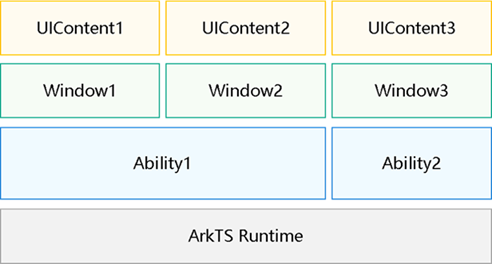

# Using the UI Context API for UI Operations (UIContext)

## Overview

With the support of the stage model in OpenHarmony, there is a scenario where multiple ArkUI instances run within a single ArkTS engine. In this case, an ArkTS engine may have multiple abilities, each of which may have multiple windows. Each window loads a page through **loadContent**, generating a UIContent (ArkUI instance).

**Figure 1** Multi-instance relationship



By default, the FA model supports only one ArkUI instance and does not involve multi-instance scenarios. After ArkUI is switched to the stage model, the ArkUI global APIs opened under the FA model cannot clearly determine which instance they are running in when called, leading to ambiguous semantics. In addition, these APIs rely on information related to the ArkUI instance. If the instance is not clear, unexpected behavior at runtime may occur.

To address these issues in multi-instance scenarios, ArkUI has introduced substitute APIs for the stage model. You can use the [getUIContext](../reference/apis-arkui/js-apis-window.md#getuicontext10) API provided by the **Window** module or use the component built-in API [getUIContext](../reference/apis-arkui/arkui-ts/ts-custom-component-api.md#getuicontext) to obtain the **UIContext** instance where the current component is located, and use the corresponding APIs in [UIContext](../reference/apis-arkui/js-apis-arkui-UIContext.md#uicontext) to obtain objects bound to the instance.

## Substitute APIs

The table below lists some of the alternative APIs to replace in multi-instance scenarios. The full range of APIs supported is described in [UIContext](../reference/apis-arkui/js-apis-arkui-UIContext.md).

|               Global API               |               Substitute API               |            Description           |
| :-----------------------------------: | :-----------------------------------: | :------------------------: |
|            @ohos.animator             |            createAnimator             |      Custom animation controller.     |
|     @ohos.arkui.componentSnapshot     |         getComponentSnapshot          |          Component snapshot.         |
|      @ohos.arkui.componentUtils       |           getComponentUtils           |         Component utility class.        |
|      @ohos.arkui.dragController       |           getDragController           |         Drag controller.        |
|         @ohos.arkui.inspector         |            getUIInspector             |        Component layout callback.       |
|         @ohos.arkui.observer          |             getUIObserver             |          Observer.         |
|              @ohos.font               |                getFont                |         Custom font registration.        |
|             @ohos.measure             |            getMeasureUtil             |          Text measurement.         |
|           @ohos.mediaquery            |             getMediaQuery             |          Media query.         |
|          @ohos.promptAction           |            getPromptAction            |            Popup.           |
|             @ohos.router              |               getRouter               |          Page routing.         |
|              AlertDialog              |            showAlertDialog            |          Alert dialog box.         |
|              ActionSheet              |            showActionSheet            |        Action sheet.       |
|         CalendarPickerDialog          |                Not supported                |       Calendar picker dialog box.      |
|           DatePickerDialog            |         showDatePickerDialog          |      Date picker dialog box.     |
|           TimePickerDialog            |         showTimePickerDialog          |     Time picker dialog box.    |
|           TextPickerDialog            |         showTextPickerDialog          |     Text picker dialog box.    |
|              ContextMenu              |       getContextMenuController        |          Menu control.         |
| vp2px/px2vp/fp2px/px2fp/lpx2px/px2lpx | vp2px/px2vp/fp2px/px2fp/lpx2px/px2lpx |        Pixel unit conversion.       |
|             focusControl              |            getFocusControl            |          Focus control.         |
|             cursorControl             |           getCursorControl            |          Cursor control.         |
|              getContext               |            getHostContext             | Obtains the context of the current ability.|
|        LocalStorage.getShared         |         getSharedLocalStorage         |  Obtains the storage passed by the current ability. |
|               animateTo               |               animateTo               |          Explicit animation.         |
|         animateToImmediately          |                Not supported                |        Explicit instant animation.       |

## How to Switch to Substitute APIs

In the following example, a toast is displayed in a specific window. ArkUI can detect that the API is called on the current page and find the corresponding UI instance. In some complex scenarios, however, the API is not initially called on the current page and has been asynchronously called. In this case, the behavior of the instance may become ambiguous.

```ts
import { promptAction } from '@kit.ArkUI'

@Entry
@Component
struct Index {
  build() {
    Row() {
      Button()
        .onClick(() => {
          promptAction.showToast({            
            message: 'Message Info',
            duration: 2000 
          });
        })
    }
  }
}
```
In the following example, **callNative** is a Node-API method. If it is asynchronously triggered by the C side, the current page information cannot be detected at execution, and the UI instance that responds cannot be determined.

```ts
import { promptAction } from '@kit.ArkUI'

@Entry
@Component
struct Index {
  build() {
    Row() {
      Button()
        .onClick(() => {
          bridge.callNative("xxxx", ()=> {
            promptAction.showToast({            
              message: 'Message Info',
              duration: 2000 
            });
          })
        })
    }
  }
}
```

To address the above issue, you can use the component built-in API [getUIContext](../reference/apis-arkui/arkui-ts/ts-custom-component-api.md#getuicontext) to directly obtain the **UIContext** instance where the current component is located, and then use the **getPromptAction** API in [UIContext](../reference/apis-arkui/js-apis-arkui-UIContext.md#uicontext) to obtain objects bound to the instance. This way, the toast is bound to a specific instance.
```ts
@Entry
@Component
struct Index {
  build() {
    Row() {
      Button()
        .onClick(() => {
          let uiContext = this.getUIContext();
          let prompt = uiContext.getPromptAction();
          bridge.callNative("xxxx", ()=> {
            prompt.showToast({            
              message: 'Message Info',
              duration: 2000 
            });
          })
        })
    }
  }
}
```

If you are using APIs in [UIContext](../reference/apis-arkui/js-apis-arkui-UIContext.md#uicontext) that do not have substitutes (such as **CalendarPickerDialog** and **animateToImmediately**), or if you are implementing custom service logic that's tied to specific instances, you can use the **runScopedTask** API in **UIContext** to encapsulate these APIs or code snippets.

| API in UIContext| Description                |
| ------------- | -------------------- |
| runScopedTask | Executes the closure of the bound instance.|

The above example can also be implemented using the following method.

```ts
// Execute the closure of the bound instance.
import { promptAction } from '@kit.ArkUI'

@Entry
@Component
struct Index {
  build() {
    Row() {
      Button()
        .onClick(() => {
          let uiContext = this.getUIContext();
          uiContext.runScopedTask(() => {
            promptAction.showToast({            
              message: 'Message Info',
              duration: 2000 
            });
          })
        })
    }
  }
}
```
