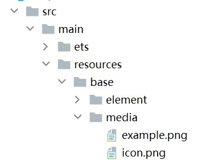
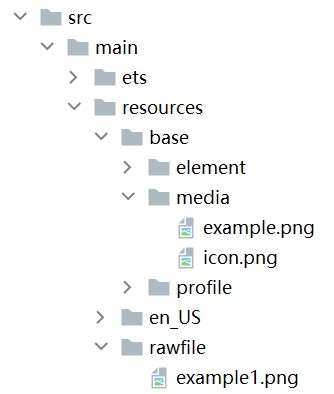
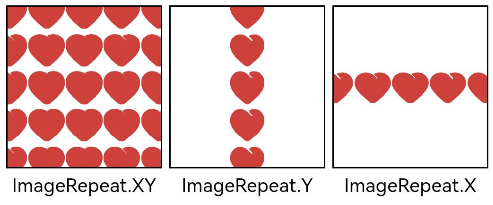
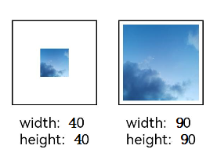
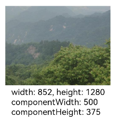

# Image Display (Image)


More often than not, you may need to display images in your application, for example, icons in buttons, online images, and local images. This is where the **Image** component comes in handy. The **Image** component supports a wide range of image formats, including PNG, JPG, BMP, SVG, and GIF. For details, see [Image](../reference/apis-arkui/arkui-ts/ts-basic-components-image.md).


To use the **Image** component, call the following API:

```ts
Image(src: PixelMap | ResourceStr | DrawableDescriptor)
```


This API obtains a local or online image from the data source specified by **src**. For details about how to load the data source, see [Loading Image Resources](#loading-image-resources).


## Loading Image Resources

The **Image** component supports two types of images: archived and pixel map.


### Archived Type Data Sources

Data sources of the archived type can be classified into local resources, online resources, **Resource** objects, media library resources, and Base64 resources.

- Local resources

  To load local images, create an **ets** folder and place the local images in any position in the folder.

  Then, in the **Image** component, set **src** to the local image path, with the root directory being the **ets** folder.

  ```ts
  Image('images/view.jpg')
  .width(200)
  ```

- Online resources

  To use online images, first apply for the **ohos.permission.INTERNET** permission. For details, see [Declaring Permissions](../security/AccessToken/declare-permissions.md). Then, in the **Image** component, set **src** to the URL of the online image.

  Currently, the **Image** component supports only simple online images.

  If an online image has been loaded before, the **Image** component can obtain it from the cache, instead of having to request it from the Internet again. For details about the image cache, see [setImageCacheCount](../reference/apis-arkui/js-apis-system-app.md#setimagecachecount7), [setImageRawDataCacheSize](../reference/apis-arkui/js-apis-system-app.md#setimagerawdatacachesize7), and [setImageFileCacheSize](../reference/apis-arkui/js-apis-system-app.md#setimagefilecachesize7). It should be noted that these image caching APIs are not flexible and will not be further developed. For complex scenarios, you are advised to use [ImageKnife](https://gitee.com/openharmony-tpc/ImageKnife).

  ```ts
  Image('https://www.example.com/example.JPG') // Replace the URL with the actual URL.
  ```

- **Resource** objects

  **Resource** objects can be used to import images across bundles and modules. To load **Resource** objects, place images in the **resources** folder, which can be read and converted to the **Resource** objects through **$r**.

  **Figure 1** resources 

  

  API:

  ```
  Image($r('app.media.icon'))
  ```

  You can also place the images in the **rawfile** folder.

  **Figure 2** rawfile folder 

  

  API:

  ```
  Image($rawfile('example1.png'))
  ```

- Media library **file://data/storage**

  To load images from the [media library](../reference/apis-core-file-kit/js-apis-file-picker.md), use a path string that starts with **file://**.

  1. Call the API to obtain the image URL in the media library.
      ```ts
      import { photoAccessHelper } from '@kit.MediaLibraryKit';
      import { BusinessError } from '@kit.BasicServicesKit';

      @Entry
      @Component
      struct Index {
        @State imgDatas: string[] = [];
        // Obtain the image URL set.
        getAllImg() {
          try {
            let PhotoSelectOptions:photoAccessHelper.PhotoSelectOptions = new photoAccessHelper.PhotoSelectOptions();
            PhotoSelectOptions.MIMEType = photoAccessHelper.PhotoViewMIMETypes.IMAGE_TYPE;
            PhotoSelectOptions.maxSelectNumber = 5;
            let photoPicker:photoAccessHelper.PhotoViewPicker = new photoAccessHelper.PhotoViewPicker();
            photoPicker.select(PhotoSelectOptions).then((PhotoSelectResult:photoAccessHelper.PhotoSelectResult) => {
              this.imgDatas = PhotoSelectResult.photoUris;
              console.info('PhotoViewPicker.select successfully, PhotoSelectResult uri: ' + JSON.stringify(PhotoSelectResult));
            }).catch((err:Error) => {
              let message = (err as BusinessError).message;
              let code = (err as BusinessError).code;
              console.error(`PhotoViewPicker.select failed with. Code: ${code}, message: ${message}`);
            });
          } catch (err) {
            let message = (err as BusinessError).message;
            let code = (err as BusinessError).code;
            console.error(`PhotoViewPicker failed with. Code: ${code}, message: ${message}`);    }
        }
      
        // Call the preceding function in aboutToAppear to obtain the image URL set and store the URLs in imgDatas.
        async aboutToAppear() {
          this.getAllImg();
        }
        // Use the URL of imgDatas to load the image.
        build() {
          Column() {
            Grid() {
              ForEach(this.imgDatas, (item:string) => {
                GridItem() {
                  Image(item)
                    .width(200)
                }
              }, (item:string):string => JSON.stringify(item))
            }
          }.width('100%').height('100%')
        }
      }
      ```
      
2. Check the format of the URL obtained from the media library:
      ```ts
      Image('file://media/Photos/5')
      .width(200)
      ```

- Base64

  As shown above, the URL format is data:image/[png|jpeg|bmp|webp];base64,[base64 data], where **[base64 data]** indicates a Base64 string.

  Base64 strings are widely used on web pages for storing pixel data of images.


### Pixel Map

A pixel map is a pixel image obtained after image decoding. For details, see [Introduction to Image Kit](../media/image/image-overview.md). In the following example, the data returned by the loaded online image is decoded into a pixel map, which is then displayed on the **Image** component.

1. Create a **PixelMap** state variable.

   ```ts
   @State image: PixelMap | undefined = undefined;
   ```

2. Reference multimedia.

   Request an online image and implement transcoding to generate a pixel map.

   1. Reference the network and media library access permissions.
       ```ts
       import { http } from '@kit.NetworkKit';
       import { image } from '@kit.ImageKit';
       import { BusinessError } from '@kit.BasicServicesKit';
       ```
   2. Enter the online image address.
       ```ts
       let OutData: http.HttpResponse
       http.createHttp().request("https://www.example.com/xxx.png",
         (error: BusinessError, data: http.HttpResponse) => {
           if (error) {
             console.error(`http request failed with. Code: ${error.code}, message: ${error.message}`);
           } else {
             OutData = data
           }
         }
       )
       ```
   3. Transcode the data returned by the online image address to a pixel map.  
       ```ts
       let code: http.ResponseCode | number = OutData.responseCode
       if (http.ResponseCode.OK === code) {
         let imageData: ArrayBuffer = OutData.result as ArrayBuffer;
         let imageSource: image.ImageSource = image.createImageSource(imageData);
       
         class tmp {
           height: number = 100
           width: number = 100
         }
       
         let si: tmp = new tmp()
         let options: Record<string, number | boolean | tmp> = {
           'alphaType': 0, // Alpha type.
           'editable': false, // Whether the image is editable.
           'pixelFormat': 3, // Pixel format.
           'scaleMode': 1, // Scale mode.
           'size': { height: 100, width: 100 }
         }  // Image size.
       
         class imagetmp {
           image: PixelMap | undefined = undefined
           set(val: PixelMap) {
             this.image = val
           }
         }
       
         imageSource.createPixelMap(options).then((pixelMap: PixelMap) => {
           let im = new imagetmp()
           im.set(pixelMap)
         })
       }
       ```
   4. Display the image.
       ```ts
       class htp{
        httpRequest: Function | undefined = undefined
        set(){
          if(this.httpRequest){
            this.httpRequest()
          }
        }
      }
       Button("Get Online Image")
         .onClick(() => {
           let sethtp = new htp()
           sethtp.set()
         })
       Image(this.image).height(100).width(100)
      ```
      You can also pass **pixelMap** to create a [PixelMapDrawableDescriptor](../reference/apis-arkui/js-apis-arkui-drawableDescriptor.md#pixelmapdrawabledescriptor12) object for displaying images.
      ```ts
       import { DrawableDescriptor, PixelMapDrawableDescriptor } from '@kit.ArkUI'
       class htp{
        httpRequest: Function | undefined = undefined
        set(){
          if(this.httpRequest){
            this.httpRequest()
          }
        }
       }
       Button("Get Online Image")
         .onClick(() => {
           let sethtp = new htp()
           sethtp.set()
           this.drawablePixelMap = new PixelMapDrawableDescriptor(this.image)
         })
       Image(this.drawablePixelMap).height(100).width(100)
      ```


## Displaying Vector Images

The **Image** component can display vector images in SVG format. The supported SVG labels are **svg**, **rect**, **circle**, **ellipse**, **path**, **line**, **polyline**, **polygon**, and **animate**.

You can use the **fillColor** attribute to change the fill color of an SVG image.


```ts
Image($r('app.media.cloud'))
  .width(50)
  .fillColor(Color.Blue) 
```

  **Figure 3** Original image 


  **Figure 4** SVG image after the fill color is set 


## Setting Attributes

Setting attributes for the **Image** component can spruce up the image with custom effects. The following are usage examples of common attributes. For details about all attributes, see [Image](../reference/apis-arkui/arkui-ts/ts-basic-components-image.md).


### Setting the Image Scale Mode

You can use the **objectFit** attribute to scale an image to fit it into a container whose height and width are determined.


```ts
@Entry
@Component
struct MyComponent {
  scroller: Scroller = new Scroller()

  build() {
    Scroll(this.scroller) {
      Column() {
        Row() {
          Image($r('app.media.img_2'))
            .width(200)
            .height(150)
            .border({ width: 1 })
              // The image is scaled with its aspect ratio retained for the content to be completely displayed within the display boundaries.
            .objectFit(ImageFit.Contain)
            .margin(15)
            .overlay('Contain', { align: Alignment.Bottom, offset: { x: 0, y: 20 } })
          Image($r('app.media.ic_img_2'))
            .width(200)
            .height(150)
            .border({ width: 1 })
            .objectFit(ImageFit.Cover)
            .margin(15)
              // The image is scaled with its aspect ratio retained for both sides to be greater than or equal to the display boundaries.
            .overlay('Cover', { align: Alignment.Bottom, offset: { x: 0, y: 20 } })
          Image($r('app.media.img_2'))
            .width(200)
            .height(150)
            .border({ width: 1 })
              // The image is scaled automatically to fit the display area.
            .objectFit(ImageFit.Auto)
            .margin(15)
            .overlay('Auto', { align: Alignment.Bottom, offset: { x: 0, y: 20 } })
        }

        Row() {
          Image($r('app.media.img_2'))
            .width(200)
            .height(150)
            .border({ width: 1 })
              // The image is scaled to fill the display area, and its aspect ratio is not retained.
            .objectFit(ImageFit.Fill)
            .margin(15)
            .overlay('Fill', { align: Alignment.Bottom, offset: { x: 0, y: 20 } })
          Image($r('app.media.img_2'))
            .width(200)
            .height(150)
            .border({ width: 1 })
              // The image content is displayed with its aspect ratio retained. The size is smaller than or equal to the original size.
            .objectFit(ImageFit.ScaleDown)
            .margin(15)
            .overlay('ScaleDown', { align: Alignment.Bottom, offset: { x: 0, y: 20 } })
          Image($r('app.media.img_2'))
            .width(200)
            .height(150)
            .border({ width: 1 })
              // The original size is retained.
            .objectFit(ImageFit.None)
            .margin(15)
            .overlay('None', { align: Alignment.Bottom, offset: { x: 0, y: 20 } })
        }
      }
    }
  }
}
```


### Using Image Interpolation

An image of low resolution may suffer quality loss with aliasing when scaled up. If this is the case, you can use the **interpolation** attribute to conduct image interpolation and improve image quality.


```ts
@Entry
@Component
struct Index {
  build() {
    Column() {
      Row() {
        Image($r('app.media.grass'))
          .width('40%')
          .interpolation(ImageInterpolation.None)
          .borderWidth(1)
          .overlay("Interpolation.None", { align: Alignment.Bottom, offset: { x: 0, y: 20 } })
          .margin(10)
        Image($r('app.media.grass'))
          .width('40%')
          .interpolation(ImageInterpolation.Low)
          .borderWidth(1)
          .overlay("Interpolation.Low", { align: Alignment.Bottom, offset: { x: 0, y: 20 } })
          .margin(10)
      }.width('100%')
      .justifyContent(FlexAlign.Center)

      Row() {
        Image($r('app.media.grass'))
          .width('40%')
          .interpolation(ImageInterpolation.Medium)
          .borderWidth(1)
          .overlay("Interpolation.Medium", { align: Alignment.Bottom, offset: { x: 0, y: 20 } })
          .margin(10)
        Image($r('app.media.grass'))
          .width('40%')
          .interpolation(ImageInterpolation.High)
          .borderWidth(1)
          .overlay("Interpolation.High", { align: Alignment.Bottom, offset: { x: 0, y: 20 } })
          .margin(10)
      }.width('100%')
      .justifyContent(FlexAlign.Center)
    }
    .height('100%')
  }
}
```


### Setting Image Repeat Pattern

You can use the **objectRepeat** attribute to set the repeat pattern of an image. For details, see [ImageRepeat](../reference/apis-arkui/arkui-ts/ts-appendix-enums.md#imagerepeat).


```ts
@Entry
@Component
struct MyComponent {
  build() {
    Column({ space: 10 }) {
      Row({ space: 5 }) {
        Image($r('app.media.ic_public_favor_filled_1'))
          .width(110)
          .height(115)
          .border({ width: 1 })
          .objectRepeat(ImageRepeat.XY)
          .objectFit(ImageFit.ScaleDown)
          // Repeat the image along both the horizontal and vertical axes.
          .overlay('ImageRepeat.XY', { align: Alignment.Bottom, offset: { x: 0, y: 20 } })
        Image($r('app.media.ic_public_favor_filled_1'))
          .width(110)
          .height(115)
          .border({ width: 1 })
          .objectRepeat(ImageRepeat.Y)
          .objectFit(ImageFit.ScaleDown)
          // Repeat the image only along the vertical axis.
          .overlay('ImageRepeat.Y', { align: Alignment.Bottom, offset: { x: 0, y: 20 } })
        Image($r('app.media.ic_public_favor_filled_1'))
          .width(110)
          .height(115)
          .border({ width: 1 })
          .objectRepeat(ImageRepeat.X)
          .objectFit(ImageFit.ScaleDown)
          // Repeat the image only along the horizontal axis.
          .overlay('ImageRepeat.X', { align: Alignment.Bottom, offset: { x: 0, y: 20 } })
      }
    }.height(150).width('100%').padding(8)
  }
}
```




### Setting Image Rendering Mode

You can use the **renderMode** attribute to set the rendering mode of an image.


```ts
@Entry
@Component
struct MyComponent {
  build() {
    Column({ space: 10 }) {
      Row({ space: 50 }) {
        Image($r('app.media.example'))
          // Set the rendering mode to Original.
          .renderMode(ImageRenderMode.Original)
          .width(100)
          .height(100)
          .border({ width: 1 })
            // overlay is a universal attribute, which is used to add overlay text on the component.
          .overlay('Original', { align: Alignment.Bottom, offset: { x: 0, y: 20 } })
        Image($r('app.media.example'))
          // Set the rendering mode to Template.
          .renderMode(ImageRenderMode.Template)
          .width(100)
          .height(100)
          .border({ width: 1 })
          .overlay('Template', { align: Alignment.Bottom, offset: { x: 0, y: 20 } })
      }
    }.height(150).width('100%').padding({ top: 20,right: 10 })
  }
}
```


### Setting Image Decoding Size

You can use the **sourceSize** attribute to set the image decoding size. By setting the decoding size to lower than the source size, you can decrease the image resolution.

In this example, the source image size is 1280 x 960, and the decoding sizes are 40 x 40 and 90 x 90.


```ts
@Entry
@Component
struct Index {
  build() {
    Column() {
      Row({ space: 50 }) {
        Image($r('app.media.example'))
          .sourceSize({
            width: 40,
            height: 40
          })
          .objectFit(ImageFit.ScaleDown)
          .aspectRatio(1)
          .width('25%')
          .border({ width: 1 })
          .overlay('width:40 height:40', { align: Alignment.Bottom, offset: { x: 0, y: 40 } })
        Image($r('app.media.example'))
          .sourceSize({
            width: 90,
            height: 90
          })
          .objectFit(ImageFit.ScaleDown)
          .width('25%')
          .aspectRatio(1)
          .border({ width: 1 })
          .overlay('width:90 height:90', { align: Alignment.Bottom, offset: { x: 0, y: 40 } })
      }.height(150).width('100%').padding(20)
    }
  }
}
```




### Adding a Filter to an Image

You can use the **colorFilter** attribute to add a filter to an image.


```ts
@Entry
@Component
struct Index {
  build() {
    Column() {
      Row() {
        Image($r('app.media.example'))
          .width('40%')
          .margin(10)
        Image($r('app.media.example'))
          .width('40%')
          .colorFilter(
            [1, 1, 0, 0, 0,
             0, 1, 0, 0, 0,
             0, 0, 1, 0, 0,
             0, 0, 0, 1, 0])
          .margin(10)
      }.width('100%')
      .justifyContent(FlexAlign.Center)
    }
  }
}
```


### Synchronously Loading Images

Generally, the image loading process is performed asynchronously to avoid blocking the main thread and to streamline UI interaction. In certain cases, however, the image may flicker when refreshed. If this occurs, you can use the **syncLoad** attribute to load the image synchronously to avoid flickering. Avoid using this attribute if the image loading may take a long time. Otherwise, the page may fail to respond.


```ts
Image($r('app.media.icon'))
  .syncLoad(true)
```


## Adding Events

By binding the **onComplete** event to the **Image** component, you can obtain necessary information about the image after the image is successfully loaded. You can also bind the **onError** event to obtain error information when the image fails to be loaded.


```ts
@Entry
@Component
struct MyComponent {
  @State widthValue: number = 0
  @State heightValue: number = 0
  @State componentWidth: number = 0
  @State componentHeight: number = 0

  build() {
    Column() {
      Row() {
        Image($r('app.media.ic_img_2'))
          .width(200)
          .height(150)
          .margin(15)
          .onComplete(msg => {
            if(msg){
              this.widthValue = msg.width
              this.heightValue = msg.height
              this.componentWidth = msg.componentWidth
              this.componentHeight = msg.componentHeight
            }
          })
            // If the image fails to be obtained, print the result.
          .onError(() => {
            console.info('load image fail')
          })
          .overlay('\nwidth: ' + String(this.widthValue) + ', height: ' + String(this.heightValue) + '\ncomponentWidth: ' + String(this.componentWidth) + '\ncomponentHeight: ' + String(this.componentHeight), {
            align: Alignment.Bottom,
            offset: { x: 0, y: 60 }
          })
      }
    }
  }
}
```



